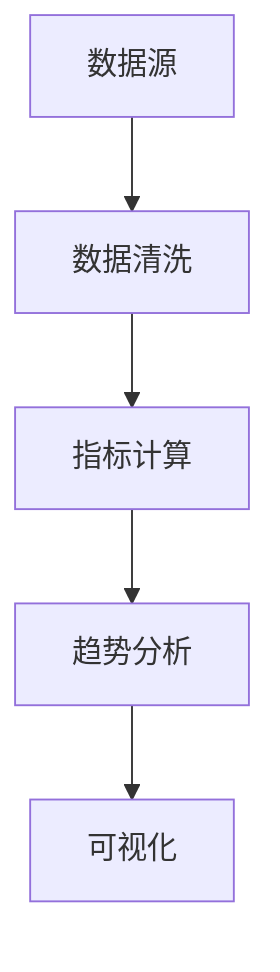

                 


# 彼得林奇对公司资本回报率趋势的分析

## 关键词：资本回报率（ROE），彼得·林奇，投资分析，财务指标，趋势预测

## 摘要：  
本文深入分析了彼得·林奇对公司资本回报率（ROE）趋势的研究，探讨了ROE的核心概念、影响因素、长期趋势，以及如何利用ROE进行投资决策。通过结合实际案例和系统化的分析方法，本文为读者提供了从理论到实践的全面指导。

---

## 第1章: 资本回报率的基本概念与重要性

### 1.1 资本回报率的定义与背景
资本回报率（ROE，Return on Equity）是衡量公司盈利能力的重要指标，表示每单位股东权益所创造的净利润。ROE = 净利润 / 股东权益。

### 1.2 资本回报率的核心要素
- **净利润**：公司税后利润，反映公司整体盈利能力。
- **股东权益**：公司净资产，包括股本、资本公积和未分配利润等。
- **ROE的计算公式**：  
  $$ROE = \frac{\text{净利润}}{\text{股东权益}}$$  

---

## 第2章: 彼得·林奇的资本回报率分析方法

### 2.1 彼得·林奇的投资理念
彼得·林奇强调长期投资和价值发现，主张通过分析ROE等财务指标筛选出具有持续盈利能力的公司。

### 2.2 资本回报率的行业比较
- 行业间的ROE差异显著，例如科技行业通常ROE较高，而传统制造业ROE较低。
- 彼得·林奇通过行业比较，识别出具有竞争优势的公司。

---

## 第3章: 影响资本回报率的关键因素

### 3.1 财务表现对资本回报率的影响
- 净利润的波动直接影响ROE。
- 股东权益的变化（如分红或增持）会影响ROE的计算。

### 3.2 市场环境对资本回报率的影响
- 经济周期影响行业ROE的趋势。
- 行业竞争格局决定ROE的可持续性。

---

## 第4章: 资本回报率的长期趋势分析

### 4.1 资本回报率的长期变化
- 长期趋势受行业增长和技术进步的影响。
- 彼得·林奇通过长期趋势预测公司的盈利能力。

### 4.2 资本回报率的周期性波动
- 经济周期影响ROE的波动。
- 市场情绪对ROE的短期影响。

---

## 第5章: 彼得·林奇的资本回报率分析系统

### 5.1 数据收集与处理
- 收集公司财务数据，计算ROE。
- 使用Python进行数据清洗和处理。

### 5.2 系统架构设计
- 数据流：数据采集 → 数据清洗 → 指标计算 → 趋势分析 → 可视化。
- 使用Mermaid图展示系统架构：



---

## 第6章: 项目实战

### 6.1 项目背景与目标
选择科技行业，分析某公司过去5年的ROE变化。

### 6.2 代码实现
```python
import pandas as pd

# 假设df是包含财务数据的DataFrame
def calculate_roe(df):
    df['ROE'] = df['净利润'] / df['股东权益']
    return df

# 示例数据
data = {
    '年份': [2018, 2019, 2020, 2021, 2022],
    '净利润': [100, 120, 150, 180, 200],
    '股东权益': [500, 550, 600, 650, 700]
}
df = pd.DataFrame(data)
df = calculate_roe(df)
print(df)
```

### 6.3 结果分析
- ROE逐年上升，表明公司盈利能力增强。
- 结合行业趋势，预测未来ROE将继续增长。

---

## 第7章: 总结与展望

### 7.1 总结
本文通过分析彼得·林奇的资本回报率研究，提供了从理论到实践的全面指导。

### 7.2 最佳实践
- 定期分析ROE趋势，及时调整投资策略。
- 结合行业和市场环境，全面评估公司价值。

### 7.3 注意事项
- ROE分析需结合其他财务指标。
- 长期趋势分析需考虑宏观经济因素。

---

## 作者：AI天才研究院 & 禅与计算机程序设计艺术

---

通过以上结构，文章系统地介绍了资本回报率的核心概念、彼得·林奇的分析方法，以及如何在实际中应用这些理论。希望对读者有所帮助！

