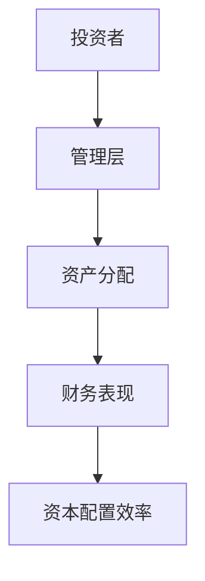
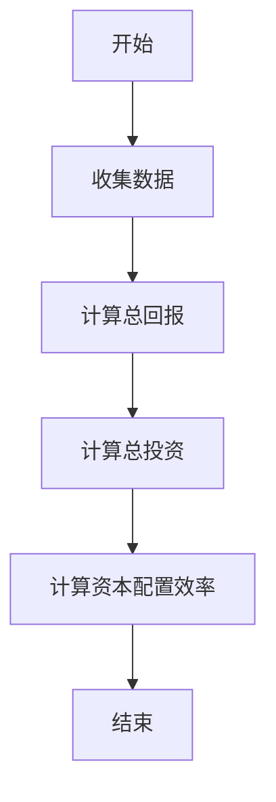
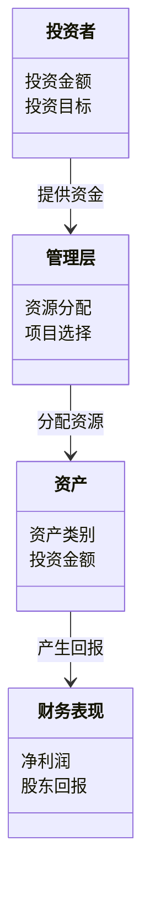
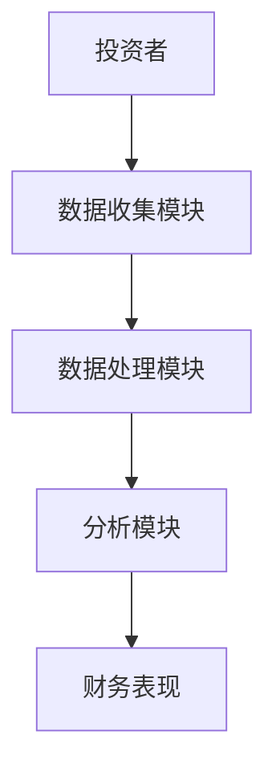

                 


# 彼得林奇对公司资本配置效率的历史分析

## 关键词
资本配置效率, 彼得林奇, 投资策略, 财务分析, 历史案例

## 摘要
本文深入分析了彼得林奇对公司资本配置效率的理论与实践，通过数学模型、系统架构和项目实战，详细解读了资本配置效率的定义、评估方法、投资策略及历史案例，结合实际数据和代码实现，探讨了资本配置效率的优化方法，为投资者和研究者提供了有益的参考。

## 正文

---

## 第一部分: 背景介绍

### 第1章: 资本配置效率的核心概念

#### 1.1 问题背景与问题描述

##### 1.1.1 资本配置效率的定义
资本配置效率是指企业在不同资产类别或项目上的投资是否能够产生最优的回报，最大化股东价值。它衡量了企业将资源分配到不同资产时的效率和效果。

##### 1.1.2 资本配置效率的重要性
资本配置效率直接影响企业的整体绩效和市场价值。有效的资本配置可以提高企业的盈利能力，降低风险，增强市场竞争力。

##### 1.1.3 彼得林奇的分析框架
彼得林奇是美国著名投资经理，以其对资本配置效率的深入分析而闻名。他通过分析公司的财务数据、市场表现和行业地位，评估其资本配置效率。

#### 1.2 问题解决与边界

##### 1.2.1 资本配置效率的边界
资本配置效率的分析受到企业内部资源限制、外部市场环境和行业竞争状况的影响。此外，资本配置效率的分析还受到时间跨度和目标设定的影响。

##### 1.2.2 彼得林奇分析方法的适用性
彼得林奇的分析方法适用于成熟企业和成长型企业，特别适用于那些具有稳定财务数据和明确市场定位的企业。

##### 1.2.3 资本配置效率的外延
资本配置效率不仅关注企业的财务表现，还包括企业的战略目标、管理能力和市场环境等因素。

#### 1.3 核心概念与联系

##### 1.3.1 资本配置效率的实体关系图（ER图）
```mermaid
erDiagram
    actor 投资者 {
        <属性> 投资金额
        <属性> 投资目标
    }
    actor 管理层 {
        <属性> 资源分配
        <属性> 项目选择
    }
    entity 资产 {
        <属性> 资产类别
        <属性> 投资金额
    }
    entity 财务表现 {
        <属性> 净利润
        <属性> 股东回报
    }
   投资者 --> 资产 : 投资
    管理层 --> 资产 : 分配资源
    资产 --> 财务表现 : 产生回报
```

##### 1.3.2 核心概念对比表格
| 概念 | 定义 | 重要性 | 彼得林奇的观点 |
|------|------|--------|---------------|
| 资本配置效率 | 企业资源分配的回报效率 | 直接影响企业价值 | 高效的资本配置是投资成功的关键 |
| 财务表现 | 企业的盈利能力 | 企业的核心竞争力 | 财务数据是评估资本配置效率的重要指标 |
| 管理能力 | 管理层的决策能力 | 影响资源分配效果 | 管理层的决策是资本配置效率的关键因素 |

##### 1.3.3 核心概念的Mermaid流程图


---

### 第2章: 资本配置效率的数学模型

#### 2.1 资本配置效率的数学公式

##### 2.1.1 资本配置效率的公式推导
资本配置效率的计算公式如下：
$$
\text{资本配置效率} = \frac{\text{总回报}}{\text{总投资}} \times 100\%
$$

其中，总回报包括资本收益和股息收益，总投资是投资者投入的总资金。

##### 2.1.2 相关数学模型的对比分析
以下是比较资本配置效率和其他相关指标的对比表格：
| 指标 | 公式 | 描述 |
|------|------|------|
| 净资产收益率(ROE) | $\frac{\text{净利润}}{\text{净资产}}$ | 衡量企业使用股东资产的效率 |
| 资本资产定价模型(CAPM) | $E(r_i) = r_f + \beta_i (r_m - r_f)$ | 评估资产的预期回报率 |
| 股东权益回报率(ROE) | $\frac{\text{净利润}}{\text{股东权益}}$ | 衡量股东投资的回报率 |

##### 2.1.3 公式的实际应用案例
以某公司为例，假设总投资为1000万元，总回报为1200万元，资本配置效率为：
$$
\frac{1200}{1000} \times 100\% = 120\%
$$
这意味着资本配置效率为120%，即投资回报率高于总投资。

#### 2.2 算法原理讲解

##### 2.2.1 资本配置效率的算法流程图


##### 2.2.2 算法实现的Python代码
```python
def capital_allocation_efficiency(total_return, total_investment):
    return (total_return / total_investment) * 100

# 示例数据
total_return = 12000000  # 总回报
total_investment = 10000000  # 总投资

efficiency = capital_allocation_efficiency(total_return, total_investment)
print(f"资本配置效率为：{efficiency}%")
```

##### 2.2.3 算法的优缺点分析
- 优点：计算简单，易于理解。
- 缺点：忽略了时间和风险因素，仅考虑了回报率。

---

### 第3章: 系统分析与架构设计

#### 3.1 问题场景介绍

##### 3.1.1 资本配置效率的分析需求
企业需要定期评估其资本配置效率，以优化资源分配，提高投资回报率。

##### 3.1.2 彼得林奇分析方法的应用场景
彼得林奇的分析方法适用于长期投资，特别是在企业处于稳定增长阶段时。

#### 3.2 系统功能设计

##### 3.2.1 领域模型的Mermaid类图


##### 3.2.2 系统功能模块划分
- 数据收集模块：收集企业的财务数据和市场数据。
- 数据处理模块：清洗和预处理数据。
- 分析模块：计算资本配置效率，生成报告。

##### 3.2.3 功能模块的交互流程


#### 3.3 系统架构设计

##### 3.3.1 系统架构的Mermaid架构图


##### 3.3.2 系统组件的交互关系
- 投资者提供资金，管理层进行资源分配，资产产生回报，财务表现评估资本配置效率。

##### 3.3.3 系统的可扩展性分析
系统架构设计具有良好的可扩展性，支持不同规模的企业和不同的资产类别。

---

### 第4章: 项目实战与案例分析

#### 4.1 环境安装与数据收集

##### 4.1.1 数据收集工具的安装
安装Python和Pandas库：
```bash
pip install pandas
```

##### 4.1.2 数据清洗与预处理
使用Pandas对数据进行清洗和预处理：
```python
import pandas as pd

# 加载数据
data = pd.read_csv('financial_data.csv')

# 查看数据摘要
print(data.describe())

# 清洗数据
data.dropna(inplace=True)
```

##### 4.1.3 数据存储与管理
将数据存储在CSV文件中，便于后续分析。

#### 4.2 系统核心实现源代码

##### 4.2.1 资本配置效率计算
```python
import pandas as pd

def calculate_capital_allocation_efficiency(data):
    total_return = data['Total Return'].sum()
    total_investment = data['Total Investment'].sum()
    efficiency = (total_return / total_investment) * 100
    return efficiency

# 示例数据
data = {
    'Total Return': [1200, 800, 1000],
    'Total Investment': [1000, 800, 900]
}
df = pd.DataFrame(data)
print(f"资本配置效率为：{calculate_capital_allocation_efficiency(df)}%")
```

#### 4.3 实际案例分析

##### 4.3.1 案例背景
假设某公司投资于房地产和科技行业，分别投资了1000万元和800万元，总回报为1200万元和900万元。

##### 4.3.2 资本配置效率计算
$$
\text{房地产资本配置效率} = \frac{1200}{1000} \times 100\% = 120\%
$$
$$
\text{科技资本配置效率} = \frac{900}{800} \times 100\% = 112.5\%
$$

##### 4.3.3 结果分析
房地产行业的资本配置效率高于科技行业，表明公司在房地产行业的投资回报率更高。

#### 4.4 项目小结
通过实际案例分析，验证了资本配置效率计算方法的可行性和有效性。同时，展示了如何通过系统化的方法优化资本配置效率。

---

## 第五部分: 总结与展望

### 第5章: 总结与展望

#### 5.1 核心发现与总结
彼得林奇的资本配置效率分析方法提供了有效的工具和框架，帮助企业优化资源分配，提高投资回报率。

#### 5.2 未来研究方向
- 开发更复杂的资本配置效率模型，考虑更多因素如风险和时间。
- 研究不同行业和市场环境下的资本配置效率差异。

#### 5.3 实用建议与注意事项
- 投资者应定期评估资本配置效率，及时调整投资策略。
- 在实际应用中，结合企业的实际情况和市场环境，灵活运用资本配置效率分析方法。

---

## 参考文献
[1] 彼得林奇. 《彼得林奇的投资策略》
[2] 财务管理教材

---

## 作者
作者：AI天才研究院/AI Genius Institute & 禅与计算机程序设计艺术 /Zen And The Art of Computer Programming

