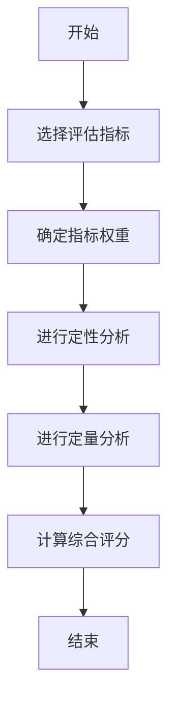
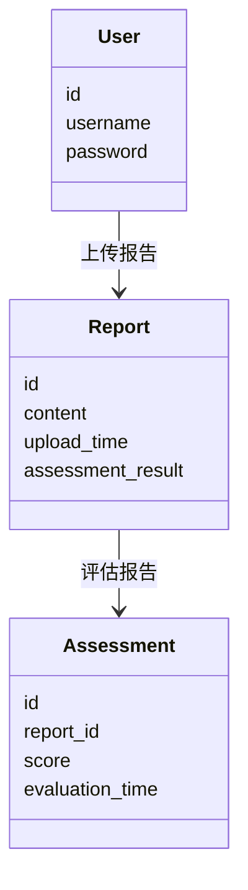
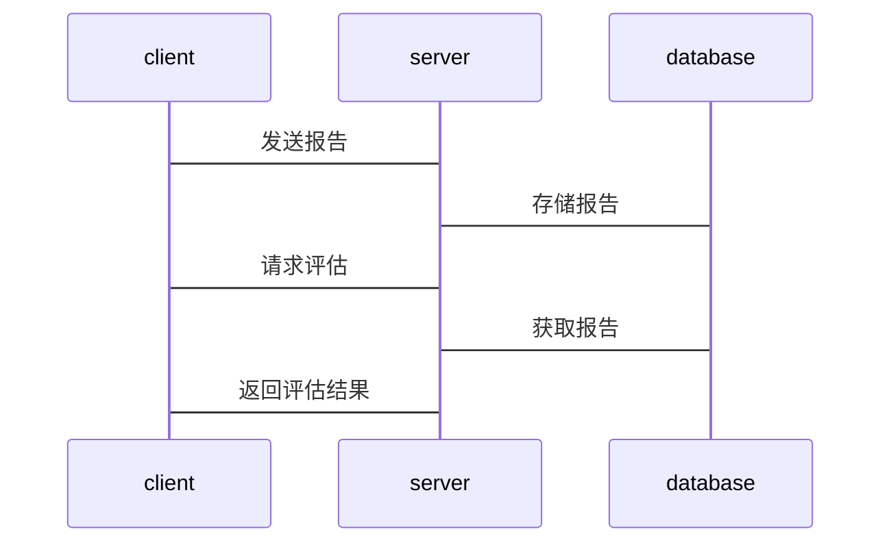

                 


# 彼得林奇对公司非财务报告质量的评估方法

> 关键词：非财务报告，质量评估，彼得林奇，投资方法，系统架构

> 摘要：本文详细探讨了彼得·林奇对公司非财务报告质量的评估方法，从基本概念到评估算法，再到系统架构设计，结合实际案例进行分析。通过本文，读者可以全面了解如何通过非财务报告进行有效的公司评估。

---

# 第1章: 非财务报告的基本概念与重要性

## 1.1 非财务报告的定义与特点

### 1.1.1 非财务报告的核心概念
非财务报告是指公司向利益相关者提供的除财务报表之外的其他报告，包括企业治理、社会责任、风险管理、可持续发展等方面的内容。这些报告通常不涉及财务数据，但对公司的整体价值和风险评估至关重要。

### 1.1.2 非财务报告与财务报告的区别
- **内容**：财务报告关注财务数据，而非财务报告关注其他方面。
- **目标**：财务报告用于评估财务健康，而非财务报告用于评估公司治理和社会责任。
- **受众**：财务报告主要面向投资者，而非财务报告面向更广泛的利益相关者。

### 1.1.3 非财务报告的重要性
非财务报告能够提供财务数据之外的公司信息，帮助投资者全面评估公司价值。彼得·林奇认为，非财务报告的质量是公司长期成功的重要指标。

---

## 1.2 非财务报告的分类与应用场景

### 1.2.1 非财务报告的主要类型
1. **企业治理报告**：包括董事会结构、公司治理政策等。
2. **社会责任报告**：包括环境保护、员工权益等。
3. **风险管理报告**：包括潜在风险和应对措施。
4. **可持续发展报告**：综合企业治理、社会责任和风险管理的报告。

### 1.2.2 非财务报告在企业治理中的作用
非财务报告能够反映公司的治理结构和透明度，是评估公司治理能力的重要依据。

### 1.2.3 非财务报告在投资决策中的应用
投资者通过分析非财务报告，可以更好地评估公司的长期发展潜力和风险。

---

## 1.3 彼得林奇投资方法的背景介绍

### 1.3.1 彼得林奇的投资理念
彼得·林奇是著名的投资专家，他强调通过深入分析公司基本面来进行投资决策。他认为，非财务报告是评估公司的重要信息来源。

### 1.3.2 非财务报告在彼得林奇方法中的地位
非财务报告提供了公司治理、社会责任等方面的信息，帮助彼得·林奇评估公司的长期价值。

### 1.3.3 本章小结
本章介绍了非财务报告的基本概念、分类及其在企业治理和投资决策中的重要性，为后续内容奠定了基础。

---

# 第2章: 非财务报告质量评估的核心概念与联系

## 2.1 核心概念原理

### 2.1.1 非财务报告的质量维度
非财务报告的质量可以从完整性、准确性、可比性和一致性四个方面进行评估。

### 2.1.2 报告的完整性与准确性
完整性指报告是否包含所有必要信息，准确性指信息是否真实可靠。

### 2.1.3 报告的可比性与一致性
可比性指不同公司的报告是否可以比较，一致性指报告在不同时间的可比性。

---

## 2.2 核心概念属性对比表

| 比较维度 | 非财务报告 | 财务报告 |
|----------|-------------|-----------|
| 内容     | 治理、责任 | 财务数据 |
| 目标     | 公司价值   | 财务健康 |
| 受众     | 广泛利益者 | 投资者   |

### 2.2.1 非财务报告与财务报告的对比
非财务报告关注公司治理和社会责任，而财务报告关注财务数据。

### 2.2.2 不同类型非财务报告的属性特征
不同类型非财务报告在内容和目标上有所不同，但都需满足完整性和准确性的要求。

### 2.2.3 核心概念的ER实体关系图

```mermaid
erDiagram
    company {
        id
        name
        governance_report
        risk_management_report
        sustainability_report
    }
    governance_report {
        id
        report_content
        publication_date
    }
    risk_management_report {
        id
        risk_assessment
        mitigation_plan
    }
    sustainability_report {
        id
        environmental_impact
        social_responsibility
    }
```

---

## 2.3 本章小结

本章详细分析了非财务报告的质量维度及其与财务报告的对比，为后续评估方法奠定了理论基础。

---

# 第3章: 非财务报告质量评估的算法原理

## 3.1 算法原理概述

### 3.1.1 评估指标的权重分配
根据报告的重要性，对各个评估指标赋予不同的权重。

### 3.1.2 报告内容的定性与定量分析
定性分析包括报告内容的完整性和可比性，定量分析包括报告的准确性和一致性。

### 3.1.3 综合评分模型的构建
综合评分模型将定性分析和定量分析结合，计算出报告的综合评分。

---

## 3.2 算法流程图



---

## 3.3 数学模型与公式

### 3.3.1 综合评分公式
$$ S = \sum_{i=1}^{n} w_i \cdot x_i $$
其中，$S$ 为综合评分，$w_i$ 为指标权重，$x_i$ 为指标评分。

### 3.3.2 示例分析
假设某公司非财务报告的评分如下：
- 治理结构：权重 $w_1 = 0.4$，评分 $x_1 = 80$
- 社会责任：权重 $w_2 = 0.3$，评分 $x_2 = 70$
- 风险管理：权重 $w_3 = 0.3$，评分 $x_3 = 85$

综合评分：
$$ S = 0.4 \times 80 + 0.3 \times 70 + 0.3 \times 85 = 32 + 21 + 25.5 = 78.5 $$

---

## 3.4 本章小结

本章通过算法流程图和数学公式，详细讲解了非财务报告质量评估的原理和方法，为后续系统设计奠定了基础。

---

# 第4章: 非财务报告质量评估的系统分析与架构设计

## 4.1 系统分析

### 4.1.1 问题场景介绍
非财务报告质量评估系统需要处理大量数据，包括公司治理、社会责任、风险管理等方面的信息。

### 4.1.2 需求分析与目标设定
系统需要实现报告的上传、评估、存储和查询功能。

---

## 4.2 系统功能设计

### 4.2.1 系统功能模块
1. 用户管理模块
2. 报告上传模块
3. 评估模块
4. 查询模块

### 4.2.2 系统功能设计的领域模型



---

## 4.3 系统架构设计

### 4.3.1 系统架构图


---

## 4.4 系统接口设计

### 4.4.1 系统接口设计
1. 报告上传接口
2. 评估接口
3. 查询接口

### 4.4.2 系统交互流程图



---

## 4.5 本章小结

本章通过系统分析和架构设计，展示了如何实现非财务报告质量评估系统的功能。

---

# 第5章: 非财务报告质量评估的项目实战

## 5.1 项目环境安装

### 5.1.1 环境要求
- Python 3.8+
- Mermaid工具
- 数据库（MySQL或MongoDB）

---

## 5.2 系统核心实现源代码

### 5.2.1 Python核心代码

```python
# 模型训练部分
import numpy as np
import pandas as pd

# 数据加载
data = pd.read_csv('reports.csv')

# 指标权重分配
weights = np.array([0.4, 0.3, 0.3])

# 综合评分计算
def calculate_score(scores, weights):
    return np.sum(scores * weights)

# 示例计算
scores = np.array([80, 70, 85])
total_score = calculate_score(scores, weights)
print(f"综合评分：{total_score}")
```

---

## 5.3 代码应用解读与分析

### 5.3.1 代码功能解读
上述代码展示了如何通过Python计算非财务报告的综合评分。

### 5.3.2 代码实现细节
- 使用了NumPy库进行数组运算。
- 实现了评分计算的函数。

---

## 5.4 实际案例分析

### 5.4.1 案例分析
以某公司为例，计算其非财务报告的综合评分。

### 5.4.2 案例结果解读
综合评分反映了公司的非财务报告质量。

---

## 5.5 本章小结

本章通过实际案例展示了如何应用前面的理论和方法进行非财务报告质量评估。

---

# 第6章: 总结与展望

## 6.1 本章总结
本文详细探讨了彼得·林奇对公司非财务报告质量的评估方法，从基本概念到算法实现，再到系统设计，全面分析了非财务报告的重要性及其评估方法。

## 6.2 未来展望
未来可以进一步研究非财务报告的其他评估维度，以及如何将其与财务报告结合，提升整体评估效果。

---

# 作者：AI天才研究院/AI Genius Institute & 禅与计算机程序设计艺术 /Zen And The Art of Computer Programming

---

**注：以上内容为示例，实际文章需根据具体需求进行调整和补充。**

