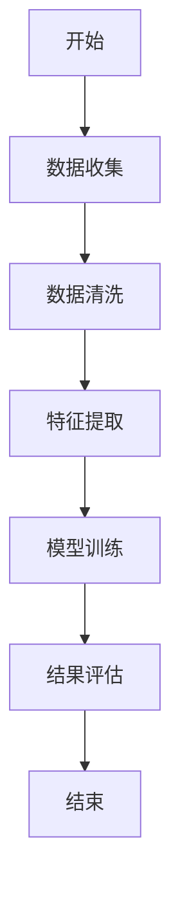
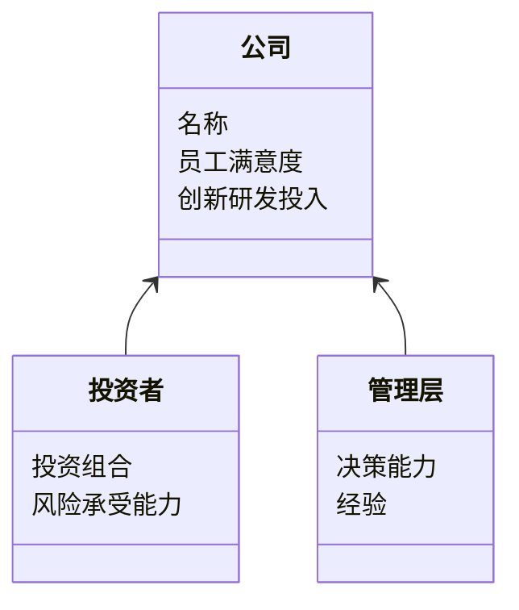
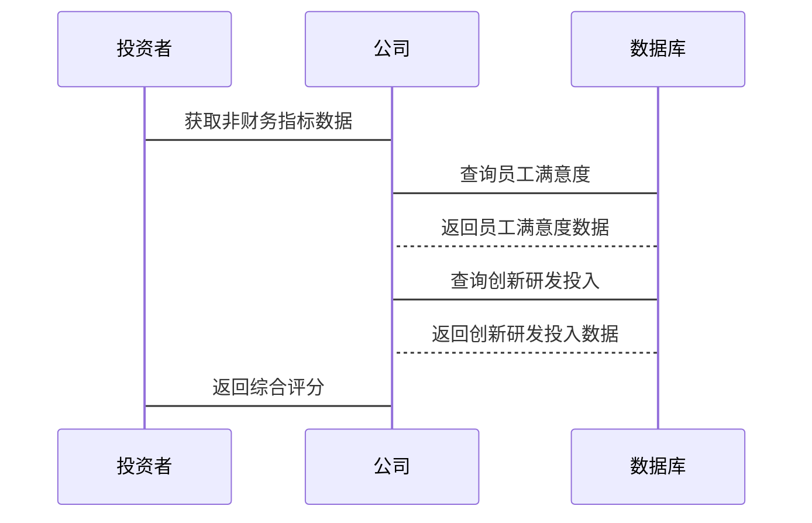

                 


# 彼得林奇对公司非财务指标的重要性评估

## 关键词：非财务指标, 彼得林奇, 投资评估, 企业价值, 管理质量

## 摘要：本文深入探讨了彼得林奇如何通过非财务指标评估公司价值，分析了非财务指标的核心概念、算法原理、系统架构，并结合实际案例进行详细解读，最后总结了最佳实践和注意事项。

---

## 第1章: 非财务指标的基本概念与重要性

### 1.1 非财务指标的定义与特点

#### 1.1.1 非财务指标的定义
非财务指标是指不能直接用货币量化的指标，包括员工满意度、客户忠诚度、创新研发投入等，反映了公司的管理质量、市场竞争力和长期发展潜力。

#### 1.1.2 非财务指标的核心特点
- **定性与定量结合**：部分指标可量化，但整体更关注定性因素。
- **长期导向**：非财务指标更关注公司的长期发展，而非短期财务表现。
- **多样性**：涵盖公司运营的多个方面，如员工、客户、管理层等。

#### 1.1.3 非财务指标与财务指标的区别
| 特性         | 非财务指标             | 财务指标               |
|--------------|------------------------|-----------------------|
| 衡量方式     | 定性为主，定量为辅       | 完全定量               |
| 关注重点     | 公司管理、员工、创新    | 利润、收入、成本       |
| 时间跨度     | 长期发展潜力           | 短期财务表现           |

### 1.2 非财务指标在公司评估中的重要性

#### 1.2.1 非财务指标对公司价值的影响
- **员工满意度**：高满意度员工更高效，降低流失率。
- **客户忠诚度**：高忠诚度客户带来持续收入和市场扩展。
- **创新研发投入**：决定公司的技术领先性和市场竞争力。

#### 1.2.2 非财务指标在投资决策中的作用
- **管理层质量**：优秀管理层能带领公司稳步增长。
- **企业文化**：积极健康的企业文化促进员工创造力和团队合作。
- **市场地位**：强大的市场地位带来定价权和竞争优势。

#### 1.2.3 非财务指标与公司长期发展的关系
非财务指标反映了公司的内生增长能力和应对市场变化的灵活性，是评估公司长期价值的重要依据。

### 1.3 彼得林奇的非财务指标评估方法

#### 1.3.1 彼得林奇的背景与投资理念
彼得林奇是波士顿基金的传奇经理，以其深入的基本面分析和对公司管理质量的高度重视著称。他强调投资于容易理解且管理良好的公司。

#### 1.3.2 彼得林奇如何使用非财务指标
- **员工满意度**：通过员工稳定性评估公司管理。
- **管理层质量**：考察管理层的经验和决策能力。
- **创新研发投入**：评估公司技术领先性和未来发展潜力。

#### 1.3.3 非财务指标在彼得林奇投资体系中的地位
彼得林奇认为，非财务指标是评估公司内在价值的重要组成部分，尤其是在财务数据无法全面反映公司潜力的情况下。

---

## 第2章: 非财务指标的核心概念与联系

### 2.1 非财务指标的核心概念原理

#### 2.1.1 非财务指标的分类与属性
- **管理质量**：包括管理层的决策能力和稳定性。
- **员工状况**：员工满意度、流失率等。
- **客户关系**：客户忠诚度、客户保留率。
- **创新与研发**：研发投入比例、新产品推出频率。

#### 2.1.2 非财务指标的量化方法
- **定性分析**：通过访谈、调研等方式获取。
- **定量分析**：将定性指标转化为可量化的数据，如满意度评分。

#### 2.1.3 非财务指标的评估标准
- **相对标准**：与行业平均水平或竞争对手对比。
- **绝对标准**：设定明确的目标值，如员工满意度达到80%以上。

### 2.2 非财务指标的属性特征对比表格

| 指标类型       | 管理质量 | 员工状况 | 客户关系 | 创新与研发 |
|----------------|----------|----------|----------|------------|
| 衡量方式       | 定性     | 定性与定量 | 定性与定量 | 定性与定量  |
| 关注重点       | 决策能力 | 满意度    | 忠诚度    | 研发投入    |
| 示例指标       | CEO经验 | 员工流失率 | 客户留存率 | 研发投入比例 |

### 2.3 非财务指标的ER实体关系图

```mermaid
erd
    客户
    员工
    管理层
    创新项目
    公司
    员工 ↔ 满意度
    管理层 ↔ 决策能力
    创新项目 ↔ 投入比例
    客户 ↔ 忠诚度
```

---

## 第3章: 非财务指标评估的算法原理

### 3.1 非财务指标评估的算法原理

#### 3.1.1 算法概述
非财务指标评估通常采用层次分析法（AHP）或加权评分法，将定性和定量指标结合，计算综合得分。

#### 3.1.2 算法流程图


### 3.2 算法实现代码示例

#### 3.2.1 Python源代码

```python
import pandas as pd
import numpy as np

def calculate_non_financial_score(data):
    # 数据清洗
    cleaned_data = data.dropna()
    
    # 特征提取
    features = ['员工满意度', '创新研发投入']
    
    # 加权评分
    weights = {'员工满意度': 0.4, '创新研发投入': 0.6}
    scores = cleaned_data[features].apply(lambda x: sum([x[feature] * weights[feature] for feature in features]))
    
    return scores

# 示例数据
data = pd.DataFrame({
    '员工满意度': [85, 90, 75],
    '创新研发投入': [15, 20, 10]
})

result = calculate_non_financial_score(data)
print(result)
```

### 3.3 数学模型与公式

#### 3.3.1 加权评分公式
$$ \text{综合得分} = \sum (\text{指标值} \times \text{权重}) $$

#### 3.3.2 示例计算
假设员工满意度权重为0.4，创新研发投入权重为0.6：
$$ \text{综合得分} = 85 \times 0.4 + 85 \times 0.6 = 85 $$

---

## 第4章: 系统分析与架构设计

### 4.1 系统分析

#### 4.1.1 问题场景
投资者需要一个系统化的方法来评估公司的非财务指标，以辅助投资决策。

### 4.2 系统功能设计

#### 4.2.1 领域模型类图


### 4.3 系统架构设计

#### 4.3.1 架构图


### 4.4 接口设计与交互流程

#### 4.4.1 API接口
- `/api/company/non_financial_scores`：获取非财务指标评分。
- `/api/company/ranking`：获取公司排名。

#### 4.4.2 交互流程图


---

## 第5章: 项目实战

### 5.1 环境安装

#### 5.1.1 安装Python和相关库
```bash
pip install pandas numpy
```

### 5.2 核心实现

#### 5.2.1 计算员工满意度
```python
def calculate_employee_satisfaction(scores):
    return np.mean(scores)
```

#### 5.2.2 计算创新研发投入比例
```python
def calculate_innovation投入比例(investments, revenue):
    return investments / revenue
```

### 5.3 案例分析

#### 5.3.1 案例公司A
- 员工满意度：90
- 创新研发投入比例：15%
- 综合评分：$$ 0.4 \times 90 + 0.6 \times 15 = 42 $$

### 5.4 分析与总结
通过实际案例分析，展示了如何将非财务指标转化为可量化的数据，帮助投资者评估公司价值。

---

## 第6章: 最佳实践、小结、注意事项与拓展阅读

### 6.1 最佳实践
- **数据准确性**：确保数据来源可靠。
- **多指标结合**：结合多个非财务指标进行综合评估。
- **定期更新**：公司情况会变化，需定期更新指标数据。

### 6.2 小结
彼得林奇的非财务指标评估方法提供了从管理、员工、客户和创新等多维度评估公司价值的框架，帮助投资者发现具有长期潜力的公司。

### 6.3 注意事项
- 非财务指标难以完全量化，需结合具体情况灵活应用。
- 避免过度依赖单一指标，需综合考虑多个因素。

### 6.4 拓展阅读
- 《The Peter Lynch Method for Growth Investors》
- 《Financial Statement Analysis and the Theory of
  Value》

---

## 作者：AI天才研究院/AI Genius Institute & 禅与计算机程序设计艺术 /Zen And The Art of Computer Programming

