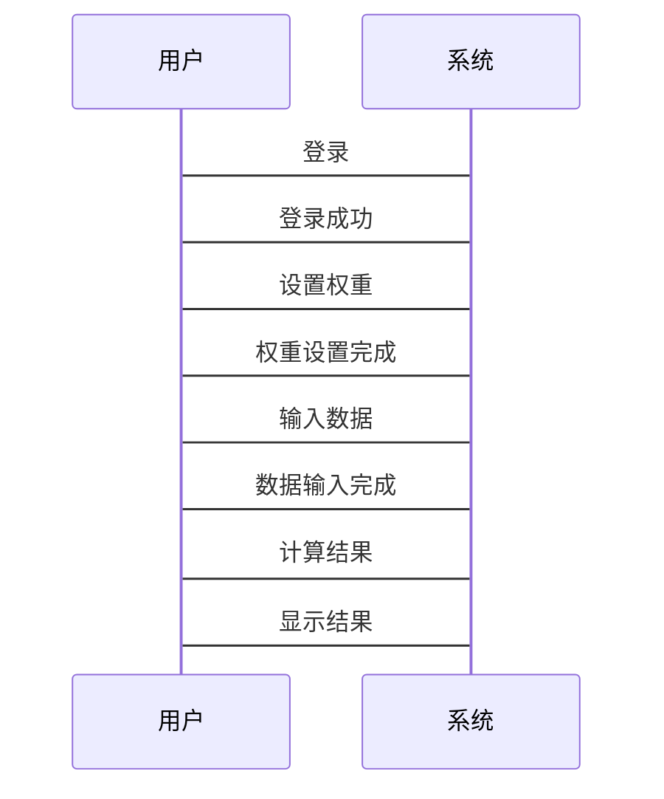

                 


```markdown
# 彼得林奇对公司领导力的评估

> 关键词：领导力评估，彼得·林奇，公司领导力，领导力算法，领导力系统架构

> 摘要：本文详细探讨了彼得·林奇对公司领导力的评估方法，结合理论分析与实际案例，系统阐述了领导力评估的核心概念、算法原理、系统架构设计及项目实战。通过本篇文章，读者将全面掌握领导力评估的理论与实践方法。

---

# 第1章: 公司领导力评估的背景介绍

## 1.1 领导力评估的背景与问题背景
### 1.1.1 领导力评估的背景
领导力评估是企业管理中的重要环节，用于识别和培养优秀领导者。随着市场竞争的加剧，领导力评估变得尤为重要。

### 1.1.2 领导力评估的核心问题
- 什么是领导力？
- 如何量化领导力？
- 如何制定有效的评估标准？

### 1.1.3 领导力评估的目标与意义
- 提高组织效率
- 优化领导团队
- 推动企业长期发展

## 1.2 领导力评估的定义与问题描述
### 1.2.1 领导力的定义
领导力是通过影响力影响他人并实现目标的能力。

### 1.2.2 领导力评估的定义
领导力评估是对领导者的能力、表现和潜力进行全面测量的过程。

### 1.2.3 领导力评估的核心问题
- 评估指标的选取
- 评估方法的科学性
- 评估结果的应用

## 1.3 领导力评估的解决思路
### 1.3.1 问题解决的总体思路
- 确定评估目标
- 设计评估指标
- 选择评估方法
- 分析评估结果

### 1.3.2 领导力评估的关键步骤
1. 明确评估目的
2. 设计评估指标
3. 选择评估方法
4. 实施评估
5. 分析结果

### 1.3.3 领导力评估的边界与外延
- 边界：评估仅关注领导能力，不涉及其他因素
- 外延：评估结果可用于招聘、培训和晋升

## 1.4 领导力评估的核心要素
### 1.4.1 领导力的核心构成要素
1. 战略思维
2. 沟通能力
3. 团队管理
4. 决策能力
5. 适应能力

### 1.4.2 领导力评估的关键维度
- 智能维度：分析和解决问题的能力
- 人际维度：沟通和团队合作能力
- 行为维度：决策和执行能力

### 1.4.3 领导力评估的指标体系
- 战略思维能力
- 沟通与影响力
- 团队领导能力
- 问题解决能力
- 适应能力

## 1.5 本章小结
本章介绍了领导力评估的背景、核心问题及解决思路，明确了领导力评估的核心要素和关键维度。

---

# 第2章: 彼得林奇的领导力评估框架

## 2.1 彼得林奇领导力评估的核心概念
### 2.1.1 领导力的三要素模型
- 愿景设定
- 团队建设
- 执行力

### 2.1.2 领导力评估的三维度框架
- 智能维度：分析和决策能力
- 人际维度：沟通和团队合作能力
- 行为维度：决策和执行能力

### 2.1.3 领导力评估的层次结构
- 个体层面
- 团队层面
- 组织层面

## 2.2 领导力评估的核心原理
### 2.2.1 领导力评估的理论基础
- 晏思模型
- 领导生命周期理论
- 权变理论

### 2.2.2 领导力评估的数学模型
$$ L = \alpha \cdot S + \beta \cdot T + \gamma \cdot E $$
其中，$L$ 表示领导力，$S$ 表示战略思维，$T$ 表示团队管理，$E$ 表示执行能力，$\alpha$、$\beta$、$\gamma$ 为权重系数。

### 2.2.3 领导力评估的算法原理
领导力评估算法通过加权求和的方式，将各维度的评估结果综合起来，得出领导力得分。

## 2.3 领导力评估的属性特征对比
下表展示了领导力评估的属性特征对比：

| 属性 | 高层领导者 | 中层领导者 | 基层领导者 |
|------|------------|------------|------------|
| 战略思维 | 高 | 中 | 低 |
| 团队管理 | 高 | 高 | 中 |
| 执行力 | 中 | 高 | 高 |

### 2.3.2 领导力评估的ER实体关系图
```mermaid
er
    actor 领导者
    actor 评估维度
    actor 评估结果
    actor 评估权重
    actor 评估过程
    actor 评估报告
```

## 2.4 本章小结
本章详细阐述了彼得·林奇的领导力评估框架，包括核心概念、理论基础和算法原理。

---

# 第3章: 领导力评估的算法原理

## 3.1 领导力评估的算法概述
### 3.1.1 算法的基本原理
领导力评估算法通过加权求和的方式，综合考虑各评估维度的权重，计算出领导力得分。

### 3.1.2 算法的核心步骤
1. 确定评估维度和权重
2. 收集评估数据
3. 计算各维度得分
4. 综合计算总得分

### 3.1.3 算法的实现流程
- 数据输入
- 权重分配
- 计算得分
- 输出结果

## 3.2 领导力评估的数学模型
### 3.2.1 数学模型的定义
$$ L = \sum_{i=1}^{n} w_i x_i $$
其中，$L$ 是领导力得分，$w_i$ 是第 $i$ 个维度的权重，$x_i$ 是第 $i$ 个维度的得分。

### 3.2.2 数学模型的公式
$$ L = w_1 x_1 + w_2 x_2 + \dots + w_n x_n $$

### 3.2.3 数学模型的解释
各维度的得分乘以相应的权重后相加，得到领导力总得分。

## 3.3 领导力评估的算法实现
### 3.3.1 算法的实现步骤
1. 确定评估维度和权重
2. 收集评估数据
3. 计算各维度得分
4. 综合计算总得分

### 3.3.2 算法的Python源代码
```python
def leadership_assessment(criteria, weights):
    return sum(w * c for w, c in zip(weights, criteria))
```

## 3.4 算法的举例说明
### 3.4.1 典型案例分析
假设评估维度为战略思维、团队管理和执行力，权重分别为0.4、0.3、0.3。评估数据分别为80、70、85。计算领导力得分为：
$$ L = 0.4 \times 80 + 0.3 \times 70 + 0.3 \times 85 = 32 + 21 + 25.5 = 78.5 $$

### 3.4.2 实际应用中的例子
某公司高管的领导力评估结果为85分，说明其领导力较强。

### 3.4.3 算法的优缺点
优点：计算简单，易于实现；缺点：忽略了评估维度之间的相互影响。

## 3.5 本章小结
本章详细讲解了领导力评估的算法原理，包括数学模型和Python代码实现，并通过案例分析说明了算法的应用。

---

# 第4章: 领导力评估的系统架构设计

## 4.1 系统功能设计
### 4.1.1 领导力评估的功能模块
- 用户界面
- 评估维度管理
- 权重设置
- 评估数据录入
- 结果计算与展示

### 4.1.2 领导力评估的流程设计
1. 用户登录
2. 设置评估维度和权重
3. 输入评估数据
4. 计算领导力得分
5. 显示评估结果

### 4.1.3 领导力评估的交互设计
- 用户输入评估数据
- 系统计算并展示结果

## 4.2 系统架构设计
### 4.2.1 领导力评估的领域模型
```mermaid
classDiagram
    class 领导力评估系统 {
        用户
        评估维度
        权重
        评估数据
        结果
    }
    领导力评估系统 -> 用户: 提供界面
    领导力评估系统 -> 评估维度: 管理维度
    领导力评估系统 -> 权重: 设置权重
    领导力评估系统 -> 评估数据: 收集数据
    领导力评估系统 -> 结果: 计算并展示
```

### 4.2.2 领导力评估的系统架构图


## 4.3 系统接口设计
### 4.3.1 系统接口的定义
- 登录接口：用户登录
- 设置权重接口：设置各评估维度的权重
- 输入数据接口：录入评估数据
- 计算结果接口：计算领导力得分
- 展示结果接口：显示评估结果

### 4.3.2 系统接口的实现
```python
class LeadershipAssessmentSystem:
    def login(self, username, password):
        # 登录验证
        pass

    def set_weights(self, weights):
        # 设置权重
        pass

    def input_data(self, data):
        # 输入数据
        pass

    def calculate_result(self):
        # 计算结果
        pass

    def display_result(self):
        # 展示结果
        pass
```

## 4.4 系统交互设计
### 4.4.1 系统交互流程
1. 用户登录系统
2. 设置评估维度和权重
3. 输入评估数据
4. 系统计算领导力得分
5. 展示评估结果

### 4.4.2 系统交互的序列图


## 4.5 本章小结
本章详细设计了领导力评估系统的架构，包括功能模块、系统架构图和交互流程。

---

# 第5章: 领导力评估的项目实战

## 5.1 项目背景与目标
### 5.1.1 项目背景
某公司需要对高管团队进行领导力评估。

### 5.1.2 项目目标
识别优秀领导者，优化领导团队。

## 5.2 项目实施步骤
### 5.2.1 环境安装
- 安装Python
- 安装相关库（如numpy、pandas）

### 5.2.2 系统核心实现
```python
import numpy as np

def calculate_leadership(criteria, weights):
    return np.dot(criteria, weights)

criteria = [80, 70, 85]
weights = [0.4, 0.3, 0.3]

leadership_score = calculate_leadership(criteria, weights)
print(f"领导力得分：{leadership_score}")
```

### 5.2.3 代码实现解读
- 导入numpy库
- 定义计算领导力得分的函数
- 输入评估数据和权重
- 计算并输出领导力得分

## 5.3 项目案例分析
### 5.3.1 案例背景
某公司高管的领导力评估。

### 5.3.2 数据准备
- 战略思维：80
- 团队管理：70
- 执行力：85

### 5.3.3 权重设置
- 战略思维：0.4
- 团队管理：0.3
- 执行力：0.3

### 5.3.4 实施步骤
1. 安装环境
2. 输入数据
3. 计算得分
4. 分析结果

### 5.3.5 结果解读
领导力得分为78.5，说明该高管领导力较强。

## 5.4 项目小结
本章通过实际案例展示了领导力评估的项目实施过程，包括环境安装、代码实现和结果分析。

---

# 第6章: 领导力评估的最佳实践与总结

## 6.1 领导力评估的最佳实践
### 6.1.1 定义清晰的评估标准
确保评估维度和权重合理。

### 6.1.2 选择合适的评估方法
根据实际情况选择定量或定性评估方法。

### 6.1.3 结果的应用
将评估结果应用于招聘、培训和晋升。

## 6.2 领导力评估的注意事项
### 6.2.1 数据的准确性
确保评估数据的准确性和客观性。

### 6.2.2 评估的公正性
避免主观因素干扰。

### 6.2.3 结果的解释
正确解读评估结果，避免误用。

## 6.3 领导力评估的拓展阅读
### 6.3.1 领导力理论
推荐书籍：《领导力的五个要素》

### 6.3.2 评估工具
推荐工具：领导力360度评估

### 6.3.3 行业实践
研究其他行业的领导力评估实践。

## 6.4 本章小结
本章总结了领导力评估的最佳实践，提供了注意事项和扩展阅读的内容，帮助读者更好地应用领导力评估方法。

---

# 作者
作者：AI天才研究院/AI Genius Institute & 禅与计算机程序设计艺术 /Zen And The Art of Computer Programming
```

