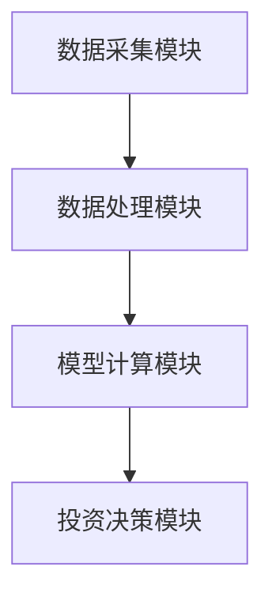
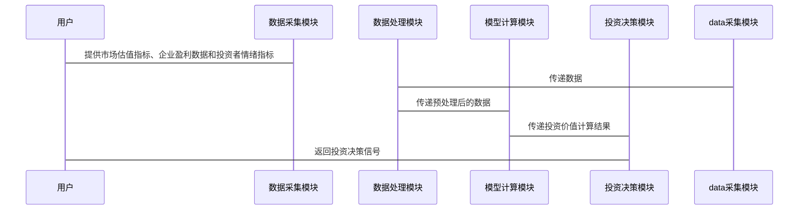

                 


# 彼得林奇对市场时机选择的看法

## 关键词：彼得·林奇、市场时机选择、投资策略、价值投资、投资模型

## 摘要：本文深入探讨了彼得·林奇在市场时机选择方面的看法，分析了他的投资哲学、市场时机选择策略及其在实际投资中的应用。文章通过详细阐述其市场时机选择的核心概念、算法原理和系统架构，帮助读者更好地理解如何在投资中把握市场时机。

---

# 第一部分: 市场时机选择的背景与重要性

## 第1章: 市场时机选择的概述

### 1.1 市场时机选择的定义与背景

#### 1.1.1 市场时机选择的定义
市场时机选择是指投资者在合适的时间进入或退出市场，以最大化投资收益或最小化潜在损失的过程。它是投资策略中的关键环节，直接影响投资结果。

#### 1.1.2 市场时机选择的重要性
市场时机选择的重要性体现在以下几点：
- **风险控制**：在市场下行时及时退出，避免重大损失。
- **收益最大化**：在市场上涨时及时进入，抓住收益机会。
- **投资决策优化**：通过合理时机选择，优化资产配置，提升整体收益。

#### 1.1.3 彼得·林奇的基本投资理念
彼得·林奇是著名的投资专家，他强调长期投资和价值投资，认为市场时机选择并非决定性因素，但合理的时机选择可以显著提升投资效果。

### 1.2 彼得·林奇对市场时机选择的看法

#### 1.2.1 彼得·林奇的投资哲学
彼得·林奇的投资哲学可以概括为：
- **长期投资**：关注企业的基本面，寻找具有长期增长潜力的公司。
- **价值投资**：寻找被市场低估的企业，等待市场回归其真实价值。
- **分散投资**：通过分散投资降低风险，避免过度依赖单一资产。

#### 1.2.2 市场时机选择在投资中的作用
市场时机选择在投资中的作用主要体现在：
- **降低风险**：在市场波动较大时，及时调整投资组合。
- **提升收益**：在市场繁荣时，抓住投资机会。
- **优化资产配置**：根据市场变化，动态调整资产配置比例。

#### 1.2.3 彼得·林奇的市场时机选择策略
彼得·林奇的市场时机选择策略包括以下几个方面：
1. **关注市场估值**：通过市盈率（PE）、市净率（PB）等指标判断市场估值。
2. **分析投资者情绪**：通过市场情绪指标（如恐慌指数、投资者情绪指数）判断市场的短期波动。
3. **长期持有优质资产**：即使市场短期波动，长期持有优质资产可以获得稳定收益。

---

## 第2章: 市场时机选择的核心概念

### 2.1 市场时机选择的核心要素

#### 2.1.1 市场趋势的判断
市场趋势的判断是市场时机选择的核心要素之一。彼得·林奇认为，市场趋势可以通过以下方式判断：
- **长期趋势**：通过对企业基本面的分析，判断市场的长期趋势。
- **短期趋势**：通过技术分析（如均线、MACD等）判断市场的短期趋势。

#### 2.1.2 投资者情绪分析
投资者情绪分析是市场时机选择的重要组成部分。彼得·林奇认为，投资者情绪可以通过以下方式分析：
- **市场情绪指标**：如恐慌指数、投资者情绪指数等。
- **市场参与度**：如成交量、换手率等指标。

#### 2.1.3 市场估值指标
市场估值指标是判断市场时机的重要依据。彼得·林奇常用的市场估值指标包括：
- **市盈率（PE）**：市盈率=股价/每股收益。
- **市净率（PB）**：市净率=股价/每股净资产。
- **股息率**：股息率=每股股息/股价。

### 2.2 彼得·林奇的市场时机选择模型

#### 2.2.1 模型的构成与原理
彼得·林奇的市场时机选择模型主要基于以下几个要素：
- **市场估值**：通过市盈率、市净率等指标判断市场估值。
- **企业盈利**：通过企业盈利增长情况判断市场的长期趋势。
- **投资者情绪**：通过市场情绪指标判断市场的短期波动。

#### 2.2.2 模型的输入与输出
- **输入**：市场估值指标（如PE、PB）、企业盈利数据、投资者情绪指标。
- **输出**：市场时机选择信号（如买入、卖出、持有）。

#### 2.2.3 模型的优缺点分析
- **优点**：模型结合了市场估值、企业盈利和投资者情绪，能够全面判断市场时机。
- **缺点**：模型依赖于数据的准确性和完整性，实际操作中可能存在误差。

### 2.3 核心概念对比分析

#### 2.3.1 技术分析与基本面分析的对比
- **技术分析**：基于市场的价格和成交量数据，预测未来的市场走势。
- **基本面分析**：基于企业的财务数据，判断企业的长期价值。

#### 2.3.2 不同市场环境下的策略选择
- **牛市**：积极投资，增加权益资产配置。
- **熊市**：谨慎投资，增加现金持有比例。
- **震荡市**：根据市场估值和企业盈利情况，动态调整投资组合。

#### 2.3.3 投资者心理与市场时机选择的关系
投资者心理对市场时机选择有着重要影响。当市场情绪高涨时，投资者可能过于乐观，导致市场泡沫；当市场情绪低落时，投资者可能过于悲观，导致市场低估。

---

## 第3章: 市场时机选择的算法原理

### 3.1 彼得·林奇市场时机选择算法

#### 3.1.1 算法的数学模型
彼得·林奇的市场时机选择算法可以表示为：
$$
P(t) = \frac{E(t)}{V(t)}
$$
其中，$P(t)$ 表示投资价值，$E(t)$ 表示企业盈利，$V(t)$ 表示市场估值。

#### 3.1.2 算法的实现步骤
1. **数据采集**：收集市场估值指标（如PE、PB）、企业盈利数据（如净利润、营业收入）和投资者情绪指标（如恐慌指数、投资者情绪指数）。
2. **数据处理**：对数据进行清洗、归一化处理。
3. **模型计算**：通过算法模型计算投资价值。
4. **投资决策**：根据计算结果，生成买入、卖出或持有信号。

#### 3.1.3 算法的实现代码
```python
import pandas as pd
import numpy as np

def calculate_market_valuation(pe_ratio, book_value, revenue_growth):
    """
    计算市场估值
    :param pe_ratio: 市盈率
    :param book_value: 市净率
    :param revenue_growth: 营收增长率
    :return: 投资价值
    """
    # 计算投资价值
    investment_value = (pe_ratio * book_value) / (1 + revenue_growth/100)
    return investment_value

# 示例数据
pe_ratio = 15
book_value = 2
revenue_growth = 10

# 计算投资价值
investment_value = calculate_market_valuation(pe_ratio, book_value, revenue_growth)
print(f"投资价值为：{investment_value}")
```

### 3.2 算法的优化与改进

#### 3.2.1 算法的优化方向
- **引入更多市场指标**：如市场情绪指标、市场波动率等。
- **动态调整权重**：根据市场环境变化，动态调整各指标的权重。

#### 3.2.2 改进后的算法模型
$$
P'(t) = \frac{E(t) \cdot C(t)}{V(t) \cdot D(t)}
$$
其中，$C(t)$ 表示市场情绪，$D(t)$ 表示市场波动性。

---

## 第4章: 市场时机选择的系统架构设计

### 4.1 系统功能设计

#### 4.1.1 系统功能模块
- **数据采集模块**：收集市场估值指标、企业盈利数据和投资者情绪指标。
- **数据处理模块**：对数据进行清洗、归一化处理。
- **模型计算模块**：通过算法模型计算投资价值。
- **投资决策模块**：根据计算结果，生成买入、卖出或持有信号。

#### 4.1.2 系统功能流程
1. 数据采集模块收集相关数据。
2. 数据处理模块对数据进行预处理。
3. 模型计算模块计算投资价值。
4. 投资决策模块生成投资信号。

### 4.2 系统架构设计

#### 4.2.1 系统架构图


#### 4.2.2 系统接口设计
- **输入接口**：市场估值指标、企业盈利数据和投资者情绪指标。
- **输出接口**：投资价值计算结果、投资决策信号。

### 4.3 系统交互设计

#### 4.3.1 系统交互流程


---

## 第5章: 项目实战

### 5.1 环境安装

#### 5.1.1 环境要求
- Python 3.6+
- pandas、numpy、scikit-learn等库。

#### 5.1.2 安装依赖
```bash
pip install pandas numpy
```

### 5.2 系统核心实现源代码

#### 5.2.1 计算市场估值的代码
```python
import pandas as pd
import numpy as np

def calculate_market_valuation(pe_ratio, book_value, revenue_growth):
    investment_value = (pe_ratio * book_value) / (1 + revenue_growth/100)
    return investment_value

# 示例数据
pe_ratio = [15, 20, 25]
book_value = [2, 3, 4]
revenue_growth = [10, 15, 20]

# 计算投资价值
investment_values = []
for p, b, r in zip(pe_ratio, book_value, revenue_growth):
    investment_values.append(calculate_market_valuation(p, b, r))

print("投资价值为：", investment_values)
```

#### 5.2.2 投资决策的代码
```python
import pandas as pd
import numpy as np

def generate_investment_signal(investment_value):
    if investment_value > 1.2:
        return "买入"
    elif investment_value < 0.8:
        return "卖出"
    else:
        return "持有"

# 示例数据
investment_values = [1.3, 0.9, 1.1]

# 生成投资信号
signals = []
for iv in investment_values:
    signals.append(generate_investment_signal(iv))

print("投资信号为：", signals)
```

### 5.3 代码应用解读与分析

#### 5.3.1 投资价值计算
通过计算投资价值，投资者可以判断市场是否被高估或低估。投资价值计算公式为：
$$
P(t) = \frac{E(t)}{V(t)}
$$
其中，$E(t)$ 表示企业盈利，$V(t)$ 表示市场估值。

#### 5.3.2 投资决策
根据计算出的投资价值，生成相应的投资信号：
- **投资价值 > 1.2**：买入信号
- **投资价值 < 0.8**：卖出信号
- **0.8 <= 投资价值 <= 1.2**：持有信号

### 5.4 实际案例分析

#### 5.4.1 案例背景
假设当前市场PE为15，PB为2，营收增长率为10%。根据彼得·林奇的市场时机选择模型，计算投资价值。

#### 5.4.2 计算过程
投资价值 = (15 * 2) / (1 + 10/100) = 30 / 1.1 ≈ 27.27

#### 5.4.3 投资决策
投资价值为27.27，远高于1.2，因此应选择买入信号。

### 5.5 项目小结
通过实际案例分析，可以验证彼得·林奇市场时机选择模型的有效性。在实际投资中，应结合市场环境和企业基本面，动态调整投资策略。

---

## 第6章: 最佳实践

### 6.1 小结
- 彼得·林奇的市场时机选择策略强调长期投资和价值投资。
- 通过市场估值、企业盈利和投资者情绪分析，可以有效判断市场时机。
- 投资者应结合实际市场环境，灵活调整投资策略。

### 6.2 注意事项
- **数据准确性**：数据的准确性和完整性直接影响投资决策。
- **模型局限性**：模型基于历史数据和假设条件，可能存在误差。
- **市场风险**：市场波动性和不可预测性增加了投资的不确定性。

### 6.3 拓展阅读
- 《彼得·林奇的投资哲学》
- 《市场时机选择的数学模型》
- 《价值投资与成长投资的结合》

---

## 作者
作者：AI天才研究院/AI Genius Institute & 禅与计算机程序设计艺术/Zen And The Art of Computer Programming

