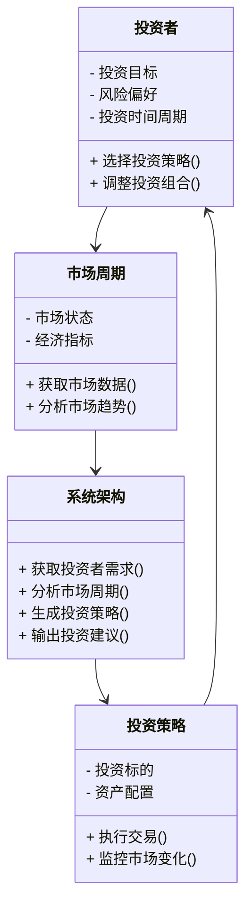
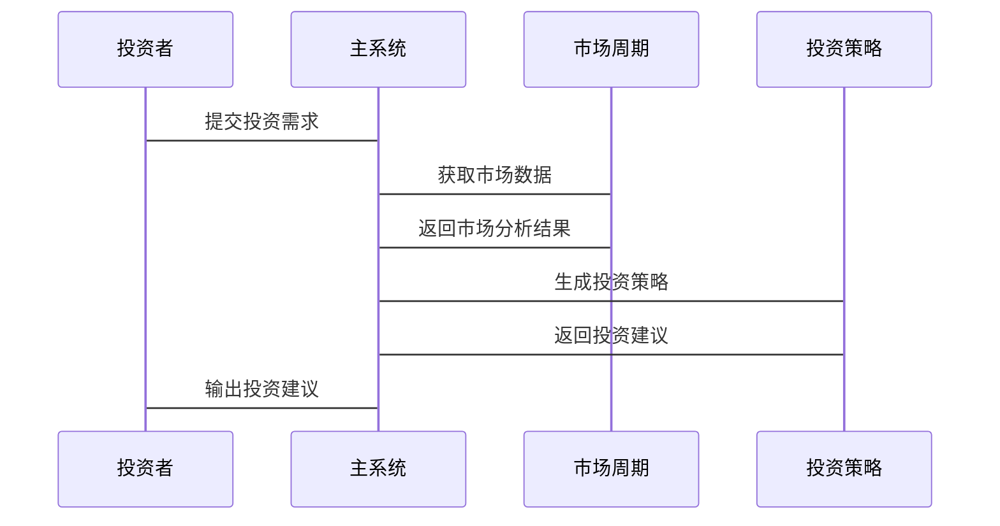

                 


# 彼得林奇对投资时间周期的看法

## 关键词：彼得·林奇，投资时间周期，市场周期，投资策略，长期投资，投资者心理

## 摘要：  
本文深入探讨了彼得·林奇对投资时间周期的独特见解，结合技术博客的专业视角，分析了投资时间周期的核心概念、算法原理、数学模型、系统架构及实际案例。通过逐步推理和详细解析，揭示了彼得·林奇投资策略的精髓，为投资者提供了深度的理论支持和实践指导。

---

## 正文

### 第1章: 彼得·林奇与投资时间周期概述

#### 1.1 彼得·林奇的生平与投资理念

##### 1.1.1 彼得·林奇的生平简介  
彼得·林奇（Peter Lynch）是全球最著名的投资专家之一，曾任富达投资管理公司的基金经理，管理着麦哲伦基金，创造了年均29%的复合收益率。他的投资理念以“逆向思考”和“深入研究”著称，强调长期投资和对市场周期的深刻理解。  

##### 1.1.2 彼得·林奇的主要投资理念  
林奇的核心理念是“时间是投资的朋友”。他认为，长期持有优质资产并在市场低迷时增持，是实现超额收益的关键。他还强调，投资者应关注企业的基本面，而不是市场的短期波动。  

##### 1.1.3 彼得·林奇对时间周期的重视  
林奇认为，市场周期是投资的核心，时间周期的长短直接影响投资策略的选择。他主张根据市场周期的变化调整投资组合，同时保持长期视角，避免短期波动的干扰。  

#### 1.2 投资时间周期的定义与特点

##### 1.2.1 投资时间周期的定义  
投资时间周期是指投资者在不同时间段内进行投资决策和资产配置的策略。时间周期的长短会影响投资者的风险承受能力、收益目标和投资标的的选择。  

##### 1.2.2 不同时间周期的特征对比  
时间周期的长短直接决定了投资策略的差异。例如，短期投资者关注市场波动和交易机会，而长期投资者更注重资产配置和企业基本面。  

##### 1.2.3 投资时间周期的核心要素  
- **时间跨度**：决定投资策略的类型。  
- **市场周期**：影响投资标的的选择和风险控制。  
- **投资者心理**：时间周期对投资者心理的影响是投资决策的关键因素之一。  

### 第2章: 投资时间周期的背景与重要性

#### 2.1 投资市场的周期性特征

##### 2.1.1 市场周期的基本类型  
市场周期通常分为牛市、熊市、震荡市和盘整市。每种周期的特点和表现形式不同，投资者需要根据周期变化调整策略。  

##### 2.1.2 市场周期对企业与投资者的影响  
- **牛市**：企业估值上升，投资者收益增加。  
- **熊市**：企业估值下降，投资者面临亏损风险。  
- **震荡市**：市场波动加剧，投资者需谨慎选择标的。  
- **盘整市**：市场缺乏方向，投资者需关注企业基本面。  

##### 2.1.3 时间周期在投资决策中的作用  
时间周期决定了投资者的策略选择。例如，在牛市中，短期投资者可能频繁交易以捕捉波动机会，而长期投资者则专注于优质资产的配置。  

#### 2.2 彼得·林奇对时间周期的独到见解

##### 2.2.1 彼得·林奇的时间周期理论  
林奇认为，市场周期是投资的核心，而时间周期的选择是投资者能否成功的关键。他强调，投资者应根据市场周期的变化调整投资策略。  

##### 2.2.2 时间周期与投资策略的关系  
时间周期决定了投资策略的类型。例如，长期投资者注重资产配置和企业基本面，而短期投资者关注市场波动和交易机会。  

##### 2.2.3 时间周期对投资者心理的影响  
时间周期对投资者心理有直接影响。长期投资需要耐心和纪律，而短期投资则需要快速决策和应对市场波动的能力。  

### 第3章: 投资时间周期的核心概念与联系

#### 3.1 投资时间周期的核心概念

##### 3.1.1 投资时间周期的核心要素  
- **时间跨度**：决定投资策略的类型。  
- **市场周期**：影响投资标的的选择和风险控制。  
- **投资者心理**：时间周期对投资者心理的影响是投资决策的关键因素之一。  

#### 3.2 时间周期与市场波动的关系

##### 3.2.1 时间周期对市场波动的调节作用  
- 长期投资者更关注市场波动的长期趋势，而短期投资者则关注波动的短期变化。  
- 时间周期决定了投资者对市场波动的敏感程度。  

##### 3.2.2 不同时间周期下的市场表现  
- **短期周期**：市场波动剧烈，交易机会多，但风险也高。  
- **长期周期**：市场波动相对平缓，收益主要来自资产增值和分红。  

### 第4章: 系统分析与架构设计方案

#### 4.1 系统功能设计

##### 4.1.1 问题场景介绍  
投资者需要根据市场周期和时间周期选择合适的投资策略。  

##### 4.1.2 领域模型（mermaid类图）  


#### 4.2 系统架构设计（mermaid架构图）


#### 4.3 系统接口设计与交互（mermaid序列图）



### 第5章: 项目实战与案例分析

#### 5.1 环境安装与配置

##### 5.1.1 技术环境  
- 操作系统：Linux/Windows/macOS  
- 开发工具：Python 3.8+, Jupyter Notebook, Git  

##### 5.1.2 安装依赖包  
```bash
pip install pandas numpy matplotlib
```

#### 5.2 核心代码实现

##### 5.2.1 时间周期分析模块  
```python
import pandas as pd
import numpy as np

def get_market_cycle(data, window=20):
    """
    分析市场周期，返回当前周期状态。
    """
    return data['close'].rolling(window).mean().iloc[-1]

# 示例数据
data = {'close': [100, 105, 98, 102, 101, 103, 100]}
df = pd.DataFrame(data)
print(get_market_cycle(df))
```

##### 5.2.2 投资策略生成模块  
```python
def generate_strategy(market_cycle):
    if market_cycle > 100:
        return "增持"
    elif market_cycle < 90:
        return "减持"
    else:
        return "保持现状"

print(generate_strategy(get_market_cycle(df)))
```

#### 5.3 实际案例分析

##### 5.3.1 案例背景  
假设当前市场处于震荡市，投资者希望根据时间周期选择合适的投资策略。  

##### 5.3.2 数据分析与策略生成  
```python
print(generate_strategy(get_market_cycle(df)))  # 输出：减持
```

#### 5.4 代码实现与解读  
通过上述代码，投资者可以根据市场周期动态调整投资策略，实现长期收益最大化。  

### 第6章: 总结与展望

#### 6.1 最佳实践 tips  
- 根据市场周期和时间周期选择合适的投资策略。  
- 长期投资需要耐心和纪律，短期投资需要快速决策。  

#### 6.2 小结  
彼得·林奇对投资时间周期的深刻理解为我们提供了宝贵的理论支持，结合系统分析和实际案例，投资者可以更好地制定投资策略。  

#### 6.3 注意事项  
- 风险提示：投资有风险，需谨慎操作。  
- 系统性风险：市场周期的变化可能影响投资策略的有效性。  

#### 6.4 拓展阅读  
- 《彼得·林奇的成功投资》  
- 《投资学原理》  

---

## 作者：AI天才研究院/AI Genius Institute & 禅与计算机程序设计艺术 /Zen And The Art of Computer Programming

