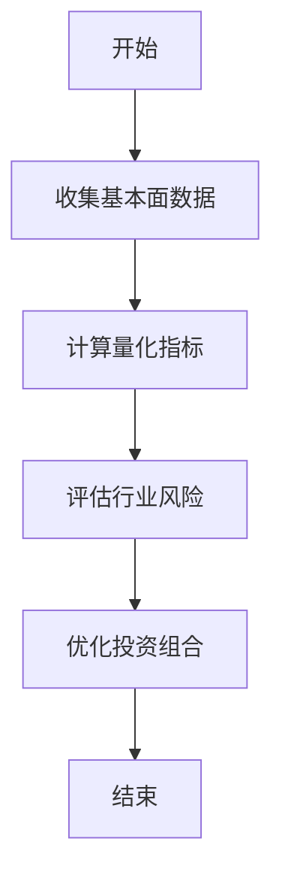
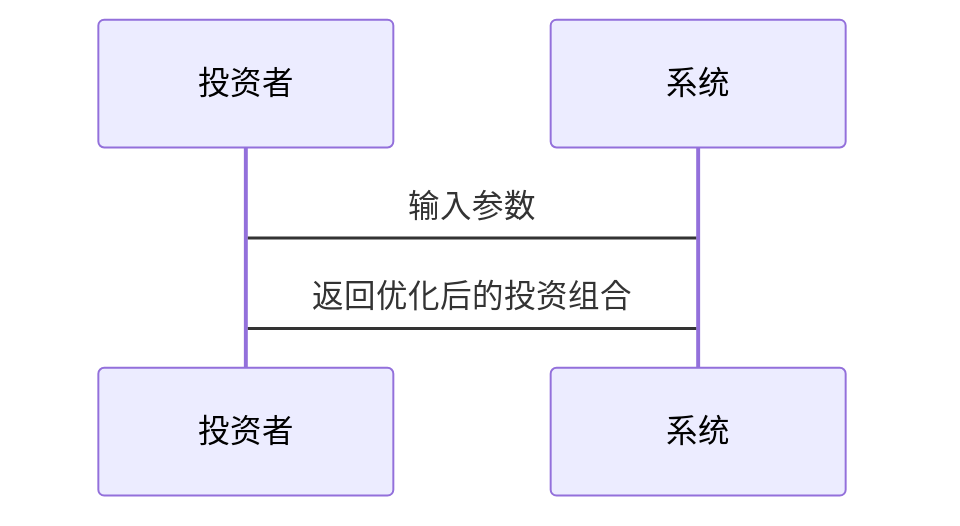

                 

# 彼得林奇对新兴市场投资的看法

> 关键词：彼得·林奇, 投资策略, 新兴市场, 价值投资, 风险管理, 股票分析

> 摘要：本文深入分析了彼得·林奇对新兴市场投资的看法，结合其投资理念和策略，探讨了新兴市场的定义、特点、投资机会以及风险管理。通过量化分析和数学模型，揭示了彼得·林奇在新兴市场投资中的选股标准和优化策略。

---

# 第一部分: 彼得·林奇与新兴市场投资概述

## 第1章: 彼得·林奇的生平与投资理念

### 1.1 彼得·林奇的生平简介

- **早年经历与职业生涯**：彼得·林奇出生于1940年，是美国著名的职业棒球运动员兼投资经理。他在职业生涯中曾担任波士顿红袜队的投手，并在1970年代进入投资领域，成为富达麦哲伦基金的经理，管理规模达到140亿美元。
- **富达麦哲伦基金的辉煌成就**：林奇在1977年至1990年期间管理富达麦哲伦基金，期间基金年均回报率达到29.2%，远超市场平均水平。他的投资理念以基本面分析为核心，注重价值发现和长期投资。
- **彼得·林奇的投资哲学**：林奇强调投资的纪律性和长期性，主张通过基本面分析寻找具有竞争优势的公司，并在市场波动中寻找投资机会。

### 1.2 彼得·林奇的投资理念

- **基本面分析的重要性**：林奇认为，股票的价值取决于公司的基本面，包括财务状况、行业地位、管理团队等因素。他反对短期交易，提倡长期持有优质股票。
- **长期投资与价值发现**：林奇强调，投资的目的是寻找那些具有持续增长潜力的公司，并在市场低估时买入，高估时卖出。
- **风险管理与组合投资**：林奇认为，风险管理是投资成功的关键。他通过分散投资和严格的风险评估来降低投资组合的波动性。

### 1.3 新兴市场的定义与现状

- **新兴市场的定义**：新兴市场是指那些经济发展迅速、市场规模较小但增长潜力大的国家，如中国、印度、巴西等。这些市场通常具有较高的波动性和不稳定性。
- **新兴市场的特点**：新兴市场通常具有较高的增长率、较低的市场成熟度和较高的风险。这些市场的公司可能具有竞争优势，但也面临更多的不确定性。
- **新兴市场的全球分布与经济影响**：新兴市场在全球经济中占据重要地位，尤其是在制造业、科技和消费领域。它们的增长对全球经济有着重要影响。

---

## 第2章: 彼得·林奇的新兴市场投资策略

### 2.1 基本面分析的核心要素

- **公司财务状况分析**：林奇注重公司的财务健康状况，包括盈利能力、资产负债表和现金流。他通过分析财务报表来评估公司的盈利能力和偿债能力。
- **行业地位与竞争优势**：林奇认为，公司所处的行业地位和竞争优势是决定其长期表现的关键因素。他倾向于投资那些在行业中具有领先地位的公司。
- **管理团队的稳定性与能力**：林奇强调管理团队的重要性，认为一个稳定且有能力的管理团队是公司长期增长的关键。

### 2.2 新兴市场的行业分析

- **制造业与科技行业的投资机会**：新兴市场在制造业和科技行业具有较大的增长潜力。这些行业通常具有较高的增长率和较低的进入门槛，适合长期投资。
- **金融服务与消费行业的潜力**：新兴市场的金融服务和消费行业也具有较大的增长潜力。随着经济的发展，这些行业的需求将不断增加。
- **新兴市场的周期性与波动性**：新兴市场的波动性较高，容易受到全球经济波动和政策变化的影响。投资者需要关注市场的周期性变化，并及时调整投资策略。

### 2.3 风险管理与投资组合优化

- **风险评估与控制策略**：林奇认为，新兴市场的风险较高，投资者需要通过风险评估来确定投资的可行性和风险承受能力。
- **投资组合的分散化原则**：为了降低投资风险，林奇建议投资者通过分散化投资来降低单一投资的风险。他通常会将资金分配到多个行业和多个公司中，以降低整体投资组合的波动性。
- **新兴市场的波动性应对**：新兴市场的波动性较高，投资者需要具备较强的耐心和纪律性，避免因短期波动而做出错误的决策。

---

## 第3章: 彼得·林奇投资策略的数学模型与算法原理

### 3.1 基本面分析的量化指标

- **市盈率（P/E）与市净率（P/B）分析**：市盈率是股票价格与每股收益的比率，市净率是股票价格与每股净资产的比率。林奇通过分析这些指标来评估股票的价值。
- **股息率与股息支付率**：股息率是股票的股息与股票价格的比率，股息支付率是股息与净利润的比率。林奇认为，高股息率的股票通常具有较高的投资价值。
- **资产负债率与ROE分析**：资产负债率是公司负债与资产的比率，ROE是净利润与股东权益的比率。林奇通过分析这些指标来评估公司的财务健康状况和盈利能力。

### 3.2 新兴市场投资的数学模型

- **基于基本面的股票评分模型**：林奇通过量化指标对股票进行评分，评分越高，投资价值越大。评分模型通常包括市盈率、市净率、股息率、ROE等指标。
- **投资组合优化的数学公式**：
  $$ \text{目标函数: 最大化 } \sum w_i \times r_i $$
  $$ \text{约束条件: } \sum w_i = 1, \text{且 } w_i \geq 0 $$
  其中，\( w_i \) 是第 \( i \) 只股票的权重，\( r_i \) 是第 \( i \) 只股票的预期回报率。

### 3.3 算法流程图

---

## 第4章: 系统分析与架构设计方案

### 4.1 问题场景介绍

- **投资决策系统**：本文将从投资决策系统的角度出发，探讨如何利用彼得·林奇的投资理念来优化新兴市场的投资组合。
- **系统功能设计**：系统需要具备数据收集、量化分析、风险评估和投资组合优化等功能。

### 4.2 系统架构设计

### 4.3 系统接口设计

- **数据接口**：系统需要从外部数据源获取新兴市场的股票数据，包括财务报表、市场指数等。
- **用户接口**：系统需要提供友好的用户界面，供投资者输入参数和查看投资组合。

### 4.4 系统交互设计

---

## 第5章: 项目实战

### 5.1 环境安装

- **工具安装**：投资者需要安装数据分析工具，如Python、Pandas、Matplotlib等。
- **数据获取**：投资者需要获取新兴市场的股票数据，可以通过API或爬虫实现。

### 5.2 核心实现

- **量化分析**：投资者可以通过Python代码对新兴市场的股票进行量化分析，计算市盈率、市净率等指标。
- **投资组合优化**：投资者可以通过优化算法对投资组合进行优化，实现最大收益和最小风险。

### 5.3 实际案例分析

- **案例分析**：以中国某新兴科技公司为例，分析其财务状况和行业地位，评估其投资价值。
- **投资建议**：基于分析结果，给出投资建议，如买入、持有或卖出。

---

## 第6章: 总结与最佳实践

### 6.1 总结

- **彼得·林奇的投资理念**：林奇通过基本面分析和长期投资，在新兴市场中取得了优异的成绩。他的投资策略强调价值发现和风险管理。
- **新兴市场的特点**：新兴市场具有较高的增长潜力和波动性，投资者需要具备较高的风险承受能力和长期投资的耐心。

### 6.2 最佳实践

- **长期投资**：投资者应坚持长期投资，避免因短期波动而做出错误决策。
- **分散投资**：投资者应通过分散投资来降低投资风险，避免将所有资金投入到单一市场或行业。
- **风险管理**：投资者应注重风险管理，定期评估投资组合的财务状况和市场风险。

---

## 第7章: 注意事项与拓展阅读

### 7.1 注意事项

- **市场波动**：新兴市场的波动性较高，投资者需要具备较高的风险意识。
- **政策风险**：新兴市场的政策变化可能对投资产生重大影响，投资者需要关注相关政策变化。

### 7.2 拓展阅读

- **相关书籍**：《彼得·林奇的选股标准》、《投资之道》。
- **学术论文**：《新兴市场投资的风险与机会》。

---

## 作者信息

作者：AI天才研究院/AI Genius Institute & 禅与计算机程序设计艺术 /Zen And The Art of Computer Programming

