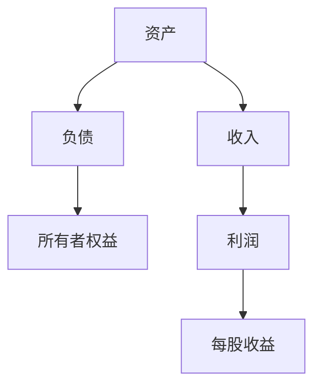
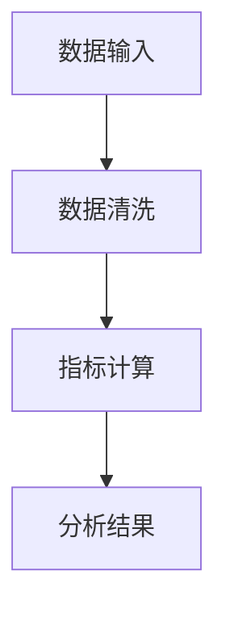
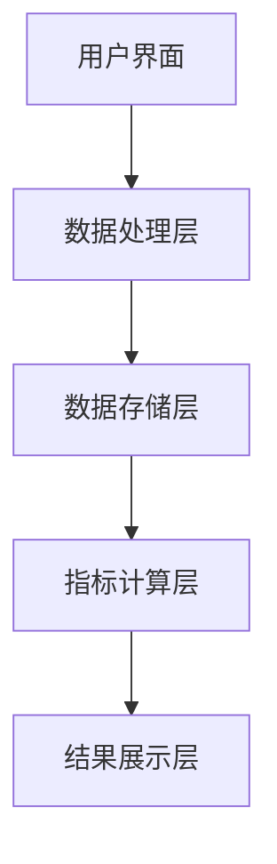

                 

# 彼得林奇对财务报表分析的重视

> 关键词：财务报表分析，彼得·林奇，投资策略，财务指标，风险管理

> 摘要：本文深入探讨了彼得·林奇如何重视财务报表分析，并详细分析了其在投资决策中的应用。文章从背景介绍、核心概念、算法原理、系统架构设计、案例分析和项目实战等多个方面，全面解析了财务报表分析的重要性及其在投资管理中的具体应用。通过本文，读者将能够理解财务报表分析的基本原理、掌握其算法设计，并能够在实际项目中应用相关技术。

---

## 第1章: 彼得·林奇与财务报表分析的背景介绍

### 1.1 彼得·林奇及其投资理念
彼得·林奇是全球最著名的基金经理之一，他的投资哲学以价值投资为核心，强调通过深入分析企业的财务状况来评估其投资价值。他相信，财务报表是了解企业财务健康状况的核心工具。

#### 1.1.1 彼得·林奇的生平简介
彼得·林奇（Peter Lynch）是美国著名的投资专家，曾管理富达麦哲伦基金（Fidelity Magellan Fund），创造了辉煌的投资业绩。他以深入研究企业财务报表而闻名，并提出了许多独特的投资策略。

#### 1.1.2 彼得·林奇的投资哲学
林奇的投资哲学强调长期投资和深入的企业分析。他认为，投资者应该通过分析企业的财务报表来评估其盈利能力、成长潜力和风险管理能力。

#### 1.1.3 财务报表分析在投资中的重要性
财务报表分析是林奇投资决策的核心工具。他通过分析资产负债表、利润表和现金流量表，评估企业的财务健康状况、盈利能力和成长潜力。

### 1.2 财务报表分析的核心概念
财务报表分析是通过对企业的财务报表进行深入研究，评估其财务状况、盈利能力和发展潜力的过程。

#### 1.2.1 财务报表的基本构成
财务报表通常包括资产负债表、利润表和现金流量表。这些报表分别从不同的角度反映了企业的财务状况。

#### 1.2.2 财务报表分析的定义与目的
财务报表分析是指通过对企业财务报表的解读，评估其财务状况、盈利能力和发展潜力的过程。其目的是为投资者提供决策支持。

#### 1.2.3 财务报表分析的边界与外延
财务报表分析不仅包括对财务数据的解读，还涉及对企业所处行业、市场环境和竞争状况的综合分析。

### 1.3 财务报表分析的核心要素
财务报表分析的核心要素包括资产负债表、利润表和现金流量表。

#### 1.3.1 资产负债表的核心要素
资产负债表反映了企业在某一特定时点的资产、负债和所有者权益的状况。资产包括流动资产和非流动资产，负债包括流动负债和非流动负债，所有者权益包括股本、资本公积和未分配利润等。

#### 1.3.2 利润表的核心要素
利润表反映了企业在一定会计期间内的收入、费用和利润情况。收入包括主营业务收入和其他业务收入，费用包括销售费用、管理费用和财务费用，利润包括净利润和每股收益。

#### 1.3.3 现金流量表的核心要素
现金流量表反映了企业在一定会计期间内的现金流入和流出情况。现金流入包括经营活动、投资活动和筹资活动的现金流入，现金流出包括经营活动、投资活动和筹资活动的现金流出。

### 1.4 本章小结
本章介绍了彼得·林奇及其投资理念，详细阐述了财务报表分析的核心概念和核心要素。通过本章，读者可以理解财务报表分析在投资决策中的重要性。

---

## 第2章: 财务报表分析的核心概念与联系

### 2.1 财务报表分析的核心原理
财务报表分析的核心原理包括资产负债表的平衡关系、利润表的收入与利润关系以及现金流量表的流入与流出关系。

#### 2.1.1 资产负债表的平衡关系
资产负债表的平衡关系是：资产 = 负债 + 所有者权益。这一关系是财务报表分析的基础。

#### 2.1.2 利润表的收入与利润关系
利润表的收入与利润关系是：利润 = 收入 - 费用。这一关系反映了企业的盈利能力。

#### 2.1.3 现金流量表的流入与流出关系
现金流量表的流入与流出关系是：净现金流量 = 现金流入 - 现金流出。这一关系反映了企业的现金流健康状况。

### 2.2 财务报表核心概念的属性特征对比
通过对比分析，可以更好地理解财务报表核心概念的差异和联系。

#### 2.2.1 资产与负债的属性对比
资产和负债的属性对比主要体现在流动性、价值稳定性以及风险性方面。

#### 2.2.2 收入与支出的属性对比
收入和支出的属性对比主要体现在时间性、金额大小以及对财务状况的影响程度方面。

#### 2.2.3 净利润与每股收益的属性对比
净利润和每股收益的属性对比主要体现在计算方式、反映的财务指标以及对投资者决策的影响方面。

### 2.3 财务报表分析的ER实体关系图
以下是一个简化的财务报表分析的ER实体关系图：

### 2.4 本章小结
本章详细分析了财务报表分析的核心原理和核心概念的属性特征，并通过ER实体关系图展示了财务报表分析的核心要素之间的关系。

---

## 第3章: 财务报表分析的算法原理

### 3.1 财务报表分析的算法概述
财务报表分析的算法主要包括数据采集、数据清洗、指标计算和结果展示四个步骤。

#### 3.1.1 财务指标计算的基本算法
财务指标计算的基本算法包括：计算资产负债率、净利率、应收账款周转率等。

#### 3.1.2 财务比率分析的算法
财务比率分析的算法包括：计算流动比率、速动比率、负债率等。

#### 3.1.3 财务报表数据的时间序列分析
时间序列分析用于研究财务数据的变化趋势，例如使用移动平均法预测未来财务状况。

### 3.2 财务报表分析的算法流程图
以下是一个财务报表分析的算法流程图：

### 3.3 算法原理的数学模型
#### 3.3.1 资产负债表平衡关系的数学表达
$$ 资产 = 负债 + 所有者权益 $$

#### 3.3.2 利润表的利润计算公式
$$ 利润 = 收入 - 费用 $$

#### 3.3.3 现金流量表的净现金流量计算
$$ 净现金流量 = 现金流入 - 现金流出 $$

### 3.4 本章小结
本章详细介绍了财务报表分析的算法流程和数学模型，为后续的系统设计和实际应用奠定了基础。

---

## 第4章: 财务报表分析的系统架构设计

### 4.1 财务报表分析系统的功能设计
财务报表分析系统的功能设计包括数据采集、数据处理、指标计算和结果展示。

#### 4.1.1 数据采集功能
数据采集功能用于从企业财务报表中提取数据，包括资产负债表、利润表和现金流量表。

#### 4.1.2 数据处理功能
数据处理功能包括数据清洗、数据转换和数据存储。

#### 4.1.3 指标计算功能
指标计算功能包括计算财务比率、时间序列分析和趋势预测。

#### 4.1.4 结果展示功能
结果展示功能包括生成分析报告、可视化展示和数据交互。

### 4.2 系统架构设计
以下是一个简化的系统架构设计图：

### 4.3 系统接口设计
#### 4.3.1 数据输入接口
数据输入接口用于接收企业的财务报表数据。

#### 4.3.2 数据输出接口
数据输出接口用于生成分析报告和可视化图表。

#### 4.3.3 用户交互接口
用户交互接口用于用户与系统之间的数据输入和输出。

### 4.4 本章小结
本章详细设计了财务报表分析系统的功能模块和系统架构，为后续的项目实战奠定了基础。

---

## 第5章: 财务报表分析的项目

### 5.1 案例分析
以彼得·林奇的投资策略为例，分析其如何通过财务报表分析选择投资标的。

#### 5.1.1 案例背景
选择一家企业，分析其财务报表数据，评估其财务健康状况。

#### 5.1.2 数据分析
通过计算财务比率、分析趋势和预测未来财务状况，评估企业的投资价值。

### 5.2 项目实战
通过一个实际的项目，展示如何应用财务报表分析技术进行投资决策。

#### 5.2.1 环境安装
安装必要的软件和工具，例如Excel、Python和数据分析库。

#### 5.2.2 核心实现
编写代码，实现财务报表数据的采集、处理和分析。

#### 5.2.3 代码应用解读
通过代码解读，展示如何计算财务指标和生成分析报告。

### 5.3 本章小结
本章通过案例分析和项目实战，展示了如何应用财务报表分析技术进行投资决策。

---

## 作者信息

作者：AI天才研究院/AI Genius Institute & 禅与计算机程序设计艺术 /Zen And The Art of Computer Programming

---

通过本文，读者可以深入理解彼得·林奇对财务报表分析的重视，并掌握财务报表分析的核心概念、算法原理和系统设计方法。希望本文能够为读者在投资决策和财务管理方面提供有价值的参考。

