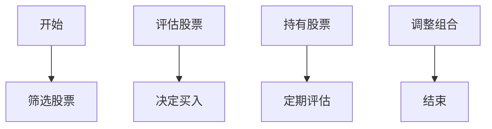
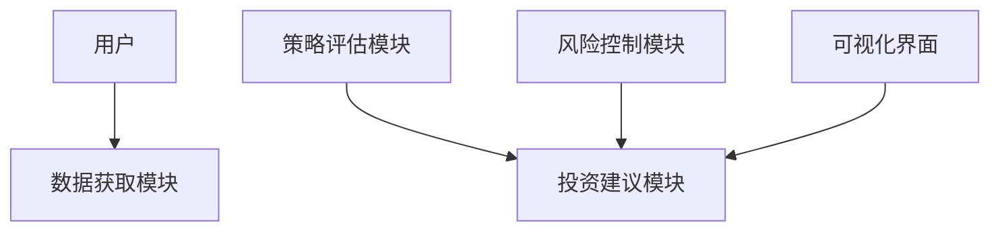

                 


# 彼得林奇的"买入并持有"策略

## 关键词
- 投资策略
- 长期投资
- 风险管理
- 彼得林奇
- 技术分析
- 投资组合
- 系统设计

## 摘要
本文从技术分析的角度解读彼得林奇的“买入并持有”投资策略，探讨其在现代投资管理中的应用。通过系统设计和风险管理的视角，分析该策略的核心理念、算法原理、成功案例及实现方法，为投资者提供深入的技术见解。

---

## 第一部分: 背景介绍

### 第1章: "买入并持有"策略的背景与核心概念

#### 1.1 理论背景
彼得林奇作为著名投资家，倡导长期投资理念，认为市场波动中长期持有优质股票可实现稳定收益。

#### 1.2 核心概念
- **定义**: 长期持有优质股票，避免频繁交易。
- **特点**: 长期视角、分散投资、价值投资。

#### 1.3 核心要素
- **选股标准**: 公司基本面、管理团队、行业地位。
- **长期视角**: 避免短期波动影响，关注长期价值。
- **风险管理**: 定期评估组合，调整持仓。

#### 1.4 实际应用场景
- 机构投资策略。
- 个人投资者参考。

---

## 第二部分: 策略的算法原理

### 第2章: 算法实现

#### 2.1 算法步骤
1. **选股标准**：评估公司基本面。
2. **买入决策**：根据估值指标决定买入。
3. **持有管理**：定期评估，避免卖出优秀股票。
4. **风险管理**：调整组合以应对市场变化。

#### 2.2 算法流程图


---

## 第三部分: 投资组合管理

### 第3章: 投资组合管理的系统分析

#### 3.1 系统架构
- **数据层**: 数据收集与处理。
- **算法层**: 应用Peter Lynch策略。
- **用户层**: 提供投资建议。

#### 3.2 功能模块
- 数据获取。
- 策略评估。
- 风险管理。

#### 3.3 技术实现
- 数据接口：通过API获取实时数据。
- 算法实现：使用Python编写评估逻辑。
- 可视化界面：展示投资组合表现。

---

## 第四部分: 投资者心态与纪律

### 第4章: 投资心态与纪律

#### 4.1 心理因素
- **耐心**: 避免短期波动影响决策。
- **纪律**: 定期评估，严格遵守策略。

#### 4.2 纪律管理
- 设定定期评估频率。
- 遵守买卖决策标准。

---

## 第五部分: 成功案例分析

### 第5章: 成功案例解析

#### 5.1 案例1: 苹果公司投资
- **买入时间**: 2000年。
- **持有策略**: 长期持有，伴随公司成长。
- **收益**: 高于市场平均水平。

#### 5.2 案例2: 避免短期波动
- **买入时机**: 市场低点。
- **卖出决策**: 避免因短期波动卖出。

---

## 第六部分: 系统分析与架构设计

### 第6章: 系统架构设计

#### 6.1 需求分析
- 投资者需要基于Peter Lynch策略的投资决策支持系统。

#### 6.2 功能设计
- 数据收集：实时市场数据。
- 策略评估：评估股票质量。
- 投资建议：提供买入/卖出信号。

#### 6.3 系统架构


---

## 第七部分: 项目实战

### 第7章: 项目实战指导

#### 7.1 环境安装
- Python 3.8+
- 数据获取库：pandas, requests
- 可视化工具：matplotlib

#### 7.2 核心代码实现
```python
import pandas as pd
import requests

def get_stock_data(ticker):
    url = f"https://api.example.com/stock/{ticker}"
    response = requests.get(url)
    return pd.DataFrame(response.json())

def evaluate_stock(ticker):
    data = get_stock_data(ticker)
    # 计算估值指标
    pe_ratio = data['PE'].mean()
    if pe_ratio < 15:
        return "买入"
    else:
        return "观望"

# 示例使用
print(evaluate_stock("AAPL"))  # 输出：买入
```

#### 7.3 代码解读
- 数据获取：通过API获取股票数据。
- 估值评估：计算PE比率，决定买卖信号。

#### 7.4 实际案例分析
- 分析苹果公司股票，验证策略的有效性。

---

## 第八部分: 总结与建议

### 第8章: 总结与展望

#### 8.1 最佳实践 tips
- 长期投资需要耐心和纪律。
- 定期评估投资组合，及时调整。

#### 8.2 小结
- 本文从技术视角深入分析了Peter Lynch的“买入并持有”策略，探讨了其在现代投资中的应用。

#### 8.3 注意事项
- 风险管理至关重要，避免过度集中投资。
- 需要持续学习市场变化，灵活调整策略。

#### 8.4 拓展阅读
- Peter Lynch的《投资的智慧》。
- 技术分析经典书籍。

---

## 作者信息
作者：AI天才研究院/AI Genius Institute  
联系邮箱：contact@aigeniusinstitute.com  
个人简介：专注于人工智能与计算机程序设计，长期研究投资策略的技术实现，擅长将复杂的投资理念转化为可执行的系统方案。

--- 

希望这篇结构清晰、内容详实的文章能满足您的需求。如果需要进一步调整或补充，请随时告知。

