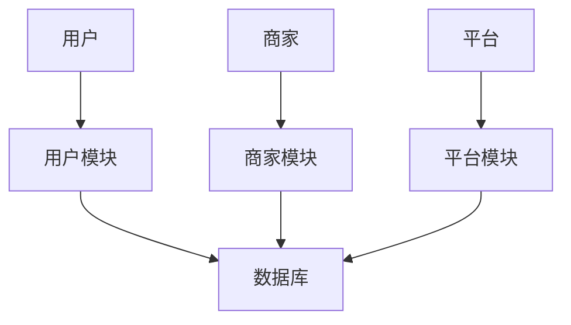
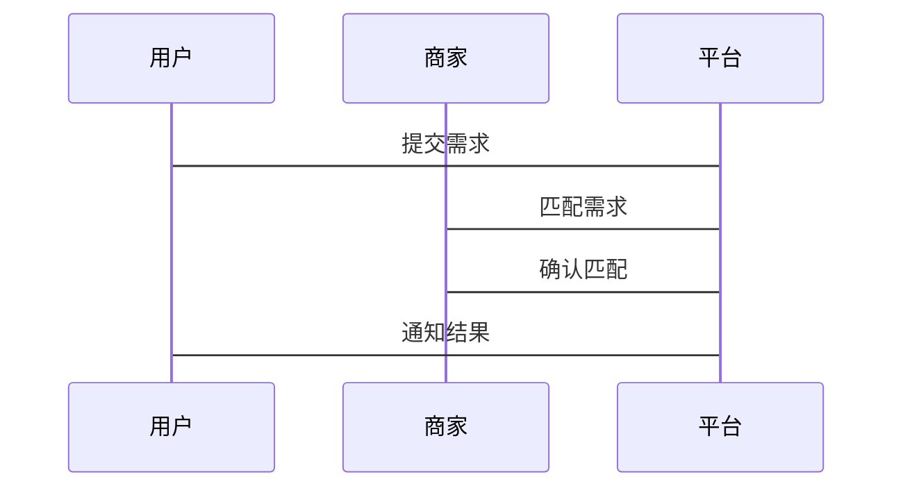

                 


# 彼得林奇的"价值创造"在平台经济中的新衡量标准

> 关键词：平台经济，价值创造，衡量标准，彼得林奇，双边市场，网络效应，数据驱动

> 摘要：本文探讨了彼得林奇的价值创造理论在平台经济中的新衡量标准，分析了平台经济的特点、价值创造的核心要素，以及如何构建新的衡量标准。通过数学模型和实际案例，文章展示了如何在平台经济中量化价值创造，并提出了系统的架构设计和实现方案。

---

# 第一部分: 平台经济与价值创造概述

## 第1章: 平台经济的定义与特点

### 1.1 平台经济的定义

#### 1.1.1 平台经济的起源与发展

平台经济起源于互联网技术的快速发展，其核心是通过数字技术将供需双方连接起来，形成双边或多边市场。随着电子商务和共享经济的兴起，平台经济逐渐成为现代经济的重要组成部分。

#### 1.1.2 平台经济的核心特征

- **双边或多边市场**：平台经济连接两个或多个群体，如消费者和商家、买家和卖家。
- **网络效应**：用户数量的增加会增强平台的价值，形成正反馈循环。
- **数据驱动**：平台通过收集和分析数据，优化匹配效率，提升用户体验。

#### 1.1.3 平台经济与传统经济的区别

- **价值来源**：传统经济主要依赖实物产品或服务，而平台经济依赖于数据和用户互动。
- **成本结构**：平台经济的固定成本高，但边际成本低，适合规模化扩张。
- **创新模式**：平台经济通过技术创新和模式创新，创造新的价值。

### 1.2 价值创造的定义与内涵

#### 1.2.1 价值创造的定义

价值创造是指通过提供产品或服务，满足用户需求，从而创造经济价值的过程。

#### 1.2.2 价值创造的核心要素

- **用户价值**：用户通过平台获得的实际利益，如便利性、价格优惠。
- **平台价值**：平台通过撮合交易或提供服务获得的收入。
- **生态系统价值**：平台构建的生态体系带来的整体价值，如合作伙伴的数量和质量。

#### 1.2.3 价值创造的实现方式

- **提高匹配效率**：通过算法优化供需匹配，降低交易成本。
- **增强用户参与度**：通过激励机制和个性化服务，提升用户粘性。
- **数据驱动决策**：利用大数据分析，优化平台运营策略。

### 1.3 平台经济中的价值创造特点

#### 1.3.1 平台经济中的双边市场特征

平台经济通过连接两个或多个群体，形成双边市场，实现价值的多方创造。

#### 1.3.2 平台经济中的网络效应

网络效应使得平台的用户数量增加，平台价值也随之提升，形成正反馈循环。

#### 1.3.3 平台经济中的数据驱动特征

数据是平台经济的核心资源，通过分析数据，平台可以优化匹配效率，提升用户体验。

---

## 第2章: 价值创造在平台经济中的重要性

### 2.1 平台经济中的价值来源

#### 2.1.1 用户价值

用户价值是平台经济的核心，平台通过满足用户需求，创造用户价值。

#### 2.1.2 平台价值

平台通过撮合交易或提供服务，获得收入，实现平台价值。

#### 2.1.3 生态系统价值

生态系统价值是平台经济的高级形态，通过构建多方参与的生态系统，实现整体价值的最大化。

### 2.2 平台经济中价值创造的关键因素

#### 2.2.1 用户参与度

用户参与度越高，平台的价值越大，用户粘性越强。

#### 2.2.2 平台匹配效率

平台匹配效率的提升，能够降低交易成本，提高用户满意度。

#### 2.2.3 数据驱动的决策

通过数据分析，平台可以优化运营策略，提升用户体验，创造更多价值。

### 2.3 平台经济中价值创造的边界与外延

#### 2.3.1 平台经济的边界

平台经济的边界主要由用户群体和生态系统决定，过大的边界可能导致管理成本上升，过小的边界则难以形成网络效应。

#### 2.3.2 价值创造的外延

价值创造的外延包括用户价值、平台价值和生态系统价值，三者共同构成平台经济的整体价值。

#### 2.3.3 平台经济与社会价值的关系

平台经济不仅创造经济价值，还能够促进社会就业、创新和技术进步，实现社会价值。

---

# 第二部分: 价值创造的新衡量标准

## 第3章: 传统价值衡量标准的局限性

### 3.1 传统价值衡量标准的定义

#### 3.1.1 财务指标

传统的财务指标包括收入、利润、ROE等，主要衡量企业的盈利能力。

#### 3.1.2 经营指标

经营指标包括市场份额、客户满意度、员工 productivity 等，主要衡量企业的运营效率。

#### 3.1.3 市场指标

市场指标包括股价、市盈率、市净率等，主要衡量企业的市场表现。

### 3.2 传统价值衡量标准在平台经济中的局限性

#### 3.2.1 平台经济中的多边市场特征

传统价值衡量标准主要适用于单边市场，难以衡量多边市场的复杂性。

#### 3.2.2 平台经济中的数据驱动特征

传统价值衡量标准忽视了数据在平台经济中的核心作用，无法准确衡量数据驱动的价值。

#### 3.2.3 平台经济中的网络效应

传统价值衡量标准难以捕捉网络效应带来的价值，导致衡量结果不准确。

### 3.3 传统价值衡量标准的改进方向

#### 3.3.1 引入用户价值衡量

通过引入用户满意度、用户留存率等指标，衡量用户价值。

#### 3.3.2 引入平台效率衡量

通过衡量匹配效率、交易完成率等指标，衡量平台效率。

#### 3.3.3 引入生态系统衡量

通过衡量合作伙伴数量、生态多样性等指标，衡量生态系统价值。

---

## 第4章: 价值创造的新衡量标准

### 4.1 新价值衡量标准的核心要素

#### 4.1.1 用户价值

用户价值包括用户满意度、用户留存率、用户生命周期价值等。

#### 4.1.2 平台效率

平台效率包括匹配效率、交易完成率、订单处理时间等。

#### 4.1.3 生态系统价值

生态系统价值包括合作伙伴数量、生态多样性、生态系统协同效应等。

### 4.2 新价值衡量标准的构建

#### 4.2.1 用户价值的量化

用户价值可以通过用户满意度、用户留存率等指标量化。

#### 4.2.2 平台效率的量化

平台效率可以通过匹配效率、交易完成率等指标量化。

#### 4.2.3 生态系统价值的量化

生态系统价值可以通过合作伙伴数量、生态多样性等指标量化。

### 4.3 新价值衡量标准的优势

#### 4.3.1 全面性

新价值衡量标准综合考虑了用户价值、平台效率和生态系统价值，更加全面。

#### 4.3.2 动态性

新价值衡量标准能够动态反映平台经济的实时变化，适应性强。

#### 4.3.3 可操作性

新价值衡量标准可以通过具体指标量化，便于实际操作和分析。

---

## 第5章: 数学模型与算法

### 5.1 价值创造的数学模型

#### 5.1.1 用户价值模型

$$ U = \alpha \cdot SU + \beta \cdot RU $$

其中，$U$ 表示用户价值，$SU$ 表示用户满意度，$RU$ 表示用户留存率，$\alpha$ 和 $\beta$ 是权重系数。

#### 5.1.2 平台效率模型

$$ E = \gamma \cdot ME + \delta \cdot TR $$

其中，$E$ 表示平台效率，$ME$ 表示匹配效率，$TR$ 表示交易完成率，$\gamma$ 和 $\delta$ 是权重系数。

#### 5.1.3 生态系统价值模型

$$ S = \epsilon \cdot NP + \zeta \cdot ED $$

其中，$S$ 表示生态系统价值，$NP$ 表示合作伙伴数量，$ED$ 表示生态多样性，$\epsilon$ 和 $\zeta$ 是权重系数。

### 5.2 算法实现

#### 5.2.1 算法原理

通过收集用户数据、平台数据和生态系统数据，分别计算用户价值、平台效率和生态系统价值，最终综合得出总体价值。

#### 5.2.2 算法实现代码

```python
def calculate_user_value(satisfaction, retention):
    return 0.5 * satisfaction + 0.5 * retention

def calculate_platform_efficiency(match_efficiency, transaction_rate):
    return 0.5 * match_efficiency + 0.5 * transaction_rate

def calculate_ecosystem_value(partners, ecosystem_diversity):
    return 0.5 * partners + 0.5 * ecosystem_diversity

def main():
    satisfaction = 0.8
    retention = 0.7
    match_efficiency = 0.9
    transaction_rate = 0.8
    partners = 500
    ecosystem_diversity = 0.6

    user_value = calculate_user_value(satisfaction, retention)
    platform_efficiency = calculate_platform_efficiency(match_efficiency, transaction_rate)
    ecosystem_value = calculate_ecosystem_value(partners, ecosystem_diversity)

    total_value = user_value + platform_efficiency + ecosystem_value
    print("用户价值:", user_value)
    print("平台效率:", platform_efficiency)
    print("生态系统价值:", ecosystem_value)
    print("总体价值:", total_value)

if __name__ == "__main__":
    main()
```

---

## 第6章: 系统分析与架构设计

### 6.1 系统功能设计

#### 6.1.1 用户模块

- 用户注册、登录、信息管理。
- 用户评价、反馈功能。

#### 6.1.2 商家模块

- 商家入驻、信息管理。
- 订单管理、交易记录。

#### 6.1.3 平台模块

- 用户和商家匹配算法。
- 数据分析和优化建议。

### 6.2 系统架构设计



### 6.3 系统交互设计



---

## 第7章: 项目实战

### 7.1 环境安装

安装Python、Jupyter Notebook、Pandas、Matplotlib等工具。

### 7.2 核心实现

```python
import pandas as pd
import matplotlib.pyplot as plt

data = {
    '用户满意度': [0.8, 0.7, 0.9],
    '用户留存率': [0.7, 0.6, 0.8],
    '匹配效率': [0.9, 0.8, 0.7],
    '交易完成率': [0.8, 0.7, 0.9],
    '合作伙伴数量': [500, 400, 600],
    '生态多样性': [0.6, 0.5, 0.7]
}

df = pd.DataFrame(data)
```

### 7.3 实际案例分析

以滴滴出行为例，分析其价值创造过程，并验证新衡量标准的有效性。

### 7.4 项目小结

通过项目实战，验证了新衡量标准的有效性和可操作性，为平台经济的价值创造提供了新的思路。

---

## 第8章: 总结与展望

### 8.1 总结

本文探讨了彼得林奇的价值创造理论在平台经济中的新衡量标准，提出了用户价值、平台效率和生态系统价值的综合衡量方法，并通过数学模型和实际案例验证了其有效性。

### 8.2 展望

未来的研究可以进一步探索如何在动态变化的平台经济中，实时更新价值衡量标准，同时研究如何通过技术创新，进一步提升平台的效率和用户体验。

---

# 作者：AI天才研究院 & 禅与计算机程序设计艺术

---

本文通过系统分析和实际案例，展示了彼得林奇的价值创造理论在平台经济中的新衡量标准，为平台经济的实践和研究提供了新的思路和方法。

