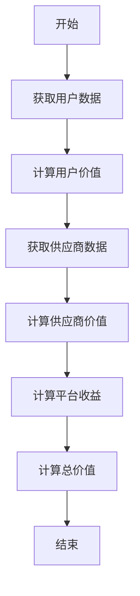
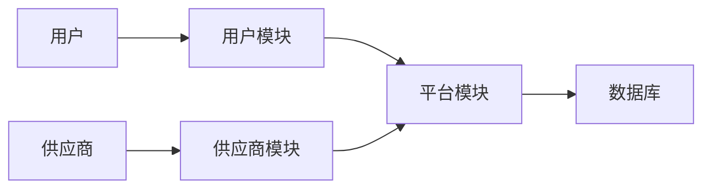
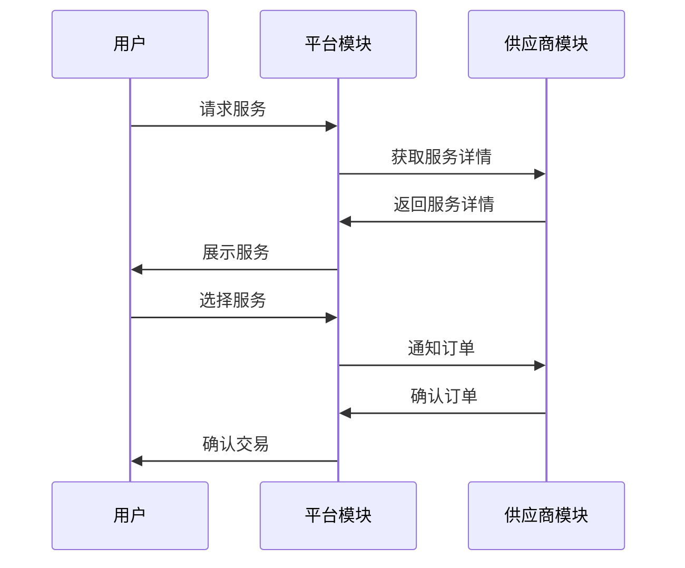

                 


---

# 彼得林奇的"价值创造"在平台经济中的新衡量维度

---

## 关键词：彼得林奇，价值创造，平台经济，衡量维度，商业模式创新

---

## 摘要

本文探讨了彼得林奇的价值创造理论在平台经济中的新衡量维度。通过分析平台经济的特点，提出了基于双边市场的价值衡量模型，并结合实际案例，展示了如何在平台经济中创新性地应用价值创造理论，为企业提供新的发展思路。

---

## 第一部分：背景介绍

### 第1章：价值创造与平台经济概述

#### 1.1 价值创造的核心概念

价值创造是指企业通过创新或优化现有模式，为股东、客户或其他利益相关者创造超过其投入的价值。传统价值创造注重财务回报和股东利益，但在现代经济中，随着商业模式的多样化，价值创造的内涵不断扩展。

#### 1.2 平台经济的定义与特点

平台经济是一种依托数字技术，通过平台连接供需双方，提供撮合交易或信息服务的商业模式。其特点包括双边市场、网络效应、数据驱动和去中介化。

#### 1.3 彼得林奇价值创造理论与平台经济的结合

彼得林奇强调通过基本面分析和长期投资创造价值。在平台经济中，价值创造不仅体现在财务回报上，还包括用户体验、网络效应和生态系统的构建。

---

## 第二部分：核心概念与联系

### 第2章：价值创造与平台经济的核心概念

#### 2.1 核心概念的原理

平台经济中的价值创造涉及用户、供应商和平台的三方互动，通过数据和技术提升效率，创造新的价值点。

#### 2.2 概念属性特征对比

| 特征       | 传统价值创造 | 平台经济中的价值创造 |
|------------|---------------|-----------------------|
| 参与方      | 企业与客户   | 用户、供应商、平台   |
| 价值来源   | 产品与服务   | 数据、网络效应       |
| 价值衡量   | 财务回报     | 用户增长、网络效应   |

#### 2.3 ER实体关系图

```mermaid
erDiagram
    actor 用户 {
        +id 用户ID
        +string 用户名
        +string 密码
    }
    actor 供应商 {
        +id 供应商ID
        +string 供应商名
        +string 资质
    }
    actor 平台 {
        +id 平台ID
        +string 平台名称
        +string 服务类型
    }
    用户 --> 平台 : 使用服务
    供应商 --> 平台 : 提供服务
    用户 --> 供应商 : 选择服务
```

---

## 第三部分：算法原理讲解

### 第3章：平台经济中的价值衡量模型

#### 3.1 算法原理概述

平台价值=用户价值 + 供应商价值 + 平台收益

其中，用户价值和供应商价值通过网络效应和双边市场进行评估。

#### 3.2 算法流程图



#### 3.3 数学公式

$$
V = V_u + V_s + V_p
$$

其中，\( V_u \) 是用户价值，\( V_s \) 是供应商价值，\( V_p \) 是平台收益。

---

## 第四部分：系统分析与架构设计

### 第4章：系统架构设计方案

#### 4.1 系统功能设计

用户模块：注册、登录、浏览服务  
供应商模块：入驻、发布服务  
平台模块：数据处理、交易撮合

#### 4.2 系统架构图



#### 4.3 系统接口设计

API接口：用户认证、数据查询

#### 4.4 系统交互流程图



---

## 第五部分：项目实战

### 第5章：平台价值衡量模型的实现

#### 5.1 环境安装

安装Python、Jupyter Notebook、Flask框架。

#### 5.2 核心代码实现

```python
def calculate_user_value(users):
    return sum(u.value for u in users)

def calculate_supplier_value(suppliers):
    return sum(s.value for s in suppliers)

def calculate_platform_value(users, suppliers, platform_revenue):
    return calculate_user_value(users) + calculate_supplier_value(suppliers) + platform_revenue

# 示例数据
users = [100, 200, 300]
suppliers = [150, 250]
platform_revenue = 1000

total_value = calculate_platform_value(users, suppliers, platform_revenue)
print(f"平台总价值为：{total_value}")
```

#### 5.3 应用案例分析

以某电商平台为例，分析用户增长、供应商参与度和平台收入的提升。

---

## 第六部分：最佳实践

### 第6章：总结与建议

#### 6.1 小结

本文探讨了彼得林奇价值创造理论在平台经济中的新应用，提出了衡量模型和系统设计。

#### 6.2 注意事项

- 数据质量影响价值计算
- 网络效应的放大效应
- 平台的双边协调挑战

#### 6.3 拓展阅读

推荐相关书籍和论文，深入探讨平台经济和价值创造。

---

## 结语

作者：AI天才研究院 & 禅与计算机程序设计艺术

---

通过本文的分析，读者可以理解如何在平台经济中创新性地应用彼得林奇的价值创造理论，并通过具体案例和系统设计，掌握实际应用的方法。

