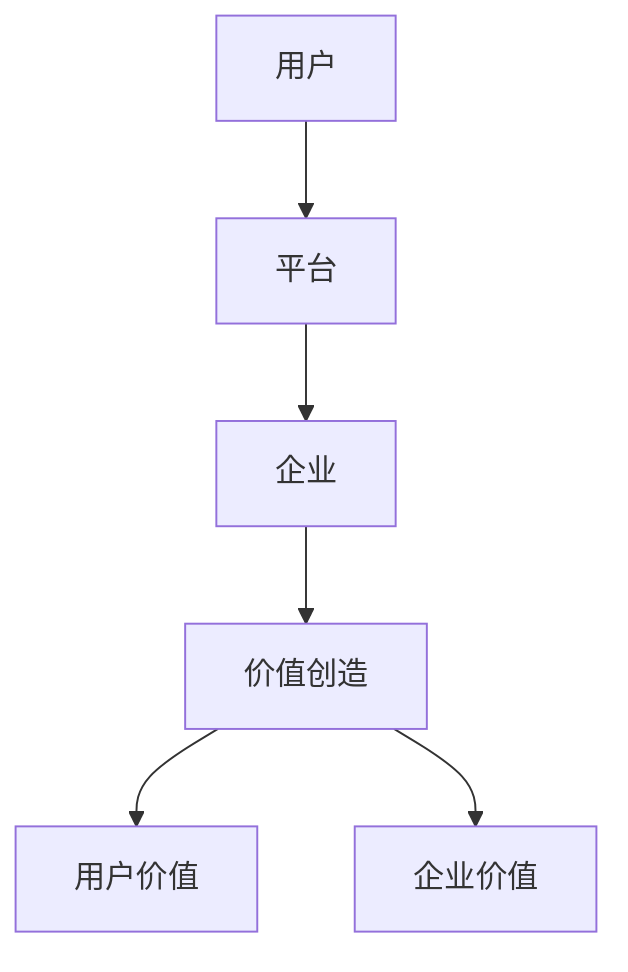
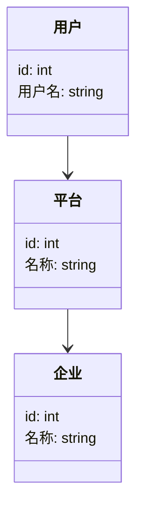
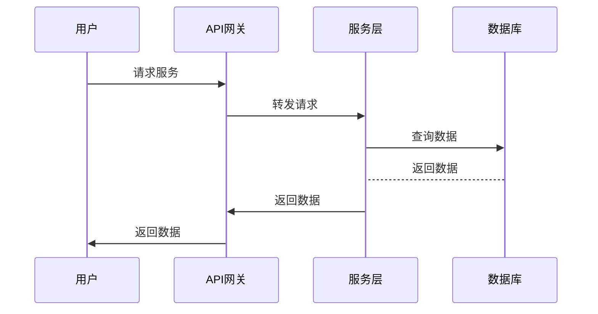

                 


# 彼得林奇的"价值创造"在平台经济中的衡量

## 关键词：
- 彼得林奇
- 价值创造
- 平台经济
- 数学模型
- 算法原理
- 系统架构
- 项目实战

## 摘要：
本文深入探讨了彼得林奇的价值创造理念在平台经济中的应用与衡量。通过构建数学模型、分析算法原理、设计系统架构，并结合实际案例，详细讲解了如何在平台经济中实现和衡量价值创造。文章内容涵盖背景介绍、核心概念、算法原理、系统架构设计、项目实战等多个方面，为读者提供了全面而深入的分析。

---

# 第一部分: 背景介绍

## 第1章: 价值创造与平台经济概述

### 1.1 价值创造的定义与核心要素

#### 1.1.1 价值创造的定义
价值创造是指通过创新和优化资源配置，使得产品或服务能够为用户或客户创造超过其成本的价值。彼得林奇认为，价值创造的核心在于发现那些能够持续创造价值的企业，并通过投资这些企业实现财富增长。

#### 1.1.2 价值创造的核心要素
- **创新性**：通过技术创新或商业模式创新创造新的价值。
- **效率性**：通过优化资源配置提高效率，降低成本。
- **可持续性**：价值创造必须是长期可持续的，而非短期行为。

#### 1.1.3 价值创造的边界与外延
价值创造的边界在于企业的核心竞争力，而外延则体现在企业与外部环境的互动中，包括用户、合作伙伴和社会。

---

### 1.2 平台经济的基本概念

#### 1.2.1 平台经济的定义
平台经济是指通过数字技术构建的虚拟平台，连接供需双方，提供撮合交易或信息共享服务的商业模式。

#### 1.2.2 平台经济的特点
- **双边市场**：平台通常连接两个或多个不同的用户群体。
- **网络效应**：用户数量的增加会增强平台的价值。
- **数据驱动**：通过数据分析优化匹配效率。

#### 1.2.3 平台经济的参与者与关系
- **用户**：平台的直接使用者。
- **供应商**：提供产品或服务的个体或企业。
- **平台运营者**：平台的建设和管理者。

---

### 1.3 彼得林奇的价值观与投资理念

#### 1.3.1 彼得林奇的个人简介
彼得·林奇（Peter Lynch）是美国著名投资家，以其在富达投资管理公司的成功投资业绩闻名。他强调长期投资和价值发现。

#### 1.3.2 彼得林奇的价值创造理念
彼得林奇认为，价值创造的核心在于找到那些能够持续增长的企业，并通过长期持有这些企业的股票实现财富增长。

#### 1.3.3 彼得林奇与平台经济的联系
随着平台经济的崛起，彼得林奇的价值观为平台经济中的价值创造提供了重要的理论支持。

---

### 1.4 平台经济中的价值创造

#### 1.4.1 平台经济与价值创造的关系
平台经济通过优化资源配置，降低交易成本，为用户创造更大的价值。

#### 1.4.2 平台经济中的价值创造模式
- **直接价值**：通过平台提供的服务直接创造价值。
- **间接价值**：通过平台的撮合，间接创造价值。

#### 1.4.3 平台经济中的价值衡量标准
- **用户满意度**：用户对平台服务的满意程度。
- **经济收益**：平台为企业或用户带来的经济效益。
- **社会影响**：平台对社会整体价值的贡献。

---

## 第2章: 平台经济中的价值创造核心概念

### 2.1 价值创造的核心概念

#### 2.1.1 价值创造的主体
- **用户**：通过使用平台服务创造个人价值。
- **企业**：通过平台实现业务增长，创造企业价值。
- **平台运营者**：通过优化平台功能，创造平台价值。

#### 2.1.2 价值创造的客体
- **产品或服务**：平台提供的核心产品或服务。
- **数据**：通过数据驱动优化资源配置。

#### 2.1.3 价值创造的过程
- **需求分析**：了解用户需求，设计符合需求的产品或服务。
- **价值实现**：通过平台功能实现需求与供给的匹配。
- **价值传递**：将价值传递给用户，实现价值创造。

---

### 2.2 平台经济中的价值衡量维度

#### 2.2.1 用户价值
- **用户满意度**：用户对平台服务的满意程度。
- **用户留存率**：用户持续使用平台的比例。

#### 2.2.2 企业价值
- **收入增长**：平台为企业带来的收入。
- **成本降低**：平台帮助企业降低运营成本。

#### 2.2.3 社会价值
- **就业机会**：平台为企业创造的就业机会。
- **社会影响力**：平台对社会整体价值的贡献。

---

### 2.3 彼得林奇价值创造理论与平台经济的结合

#### 2.3.1 彼得林奇理论的核心观点
彼得林奇认为，价值创造的核心在于发现那些能够持续增长的企业，并通过长期持有这些企业的股票实现财富增长。

#### 2.3.2 平台经济中的应用
- **用户增长**：通过平台吸引更多的用户，实现用户增长。
- **业务扩展**：通过平台拓展新的业务领域，实现业务增长。

#### 2.3.3 理论与实践的结合
通过彼得林奇的价值创造理论，平台经济可以在实际运营中实现用户、企业和社会价值的共同增长。

---

## 第3章: 平台经济中的价值创造模型

### 3.1 平台经济中的价值创造模型构建

#### 3.1.1 模型构建的背景
为了衡量平台经济中的价值创造，我们需要构建一个能够量化用户、企业和社会价值的模型。

#### 3.1.2 模型构建的步骤
1. **确定核心变量**：包括用户数量、收入、成本等。
2. **建立数学关系**：将这些变量通过数学公式联系起来。
3. **验证模型**：通过实际数据验证模型的准确性。

#### 3.1.3 模型的核心要素
- **用户数量**：平台的用户规模。
- **收入**：平台的总收入。
- **成本**：平台的运营成本。

---

### 3.2 平台经济中的价值创造模型分析

#### 3.2.1 模型的输入变量
- **用户数量**：平台的用户规模。
- **收入**：平台的总收入。
- **成本**：平台的运营成本。

#### 3.2.2 模型的输出变量
- **净收益**：平台的净利润。
- **用户满意度**：用户对平台的满意程度。

#### 3.2.3 模型的验证与优化
通过实际数据验证模型的准确性，并根据反馈不断优化模型。

---

### 3.3 模型的可视化与图表展示

#### 3.3.1 模型的流程图


#### 3.3.2 模型的对比表
| 指标 | 定义 | 重要性 |
|------|------|--------|
| 用户数量 | 平台的用户规模 | 高 |
| 收入 | 平台的总收入 | 高 |
| 成本 | 平台的运营成本 | 中 |

#### 3.3.3 模型的ER实体关系图
```mermaid
erd
entity 用户 {
  id
  用户名
}
entity 平台 {
  id
  名称
}
entity 企业 {
  id
  名称
}
用户 --> 平台
平台 --> 企业
```

---

## 第4章: 价值创造的算法原理

### 4.1 算法原理概述

#### 4.1.1 算法的基本概念
价值创造的算法是指通过一系列步骤，将平台的用户、收入和成本等变量转化为净收益的过程。

#### 4.1.2 算法的核心原理
通过数学公式计算平台的净收益，进而衡量价值创造。

#### 4.1.3 算法的实现步骤
1. **收集数据**：获取平台的用户数量、收入和成本。
2. **计算净收益**：净收益 = 收入 - 成本。
3. **分析结果**：根据净收益判断平台的价值创造能力。

---

### 4.2 算法的数学模型

#### 4.2.1 数学模型的定义
数学模型是指通过数学公式描述平台经济中的价值创造过程。

#### 4.2.2 算法的实现代码
```python
def calculate_profit(users, revenue, cost):
    profit = revenue - cost
    return profit

users = 100000
revenue = 1000000
cost = 500000

profit = calculate_profit(users, revenue, cost)
print("Net Profit:", profit)
```

#### 4.2.3 算法的数学公式
$$\text{Net Profit} = \text{Revenue} - \text{Cost}$$

---

## 第5章: 系统分析与架构设计

### 5.1 问题场景介绍

#### 5.1.1 问题背景
平台经济中的价值创造需要通过系统架构来实现。

#### 5.1.2 问题描述
如何通过系统架构设计实现平台的高效运行和价值创造。

#### 5.1.3 问题解决
通过优化系统架构，提高平台的运行效率，进而实现价值创造。

---

### 5.2 系统功能设计

#### 5.2.1 领域模型mermaid类图


#### 5.2.2 系统架构设计mermaid架构图


#### 5.2.3 系统接口设计
- **API接口**：平台与用户、企业之间的交互接口。
- **数据库接口**：平台与数据库之间的交互接口。

#### 5.2.4 系统交互mermaid序列图


---

## 第6章: 项目实战

### 6.1 环境安装

#### 6.1.1 系统环境
- 操作系统：Linux
- Python版本：3.8以上
- 其他依赖：numpy、pandas等

#### 6.1.2 安装步骤
```bash
pip install numpy pandas matplotlib
```

---

### 6.2 系统核心实现源代码

#### 6.2.1 核心代码实现
```python
import numpy as np
import pandas as pd

def calculate_value创造(users, revenue, cost):
    value = revenue - cost
    return value

users = 100000
revenue = 1000000
cost = 500000

value = calculate_value创造(users, revenue, cost)
print("Value创造:", value)
```

#### 6.2.2 代码应用解读与分析
通过上述代码，我们可以计算平台的净收益，进而衡量平台的价值创造能力。

---

### 6.3 实际案例分析

#### 6.3.1 案例背景
假设我们有一个在线教育平台，用户数量为10万，总收入为1000万元，运营成本为500万元。

#### 6.3.2 案例分析
通过上述代码，我们可以计算平台的净收益为500万元，表明平台的价值创造能力较强。

---

## 第7章: 最佳实践与小结

### 7.1 最佳实践 tips
- 定期优化系统架构，提高平台的运行效率。
- 关注用户反馈，不断改进平台功能。
- 加强数据驱动，通过数据分析优化价值创造。

### 7.2 注意事项
- 确保数据的准确性和完整性。
- 注意平台的扩展性，避免系统瓶颈。
- 关注平台的可持续性，确保长期价值创造。

### 7.3 拓展阅读
建议读者进一步阅读彼得林奇的相关著作，深入了解价值创造的理论与实践。

---

## 结论

本文通过构建数学模型、分析算法原理、设计系统架构，并结合实际案例，详细讲解了彼得林奇的价值创造理念在平台经济中的应用与衡量。通过本文的分析，读者可以更好地理解平台经济中的价值创造，并将其应用到实际工作中。

---

## 作者

作者：AI天才研究院/AI Genius Institute & 禅与计算机程序设计艺术 /Zen And The Art of Computer Programming

