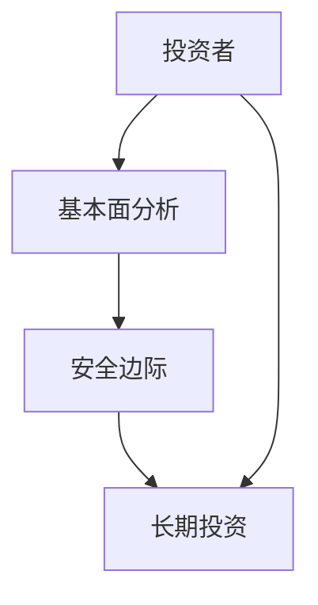
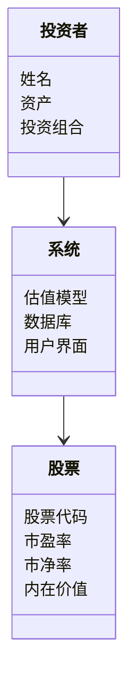
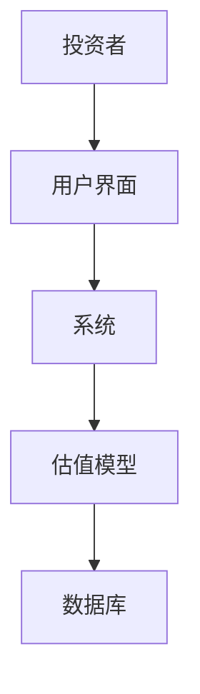

                 


# 彼得林奇的"价值创造"投资理念

---

## 关键词

- 价值创造
- 投资理念
- 彼得·林奇
- 基本面分析
- 安全边际
- 长期投资
- 数学模型

---

## 摘要

彼得·林奇是全球著名的投资专家，他提出的"价值创造"投资理念强调通过基本面分析、安全边际和长期投资来实现财富增长。本文将从背景、核心概念、算法原理、系统架构、项目实战等多维度全面解析这一理念，并通过具体案例和代码实现帮助读者深入理解其本质和应用。

---

# 第一部分: 价值创造理念的背景与基础

## 第1章: 投资的基本概念与彼得·林奇的生平

### 1.1 投资的基本概念

#### 1.1.1 投资的定义与分类
投资是通过将资金投入某一领域（如股票、债券、房地产等）以获得收益的行为。投资可以分为短期投资和长期投资，其中长期投资更符合彼得·林奇的价值创造理念。

#### 1.1.2 投资的基本原则
- 分散投资：避免将所有资金投入到单一领域。
- 长期视角：关注企业的长期价值，而非短期波动。
- 风险控制：通过基本面分析和安全边际降低投资风险。

#### 1.1.3 投资与价值创造的关系
价值创造是投资的终极目标。通过投资推动企业或项目的增值，实现财富的可持续增长。

---

### 1.2 彼得·林奇的生平与投资理念

#### 1.2.1 彼得·林奇的生平简介
彼得·林奇是美国著名的投资家，曾管理富达麦哲伦基金，创造了卓越的投资业绩。

#### 1.2.2 林奇的投资风格与特点
- 以基本面分析为核心。
- 注重安全边际，避免过度冒险。
- 长期持有优质资产。

#### 1.2.3 林奇的价值创造理念的核心思想
通过深入分析企业的基本面，选择具有长期增长潜力的公司，并以合理的价格买入，实现价值的持续增长。

---

## 第2章: 价值创造理念的基本框架

### 2.1 价值创造的核心概念

#### 2.1.1 价值创造的定义
价值创造是指通过投资推动企业或项目的增值，最终实现资产的长期增长。

#### 2.1.2 价值创造的核心要素
- 企业的基本面：收入、利润、负债等财务指标。
- 行业的竞争格局：行业的增长潜力和竞争程度。
- 管理层的能力：企业的决策层是否具备优秀的管理能力。

#### 2.1.3 价值创造的实现路径
- 选择具有长期增长潜力的企业。
- 以合理的价格买入，避免过度支付。
- 长期持有，分享企业的增长收益。

---

### 2.2 价值创造与投资的关系

#### 2.2.1 价值创造在投资中的作用
价值创造是投资的最终目标，通过投资推动企业的价值增长，实现资产的增值。

#### 2.2.2 投资如何推动价值创造
- 通过投资为优秀企业提供资金支持。
- 通过市场机制推动企业优化管理和技术创新。

#### 2.2.3 价值创造理念在投资中的应用
投资者通过价值创造理念，选择具有长期增长潜力的企业，实现资产的可持续增长。

---

# 第二部分: 核心概念与联系

## 第3章: 核心概念与联系

### 3.1 核心概念原理

#### 3.1.1 基本面分析
基本面分析是价值创造的核心方法，通过对企业财务数据的分析，评估企业的内在价值。

#### 3.1.2 安全边际
安全边际是指投资价格低于企业内在价值的部分，是降低投资风险的重要因素。

#### 3.1.3 长期投资
长期投资是价值创造的重要策略，通过持有优质资产，分享企业的长期增长收益。

---

### 3.2 核心概念属性对比表格

| 概念         | 属性1 | 属性2 | 属性3 |
|--------------|-------|-------|-------|
| 基本面分析   | 定量分析 | 定性分析 | 长期视角 |
| 安全边际     | 保护性 | 稳定性 | 可靠性 |
| 长期投资     | 时间跨度 | 耐心要求 | 风险分散 |

---

### 3.3 ER实体关系图（Mermaid流程图）



---

## 第4章: 价值评估模型与算法

### 4.1 价值评估模型的原理

#### 4.1.1 现金流折现模型（DCF）

现金流折现模型（DCF）是价值评估的核心方法之一，通过对企业未来现金流的折现，评估企业的内在价值。

- **公式**：
  $$
  V = \sum_{t=1}^{n} \frac{CF_t}{(1 + r)^t} + \frac{TV}{(1 + r)^n}
  $$
  其中，\( V \) 是企业价值，\( CF_t \) 是第 \( t \) 年的现金流，\( r \) 是折现率，\( TV \) 是终值。

- **流程图**：
  ```mermaid
  graph TD
      A[现金流折现模型] --> B[确定现金流]
      B --> C[确定折现率]
      C --> D[计算现值]
      D --> E[评估企业价值]
  ```

#### 4.1.2 市盈率与市净率分析

市盈率（P/E）和市净率（P/B）是常用的估值指标，分别表示股价与企业利润、资产的比率。

- **公式**：
  - 市盈率：$$ P/E = \frac{P}{E} $$
  - 市净率：$$ P/B = \frac{P}{B} $$

---

## 第5章: 系统分析与架构设计方案

### 5.1 问题场景介绍

#### 5.1.1 问题背景
投资者需要通过系统化的分析工具，快速评估企业的内在价值。

#### 5.1.2 项目介绍
设计一个基于彼得·林奇价值创造理念的股票估值系统。

---

### 5.2 系统功能设计

#### 5.2.1 领域模型（Mermaid类图）



---

### 5.3 系统架构设计（Mermaid架构图）


---

## 第6章: 项目实战

### 6.1 环境安装

- **Python环境**：安装Python 3.8+
- **依赖库**：安装 `pandas`, `numpy`, `scipy`

### 6.2 核心代码实现

```python
import pandas as pd
import numpy as np

def discounted_cash_flow(cash_flows, discount_rate):
    """
    计算现金流的现值
    """
    return sum(cf / (1 + discount_rate)**t for t, cf in enumerate(cash_flows))

def value_atRisk(prices, confidence_level=0.95):
    """
    计算资产的价值风险
    """
    sorted_prices = sorted(prices)
    percentile = int(len(sorted_prices) * confidence_level)
    return sorted_prices[percentile]

def main():
    cash_flows = [100, 200, 300]
    discount_rate = 0.1
    value = discounted_cash_flow(cash_flows, discount_rate)
    print(f"企业价值为：{value}")
    # 示例价值风险计算
    prices = [10, 20, 30, 40, 50]
    VaR = value_atRisk(prices)
    print(f"在{confidence_level*100}%的置信水平下，价值风险为：{VaR}")

if __name__ == "__main__":
    main()
```

---

## 第7章: 深入分析与优化

### 7.1 投资组合优化

#### 7.1.1 投资组合优化的数学模型
$$
\text{目标函数：} \quad \max \sum_{i=1}^{n} w_i r_i
$$
$$
\text{约束条件：} \quad \sum_{i=1}^{n} w_i = 1
$$
$$
\quad \quad \quad \sum_{i=1}^{n} w_i^2 \leq k
$$

---

## 第8章: 系统架构与实现

### 8.1 系统架构设计

#### 8.1.1 系统架构图


---

## 第9章: 项目小结

### 9.1 投资策略与风险管理

#### 9.1.1 投资策略
- 坚持长期投资。
- 选择基本面良好的企业。
- 保持分散投资。

#### 9.1.2 风险管理
- 设置止损点。
- 定期评估投资组合。
- 保持对市场的敏感性。

---

## 第10章: 总结与展望

### 10.1 投资理念的总结

#### 10.1.1 总结
彼得·林奇的价值创造理念强调基本面分析、安全边际和长期投资，是实现财富增长的重要方法。

#### 10.1.2 展望
随着技术的发展，基于价值创造理念的投资工具和系统将更加智能化和高效化。

---

## 作者

作者：AI天才研究院/AI Genius Institute & 禅与计算机程序设计艺术/Zen And The Art of Computer Programming

