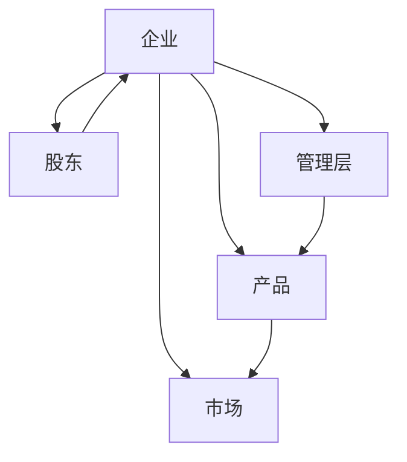
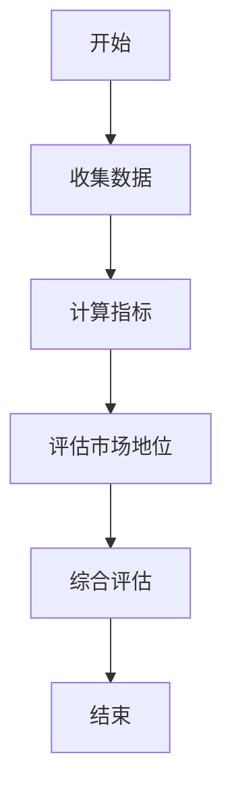
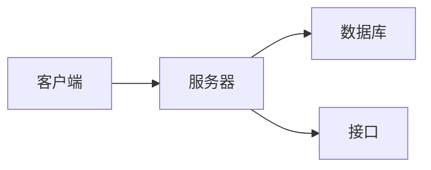
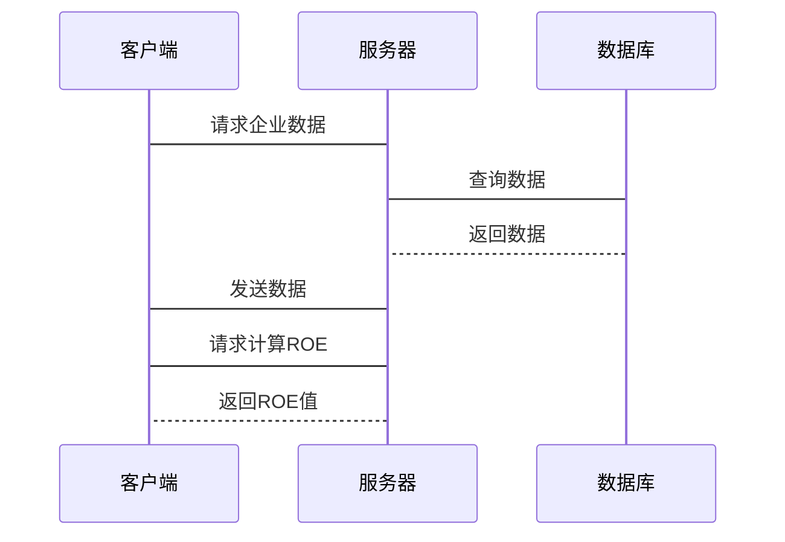

                 


# 彼得林奇的"价值创造"投资理念解析

## 关键词：价值创造、投资理念、彼得林奇、企业价值、股东价值

## 摘要：本文深入解析了彼得林奇的“价值创造”投资理念，从其核心概念、算法原理、系统架构到项目实战，详细阐述了如何通过价值创造实现企业与股东的双赢。通过实例分析和系统设计，本文为投资者提供了科学的投资方法论。

---

# 第一部分：价值创造投资理念的背景与核心概念

## 第1章：价值创造投资理念的背景介绍

### 1.1 价值创造投资理念的定义与特点

#### 1.1.1 价值创造的定义
价值创造是指通过优化企业内部管理、提升产品竞争力、扩大市场份额等方式，使得企业能够为股东创造超过其投资成本的回报。它强调企业不仅仅追求短期利润，更注重长期的价值增长。

#### 1.1.2 价值创造的核心要素
- **财务健康**：包括盈利能力、资产负债情况、现金流等。
- **市场地位**：企业在市场中的竞争力和品牌影响力。
- **管理层能力**：管理层的战略眼光和执行能力。
- **创新与研发**：企业的技术创新能力。

#### 1.1.3 价值创造与传统投资理念的区别
- **传统投资**：注重短期股价波动，依赖市场情绪。
- **价值创造**：关注企业长期价值，注重基本面分析。

### 1.2 价值创造投资理念的背景

#### 1.2.1 投资市场的演变
随着全球经济的发展，投资者逐渐从短期投机转向长期价值投资。

#### 1.2.2 价值创造理念的兴起
20世纪80年代，彼得·林奇提出的“价值投资”理念开始受到广泛认可。

#### 1.2.3 彼得·林奇的贡献
彼得·林奇通过长期投资实践，总结出一套以企业价值为核心的投资方法。

### 1.3 价值创造投资理念的理论基础

#### 1.3.1 基本面分析
通过分析企业的财务报表，评估其经营状况。

#### 1.3.2 股东价值最大化
企业决策以股东利益为核心，追求长期价值增长。

#### 1.3.3 经济学原理
价值创造依赖于市场供需关系和企业成本控制。

### 1.4 价值创造投资理念的应用范围

#### 1.4.1 企业价值评估
评估企业的内在价值，寻找被低估的投资标的。

#### 1.4.2 股票投资策略
通过价值发现，制定长期持股策略。

#### 1.4.3 价值创造与企业成长
分析企业的成长潜力，选择具有竞争优势的企业。

---

## 第2章：价值创造的核心概念与联系

### 2.1 价值创造的核心概念

#### 2.1.1 企业价值的构成
- **资产价值**：包括流动资产和固定资产。
- **未来现金流**：企业未来盈利能力的现值。
- **品牌价值**：品牌知名度和美誉度带来的溢价能力。

#### 2.1.2 股东价值的实现路径
- **提升ROE（净资产收益率）**：通过优化资本结构，提高盈利能力。
- **扩大市场份额**：通过技术创新和市场拓展，增加收入来源。
- **降低成本**：通过流程优化和供应链管理，提升效率。

#### 2.1.3 价值创造的驱动因素
- **技术创新**：通过技术进步提高产品附加值。
- **管理优化**：高效的组织架构和管理制度。
- **人才储备**：高素质的人才团队推动企业持续发展。

### 2.2 价值创造的核心要素对比

#### 2.2.1 财务指标对比
| 指标 | 优秀企业 | 一般企业 |
|------|-----------|-----------|
| 净利润增长率 | 高         | 低         |
| ROE   | 高         | 低         |
| 负债率 | 低         | 高         |

#### 2.2.2 市场表现对比
| 表现 | 价值型企业 | 非价值型企业 |
|------|-------------|---------------|
| 股价波动 | 小           | 大           |
| 长期收益 | 高           | 低           |

#### 2.2.3 管理层能力对比
| 能力 | 优秀管理层 | 一般管理层 |
|------|-------------|-------------|
| 战略眼光 | 准确         | 有限       |
| 执行力 | 强          | 弱          |

### 2.3 价值创造的ER实体关系图



---

## 第3章：价值创造的算法原理

### 3.1 价值创造的算法原理

#### 3.1.1 算法概述
通过对企业基本面的量化分析，评估其价值创造能力。

#### 3.1.2 算法的输入与输出
- **输入**：企业的财务数据、市场数据。
- **输出**：企业价值评分、投资建议。

#### 3.1.3 算法的实现步骤
1. 收集企业的财务数据。
2. 计算关键财务指标（如ROE、市盈率）。
3. 评估企业的市场地位和竞争优势。
4. 综合评估企业价值，给出投资建议。

### 3.2 算法的mermaid流程图



### 3.3 算法的数学模型与公式

#### 3.3.1 计算ROE
$$ ROE = \frac{\text{净利润}}{\text{净资产}} $$

#### 3.3.2 计算市盈率
$$ P/E = \frac{\text{股价}}{\text{每股收益}} $$

### 3.4 算法的详细讲解与举例说明

#### 3.4.1 案例分析
假设某公司ROE为15%，市盈率为12，行业平均ROE为10%，市盈率为15。根据算法，该公司的ROE高于行业平均，市盈率低于行业平均，表明公司具有较高的价值创造能力。

---

## 第4章：价值创造的系统分析与架构设计

### 4.1 系统分析

#### 4.1.1 问题场景
投资者需要快速评估企业的价值创造能力，做出投资决策。

#### 4.1.2 系统需求
- 实时获取企业财务数据。
- 自动计算关键财务指标。
- 提供投资建议。

### 4.2 系统架构设计



### 4.3 系统接口设计

#### 4.3.1 接口设计原则
- 简单性：接口功能单一。
- 可扩展性：支持未来功能扩展。

#### 4.3.2 接口实现
- 数据接口：获取企业财务数据。
- 计算接口：计算ROE和市盈率。
- 报告接口：生成投资建议报告。

### 4.4 系统交互设计



---

## 第5章：价值创造的项目实战

### 5.1 环境安装与配置

#### 5.1.1 环境需求
- Python 3.8及以上版本。
- 安装库：pandas、numpy、scikit-learn。

#### 5.1.2 环境配置
```bash
pip install pandas numpy scikit-learn
```

### 5.2 系统核心实现源代码

#### 5.2.1 核心代码
```python
import pandas as pd

def calculate_roe(net_profit, equity):
    return net_profit / equity

def calculate_pe_ratio(price, eps):
    return price / eps

# 示例数据
data = {
    '公司': ['A', 'B', 'C'],
    '净利润': [100, 150, 200],
    '净资产': [500, 600, 700],
    '股价': [50, 60, 70],
    '每股收益': [5, 4, 3.5]
}

df = pd.DataFrame(data)

# 计算ROE和市盈率
df['ROE'] = df.apply(lambda x: calculate_roe(x['净利润'], x['净资产']), axis=1)
df['P/E'] = df.apply(lambda x: calculate_pe_ratio(x['股价'], x['每股收益']), axis=1)

print(df)
```

### 5.3 代码应用解读与分析

#### 5.3.1 代码功能
- 计算企业的ROE和市盈率，评估其价值创造能力。

#### 5.3.2 结果分析
通过代码计算的结果，可以发现公司A的ROE为20%，市盈率为10，表明其具有较高的价值创造能力。

### 5.4 实际案例分析

#### 5.4.1 案例背景
某公司过去5年的ROE平均为18%，行业平均为12%。

#### 5.4.2 评估结果
该公司ROE显著高于行业平均，表明其具有较强的价值创造能力，值得长期投资。

### 5.5 项目小结

---

## 第6章：总结与最佳实践

### 6.1 投资的注意事项
- 长期持有优质企业股票，避免频繁交易。
- 定期评估企业财务状况，及时调整投资策略。

### 6.2 小结
价值创造投资理念强调企业长期价值，通过基本面分析和量化评估，帮助投资者做出科学的投资决策。

### 6.3 注意事项
- 避免仅依赖财务指标，需结合市场环境和企业战略。
- 定期复盘投资组合，优化资产配置。

### 6.4 拓展阅读
- 彼得·林奇《价值投资》
- 投资经典书籍推荐

---

## 作者：AI天才研究院 & 禅与计算机程序设计艺术

