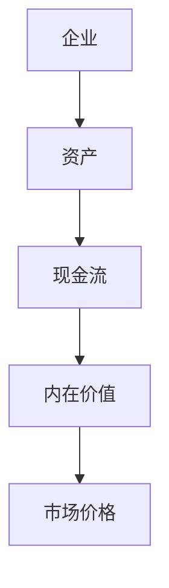
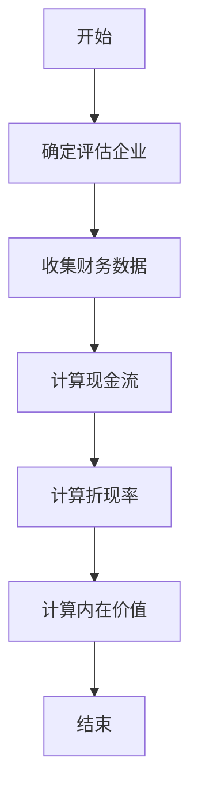
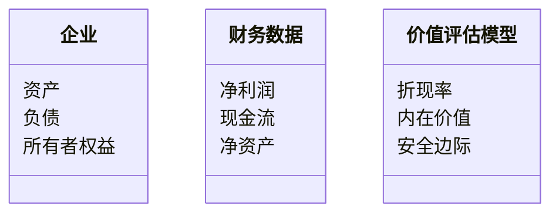
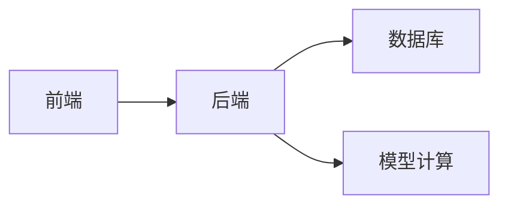

                 


# 彼得林奇的"价值创造"评估体系

## 关键词：价值投资、彼得·林奇、现金流折现模型、内在价值、市场价值

## 摘要：本文深入探讨了彼得·林奇提出的“价值创造”评估体系，从背景、核心概念、算法原理到系统架构和项目实战，全面剖析了该体系的理论基础和实践应用。文章结合数学模型和Python代码，详细讲解了如何通过现金流折现模型评估企业的内在价值，并提供了实际案例分析，帮助读者掌握价值创造的评估方法。

---

# 第一部分：价值创造评估体系的背景与核心概念

## 第1章：价值创造评估体系概述

### 1.1 价值投资的起源与发展

#### 1.1.1 价值投资的定义与核心理念
价值投资是一种投资策略，强调以低于内在价值的价格购买优质资产。其核心理念是寻找市场低估的企业，通过长期持有实现收益。彼得·林奇作为价值投资的代表人物，提出了“价值创造”评估体系，进一步完善了这一理论。

#### 1.1.2 彼得·林奇的贡献与投资风格
彼得·林奇是富达投资集团的传奇经理人，以其卓越的投资业绩闻名。他的投资风格注重基本面分析，强调对企业内在价值的理解，并通过长期持有优质股票实现超额收益。

#### 1.1.3 价值创造评估体系的提出背景
价值创造评估体系的核心在于通过分析企业的内在价值，判断其是否被市场低估。这一体系的提出背景是市场波动性和投资者情绪化的双重影响，使得企业的真实价值往往被掩盖。

### 1.2 价值创造的核心概念

#### 1.2.1 价值创造的定义与内涵
价值创造是指通过对企业基本面的深入分析，评估其内在价值，并与市场价格进行对比，判断是否存在投资机会。其内涵包括对企业资产质量、盈利能力、现金流状况的全面评估。

#### 1.2.2 价值创造与企业发展的关系
企业的发展与价值创造密不可分。通过价值创造，企业能够实现资产的高效配置和利润的最大化，进而推动企业持续发展。

#### 1.2.3 价值创造评估体系的边界与外延
价值创造评估体系的边界在于企业自身的财务状况和市场环境。其外延则包括对企业竞争优势、管理团队、行业地位等多维度的分析。

### 1.3 价值创造评估体系的构成要素

#### 1.3.1 企业的内在价值
内在价值是企业未来现金流的现值，反映了其真实的经营价值。计算内在价值需要考虑企业的现金流、增长率和折现率等因素。

#### 1.3.2 市场价值与内在价值的对比
市场价格是市场参与者对企业价值的集体定价，往往受短期因素影响。内在价值则更关注企业的长期经营潜力。

#### 1.3.3 价值创造的驱动因素
价值创造的驱动因素包括企业的盈利能力、成长能力、财务健康状况以及管理团队的执行力等。

---

## 第2章：价值创造评估的核心原理

### 2.1 价值评估的核心模型

#### 2.1.1 现金流折现模型（DCF）
现金流折现模型是价值评估的核心工具，通过将未来现金流折现至当前时点，计算企业的内在价值。公式如下：

$$ V = \sum_{t=1}^{n} \frac{CF_t}{(1+r)^t} $$

其中，\( V \) 为内在价值，\( CF_t \) 为第 \( t \) 年的现金流，\( r \) 为折现率。

#### 2.1.2 市盈率与市净率分析
市盈率（P/E）和市净率（P/B）是常用的估值指标。市盈率反映了企业盈利能力，市净率则反映了资产质量。

#### 2.1.3 综合价值评估公式
综合价值评估公式结合了多个指标，全面评估企业的价值：

$$ V = \alpha \times \text{净利润} + \beta \times \text{现金流} + \gamma \times \text{净资产} $$

### 2.2 价值创造的数学模型

#### 2.2.1 现金流折现模型的数学表达
现金流折现模型的数学表达式为：

$$ V = \sum_{t=1}^{n} \frac{CF_t}{(1+r)^t} $$

其中，\( CF_t \) 为第 \( t \) 年的现金流，\( r \) 为折现率。

#### 2.2.2 内在价值与市场价格的关系
内在价值与市场价格的关系可以通过以下公式表示：

$$ V = \text{市场价格} \times \text{安全边际} $$

### 2.3 价值创造的实体关系图



---

## 第3章：价值创造的算法与实现

### 3.1 现金流折现模型的算法流程



### 3.2 现金流折现模型的Python实现

```python
def discounted_cash_flow(cash_flows, discount_rate):
    present_value = sum(cash_flow / (1 + discount_rate) ** t for t, cash_flow in enumerate(cash_flows))
    return present_value

# 示例计算
cash_flows = [100, 200, 300]
discount_rate = 0.1
intrinsic_value = discounted_cash_flow(cash_flows, discount_rate)
print(f"内在价值: {intrinsic_value}")
```

---

## 第4章：系统分析与架构设计方案

### 4.1 价值评估系统的整体架构


### 4.2 系统功能设计

#### 4.2.1 领域模型



### 4.3 系统架构设计



### 4.4 系统接口设计

#### 4.4.1 数据接口
接口用于获取企业的财务数据，包括净利润、现金流和净资产等。

#### 4.4.2 计算接口
接口用于调用价值评估模型，计算内在价值和安全边际。

---

## 第5章：项目实战

### 5.1 环境安装

#### 5.1.1 安装Python
```bash
python --version
pip install numpy
pip install pandas
pip install matplotlib
```

### 5.2 核心代码实现

#### 5.2.1 现金流折现模型的实现
```python
import numpy as np

def discounted_cash_flow(cash_flows, discount_rate):
    return np.npv(discount_rate, cash_flows)

# 示例数据
cash_flows = [-100, 200, 300]
discount_rate = 0.1
intrinsic_value = discounted_cash_flow(cash_flows, discount_rate)
print(f"内在价值: {intrinsic_value}")
```

### 5.3 案例分析

#### 5.3.1 案例背景
假设某企业未来三年的现金流分别为100万、200万和300万，折现率为10%。

#### 5.3.2 计算过程
```python
cash_flows = [100, 200, 300]
discount_rate = 0.1
intrinsic_value = discounted_cash_flow(cash_flows, discount_rate)
print(f"内在价值: {intrinsic_value}")
```

### 5.4 小结

---

## 第6章：最佳实践与注意事项

### 6.1 最佳实践
- 定期更新财务数据，确保模型的准确性。
- 结合行业趋势，动态调整折现率。
- 多维度分析，避免单一指标的误导。

### 6.2 小结
彼得·林奇的价值创造评估体系通过对企业内在价值的深入分析，帮助投资者识别低估的投资机会。本文从理论到实践，全面介绍了该体系的应用方法。

### 6.3 注意事项
- 折现率的选择对结果影响较大，需谨慎判断。
- 市场价格受多种因素影响，需结合实际情况分析。
- 长期持有优质资产，避免短期波动的干扰。

### 6.4 拓展阅读
建议阅读彼得·林奇的《价值投资》和《投资的艺术》，深入理解价值创造的真谛。

---

# 作者：AI天才研究院/AI Genius Institute & 禅与计算机程序设计艺术 /Zen And The Art of Computer Programming

