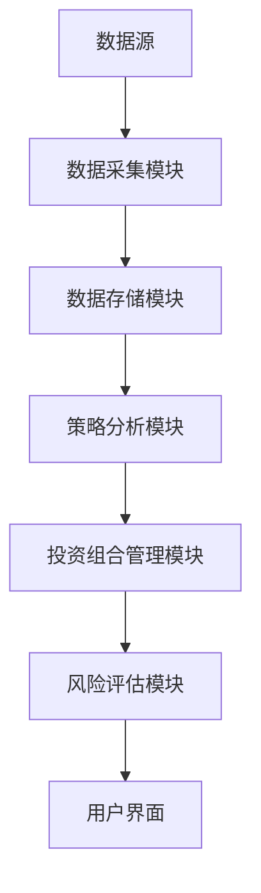

                 


# 彼得林奇的"价值投资"vs"成长投资"

> 关键词：价值投资、成长投资、彼得林奇、投资策略、投资分析

> 摘要：本文将详细对比分析彼得·林奇所倡导的价值投资与成长投资两大投资策略，分别从定义、核心理念、优缺点、适用场景等方面进行深入探讨。通过系统化的方法，帮助读者全面理解这两种投资策略的区别与联系，并在实际投资中做出明智选择。

---

## 第一章：投资的基本概念与价值投资、成长投资的背景

### 1.1 投资的基本概念

#### 1.1.1 投资的定义与分类
投资是指将资金投入到某种资产或项目中，以期在未来获得收益的行为。根据投资对象的不同，可以将投资分为以下几类：
- **股票投资**：购买公司股份，成为股东。
- **债券投资**：购买政府或企业发行的债券，定期获得利息。
- **房地产投资**：购买土地或房产，通过租金或升值获利。
- **货币市场投资**：投资于短期金融工具，如国库券、货币基金等。

#### 1.1.2 投资在个人财务中的作用
投资是实现财富增值的重要手段，尤其是在通货膨胀的背景下，投资可以帮助个人跑赢通胀，实现资产保值增值。通过合理的投资组合，投资者可以分散风险，降低单一投资品种带来的波动性影响。

#### 1.1.3 投资市场的基本构成
投资市场主要由以下几个部分构成：
- **发行人**：企业或政府，通过发行股票、债券等融资工具筹集资金。
- **投资者**：个人或机构，通过购买金融资产参与市场。
- **中介机构**：如证券公司、银行、交易所等，为投资者提供交易、托管等服务。
- **监管机构**：如证监会、银保监会等，负责市场规则制定和监管。

### 1.2 价值投资与成长投资的起源

#### 1.2.1 价值投资的历史背景
价值投资的概念最早可以追溯到20世纪初，由本杰明·格雷厄姆和戴维·多德提出。他们强调以低于内在价值的价格购买股票，长期持有，等待市场重新认识其价值。彼得·林奇作为格雷厄姆的忠实追随者，进一步发展了这一理念，强调寻找被市场低估的优质企业。

#### 1.2.2 成长投资的发展历程
成长投资起源于20世纪60年代，随着科技行业的崛起，投资者开始关注那些具有高速成长潜力的企业。彼得·林奇在其职业生涯中也涉及成长投资，但他更倾向于将成长投资与价值投资结合，寻找那些既有成长潜力又估值合理的公司。

#### 1.2.3 彼得·林奇的贡献与风格
彼得·林奇以其独特的投资风格闻名，他主张投资那些具有强大竞争优势、良好管理团队和可持续增长能力的公司。他的投资策略既包括价值投资的选股方法，也融入了成长投资的理念，形成了独特的“林奇风格”。

---

## 第二章：价值投资的核心理念与策略

### 2.1 价值投资的定义与特征

#### 2.1.1 价值投资的核心理念
价值投资的核心理念是寻找市场价格低于其内在价值的股票。投资者通过深入分析企业的基本面，包括财务状况、盈利能力、行业地位等因素，寻找那些被市场低估的投资标的。

#### 2.1.2 价值投资的关键特征
- **注重内在价值**：关注企业的实际价值，而非市场的短期波动。
- **长期持有**：买入后长期持有，等待市场发现其价值。
- **安全边际**：买入价格低于内在价值，以提供安全边际。

#### 2.1.3 价值投资与市场周期的关系
价值投资在市场低迷时期往往表现更好，因为此时许多优质股票可能被低估。而在市场繁荣时期，价值投资的表现可能不如成长投资，因为市场可能更关注未来的增长潜力而非当前的价值。

### 2.2 价值投资的主要策略

#### 2.2.1 低市盈率与市净率策略
- **低市盈率（P/E）**：市盈率=股票价格/每股收益。低市盈率意味着公司当前股价相对于其盈利能力较低，可能被市场低估。
- **低市净率（P/B）**：市净率=股票价格/每股净资产。低市净率意味着公司股价相对于其资产价值较低，可能被市场低估。

#### 2.2.2 高股息率策略
高股息率策略关注那些股息收益率较高的股票。这类股票通常具有稳定的现金流和较高的分红能力，适合追求稳定收益的投资者。

#### 2.2.3 股票安全边际的概念
安全边际是指买入价格与内在价值之间的差距。通过预留安全边际，投资者可以在市场波动中减少损失，同时为未来的价格上涨留出空间。

---

## 第三章：成长投资的核心理念与策略

### 3.1 成长投资的定义与特征

#### 3.1.1 成长投资的核心理念
成长投资的核心理念是寻找那些具有高速成长潜力的公司。这类公司通常处于快速发展的行业，具有强大的竞争优势和增长空间。

#### 3.1.2 成长投资的关键特征
- **关注未来增长潜力**：成长投资的核心在于公司未来的发展空间，而非当前的盈利能力。
- **高市盈率与市净率**：由于成长公司的未来盈利能力较强，市场通常给予较高的市盈率和市净率。
- **高风险与高回报**：成长投资的风险较高，但潜在回报也更大。

#### 3.1.3 成长投资与市场周期的关系
成长投资在市场繁荣时期表现较好，因为此时市场更愿意为未来的增长潜力支付更高的价格。而在市场低迷时期，成长投资可能面临较大的估值压力。

### 3.2 成长投资的主要策略

#### 3.2.1 寻找高成长率的企业
- **收入增长率**：关注公司过去几年的收入增长情况。
- **净利润增长率**：关注公司盈利能力的提升情况。
- **行业增长空间**：选择处于高速发展阶段的行业。

#### 3.2.2 行业龙头与创新企业的选择
- **行业龙头**：选择行业内具有领先地位的企业，这些企业通常具有更强的竞争力和更大的市场份额。
- **创新企业**：选择那些具有创新能力和技术优势的企业，这些企业更有可能在未来实现高速成长。

#### 3.2.3 成长投资的风险与回报平衡
成长投资的风险主要体现在以下方面：
- **估值过高**：市场可能过度抬高成长公司的股价，导致估值过高。
- **成长放缓**：公司可能无法实现预期的增长目标，导致股价下跌。
- **波动性较大**：成长股的股价波动通常较大，投资者需要具备较强的心理承受能力。

---

## 第四章：价值投资与成长投资的核心概念对比

### 4.1 核心概念的对比分析

#### 4.1.1 投资目标的差异
- **价值投资**：追求内在价值，注重安全边际，适合风险厌恶型投资者。
- **成长投资**：追求未来增长潜力，注重企业的成长性，适合风险偏好型投资者。

#### 4.1.2 投资策略的差异
- **价值投资**：注重低估值、高分红、安全边际。
- **成长投资**：注重高成长率、创新能力强、行业地位高。

#### 4.1.3 投资风险的差异
- **价值投资**：风险相对较低，但回报也较为有限。
- **成长投资**：风险较高，但潜在回报更大。

### 4.2 价值投资与成长投资的优缺点对比

#### 4.2.1 价值投资的优点与缺点
- **优点**：
  - 风险较低，适合保守型投资者。
  - 投资标的通常具有较高的安全边际。
- **缺点**：
  - 在市场繁荣时期可能表现不佳。
  - 对于快速变化的市场环境适应能力较弱。

#### 4.2.2 成长投资的优点与缺点
- **优点**：
  - 投资回报潜力大，适合长期增长型投资。
  - 适合参与新兴行业和创新企业的成长。
- **缺点**：
  - 风险较高，市场波动较大。
  - 需要较高的市场分析能力和选股能力。

#### 4.2.3 两种策略的适用场景
- **价值投资**：适用于市场低迷时期，或追求稳定收益的投资者。
- **成长投资**：适用于市场繁荣时期，或追求高增长回报的投资者。

---

## 第五章：价值投资与成长投资的数学模型与公式

### 5.1 价值投资的数学模型

#### 5.1.1 市盈率（P/E）计算公式
$$ P/E = \frac{股票价格}{每股收益} $$

#### 5.1.2 市净率（P/B）计算公式
$$ P/B = \frac{股票价格}{每股净资产} $$

### 5.2 成长投资的数学模型

#### 5.2.1 净利润增长率计算公式
$$ 净利润增长率 = \frac{本期净利润 - 上期净利润}{上期净利润} \times 100\% $$

#### 5.2.2 收入增长率计算公式
$$ 收入增长率 = \frac{本期收入 - 上期收入}{上期收入} \times 100\% $$

### 5.3 投资组合的风险与回报平衡公式

#### 5.3.1 投资组合的期望回报率
$$ E[R_p] = \sum (w_i \times R_i) $$
其中，$w_i$ 是第i种资产的投资比例，$R_i$ 是第i种资产的期望回报率。

#### 5.3.2 投资组合的波动率
$$ \sigma_p = \sqrt{\sum \sum w_i w_j \sigma_i \sigma_j \rho_{ij} } $$
其中，$\rho_{ij}$ 是第i种资产和第j种资产的相关系数。

---

## 第六章：价值投资与成长投资的系统架构与实现

### 6.1 系统分析与架构设计

#### 6.1.1 问题场景介绍
假设我们希望构建一个投资决策支持系统，能够帮助投资者根据价值投资和成长投资的策略选择合适的股票。

#### 6.1.2 系统功能设计
- 数据采集模块：获取股票的基本面数据、市场数据等。
- 策略分析模块：根据价值投资和成长投资的策略，对股票进行筛选和评估。
- 投资组合管理模块：根据分析结果，生成投资组合建议。
- 风险评估模块：对投资组合进行风险评估，并提出风险管理建议。

#### 6.1.3 系统架构设计



---

## 第七章：价值投资与成长投资的项目实战

### 7.1 环境安装与配置

#### 7.1.1 安装Python与相关库
```bash
pip install numpy pandas matplotlib
```

#### 7.1.2 数据获取工具
使用Yahoo Finance API获取股票数据。

### 7.2 核心实现源代码

#### 7.2.1 价值投资策略实现
```python
import pandas as pd

def calculate_pe_ticker(ticker):
    # 获取股票数据
    data = pd.read_csv(f'data/{ticker}.csv')
    pe_ratio = data['price'] / data['eps']
    return pe_ratio.mean()

# 示例：计算苹果公司的市盈率
print(calculate_pe_ticker('AAPL'))
```

#### 7.2.2 成长投资策略实现
```python
import pandas as pd

def calculate_growth_rate(ticker):
    data = pd.read_csv(f'data/{ticker}.csv')
    growth_rate = (data['revenue'].pct_change() * 100).mean()
    return growth_rate

# 示例：计算亚马逊的成长率
print(calculate_growth_rate('AMZN'))
```

### 7.3 案例分析与代码解读

#### 7.3.1 案例分析
以苹果公司（AAPL）和亚马逊（AMZN）为例，分别使用价值投资和成长投资策略进行分析。

#### 7.3.2 代码实现
```python
import pandas as pd
import matplotlib.pyplot as plt

# 价值投资策略：计算市盈率
def value_investment_analysis(ticker):
    data = pd.read_csv(f'data/{ticker}.csv')
    pe_ratio = data['price'] / data['eps']
    plt.plot(pe_ratio.index, pe_ratio, label='PE Ratio')
    plt.title(f'{ticker} PE Ratio Analysis')
    plt.xlabel('Date')
    plt.ylabel('PE Ratio')
    plt.legend()
    plt.show()

# 成长投资策略：计算收入增长率
def growth_investment_analysis(ticker):
    data = pd.read_csv(f'data/{ticker}.csv')
    revenue_growth = data['revenue'].pct_change() * 100
    plt.plot(revenue_growth.index, revenue_growth, label='Revenue Growth Rate')
    plt.title(f'{ticker} Revenue Growth Rate Analysis')
    plt.xlabel('Date')
    plt.ylabel('Revenue Growth Rate (%)')
    plt.legend()
    plt.show()

# 示例：分析苹果公司（价值投资）和亚马逊公司（成长投资）
value_investment_analysis('AAPL')
growth_investment_analysis('AMZN')
```

---

## 第八章：价值投资与成长投资的总结与展望

### 8.1 总结
- 价值投资与成长投资各有优缺点，适用于不同的市场环境和投资者需求。
- 价值投资注重安全边际，适合风险厌恶型投资者；成长投资注重未来增长潜力，适合风险偏好型投资者。
- 投资者可以根据自身的风险承受能力和投资目标，选择适合自己的投资策略。

### 8.2 小结
- 通过系统化的方法，投资者可以更好地理解和应用价值投资与成长投资的策略。
- 在实际投资中，建议根据市场环境和个人需求，灵活调整投资策略。

### 8.3 注意事项
- 投资有风险，入市需谨慎。
- 投资者需要持续学习和关注市场变化，及时调整投资策略。
- 本文仅提供理论指导，不构成具体的投资建议。

### 8.4 拓展阅读
- 《彼得·林奇的成功投资》
- 《价值投资实战策略》
- 《成长投资的奥秘》

---

## 作者：AI天才研究院/AI Genius Institute & 禅与计算机程序设计艺术/Zen And The Art of Computer Programming

---

**温馨提示**：投资有风险，本文仅为理论探讨，不构成具体的投资建议。读者在进行实际投资前，请务必进行充分的研究和风险评估。

