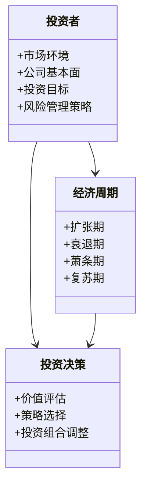
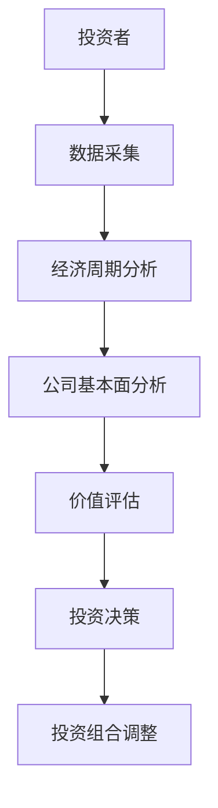

                 


# 彼得林奇的"价值投资"在不同经济周期的应用

> 关键词：彼得林奇，价值投资，经济周期，投资策略，市盈率，市净率，股息率

> 摘要：本文深入探讨了彼得·林奇的价值投资理念，并分析了在不同经济周期（扩张期、衰退期、萧条期、复苏期）下的应用策略。文章结合了基本面分析、安全边际、市盈率、市净率等关键指标，通过系统分析和实战案例，详细阐述了如何在不同经济环境下灵活运用价值投资策略，以实现长期稳健的投资回报。

---

## 第1章 彼得林奇及其价值投资理念

### 1.1 彼得林奇的生平简介

彼得·林奇（Peter Lynch）是美国著名的投资经理和作家，以其在富达投资管理公司（Fidelity Management）的卓越表现而闻名。他于1942年出生在美国马萨诸塞州，毕业于波士顿学院和宾夕法尼亚大学沃顿商学院。林奇的职业生涯始于1967年，当时他加入富达投资，最终成为该公司旗下麦哲伦基金（Fidelity Magellan Fund）的经理，任期长达13年，取得了年均29%的惊人回报率。

### 1.2 价值投资的核心理念

价值投资是一种以基本面分析为基础的投资策略，其核心在于寻找市场低估的股票，并长期持有，直到其价值回归。林奇的价值投资理念强调以下几个关键点：

1. **安全边际**：投资时应选择价格远低于其内在价值的股票，确保在市场波动中仍能获得超额收益。
2. **深入研究**：投资者必须对公司的财务状况、行业地位、竞争优势和管理层能力进行详尽的分析。
3. **长期视角**：价值投资不是短期的交易行为，而是基于公司长期价值的判断进行投资。

### 1.3 价值投资的适用场景

价值投资在不同市场环境下的表现有所不同：

- **熊市**：在市场下跌期间，价值投资往往表现优异，因为许多优质股票的价格被低估。
- **牛市**：在市场上涨期间，价值投资的表现可能不如成长投资，但其长期稳健的特点仍能为投资者提供稳定的回报。

---

## 第2章 不同经济周期的特点与投资策略

### 2.1 经济周期的定义与阶段划分

经济周期通常分为四个阶段：扩张期、衰退期、萧条期和复苏期。每个阶段的市场特点和投资策略均不同。

### 2.2 扩张期的投资策略

在扩张期，经济增长强劲，企业盈利上升，市场情绪乐观。此时，价值投资应注重选择那些市盈率和市净率较低的股票，尤其是那些具有强大竞争优势和稳定收益的公司。

### 2.3 衰退期的投资策略

衰退期市场情绪低迷，企业盈利下降，许多股票价格被低估。此时，价值投资者应寻找那些基本面良好、财务状况稳健的公司，尤其是那些在衰退期中仍能保持增长的行业。

### 2.4 萧条期的投资策略

萧条期市场处于底部，许多股票价格远低于其内在价值。此时，价值投资应重点关注那些具有强大竞争优势和长期增长潜力的公司，尤其是那些能够穿越经济周期的行业。

### 2.5 复苏期的投资策略

复苏期市场逐渐复苏，企业盈利开始回升。此时，价值投资者应关注那些在复苏期中表现强劲的行业和公司，尤其是那些能够快速恢复增长的股票。

### 2.6 经济周期中的风险管理

风险管理是价值投资成功的关键。在不同经济周期中，投资者应根据市场环境调整投资组合的构成，避免过度集中于单一行业或股票。

---

## 第3章 价值投资的核心评估指标与方法

### 3.1 基本面分析的核心要素

基本面分析是价值投资的核心，主要包括盈利能力、偿债能力和运营能力。

#### 盈利能力分析
盈利能力是衡量公司财务健康的重要指标，主要包括净利润率、毛利率和净利率。

#### 偿债能力分析
偿债能力分析是评估公司财务风险的重要指标，主要包括流动比率、速动比率和债务比率。

#### 运营能力分析
运营能力分析是评估公司管理效率的重要指标，主要包括存货周转率和应收账款周转率。

### 3.2 安全边际的概念与计算

安全边际是价值投资中的重要概念，指的是股票价格与内在价值之间的差距。安全边际越大，投资风险越小。

### 3.3 市盈率与市净率的比较分析

#### 市盈率的计算公式
$$ 市盈率 = \frac{股票价格}{每股收益} $$

#### 市净率的计算公式
$$ 市净率 = \frac{股票价格}{每股净资产} $$

市盈率适用于盈利稳定的公司，而市净率适用于资产密集型行业。

### 3.4 股息率的计算与投资策略

股息率是衡量股票收益能力的重要指标，计算公式为：

$$ 股息率 = \frac{每股股息}{股票价格} $$

高股息率的股票通常具有较高的分红能力，适合长期投资者。

---

## 第4章 系统分析与架构设计方案

### 4.1 问题场景介绍

在实际投资中，投资者需要根据市场环境和公司基本面选择合适的投资标的。本文将构建一个基于价值投资的策略系统，帮助投资者在不同经济周期中做出明智的投资决策。

### 4.2 系统功能设计

#### 领域模型


### 4.3 系统架构设计



---

## 第5章 项目实战与代码实现

### 5.1 环境安装

投资者需要安装Python和相关库（如pandas、numpy、matplotlib）。

### 5.2 核心实现代码

以下代码示例展示了如何计算市盈率和市净率：

```python
import pandas as pd

# 假设我们有一个股票数据的DataFrame
df = pd.DataFrame({
    '股票名称': ['股票A', '股票B', '股票C'],
    '每股收益': [1.5, 2.0, 0.8],
    '每股净资产': [10, 15, 5],
    '股票价格': [20, 30, 10]
})

# 计算市盈率和市净率
df['市盈率'] = df['股票价格'] / df['每股收益']
df['市净率'] = df['股票价格'] / df['每股净资产']

print(df)
```

### 5.3 实际案例分析

以某公司为例，分析其市盈率和市净率，并判断其是否具有投资价值。

---

## 第6章 总结与注意事项

### 6.1 本章小结

彼得·林奇的价值投资理念强调安全边际和深入的基本面分析。在不同经济周期中，投资者应灵活调整策略，选择具有长期增长潜力的股票。

### 6.2 注意事项

1. **风险管理**：投资者应根据市场环境调整投资组合，避免过度集中。
2. **持续学习**：投资需要不断学习和更新知识，以应对市场的变化。
3. **长期视角**：价值投资需要耐心和长期视角，避免短期波动的干扰。

---

## 作者

作者：AI天才研究院/AI Genius Institute & 禅与计算机程序设计艺术 /Zen And The Art of Computer Programming

---

本文通过系统分析和实战案例，详细阐述了彼得·林奇的价值投资理念及其在不同经济周期中的应用策略。希望读者能通过本文全面掌握价值投资的核心思想，并能在实际投资中灵活运用这些策略，实现长期稳健的投资回报。

