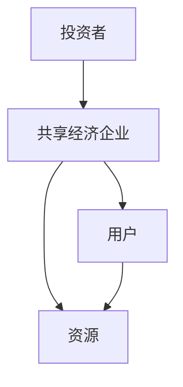
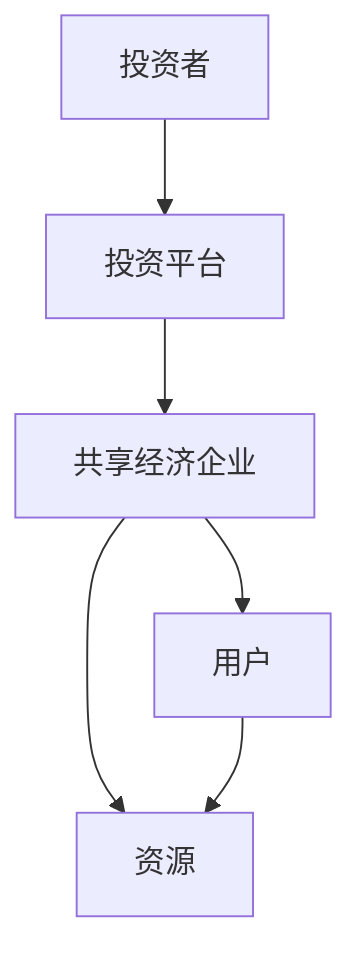

                 


# 彼得林奇的"价值投资"在共享经济中的调整

> 关键词：价值投资，共享经济，彼得林奇，投资策略，风险管理，数学模型，系统架构

> 摘要：本文探讨了彼得林奇的价值投资理念在共享经济环境下的适应性与调整策略。通过分析共享经济的特性，结合实际案例，提出了一套适合共享经济环境的价值投资方法，并通过数学模型和系统架构设计，详细阐述了投资策略的实现过程。文章内容涵盖了背景介绍、核心概念、调整策略、数学模型、系统架构设计、项目实战等多个方面，为投资者提供了全面的指导。

---

## 第一部分: 背景介绍与核心概念

### 第1章: 价值投资与共享经济概述

#### 1.1 价值投资的基本概念
价值投资是一种长期投资策略，强调以低于资产内在价值的价格买入优质资产。彼得林奇作为该领域的权威，提出了“寻找烟屁股”策略，即寻找被市场低估的优秀企业进行投资。

#### 1.2 共享经济的定义与特点
共享经济是指通过数字平台将闲置资源进行共享，以提高资源利用率的经济模式。其特点包括去中心化、资源高效利用和用户参与度高。

#### 1.3 价值投资与共享经济的关联
共享经济的兴起为投资者提供了新的机会，但同时也带来了新的挑战，如高波动性和高风险。

### 第2章: 价值投资在共享经济中的应用背景

#### 2.1 共享经济的发展现状
全球范围内，共享经济迅速发展，涵盖交通、住宿、办公等多个领域。中国市场的快速发展是全球增长的重要驱动力。

#### 2.2 价值投资在共享经济中的适应性分析
虽然价值投资的基本原则适用，但共享经济的动态性和不确定性要求投资者进行策略调整，包括更灵活的风险管理和投资组合优化。

---

## 第二部分: 核心概念与联系

### 第3章: 核心概念与联系

#### 3.1 核心概念原理
价值投资关注企业的基本面，而共享经济强调资源的共享和高效利用，两者在企业价值评估上有交集。

#### 3.2 核心概念属性特征对比
| 特性 | 价值投资 | 共享经济 |
|------|-----------|----------|
| 核心 | 企业内在价值 | 资源共享效率 |
| 风险 | 财务风险 | 市场波动风险 |
| 机会 | 低估企业 | 新兴行业 |

#### 3.3 ER实体关系图



---

## 第三部分: 价值投资在共享经济中的调整策略

### 第4章: 调整策略

#### 4.1 企业评估标准
在共享经济中，除了传统的财务指标，还需要考虑平台的用户活跃度和资源利用率。

#### 4.2 风险管理
通过建立动态监控机制，及时识别和应对市场波动和政策变化带来的风险。

#### 4.3 投资组合优化
采用多元化策略，将资金分配到不同的共享经济领域，降低整体风险。

### 第5章: 案例分析

#### 5.1 滴滴出行的价值投资分析
分析滴滴的市场地位、用户增长和财务状况，评估其投资价值。

---

## 第四部分: 数学模型与算法

### 第6章: 数学模型与算法

#### 6.1 市盈率模型
$$ P/E = \frac{P}{E} $$
其中，P为股价，E为每股收益。

#### 6.2 投资组合优化
使用Python代码实现投资组合优化，考虑共享经济企业的风险和收益。

```python
import numpy as np

def compute_sharpe_ratio(returns, risk_free_rate):
    # 计算收益与风险比
    excess_returns = returns - risk_free_rate
    sharpe_ratio = np.mean(excess_returns) / np.std(excess_returns)
    return sharpe_ratio

# 示例数据
returns = np.array([0.1, 0.2, -0.1, 0.15])
risk_free_rate = 0.05

print(compute_sharpe_ratio(returns, risk_free_rate))
```

---

## 第五部分: 系统架构设计

### 第7章: 系统架构设计

#### 7.1 领域模型类图


#### 7.2 系统架构图


---

## 第六部分: 项目实战

### 第8章: 项目实战

#### 8.1 环境安装
安装必要的Python库，如numpy和pandas。

#### 8.2 核心代码实现
实现共享经济企业的价值评估模型。

```python
import pandas as pd

def evaluate_company(company_data):
    # 计算市盈率
    pe_ratio = company_data['price'] / company_data['earnings_per_share']
    return pe_ratio

# 示例数据
data = {
    'price': 100,
    'earnings_per_share': 25
}
print(evaluate_company(data))
```

#### 8.3 案例分析
以Airbnb为例，分析其投资价值。

---

## 第七部分: 总结与展望

### 第9章: 总结与展望

#### 9.1 总结
价值投资在共享经济中的应用需要结合动态市场环境，注重风险管理。

#### 9.2 展望
未来，随着技术进步，共享经济将提供更多的投资机会，但同时也需要更精细的投资策略。

---

作者：AI天才研究院/AI Genius Institute & 禅与计算机程序设计艺术 /Zen And The Art of Computer Programming

