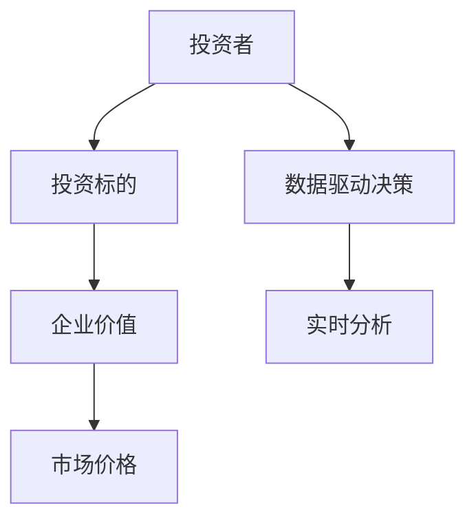

                 

# 彼得林奇的"价值投资"在数字经济时代的重新定义

---

## 关键词
- 彼得林奇
- 价值投资
- 数字经济
- 数据驱动
- 投资策略

---

## 摘要
本文从彼得林奇的经典价值投资理论出发，探讨其在数字经济时代的核心理念与实践方法。通过分析数字经济对投资环境的影响，重构价值投资的数学模型与算法原理，提出数据驱动的新型投资策略。文章结合实际案例，详细阐述如何将传统价值投资与现代技术手段相结合，为投资者提供一套适应数字时代的投资方法论。

---

## 第一部分: 价值投资的起源与彼得林奇的投资理念

### 第1章: 价值投资的核心概念与背景

#### 1.1 价值投资的起源与发展
- **价值投资的定义与核心理念**  
  价值投资是一种以企业内在价值为核心的投资策略，强调以低于内在价值的价格买入优质资产，并长期持有。其核心理念是通过深入研究企业基本面，寻找市场低估的投资机会。

- **彼得林奇的贡献与投资风格**  
  彼得林奇是价值投资领域的代表人物，以其独特的投资风格闻名。他强调对企业基本面的深入研究、长期投资和分散投资，尤其擅长挖掘中小市值的优质企业。

- **数字经济时代对价值投资的挑战**  
  数字经济时代的到来，使得投资环境发生了根本性变化。数据的爆炸式增长、算法的广泛应用以及企业的数字化转型，都对传统的价值投资理念提出了新的挑战。

---

### 第2章: 彼得林奇的投资策略解析

#### 2.1 彼得林奇的投资哲学
- **长期投资与价值发现**  
  彼得林奇主张长期投资，认为短期市场的波动不应影响长期价值判断。他强调通过对企业基本面的深入研究，发现那些被市场低估的优质企业。

- **风险控制与安全边际**  
  彼得林奇非常重视风险控制，主张通过设置安全边际（即以低于内在价值的价格买入）来降低投资风险。他认为，安全边际是抵御市场波动的重要保障。

- **行业分析与公司基本面研究**  
  彼得林奇的投资策略以行业分析为基础，通过对行业趋势和公司基本面的深入研究，筛选出具有竞争优势的企业。

#### 2.2 彼得林奇的经典投资案例
- **高盛集团的投资案例**  
  高盛集团是彼得林奇的经典投资案例之一。他通过对企业基本面的深入分析，发现其内在价值被市场严重低估，最终实现了可观的收益。

- **华盛顿互助银行的投资案例**  
  华盛顿互助银行的案例展示了彼得林奇如何通过行业分析和公司基本面研究，发现潜在的投资机会。

- **其他经典投资案例分析**  
  本文将通过多个经典案例，详细分析彼得林奇的投资逻辑和方法。

---

### 第3章: 数字经济时代的价值投资新特征

#### 3.1 数字经济时代的投资环境变化
- **数字经济的定义与特征**  
  数字经济是指以数字技术为核心驱动力，以数据为关键生产要素的经济形态。其主要特征包括数据驱动、数字化转型、智能化决策等。

- **数字经济时代投资机会的增加**  
  数字经济的兴起带来了新的投资机会，尤其是在科技、人工智能、大数据等领域，传统价值投资需要重新审视这些新兴行业的投资价值。

- **数字经济时代投资风险的加剧**  
  数字经济时代的信息不对称加剧，数据的复杂性和不确定性增加，使得投资风险更加难以控制。

#### 3.2 价值投资在数字经济时代的重构
- **价值投资的三要素：价格、价值、市场先生**  
  传统价值投资的三要素在数字经济时代需要重新定义。数据成为新的关键生产要素，市场情绪的波动更加复杂。

- **数据驱动的投资决策方法**  
  数据驱动的投资决策方法强调通过对数据的分析和建模，发现潜在的投资机会和风险。

- **数字技术对企业价值的影响**  
  数字技术的广泛应用对企业价值的影响日益显著。企业的数字化能力、数据质量和算法效率都成为价值评估的重要维度。

---

## 第二部分: 价值投资的核心概念与数学模型

### 第4章: 价值投资的核心概念与联系

#### 4.1 核心概念原理
- **价格与价值的关系**  
  在传统价值投资中，价格与价值的关系是核心。价格围绕价值波动，而价值是企业的内在价值，主要取决于企业的盈利能力、成长性和行业地位。

- **数据驱动的价值评估模型**  
  在数字经济时代，数据成为价值评估的重要依据。通过对企业的数据质量、算法效率和数字化能力进行分析，可以更准确地评估企业的内在价值。

- **数字经济时代的价值评估新维度**  
  数字经济时代的价值评估需要考虑企业的数字化转型能力、数据质量和算法效率等因素。这些因素对企业未来的盈利能力有重要影响。

#### 4.2 核心概念属性特征对比表格
| 特征             | 传统价值投资                 | 数字经济时代价值投资         |
|------------------|----------------------------|-----------------------------|
| 核心要素         | 价格、价值、市场先生         | 数据、算法、企业数字化能力   |
| 投资策略         | 长期持有、安全边际           | 数据驱动、实时分析           |
| 风险控制         | 安全边际、分散投资           | 数据质量、模型稳定性         |

#### 4.3 实体关系图（Mermaid）

---

### 第5章: 价值投资的数学模型与算法原理

#### 5.1 价值投资的数学模型

- **市场价格与内在价值的关系**  
  $$ P = V \times M $$
  其中：
  - \( P \) 表示市场价格
  - \( V \) 表示内在价值
  - \( M \) 表示市场情绪因子

- **内在价值的计算公式**  
  $$ V = \frac{CF}{r - g} $$
  其中：
  - \( CF \) 表示未来现金流
  - \( r \) 表示折现率
  - \( g \) 表示现金流增长率

---

## 第三部分: 数据驱动的价值投资算法与系统架构

### 第6章: 数据驱动的价值投资算法

#### 6.1 数据驱动的价值评估模型
- **数据驱动的价值评估模型**  
  通过对企业的数据质量、算法效率和数字化能力进行分析，构建数据驱动的价值评估模型。模型的核心是通过数据的分析和建模，发现潜在的投资机会和风险。

#### 6.2 价值投资算法的实现步骤
1. 数据采集：收集企业的财务数据、行业数据和市场数据。
2. 数据清洗：对数据进行预处理，去除异常值和缺失值。
3. 数据建模：通过机器学习算法对数据进行建模，预测企业的内在价值。
4. 投资决策：根据模型预测结果，制定投资策略。

---

### 第7章: 系统架构设计

#### 7.1 系统功能设计
- **数据采集模块**：负责收集企业的财务数据、行业数据和市场数据。
- **数据建模模块**：通过对数据进行分析和建模，预测企业的内在价值。
- **投资决策模块**：根据模型预测结果，制定投资策略。

#### 7.2 系统架构图（Mermaid）

---

## 第四部分: 项目实战

### 第8章: 项目实战

#### 8.1 环境安装
- **Python环境安装**  
  安装Python 3.8及以上版本，安装必要的库，如Pandas、NumPy、Scikit-learn等。

#### 8.2 核心功能实现
- **数据采集与清洗**  
  使用Python脚本从公开数据源获取企业的财务数据和行业数据，清洗数据并存储到数据库中。

- **数据建模与预测**  
  使用机器学习算法对数据进行建模，预测企业的内在价值，并生成投资建议。

#### 8.3 实际案例分析
- **案例分析**  
  以某科技公司为例，详细分析如何通过数据驱动的方法进行价值评估，并制定投资策略。

---

## 第五部分: 最佳实践与小结

### 第9章: 最佳实践

#### 9.1 投资策略的重构
- **数据驱动的投资策略**  
  在数字经济时代，数据驱动的投资策略是传统价值投资的延伸。通过对数据的分析和建模，可以更准确地评估企业的内在价值。

#### 9.2 小结
- **总结与展望**  
  本文从彼得林奇的经典价值投资理论出发，探讨其在数字经济时代的核心理念与实践方法。通过分析数字经济对投资环境的影响，重构价值投资的数学模型与算法原理，提出数据驱动的新型投资策略。未来，随着数字技术的不断发展，价值投资将在数字经济时代继续发挥重要作用。

---

## 第六部分: 拓展阅读与注意事项

### 第10章: 拓展阅读

#### 10.1 拓展阅读推荐
- **推荐书籍**  
  1. 《彼得林奇的股票投资策略》
  2. 《价值投资实战》
  3. 《数字经济与投资》

#### 10.2 注意事项
- **数据质量的重要性**  
  在数据驱动的投资策略中，数据质量是关键。只有高质量的数据才能保证模型的准确性。

- **模型的局限性**  
  数据驱动的模型虽然能够提供重要的参考，但其预测结果仍存在一定的局限性。投资者需要结合实际情况进行判断。

---

## 作者信息

作者：AI天才研究院/AI Genius Institute & 禅与计算机程序设计艺术/Zen And The Art of Computer Programming

