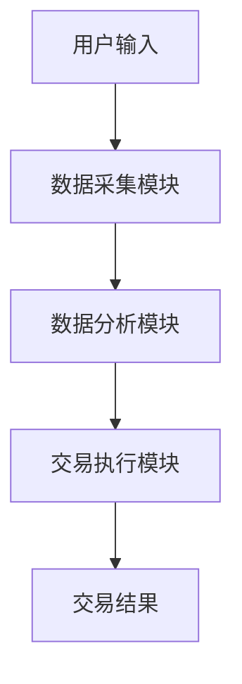

                 

# 彼得林奇的"价值投资"在数字资产时代的演变

> **关键词**：价值投资、数字资产、区块链、彼得林奇、风险管理、技术分析  
> **摘要**：本文探讨了彼得林奇的经典价值投资理念在数字资产时代的变化与适应。通过分析数字资产的特点与传统金融的区别，本文提出了数字资产投资的核心策略与创新方法。结合技术分析、风险管理与系统架构设计，本文为投资者提供了在数字资产时代如何实践价值投资的深度指导。

---

## 引言

价值投资是投资领域的经典策略，而数字资产的兴起为这一策略带来了新的挑战与机遇。彼得林奇作为价值投资的代表人物，其理念在数字资产时代需要进行适应性调整。本文将从价值投资的核心理念出发，分析其在数字资产中的演变，并提出具体的策略与实践方法。

---

## 第1章：价值投资的核心理念

### 1.1 价值投资的定义与核心原则

- **价值投资的定义**：寻找具有长期稳定增长潜力的公司，以低于其内在价值的价格买入并长期持有。
- **核心原则**：
  1. 以合理价格买入优质资产。
  2. 长期持有，避免频繁交易。
  3. 以公司基本面分析为基础，而非市场波动。

### 1.2 数字资产的定义与特点

- **数字资产的定义**：基于区块链技术的虚拟资产，具有去中心化、不可篡改和可编程性。
- **特点**：
  1. 去中心化：无须中介机构，直接点对点交易。
  2. 匿名性：交易过程不涉及真实身份。
  3. 可编程性：通过智能合约实现自动化操作。
  4. 全球化：无国界限制，可在全球范围内自由流动。

### 1.3 数字资产与传统金融的区别

- **传统金融**：依赖中介机构（银行、交易所等），交易透明但成本较高。
- **数字资产**：去中心化，交易速度快，成本低，但市场波动大。

### 1.4 数字资产时代的投资机会

- **技术驱动**：区块链技术的创新为数字资产提供了广阔的应用场景。
- **市场潜力**：数字资产市场增长迅速，但波动性高。
- **长期价值**：优质数字资产具有类似传统金融的长期增长潜力。

---

## 第2章：价值投资在数字资产中的演变

### 2.1 传统价值投资在数字资产中的挑战

- **市场波动性**：数字资产价格波动剧烈，传统价值评估方法难以适用。
- **技术复杂性**：区块链技术要求投资者具备一定的技术背景。
- **信息不对称**：数字资产市场信息透明度低，投资者难以获取真实信息。

### 2.2 数字资产价值评估的新维度

- **技术评估**：区块链技术的可扩展性与安全性是核心。
- **市场评估**：流动性、市场接受度与监管政策是关键因素。
- **社区与治理**：数字资产项目的成功依赖于社区的支持与治理能力。

### 2.3 数字资产价值投资的创新策略

- **组合管理**：将数字资产与其他资产类别结合，降低风险。
- **风险管理**：采用分散化投资，避免单一资产的风险集中。
- **长期价值挖掘**：寻找具有技术创新和广泛应用前景的数字资产。

---

## 第3章：数字资产投资的核心策略

### 3.1 数字资产投资的基本策略

- **长期持有**：选择优质数字资产，长期持有以获得价值增长。
- **短期交易**：利用市场波动进行套利，但需谨慎操作。
- **分散投资**：避免将所有资金投入单一资产。

### 3.2 数字资产技术分析与价值评估

- **技术分析方法**：
  1. **K线图分析**：通过价格走势判断市场情绪。
  2. **技术指标**：如MACD、RSI等，用于判断超买超卖状态。
  3. **趋势线与支撑阻力位**：用于预测价格波动区间。

- **区块链技术评估**：
  1. **可扩展性**：评估区块链处理交易的能力。
  2. **安全性**：检查是否存在漏洞。
  3. **去中心化程度**：评估项目是否真正去中心化。

### 3.3 数字资产市场的风险管理

- **风险分类**：
  1. **市场风险**：价格波动导致的损失。
  2. **技术风险**：区块链技术故障或漏洞。
  3. **政策风险**：监管政策变化对市场的影响。

- **风险管理工具**：
  1. **止损策略**：设置止损点以限制损失。
  2. **保险基金**：通过保险机制分散风险。

---

## 第4章：数字资产投资的系统架构与技术分析

### 4.1 数字资产投资的技术分析框架

- **技术分析流程**：
  1. 数据采集：获取数字资产的历史价格和交易数据。
  2. 数据分析：使用技术指标和图表分析市场趋势。
  3. 交易信号生成：根据分析结果制定买卖决策。

- **区块链技术评估框架**：
  1. 技术评估：通过代码审计和性能测试评估区块链技术。
  2. 项目评估：分析团队背景、社区支持和应用场景。

### 4.2 数字资产投资的系统架构设计

- **系统功能设计**：
  1. 数据采集模块：实时采集数字资产价格和交易数据。
  2. 数据分析模块：使用技术指标和算法分析数据。
  3. 交易执行模块：根据分析结果自动执行交易。

- **系统架构图**（以下为 mermaid 图表）：

---

## 第5章：数字资产投资的实战案例

### 5.1 投资策略的实际应用

- **案例分析**：以比特币和以太坊为例，分析其长期投资价值。
- **交易策略**：结合技术分析和基本面分析制定买卖决策。

### 5.2 风险管理的实际操作

- **止损策略**：设置价格止损点，避免大幅亏损。
- **分散投资**：将资金分配到多个数字资产中，降低风险。

---

## 第6章：结论与展望

### 6.1 价值投资在数字资产中的演变总结

- 彼得林奇的价值投资理念在数字资产时代需要结合技术分析和风险管理。
- 数字资产的投资策略更加注重技术创新和市场适应性。

### 6.2 数字资产投资的未来展望

- **技术创新**：区块链技术的进一步发展将推动数字资产的应用。
- **市场成熟**：数字资产市场将逐渐成熟，风险可控。
- **投资者教育**：加强投资者教育，提升市场参与度。

---

## 作者

作者：AI天才研究院/AI Genius Institute & 禅与计算机程序设计艺术 /Zen And The Art of Computer Programming

---

**注**：由于篇幅限制，本文仅为目录和部分章节内容的概述。完整文章将包含更详细的技术分析、数学模型和代码实现等内容。

