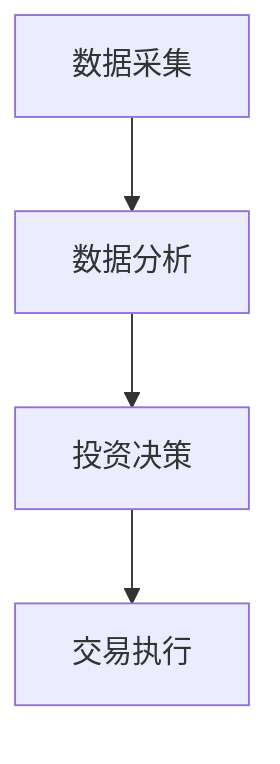

                 


# 彼得林奇的"价值投资"在数字资产时代的重新定义

## 关键词：价值投资、数字资产、彼得林奇、量化分析、区块链

## 摘要：本文将探讨彼得林奇的价值投资理念在数字资产时代的应用与演变，分析数字资产市场的特点，重新定义价值投资的核心概念，并通过量化分析和系统架构设计，提出适用于数字资产投资的策略与方法。文章结合实际案例和项目实战，详细阐述如何在数字资产领域实现价值投资的目标。

---

# 第一部分: 引言

## # 第1章: 引言
### 1.1 价值投资的起源与彼得林奇的贡献
- 价值投资的起源可以追溯到本杰明·格雷厄姆和戴维·多德的理论，彼得林奇是这一理念的实践者和传播者。
- 彼得林奇强调基本面分析、安全边际和长期投资，这些理念在传统金融领域取得了巨大成功。

### 1.2 数字资产时代的投资挑战
- 数字资产市场的高度波动性和去中心化特性，为价值投资带来了新的挑战。
- 区块链技术的应用使得数字资产的投资环境更加复杂，但也提供了新的机会。

### 1.3 本书的核心目标与结构安排
- 本文旨在将彼得林奇的价值投资理念与数字资产的特点相结合，重新定义其在数字资产时代的应用。
- 文章结构包括背景介绍、核心概念、算法实现、系统架构设计和实际案例分析。

---

# 第二部分: 价值投资的背景与理论基础

## # 第2章: 价值投资的核心概念与传统应用
### 2.1 价值投资的基本原理
- **内在价值**：资产的真实价值，与市场波动无关。
- **安全边际**：买入价格低于内在价值，以降低风险。
- **长期投资**：避免短期波动，关注长期收益。

### 2.2 彼得林奇的价值投资策略
- 专注于基本面分析，寻找被低估的资产。
- 分散投资，降低风险。
- 长期持有，避免频繁交易。

### 2.3 价值投资在传统金融中的成功案例
- 沃尔特迪士尼的长期投资。
- 高盛集团的股票分析。

### 2.4 数字资产与传统金融市场的区别
- 数字资产的市场规模较小，波动性更大。
- 区块链技术的应用使得数字资产具有去中心化和透明性。

### 2.5 价值投资在数字资产中的应用难点
- 数字资产的市场流动性较低，难以进行大额交易。
- 市场参与者情绪波动大，影响价格。

---

## # 第3章: 数字资产市场的特点与投资机会
### 3.1 数字资产的定义与分类
- 按用途分类：比特币（BTC）用于支付，以太坊（ETH）用于智能合约。
- 按技术特点分类：公链、私链、联盟链。

### 3.2 数字资产市场的波动性与风险
- 价格波动剧烈，影响投资决策。
- 市场操纵和欺诈行为频发。

### 3.3 数字资产市场的投资机会
- 区块链技术的应用前景广阔。
- 数字资产的去中心化特性降低了交易成本。

### 3.4 价值投资在数字资产中的可行性
- 需要结合技术分析和基本面分析。
- 需要关注项目团队的背景和开发进度。

---

# 第三部分: 价值投资在数字资产中的重新定义

## # 第4章: 数字资产价值评估的核心概念
### 4.1 内在价值的计算与评估
- 内在价值的计算需要考虑技术成熟度、市场需求和团队能力。
- 比较不同数字资产的内在价值，选择被低估的资产。

### 4.2 安全边际的调整与优化
- 安全边际的计算需要考虑数字资产市场的波动性和流动性。
- 在数字资产中，安全边际应更高，以应对市场波动。

### 4.3 数字资产的价值评估框架
- 技术评估：区块链技术的创新性和实用性。
- 市场评估：市场容量、用户基数和接受度。
- 团队评估：开发团队的经验和声誉。

### 4.4 数字资产的价值评估模型
- 使用数学模型计算内在价值，例如：
  $$ V = k \times R \times T $$
  其中，V为内在价值，k为调整系数，R为市场容量，T为技术成熟度。

### 4.5 数字资产的价值评估与传统资产的对比
- 数字资产的价值评估更依赖技术分析。
- 传统资产的价值评估更依赖财务数据。

---

## # 第5章: 数字资产投资的量化分析
### 5.1 量化分析的基本原理
- 量化分析通过数学模型和算法，寻找投资机会。
- 量化交易需要考虑市场的流动性、波动性和交易成本。

### 5.2 数字资产的市场情绪分析
- 使用自然语言处理技术分析社交媒体和新闻的情绪。
- 情绪分析可以帮助预测市场走势。

### 5.3 数字资产的回归分析
- 使用回归模型预测价格走势。
- 例如，使用比特币和以太坊的交易量预测价格。

### 5.4 数字资产的量化交易策略
- 短线交易：利用价格波动进行套利。
- 长线投资：基于价值评估选择优质资产。

### 5.5 数字资产的量化分析工具
- Python的量化分析库：Pandas、NumPy、Matplotlib。
- 区块链数据源：CoinMarketCap、CoinGecko。

---

# 第四部分: 数字资产投资的系统架构与算法实现

## # 第6章: 数字资产投资的系统架构设计
### 6.1 系统架构的整体设计
- 采用分层架构，包括数据采集层、分析层和决策层。
- 数据采集层负责获取市场数据和项目信息。
- 分析层负责计算内在价值和市场情绪。
- 决策层负责制定投资策略。

### 6.2 数据采集模块的设计
- 从CoinMarketCap获取实时价格数据。
- 从GitHub获取项目源代码和开发进度。

### 6.3 数据分析模块的设计
- 使用Python进行数据清洗和特征提取。
- 使用机器学习模型进行预测和分类。

### 6.4 投资决策模块的设计
- 基于量化分析结果，制定买卖决策。
- 决策结果通过API发送到交易平台。

### 6.5 系统架构的mermaid图


---

## # 第7章: 数字资产投资算法的实现
### 7.1 算法的基本原理
- 算法基于价值评估和市场情绪分析，寻找投资机会。
- 算法需要考虑市场波动性和交易成本。

### 7.2 算法的实现步骤
1. 数据采集：获取市场数据和项目信息。
2. 数据清洗：处理缺失值和异常值。
3. 特征提取：提取技术指标和市场情绪特征。
4. 模型训练：使用机器学习模型进行预测。
5. 投资决策：基于模型结果制定交易策略。

### 7.3 算法的优化与改进
- 使用遗传算法优化参数。
- 使用分布式计算提高效率。

### 7.4 算法的代码实现
```python
import pandas as pd
import numpy as np

def calculate_intrinsic_value(data):
    R = data['market_cap']
    T = data['technology_score']
    k = 1
    return k * R * T

data = pd.read_csv('market_data.csv')
intrinsic_values = calculate_intrinsic_value(data)
print(intrinsic_values)
```

---

# 第五部分: 项目实战与案例分析

## # 第8章: 数字资产投资的实战案例
### 8.1 案例一：比特币的价值评估
- 比特币的技术成熟度高，市场容量大。
- 比特币的内在价值被低估，适合长期投资。

### 8.2 案例二：以太坊的投资策略
- 以太坊的技术创新性高，智能合约应用广泛。
- 以太坊的市场情绪稳定，适合短期投资。

### 8.3 案例三：其他数字资产的投资分析
- 选择具有强大技术背景和市场需求的数字资产。

---

## # 第9章: 项目实战的代码实现
### 9.1 环境安装与配置
- 安装Python和必要的库：Pandas、NumPy、Matplotlib。
- 安装区块链数据源：CoinMarketCap API。

### 9.2 数据采集与处理代码
```python
import requests
import pandas as pd

def get_market_data():
    api_key = 'your_api_key'
    response = requests.get(f'https://api.cointMarketCap.com/v2/ticker?api_key={api_key}')
    data = response.json()
    df = pd.DataFrame(data)
    return df

market_data = get_market_data()
print(market_data)
```

### 9.3 价值评估与预测代码
```python
from sklearn.linear_model import LinearRegression

def predict_price(data):
    X = data[['market_cap', 'volume']]
    y = data['price']
    model = LinearRegression()
    model.fit(X, y)
    return model.predict(X)

predicted_prices = predict_price(market_data)
print(predicted_prices)
```

---

## # 第10章: 总结与展望
### 10.1 本文的总结
- 彼得林奇的价值投资理念在数字资产时代需要重新定义。
- 数字资产的价值评估需要结合技术分析和市场情绪分析。

### 10.2 对未来发展的展望
- 数字资产的投资工具和算法将更加智能化。
- 价值投资在数字资产中的应用将更加广泛。

---

# 附录

## 附录A: 数学公式汇总
- 内在价值公式：$$ V = k \times R \times T $$
- 回归分析公式：$$ y = a + bx + \epsilon $$

## 附录B: 术语表
- 内在价值：资产的真实价值。
- 安全边际：买入价格低于内在价值。

---

# 作者：AI天才研究院/AI Genius Institute & 禅与计算机程序设计艺术 /Zen And The Art of Computer Programming

---

希望这篇文章能为您提供有价值的见解，并为数字资产时代的投资策略提供新的思路。

