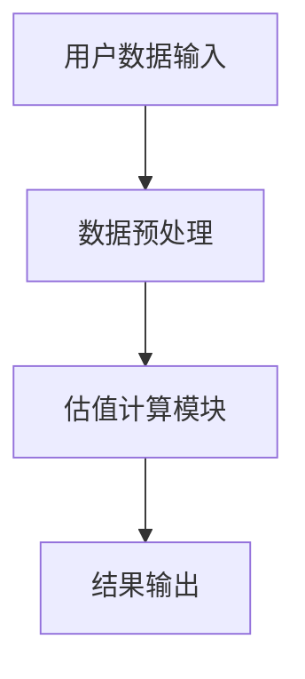
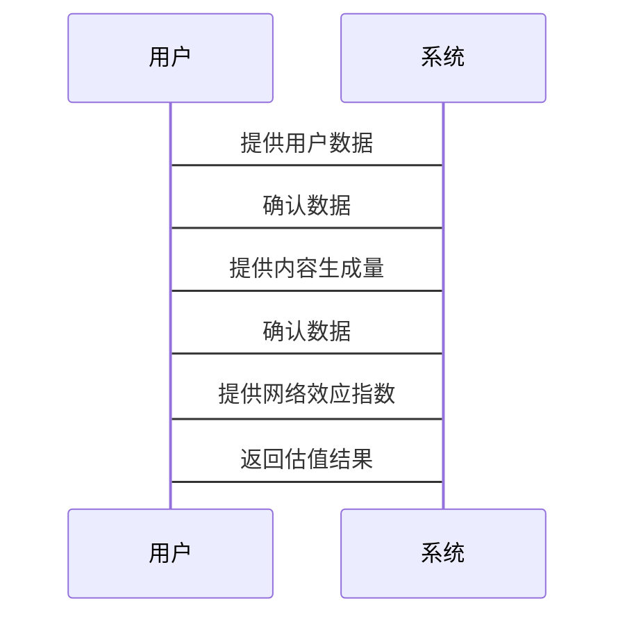

                 


# 彼得林奇的"价值投资"在社交媒体公司估值中的调整

> 关键词：价值投资，社交媒体公司，估值调整，彼得林奇，投资策略

> 摘要：本文详细探讨了彼得林奇的价值投资理论在社交媒体公司估值中的应用与调整。通过对社交媒体公司的特殊性分析，结合传统估值方法的局限性，构建了适用于社交媒体公司的估值模型，提出了具体的实施步骤和系统架构设计，最后通过实际案例分析验证了模型的有效性。

---

# 第一部分：引言

## 第1章：价值投资与社交媒体公司估值的背景

### 1.1 价值投资的起源与核心理念

#### 1.1.1 彼得林奇与价值投资的简介

彼得·林奇（Peter Lynch）是全球著名的价值投资者，以其在富达投资管理公司的卓越表现闻名。他强调基本面分析和长期投资，主张以低于内在价值的价格买入优质股票。

#### 1.1.2 价值投资的核心原则

- **内在价值**：公司的真实价值远高于市场价。
- **安全边际**：买入价格低于内在价值。
- **长期视角**：关注公司长期增长潜力。

#### 1.1.3 价值投资在传统金融中的应用

在传统金融中，价值投资通过分析财务报表和行业地位，寻找被市场低估的股票。

---

### 1.2 社交媒体公司的特点与挑战

#### 1.2.1 社交媒体公司的定义与商业模式

社交媒体公司依赖用户生成内容，通过广告和数据分析盈利。

#### 1.2.2 社交媒体公司的估值难点

- **数据驱动**：用户数据是核心资产。
- **网络效应**：用户增长呈指数级。
- **内容生成**：依赖用户贡献内容。

#### 1.2.3 社交媒体行业的现状与趋势

行业竞争激烈，用户隐私和数据安全成为关键问题。

---

### 1.3 传统估值方法的局限性

#### 1.3.1 传统估值方法概述

包括市盈率、市净率等指标，主要用于评估企业财务状况。

#### 1.3.2 传统估值方法在社交媒体公司中的不足

- **难以量化用户数据价值**。
- **忽略网络效应和内容生成**。
- **短期波动影响估值**。

---

# 第二部分：彼得林奇价值投资理论的核心概念

## 第2章：价值投资理论的原理与模型

### 2.1 价值投资的核心原理

#### 2.1.1 内在价值的概念

内在价值是公司未来现金流的现值，需考虑贴现率。

#### 2.1.2 市场先生的比喻

市场情绪波动影响股价，投资者应独立于市场做出决策。

#### 2.1.3 安全边际的重要性

买入价格低于内在价值，降低投资风险。

---

### 2.2 彼得林奇的投资模型

#### 2.2.1 公司基本面分析

分析收入、利润、现金流等财务指标。

#### 2.2.2 财务指标评估

- **市盈率（P/E）**：股价与每股收益的比率。
- **市净率（P/B）**：股价与每股净资产的比率。

#### 2.2.3 行业地位与竞争优势

评估公司在行业中的地位和竞争优势。

---

### 2.3 价值投资与成长投资的对比

#### 2.3.1 价值投资与成长投资的定义

- **价值投资**：寻找被低估的股票。
- **成长投资**：投资于高增长潜力的公司。

#### 2.3.2 两者的优缺点对比

| 特性       | 价值投资               | 成长投资               |
|------------|------------------------|------------------------|
| 适用场景   | 估值被低估的公司       | 高增长潜力的公司       |
| 风险       | 较低                   | 较高                   |
| 回报       | 稳定                   | 波动大                 |

#### 2.3.3 在社交媒体公司中的应用选择

根据公司特点选择合适的投资策略。

---

# 第三部分：社交媒体公司的估值模型调整

## 第3章：社交媒体公司的特殊性与调整方向

### 3.1 社交媒体公司的特殊性分析

#### 3.1.1 用户数据的重要性

用户数据是社交媒体公司的核心资产，决定了其市场价值。

#### 3.1.2 网络效应的评估

网络效应使用户增长呈指数级，需在估值中体现。

#### 3.1.3 内容生成能力的考量

内容生成能力影响平台的活跃度和用户留存。

---

### 3.2 传统估值方法的调整方向

#### 3.2.1 数据驱动的估值模型

将用户数据转化为经济价值，需构建新的数学模型。

---

# 第四部分：算法原理讲解

## 第4章：社交媒体公司估值的数学模型

### 4.1 调整后的估值模型

#### 4.1.1 模型结构

公式：$$ V = \alpha \cdot U + \beta \cdot C + \gamma \cdot N $$

其中，$V$ 是公司价值，$U$ 是用户数量，$C$ 是内容生成量，$N$ 是网络效应指数，$\alpha, \beta, \gamma$ 是权重系数。

#### 4.1.2 权重系数的确定

根据公司特点和市场数据确定权重。

---

### 4.2 代码实现

```python
def calculate_value(users, content, network_effect):
    alpha = 0.5
    beta = 0.3
    gamma = 0.2
    value = alpha * users + beta * content + gamma * network_effect
    return value

users = 1000000
content = 500000
network_effect = 2.0

value = calculate_value(users, content, network_effect)
print(f"公司价值为：{value}")
```

---

## 第5章：系统分析与架构设计

### 5.1 问题场景介绍

设计一个社交媒体公司估值系统，整合用户数据、内容生成和网络效应。

### 5.2 系统功能设计

- 用户数据输入模块
- 内容生成分析模块
- 网络效应评估模块
- 估值计算模块

### 5.3 系统架构设计



### 5.4 系统接口设计

- 输入接口：接收用户数据、内容生成量和网络效应指数。
- 输出接口：返回公司估值结果。

### 5.5 系统交互设计



---

## 第6章：项目实战

### 6.1 环境安装

安装Python和相关库，如Pandas和Matplotlib。

### 6.2 核心代码实现

```python
import pandas as pd
import matplotlib.pyplot as plt

# 数据输入
users = [1000000, 2000000, 1500000]
content = [500000, 800000, 600000]
network_effect = [1.5, 2.0, 1.8]

# 估值计算
alpha = 0.5
beta = 0.3
gamma = 0.2

values = []
for i in range(len(users)):
    value = alpha * users[i] + beta * content[i] + gamma * network_effect[i]
    values.append(value)

# 可视化
plt.plot(users, values, 'b-', marker='o')
plt.xlabel('用户数量')
plt.ylabel('公司价值')
plt.title('社交媒体公司估值曲线')
plt.show()
```

---

## 第7章：最佳实践与小结

### 7.1 总结与反思

社交媒体公司估值需综合考虑用户数据、内容生成和网络效应，传统估值方法需调整。

### 7.2 小结

本文构建了适用于社交媒体公司的估值模型，并通过代码实现和案例分析验证了其有效性。

### 7.3 注意事项

- 数据质量影响估值结果。
- 模型需根据实际情况调整权重。

### 7.4 拓展阅读

推荐书籍：《彼得·林奇的 investing》。

---

作者：AI天才研究院/AI Genius Institute & 禅与计算机程序设计艺术 /Zen And The Art of Computer Programming

