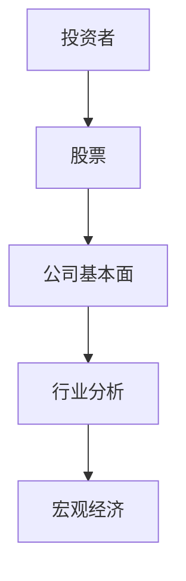
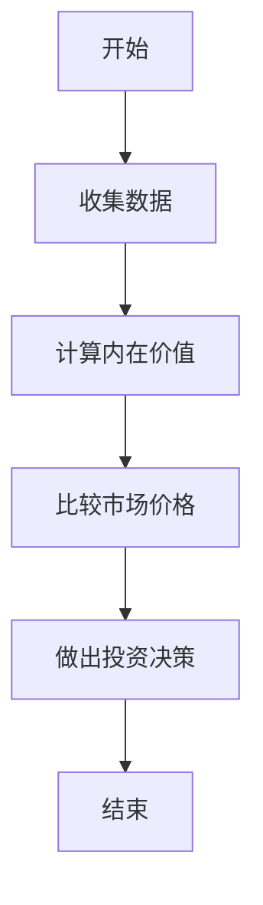
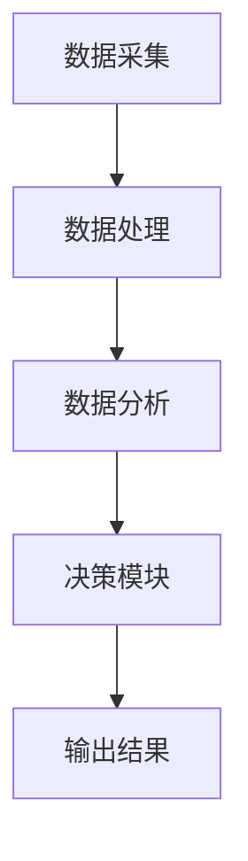

                 


# 彼得林奇的"价值投资"实践指南

> 关键词：价值投资，彼得林奇，内在价值，安全边际，投资策略，投资决策系统

> 摘要：本文将深入探讨彼得林奇的价值投资理念，分析其核心概念和实践方法。通过系统的分析和案例研究，揭示价值投资的数学模型、决策流程以及实际应用中的注意事项，帮助读者构建稳健的投资策略。

---

## 第一部分: 价值投资的背景与核心理念

### 第1章: 价值投资的起源与发展

#### 1.1 价值投资的起源
价值投资作为一种投资理念，起源于20世纪初，其核心思想是购买被市场低估的股票，长期持有，等待其价值回归。本节将介绍价值投资的起源，包括其在学术界和实践中的发展。

- **1.1.1 投资学说的演变历程**
  从古典投资学说的出现到现代投资理论的形成，价值投资如何演变？

- **1.1.2 彼得林奇与价值投资的结合**
  彼得林奇如何将价值投资理念应用于实际投资，并取得巨大成功？

- **1.1.3 价值投资在现代金融中的地位**
  在现代金融体系中，价值投资为何依然具有重要性？

---

### 第2章: 彼得林奇的投资哲学

#### 2.1 价值投资的核心理念
本节将详细阐述彼得林奇价值投资的核心理念，包括安全边际、内在价值和长期投资的重要性。

- **2.1.1 安全边际的概念**
  什么是安全边际？它如何保护投资者免受市场波动的影响？

- **2.1.2 内在价值的定义与计算**
  内在价值如何定义？如何通过DCF模型计算内在价值？

- **2.1.3 长期投资与复利效应**
  长期投资如何通过复利效应实现财富增长？

- **2.1.4 投资组合管理**
  如何构建和管理投资组合，以分散风险并最大化收益？

---

## 第二部分: 价值投资的核心概念与联系

### 第3章: 核心概念原理

#### 3.1 内在价值的数学模型
通过数学公式理解内在价值的计算方法。

- **DCF模型公式**
  $$ V = \frac{CF}{r - g} $$
  其中：
  - \( CF \)：未来现金流
  - \( r \)：折现率
  - \( g \)：增长率

#### 3.2 安全边际的计算
如何通过安全边际公式评估投资风险？

- **安全边际公式**
  $$ \text{安全边际} = \text{内在价值} - \text{市场价格} $$

#### 3.3 市场情绪与投资决策
如何通过市场情绪分析调整投资策略？

---

### 第4章: 核心概念属性特征对比表格

#### 4.1 不同投资策略的对比分析
以下是一个对比表格，展示了价值投资与其他投资策略的优劣势：

| 投资策略 | 核心理念                | 优点                            | 缺点                            |
|----------|------------------------|--------------------------------|--------------------------------|
| 价值投资 | 购买被低估的股票          | 风险较低，长期收益稳定          | 需要深入分析，投资周期长        |
| 成长型投资 | 投资高增长潜力的公司      | 高增长潜力，收益高              | 风险较高，波动性大              |
| 收益型投资 | 追求稳定的股息收益        | 收入稳定，风险较低              | 收益有限，增长潜力小            |

---

### 第5章: ER实体关系图架构

以下是一个简单的ER图，展示了价值投资的决策过程：



---

## 第三部分: 价值投资的算法原理

### 第6章: 算法原理讲解

#### 6.1 投资决策流程
以下是一个价值投资的决策流程图：



#### 6.2 内在价值计算公式
$$ V = \frac{CF}{r - g} $$

---

## 第四部分: 系统分析与架构设计方案

### 第7章: 系统架构设计

#### 7.1 系统功能设计
以下是价值投资决策系统的功能模块：

- **数据采集模块**：收集公司财务数据、行业信息、宏观经济指标等。
- **数据分析模块**：计算内在价值、评估安全边际。
- **决策模块**：根据分析结果做出投资决策。
- **监控模块**：实时跟踪投资标的的市场表现。

#### 7.2 系统架构图


---

## 第五部分: 项目实战

### 第8章: 项目实战

#### 8.1 项目介绍
选择一家公司（如苹果公司）进行价值投资分析。

#### 8.2 核心代码实现
以下是计算内在价值的Python代码：

```python
def calculate_intrinsic_value(cash_flow, discount_rate, growth_rate):
    return cash_flow / (discount_rate - growth_rate)

# 示例数据
CF = 100
r = 0.1
g = 0.05

V = calculate_intrinsic_value(CF, r, g)
print(f"内在价值为：{V}")
```

#### 8.3 实际案例分析
以苹果公司为例，分析其内在价值和投资价值。

---

## 第六部分: 最佳实践

### 第9章: 小结与注意事项

#### 9.1 小结
总结价值投资的核心理念和实践方法。

#### 9.2 投资注意事项
- **避免情绪化投资**
- **定期复盘和调整**
- **分散投资，降低风险**

#### 9.3 拓展阅读
推荐相关书籍和资源，供进一步学习。

---

## 作者

**作者：AI天才研究院/AI Genius Institute & 禅与计算机程序设计艺术 /Zen And The Art of Computer Programming**

---

通过本文的系统分析和实践指南，读者可以深入理解彼得林奇的价值投资理念，并将其应用于实际投资中。希望本文能为投资者提供有价值的参考和指导。

