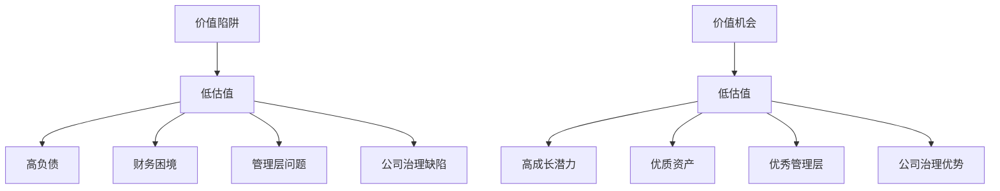

                 


# 彼得林奇的"价值陷阱"vs"价值机会"

## 关键词：价值陷阱，价值机会，彼得林奇，投资策略，风险管理

## 摘要：彼得林奇是世界著名投资家，他提出了“价值陷阱”和“价值机会”两个概念。价值陷阱是指那些看似具有低估值但实际存在严重问题的公司或行业，而价值机会则是指低估值但具有高成长潜力的优质资产。本文将深入分析这两个概念的核心要素、识别方法、投资策略，并通过实际案例帮助投资者更好地理解和应用这些概念。同时，本文还将探讨风险管理与投资心理在价值投资中的重要性。

---

# 第1章: 价值陷阱与价值机会的背景介绍

## 1.1 价值陷阱与价值机会的核心概念

### 1.1.1 价值陷阱的定义与特征
价值陷阱是指那些表面上看似具有投资价值，但实际上存在严重问题的公司或行业。这类资产通常表现为低估值，但其基本面存在问题，如高负债、财务困境、管理层问题或公司治理缺陷等。

### 1.1.2 价值机会的定义与特征
价值机会是指那些低估值但具有高成长潜力的优质资产。这类资产通常具有良好的财务状况、优秀的管理层和健康的公司治理结构，且处于高成长行业的公司。

### 1.1.3 价值陷阱与价值机会的区别与联系
价值陷阱和价值机会的主要区别在于其基本面和潜在成长性。价值陷阱虽然低估值，但存在严重问题，未来增长潜力有限；而价值机会则是低估值且具有高成长潜力的优质资产。两者都需要投资者具备深入的分析能力和敏锐的洞察力。

## 1.2 彼得林奇的理论背景

### 1.2.1 彼得林奇的投资理念
彼得林奇是美国著名投资家，曾管理富达麦哲伦基金，创造了辉煌的投资业绩。他的投资理念以“价值投资”为核心，强调深入研究公司基本面，寻找那些被市场低估的优质资产。

### 1.2.2 价值投资的起源与发展
价值投资起源于本杰明·格雷厄姆的理论，强调以低于内在价值的价格购买优质资产。彼得林奇继承并发展了这一理论，提出了“烟蒂股”概念，即那些被市场忽视但具有潜在价值的公司。

### 1.2.3 价值陷阱与价值机会在彼得林奇投资策略中的地位
在彼得林奇的投资策略中，价值陷阱和价值机会是核心概念。他强调投资者需要区分这两者，避免陷入价值陷阱，同时抓住价值机会。

## 1.3 价值陷阱与价值机会的现实意义

### 1.3.1 投资者在价值陷阱中的常见误区
许多投资者容易混淆价值陷阱和价值机会，往往因为低估值而盲目投资，忽视了公司基本面的问题。

### 1.3.2 价值机会对投资者的潜在收益
抓住价值机会可以为投资者带来超额收益，尤其是在市场低估优质资产时。

### 1.3.3 价值陷阱与价值机会对投资决策的影响
正确识别价值陷阱和价值机会可以帮助投资者做出更明智的投资决策，避免重大损失并抓住潜在的高收益机会。

## 1.4 本章小结
本章通过介绍价值陷阱和价值机会的核心概念、彼得林奇的理论背景及其现实意义，为读者理解这两个概念奠定了基础。

---

# 第2章: 价值陷阱与价值机会的核心要素分析

## 2.1 价值陷阱的核心要素

### 2.1.1 低估值的表象
价值陷阱的表象通常是低估值，但其内在问题严重，如高负债、财务困境等。

### 2.1.2 高负债与财务困境
高负债和财务困境是价值陷阱的核心特征之一。这类公司通常面临偿债压力，难以持续发展。

### 2.1.3 管理层问题与公司治理缺陷
管理层问题和公司治理缺陷是价值陷阱的另一个核心特征。这类公司通常管理混乱，难以实现长期发展。

## 2.2 价值机会的核心要素

### 2.2.1 低估值的优质资产
价值机会的核心特征是低估值的优质资产。这类资产通常具有较高的内在价值，但市场价格被低估。

### 2.2.2 高成长潜力的行业与公司
高成长潜力的行业与公司是价值机会的重要特征。这类公司通常处于高成长行业，具有较大的发展潜力。

### 2.2.3 优秀管理层与公司治理优势
优秀管理层和公司治理优势是价值机会的另一个核心要素。这类公司通常管理规范，治理结构健康。

## 2.3 价值陷阱与价值机会的对比分析

### 2.3.1 核心要素对比表格
| 核心要素         | 价值陷阱                  | 价值机会                  |
|------------------|---------------------------|---------------------------|
| 低估值           | 是                       | 是                       |
| 高负债           | 是                       | 否                       |
| 财务困境         | 是                       | 否                       |
| 管理层问题       | 是                       | 否                       |
| 公司治理缺陷     | 是                       | 否                       |
| 高成长潜力       | 否                       | 是                       |
| 优质资产         | 否                       | 是                       |

### 2.3.2 实体关系图（ER图）



## 2.4 本章小结
通过对比分析，我们可以清晰地看到价值陷阱和价值机会在核心要素上的区别，从而更好地识别和区分这两种类型。

---

# 第3章: 价值陷阱与价值机会的投资策略与方法

## 3.1 价值陷阱的识别方法

### 3.1.1 财务指标分析法
通过分析公司的财务指标，如资产负债率、净利润率等，识别高负债和财务困境的公司。

### 3.1.2 行业分析法
通过分析公司所在行业的竞争状况和发展前景，识别高负债和财务困境的公司。

### 3.1.3 管理层评估法
通过分析公司的管理层背景和管理风格，识别管理层问题和公司治理缺陷。

## 3.2 价值机会的挖掘方法

### 3.2.1 寻找低估值的优质资产
通过分析市场估值和公司内在价值，寻找低估值的优质资产。

### 3.2.2 行业趋势分析
通过分析行业发展趋势，寻找高成长潜力的行业和公司。

### 3.2.3 优秀管理层识别
通过分析公司管理层的背景和管理风格，识别优秀管理层和公司治理优势。

## 3.3 价值陷阱与价值机会的对比分析

### 3.3.1 投资策略对比
价值陷阱需要避免，而价值机会需要抓住。

### 3.3.2 实际案例分析
通过实际案例分析，展示如何区分价值陷阱和价值机会。

---

# 第4章: 价值陷阱与价值机会的系统分析与架构设计方案

## 4.1 系统分析

### 4.1.1 问题场景介绍
投资者在进行投资决策时，需要区分价值陷阱和价值机会。

### 4.1.2 领域模型设计
通过领域模型设计，展示系统的核心功能模块。

### 4.1.3 系统架构设计
通过系统架构设计，展示系统的各个部分及其交互。

## 4.2 架构设计方案

### 4.2.1 项目介绍
项目旨在帮助投资者识别价值陷阱和价值机会。

### 4.2.2 系统功能设计
系统功能包括数据采集、分析、识别和报告生成。

### 4.2.3 系统架构设计
系统架构包括数据采集模块、分析模块、识别模块和报告生成模块。

---

# 第5章: 价值陷阱与价值机会的项目实战

## 5.1 项目介绍

### 5.1.1 项目目标
帮助投资者识别价值陷阱和价值机会。

### 5.1.2 项目环境
Python编程语言，数据处理工具等。

## 5.2 核心实现源代码

### 5.2.1 数据采集
```python
import pandas as pd

# 从数据库中读取数据
data = pd.read_sql("SELECT * FROM company_data", con)
```

### 5.2.2 数据分析
```python
# 计算财务指标
data['debt_to_equity_ratio'] = data['total_liabilities'] / data['total_equity']
data['net_profit_margin'] = data['net_profit'] / data['revenue']
```

### 5.2.3 识别价值陷阱和价值机会
```python
# 识别价值陷阱
value_traps = data[(data['debt_to_equity_ratio'] > 2) & (data['net_profit_margin'] < 0)]
# 识别价值机会
value Opportunities = data[(data['debt_to_equity_ratio'] < 1) & (data['net_profit_margin'] > 0)]
```

## 5.3 代码应用解读与分析

### 5.3.1 数据采集模块
通过数据采集模块，获取公司的财务数据。

### 5.3.2 数据分析模块
通过数据分析模块，计算公司的财务指标，识别价值陷阱和价值机会。

### 5.3.3 报告生成模块
通过报告生成模块，输出识别结果，帮助投资者做出决策。

## 5.4 案例分析

### 5.4.1 案例介绍
分析某公司的情况，判断其是否为价值陷阱或价值机会。

### 5.4.2 数据分析与解读
通过数据分析，识别公司的财务状况和潜在价值。

### 5.4.3 结论与建议
根据分析结果，提出投资建议。

## 5.5 本章小结
通过项目实战，我们可以更好地理解如何应用价值陷阱和价值机会的识别方法。

---

# 第6章: 价值陷阱与价值机会的风险管理与投资心理

## 6.1 风险管理

### 6.1.1 投资组合管理
通过合理配置投资组合，分散投资风险。

### 6.1.2 风险控制策略
制定风险控制策略，避免重大损失。

## 6.2 投资心理

### 6.2.1 避免情绪化决策
投资者需要保持理性，避免情绪化决策。

### 6.2.2 建立正确的投资心态
投资者需要建立正确的投资心态，长期坚持价值投资。

## 6.3 本章小结
风险管理与投资心理在价值投资中至关重要，投资者需要具备良好的风险管理和心理素质，才能在长期投资中取得成功。

---

# 第7章: 总结与展望

## 7.1 总结
通过本文的分析，我们可以清晰地看到价值陷阱和价值机会的区别和联系，以及如何在投资中应用这些概念。

## 7.2 展望
未来，随着市场的变化和投资理论的发展，价值陷阱和价值机会的识别方法将不断改进和创新。

---

# 作者：AI天才研究院/AI Genius Institute & 禅与计算机程序设计艺术 /Zen And The Art of Computer Programming

