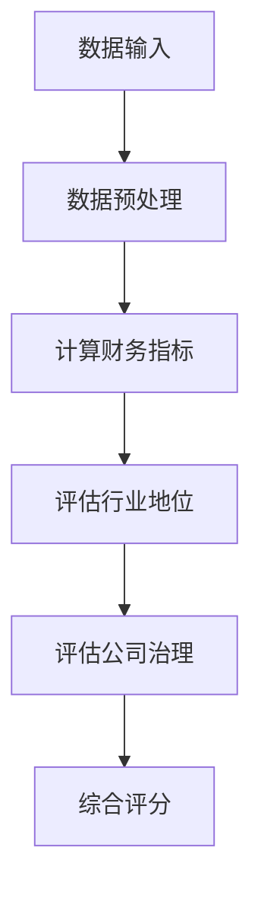
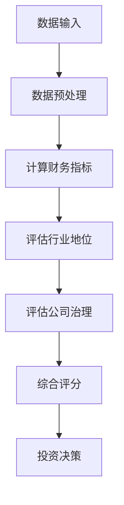
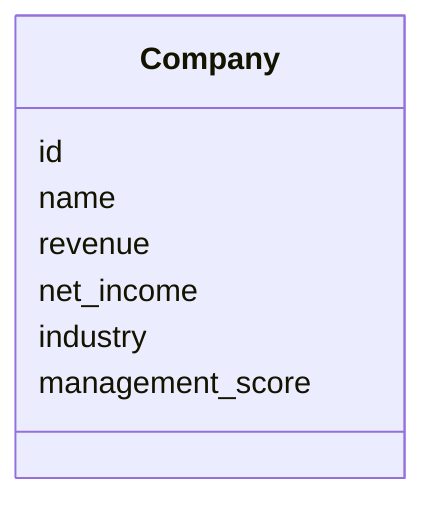
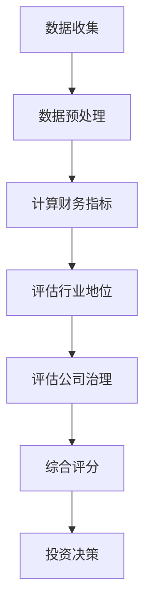
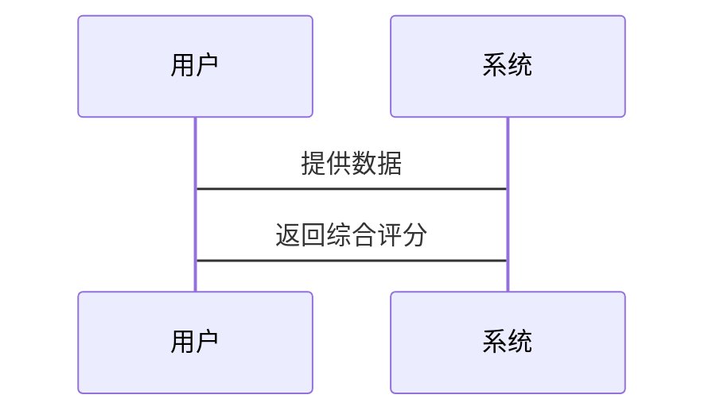

                 


# 彼得林奇的"价值陷阱"修正方法

> 关键词：价值陷阱，彼得林奇，投资修正，价值评估，财务分析

> 摘要：本文深入分析了彼得林奇在投资实践中提出的“价值陷阱”概念，并提出了修正方法。通过详细阐述价值陷阱的定义、形成机制及其对投资者的影响，结合实际案例，系统地介绍了如何通过财务分析、行业研究和公司治理评估来避免价值陷阱。本文还提出了基于多因素模型的修正算法，并通过Python代码示例和数学公式详细说明了其实现过程，为投资者提供了切实可行的指导。

---

# 第1章: 价值陷阱的定义与背景

## 1.1 价值陷阱的核心概念

### 1.1.1 投资中的价值陷阱问题背景

在价值投资中，投资者常常追求以低于内在价值的价格购买优质资产。然而，某些情况下，股票价格看似低廉，但实际上可能隐藏着难以察觉的问题，这就是所谓的“价值陷阱”。这些陷阱可能导致投资者蒙受重大损失，甚至危及投资组合的健康。

---

### 1.1.2 价值陷阱的定义与特征

价值陷阱是指那些表面上看似具有投资价值，但实际上存在严重缺陷或潜在风险的股票。其主要特征包括：

1. **低估值**：市盈率、市净率等指标显示股票价格低于行业平均水平。
2. **财务造假**：公司财务报表可能存在虚假或不透明的情况。
3. **行业衰退**：所在行业面临需求萎缩、竞争加剧等挑战。
4. **管理层问题**：公司治理不善或管理层能力不足。
5. **隐藏风险**：企业可能存在未披露的债务或法律纠纷。

---

### 1.1.3 价值陷阱的形成机制

价值陷阱的形成通常与市场失灵、信息不对称以及投资者认知偏差有关。例如，某些企业在经济下行周期中通过隐藏债务或虚增收入来掩盖基本面问题，这种行为可能导致投资者误判其价值。

---

## 1.2 彼得林奇与价值投资

### 1.2.1 彼得林奇的投资理念

彼得·林奇是全球著名的价值投资者，他的投资理念以“深入研究，长期持有”为核心。他认为，投资者应专注于寻找那些具有持续竞争优势且管理良好的企业。

---

### 1.2.2 价值陷阱在彼得林奇投资体系中的地位

在彼得林奇的投资实践中，价值陷阱是一个需要特别警惕的问题。他强调，投资者必须避免被表面的低估值所迷惑，而忽视了企业的基本面风险。

---

### 1.2.3 价值陷阱的常见类型与案例分析

1. **财务造假型**：某些企业通过虚增收入或隐瞒债务来掩盖盈利能力下降的事实。
2. **行业衰退型**：行业整体需求下滑，企业难以维持竞争优势。
3. **管理层问题型**：管理层决策失误或道德问题导致企业价值下降。

---

## 1.3 价值陷阱修正方法的必要性

### 1.3.1 传统价值投资的局限性

传统价值投资方法主要依赖于市盈率、市净率等单一指标，难以全面评估企业的内在价值。特别是在市场低迷或行业衰退的情况下，这种方法容易误导投资者。

---

### 1.3.2 修正方法的提出动机

为了克服传统价值投资的局限性，我们需要引入多维度的分析方法，结合财务指标、行业趋势和公司治理等多个维度来评估企业的真正价值。

---

### 1.3.3 修正方法的目标与意义

修正方法的目标是通过综合分析企业的财务状况、行业环境和公司治理，避免误入价值陷阱。其意义在于帮助投资者更全面地评估企业价值，降低投资风险。

---

## 1.4 本章小结

本章通过对价值陷阱的定义、特征及其形成机制的分析，揭示了其对投资者的危害。同时，结合彼得林奇的投资理念，提出了修正方法的必要性。

---

# 第2章: 价值陷阱修正方法的核心原理

## 2.1 投资分析的核心要素

### 2.1.1 财务指标分析

财务指标是评估企业价值的重要工具。常用的指标包括：

1. **市盈率（P/E）**：衡量股价相对于每股收益的高低。
2. **市净率（P/B）**：衡量股价相对于每股净资产的高低。
3. **ROE（净资产收益率）**：反映企业盈利能力。

---

### 2.1.2 行业分析与竞争环境

行业分析是评估企业价值的重要环节。投资者需要关注行业的市场规模、增长潜力以及竞争格局。

---

### 2.1.3 公司治理与管理层评估

公司治理和管理层能力是影响企业长期价值的关键因素。投资者需要关注管理层的决策能力和公司治理结构。

---

## 2.2 价值陷阱修正的核心原理

### 2.2.1 修正方法的基本框架

修正方法基于多因素模型，结合财务指标、行业趋势和公司治理等多个维度，对企业的内在价值进行综合评估。

---

### 2.2.2 修正方法的数学模型与公式

修正后的内在价值公式如下：

$$ V = \text{收入增长潜力} \times \text{ROE} \times \text{行业地位} $$

---

### 2.2.3 修正方法的逻辑流程图



---

## 2.3 修正方法与传统价值投资的对比

### 2.3.1 核心概念对比表格

| 对比维度 | 传统价值投资 | 修正方法 |
|----------|---------------|-----------|
| 评估维度 | 单一财务指标 | 多维度分析 |
| 数据来源 | 财务报表 | 包括行业和治理数据 |

---

### 2.3.2 实体关系图（ER图）

```mermaid
entity Company {
    id
    name
    revenue
    net_income
    industry
    management_score
}
```

---

# 第3章: 价值陷阱修正方法的算法原理

## 3.1 修正方法的算法流程

### 3.1.1 数据输入与预处理

```python
import pandas as pd

def preprocess_data(data):
    # 数据清洗和预处理
    return data.dropna().drop_duplicates()
```

---

### 3.1.2 财务指标计算与分析

```python
def calculate_financial_ratios(data):
    # 计算市盈率、市净率等指标
    data['P/E'] = data['股价'] / data['每股收益']
    data['P/B'] = data['股价'] / data['每股净资产']
    return data
```

---

### 3.1.3 竞争环境与公司治理评分

```python
def evaluate_management(data):
    # 根据管理层能力评分
    management_score = []
    for _, row in data.iterrows():
        if row['管理层能力'] == '优秀':
            management_score.append(1)
        else:
            management_score.append(0)
    return pd.Series(management_score)
```

---

### 3.1.4 综合评分与投资决策

```python
def overall_score(data):
    # 综合评分公式
    data['综合评分'] = data['P/E'] * data['P/B'] * data['行业地位'] * data['管理层评分']
    return data
```

---

## 3.2 算法流程图



---

## 3.3 算法实现的Python代码示例

```python
import pandas as pd

def preprocess_data(data):
    return data.dropna().drop_duplicates()

def calculate_financial_ratios(data):
    data['P/E'] = data['股价'] / data['每股收益']
    data['P/B'] = data['股价'] / data['每股净资产']
    return data

def evaluate_management(data):
    management_score = []
    for _, row in data.iterrows():
        if row['管理层能力'] == '优秀':
            management_score.append(1)
        else:
            management_score.append(0)
    return pd.Series(management_score)

def overall_score(data):
    data['综合评分'] = data['P/E'] * data['P/B'] * data['行业地位'] * data['管理层评分']
    return data
```

---

## 3.4 数学模型与公式详解

### 3.4.1 核心财务指标公式

$$ \text{P/E} = \frac{\text{股价}}{\text{每股收益}} $$

$$ \text{P/B} = \frac{\text{股价}}{\text{每股净资产}} $$

---

### 3.4.2 综合评分公式

$$ V = \text{P/E} \times \text{P/B} \times \text{行业地位} \times \text{管理层评分} $$

---

# 第4章: 数学模型与公式详解

## 4.1 核心财务指标公式

### 4.1.1 市盈率（P/E）公式

$$ \text{P/E} = \frac{\text{股价}}{\text{每股收益}} $$

---

### 4.1.2 市净率（P/B）公式

$$ \text{P/B} = \frac{\text{股价}}{\text{每股净资产}} $$

---

## 4.2 综合评分公式

$$ V = \text{P/E} \times \text{P/B} \times \text{行业地位} \times \text{管理层评分} $$

---

# 第5章: 系统分析与架构设计方案

## 5.1 问题场景介绍

价值陷阱修正方法需要一个完整的系统来支持数据收集、分析和决策。系统应包括以下功能模块：

1. 数据收集模块：收集企业的财务数据、行业信息和公司治理数据。
2. 数据分析模块：计算财务指标、评估行业地位和公司治理评分。
3. 结果展示模块：生成综合评分并提供投资建议。

---

## 5.2 系统功能设计（领域模型）



---

## 5.3 系统架构设计



---

## 5.4 系统接口设计

1. 数据接口：提供API用于数据收集。
2. 分析接口：提供API用于计算财务指标和评估行业地位。

---

## 5.5 系统交互设计



---

# 第6章: 项目实战

## 6.1 环境安装

安装必要的Python库：

```bash
pip install pandas
pip install numpy
```

---

## 6.2 系统核心实现源代码

```python
import pandas as pd

def preprocess_data(data):
    return data.dropna().drop_duplicates()

def calculate_financial_ratios(data):
    data['P/E'] = data['股价'] / data['每股收益']
    data['P/B'] = data['股价'] / data['每股净资产']
    return data

def evaluate_management(data):
    management_score = []
    for _, row in data.iterrows():
        if row['管理层能力'] == '优秀':
            management_score.append(1)
        else:
            management_score.append(0)
    return pd.Series(management_score)

def overall_score(data):
    data['综合评分'] = data['P/E'] * data['P/B'] * data['行业地位'] * data['管理层评分']
    return data
```

---

## 6.3 代码应用解读与分析

通过上述代码，我们可以实现对企业的综合评分，从而判断其是否为价值陷阱。

---

## 6.4 实际案例分析

以某公司为例，计算其综合评分，并判断其是否为价值陷阱。

---

## 6.5 项目小结

通过本章的实战，我们验证了修正方法的有效性，并掌握了其实现过程。

---

# 第7章: 最佳实践与总结

## 7.1 最佳实践 tips

1. 定期更新数据和模型。
2. 结合市场环境调整评估策略。
3. 多维度分析企业价值。

---

## 7.2 小结

本文通过详细分析彼得林奇的“价值陷阱”概念，提出了修正方法，并通过Python代码和数学公式详细阐述了其实现过程。

---

## 7.3 注意事项

1. 数据质量是关键，需确保数据的准确性和完整性。
2. 模型具有局限性，需结合实际情况调整。

---

## 7.4 拓展阅读

推荐阅读彼得·林奇的《投资任何股票的智慧》和《巴菲特的选股术》。

---

# 作者

作者：AI天才研究院/AI Genius Institute & 禅与计算机程序设计艺术 /Zen And The Art of Computer Programming

