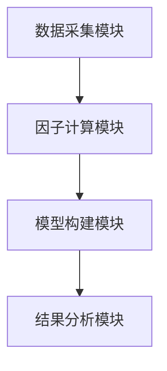

                 


# 彼得林奇的"价值陷阱"在新兴科技股中的多因子识别模型

> 关键词：彼得林奇，价值陷阱，多因子识别模型，新兴科技股，股票筛选，投资策略

> 摘要：本文探讨了彼得林奇提出的“价值陷阱”概念，并将其与新兴科技股的投资策略相结合，构建了一个基于多因子识别模型的分析框架。通过详细分析价值陷阱的本质、多因子模型的构建方法以及在新兴科技股中的具体应用，本文旨在为投资者提供一种有效的股票筛选工具，帮助识别潜在的价值陷阱，降低投资风险，提高投资收益。

---

## 第一部分: 背景介绍

### 第1章: 彼得林奇的"价值陷阱"概述

#### 1.1 价值陷阱的定义与特征
价值陷阱是指那些看似具有吸引力但实际存在根本性缺陷的股票。这类股票通常表现为低市盈率、低市净率等表面上的“廉价”特征，但实际上可能隐藏着财务状况恶化、行业竞争加剧、管理不善等潜在风险。

- **定义**：价值陷阱是彼得林奇在其投资理论中提出的一个概念，指那些表面上看似便宜，但实际上存在严重问题的股票。
- **特征**：包括低估值、高负债、盈利能力下降、行业竞争加剧等。

#### 1.2 彼得林奇的价值投资理念
彼得林奇强调长期投资和基本面分析，主张寻找具有持续增长潜力的公司。他认为，价值陷阱的核心问题在于公司基本面的恶化，而不仅仅是价格的低估。

- **核心思想**：投资于具有强大基本面和竞争优势的公司，避免被低估值的表象迷惑。
- **成长股与价值股的结合**：彼得林奇并不完全排斥价值股，但强调要区分真正的价值股和价值陷阱。

#### 1.3 新兴科技股的特点与投资机会
新兴科技股通常具有高增长潜力，但也伴随着高波动性和高风险。科技行业的快速变化和技术迭代使得新兴科技股的投资更具挑战性。

- **定义与分类**：新兴科技股包括人工智能、大数据、云计算等领域的创新企业。
- **投资价值分析**：高增长潜力与高风险并存，投资者需要结合行业趋势和公司基本面进行分析。

#### 1.4 本章小结
价值陷阱的核心在于公司基本面的恶化，而新兴科技股的投资机会与风险并存。本章总结了价值陷阱的定义、特征以及新兴科技股的特点，为后续的多因子识别模型构建奠定了基础。

---

## 第二部分: 多因子识别模型的理论基础

### 第2章: 多因子模型的核心概念

#### 2.1 多因子模型的基本原理
多因子模型是一种通过多个因子（如市值、价值、动量等）来解释股票收益的模型。与单因子模型相比，多因子模型能够更全面地捕捉股票收益的驱动因素。

- **定义**：多因子模型是将股票收益分解为多个因子的线性组合。
- **分类**：常见的多因子模型包括Fama-French三因子模型、动量因子模型等。
- **优势与局限性**：优势在于能够解释更多的收益来源，但因子过多可能导致过拟合。

#### 2.2 多因子模型在股票筛选中的应用
在股票筛选中，多因子模型可以帮助投资者识别具有持续收益潜力的股票，同时避免单一因子的局限性。

- **因子选择标准**：包括因子的可解释性、可操作性和统计显著性。
- **因子权重分配**：根据因子的重要性进行权重分配，通常采用回归分析确定权重。

#### 2.3 常见的多因子模型介绍
- **Fama-French三因子模型**：包括市值、价值和动量三个因子。
- **其他多因子模型**：如风格因子模型、质量因子模型等。

#### 2.4 本章小结
多因子模型通过多个因子的组合，能够更全面地分析股票收益的驱动因素，为股票筛选提供了更强大的工具。

---

## 第三部分: 多因子识别模型的算法原理

### 第3章: 多因子模型的算法流程

#### 3.1 多因子模型的因子筛选流程
因子筛选是多因子模型构建的关键步骤，通常包括数据收集、预处理、因子选择和因子组合优化。

- **数据收集与预处理**：收集历史价格、财务数据等，进行数据清洗和标准化。
- **因子选择**：通过回归分析、主成分分析等方法筛选出显著的因子。
- **因子组合优化**：使用回归分析确定因子权重，构建最终的多因子模型。

#### 3.2 多因子模型的数学模型
多因子模型的数学表达通常为：

$$ R_i = \beta_0 + \beta_1 F_1 + \beta_2 F_2 + \cdots + \beta_n F_n + \epsilon $$

其中，$R_i$是股票i的收益，$F_j$是因子j，$\beta_j$是因子的系数，$\epsilon$是误差项。

#### 3.3 多因子模型的实现流程
1. 数据收集与预处理：收集目标股票的历史数据，包括价格、财务指标等。
2. 因子选择：通过统计方法筛选出显著的因子。
3. 因子组合优化：确定各因子的权重，构建多因子模型。
4. 模型验证：通过回测验证模型的有效性。

#### 3.4 本章小结
本章详细介绍了多因子模型的算法流程，包括因子筛选、模型构建和验证的步骤。

---

## 第四部分: 系统架构与项目实战

### 第4章: 系统架构设计

#### 4.1 系统功能设计
- 数据采集模块：负责收集股票数据。
- 因子计算模块：计算各因子的值。
- 模型构建模块：构建多因子模型。
- 结果分析模块：对模型结果进行分析和解读。

#### 4.2 系统架构图


#### 4.3 系统接口设计
- 数据接口：提供API用于数据的导入和导出。
- 模型接口：提供API用于模型的训练和预测。

#### 4.4 本章小结
系统架构设计为多因子识别模型的实现提供了框架，明确了各模块的功能和交互流程。

---

## 第五部分: 项目实战与总结

### 第5章: 项目实战

#### 5.1 环境安装与数据准备
- 安装Python环境，安装pandas、numpy等库。
- 收集目标股票的历史数据，包括价格、财务指标等。

#### 5.2 多因子模型的实现代码
```python
import pandas as pd
import numpy as np
from sklearn.linear_model import LinearRegression
from sklearn.metrics import mean_squared_error

# 数据预处理
data = pd.read_csv('stock_data.csv')
data = data.dropna()

# 因子选择
factors = data[['PE', 'PB', 'ROE', 'Revenue_Growth']]
target = data['Return']

# 模型构建
model = LinearRegression()
model.fit(factors, target)

# 模型验证
predicted = model.predict(factors)
 mse = mean_squared_error(target, predicted)
 print(f'MSE: {mse}')
```

#### 5.3 实证分析与结果解读
通过回测分析模型的预测能力，验证其在识别价值陷阱中的有效性。

#### 5.4 本章小结
本章通过实际案例展示了多因子识别模型的实现过程，验证了其在新兴科技股投资中的应用价值。

---

## 第六部分: 总结与展望

### 第6章: 总结与展望

#### 6.1 本章小结
本文构建了一个基于多因子识别模型的分析框架，探讨了其在识别新兴科技股价值陷阱中的应用。

#### 6.2 投资者注意事项
- 多因子模型的有效性依赖于数据的质量和因子的选择。
- 需要结合行业趋势和公司基本面进行综合分析。

#### 6.3 未来研究方向
- 研究更多因子的加入对模型的影响。
- 探讨多因子模型在不同市场环境下的表现。

---

## 作者信息

作者：AI天才研究院/AI Genius Institute & 禅与计算机程序设计艺术 /Zen And The Art of Computer Programming

