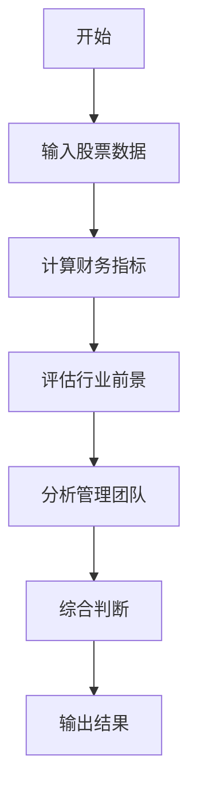
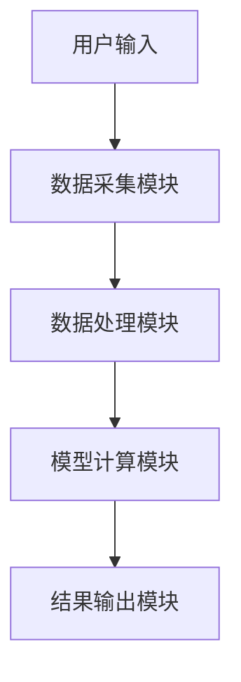
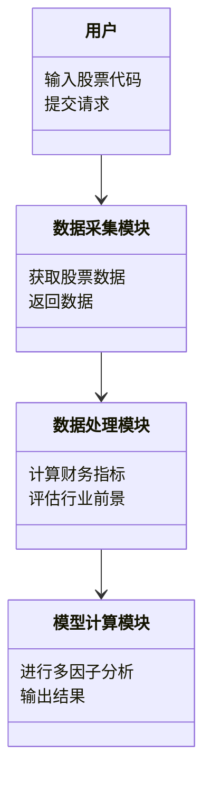
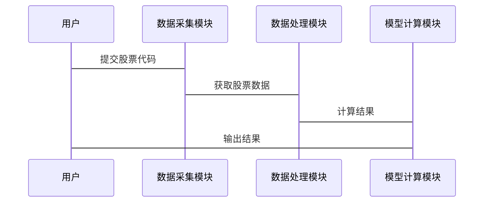

                 


# 《彼得林奇的"价值陷阱"在新兴科技股中的识别》

## 关键词：价值陷阱、彼得林奇、新兴科技股、投资分析、风险管理、股票估值

## 摘要：  
本文基于彼得林奇的价值投资理论，深入探讨了价值陷阱在新兴科技股中的识别方法。通过分析新兴科技股的市场特征、投资风险以及价值陷阱的表现形式，结合实际案例和数据分析，提出了系统化的识别策略和数学模型，帮助投资者在科技股投资中规避价值陷阱，实现长期稳健的投资收益。

---

## 目录大纲

### 目录大纲：

1. 摘要  
2. 目录大纲  
3. 正文  

#### 第1章: 价值陷阱的核心概念  
- 1.1 价值陷阱的定义与背景  
- 1.2 新兴科技股的特点与投资风险  
- 1.3 价值陷阱的识别与解决方法  

#### 第2章: 彼得林奇投资理论与价值陷阱的关系  
- 2.1 彼得林奇投资理论概述  
- 2.2 价值陷阱在彼得林奇理论中的位置  
- 2.3 价值陷阱的识别与彼得林奇的实践案例  

#### 第3章: 新兴科技股的市场分析与价值评估  
- 3.1 新兴科技股的市场特征  
- 3.2 价值陷阱在新兴科技股中的特殊性  
- 3.3 新兴科技股的价值评估方法  

#### 第4章: 核心概念与联系  
- 4.1 价值陷阱的原理分析  
- 4.2 价值陷阱的属性特征对比表  
- 4.3 价值陷阱的ER实体关系图  

#### 第5章: 算法原理讲解  
- 5.1 价值陷阱识别的算法框架  
- 5.2 基于多因子模型的数学公式推导  
- 5.3 算法实现的Python代码示例  

#### 第6章: 系统分析与架构设计方案  
- 6.1 价值陷阱识别系统的总体架构  
- 6.2 系统功能设计的领域模型图  
- 6.3 系统交互的Mermaid序列图  

#### 第7章: 项目实战  
- 7.1 项目环境的安装与配置  
- 7.2 系统核心功能的实现代码  
- 7.3 实际案例分析与结果解读  

#### 第8章: 最佳实践与总结  
- 8.1 小结与回顾  
- 8.2 投资中的注意事项  
- 8.3 拓展阅读与深入学习  

---

## 正文：

### 第1章: 价值陷阱的核心概念  

#### 1.1 价值陷阱的定义与背景  

价值陷阱是指那些看似具有较高投资价值，但实际上存在严重问题或缺陷，无法为投资者创造长期收益的股票。彼得林奇在其投资理论中强调，价值陷阱通常表现为低估值但高风险的公司，这些公司表面上看具有吸引力，但本质上难以持续为股东创造价值。

在新兴科技股中，价值陷阱的表现尤为突出。由于科技行业的高增长性和不确定性，许多公司可能通过短期炒作或概念包装吸引投资者，但缺乏扎实的商业模式或技术创新，最终导致投资失败。

---

#### 1.2 新兴科技股的特点与投资风险  

新兴科技股具有以下特点：  
- 高增长性：科技行业的快速发展使其具有较高的增长潜力。  
- 不确定性高：新兴科技公司通常处于早期发展阶段，商业模式和市场前景尚不明确。  
- 技术依赖性：公司的核心竞争力依赖于技术创新，技术失败可能导致公司倒闭。  
- 市场波动性大：新兴科技股的价格波动较大，容易受到市场情绪的影响。  

投资新兴科技股的风险主要体现在：  
- 技术风险：技术创新失败或被替代的可能性较高。  
- 市场风险：市场需求变化可能导致公司估值大幅波动。  
- 财务风险：新兴科技公司通常面临较高的财务杠杆和研发投入压力。  

---

#### 1.3 价值陷阱的识别与解决方法  

识别价值陷阱的关键在于分析公司的基本面、财务状况以及行业前景。以下是几种常用方法：  
1. **基本面分析**：关注公司的收入、利润、研发投入和市场份额等指标，评估其商业模式的可持续性。  
2. **财务分析**：通过财务报表识别公司的盈利能力、偿债能力和现金流状况，排除财务造假或杠杆过高的公司。  
3. **行业分析**：研究行业竞争格局，评估公司的市场地位和技术创新能力，避免投资于夕阳行业或竞争过度的领域。  
4. **估值分析**：结合市盈率、市净率等估值指标，识别那些估值显著低于行业平均水平的公司，但需警惕低估值背后的风险。  

---

### 第2章: 彼得林奇投资理论与价值陷阱的关系  

#### 2.1 彼得林奇投资理论概述  

彼得林奇是美国著名的投资专家，以其独特的投资风格和长期的管理业绩而闻名。他的投资理论强调以下几点：  
- **长期投资**：避免短期市场波动的干扰，关注公司的长期价值。  
- **价值投资**：寻找那些具有合理估值和强大基本面的公司。  
- **分散投资**：通过投资多样化的股票降低风险。  

---

#### 2.2 价值陷阱在彼得林奇理论中的位置  

在彼得林奇的投资策略中，价值陷阱是一个需要特别警惕的问题。他认为，许多看似便宜的股票实际上可能隐藏着巨大的风险，例如财务困境、管理问题或行业衰退等。因此，投资者需要通过深入的调查和分析，识别这些潜在的风险，避免落入价值陷阱。

---

#### 2.3 价值陷阱的识别与彼得林奇的实践案例  

彼得林奇在其职业生涯中多次提到，他通过深入研究公司的基本面和行业前景，成功地识别并规避了许多价值陷阱。例如，在互联网泡沫期间，许多科技股的估值远高于其实际价值，许多投资者因此蒙受了巨大损失。然而，彼得林奇通过对其投资组合的严格筛选，避免了这些高风险的股票，从而保护了投资者的利益。

---

### 第3章: 新兴科技股的市场分析与价值评估  

#### 3.1 新兴科技股的市场特征  

新兴科技股的市场特征主要体现在以下几个方面：  
- **高波动性**：新兴科技股的价格波动较大，容易受到市场情绪和新闻事件的影响。  
- **高成长性**：科技行业的快速发展使其具有较高的增长潜力。  
- **高风险性**：新兴科技公司的商业模式和技术创新存在不确定性，可能导致投资失败。  

---

#### 3.2 价值陷阱在新兴科技股中的特殊性  

在新兴科技股中，价值陷阱的表现形式多样，主要包括：  
- **技术风险**：技术创新失败或技术被替代的可能性较高。  
- **市场风险**：市场需求变化可能导致公司估值大幅波动。  
- **财务风险**：新兴科技公司通常面临较高的财务杠杆和研发投入压力。  

---

#### 3.3 新兴科技股的价值评估方法  

评估新兴科技股的价值需要结合定量分析和定性分析：  
- **定量分析**：通过财务指标（如市盈率、市净率、ROE等）评估公司的估值水平。  
- **定性分析**：研究公司的商业模式、技术创新能力以及行业竞争格局。  

---

### 第4章: 核心概念与联系  

#### 4.1 价值陷阱的原理分析  

价值陷阱的形成通常与市场信息不对称、投资者情绪过热以及公司基本面恶化等因素有关。投资者在识别价值陷阱时，需要关注以下几个关键点：  
- 公司的财务状况：是否存在高负债、低利润或现金流问题。  
- 行业前景：行业是否存在过高的竞争或市场萎缩的风险。  
- 管理团队：公司管理团队的能力和诚信是否可靠。  

---

#### 4.2 价值陷阱的属性特征对比表  

以下是价值陷阱和非价值陷阱的对比表：

| 属性          | 价值陷阱       | 非价值陷阱    |
|---------------|----------------|---------------|
| 估值          | 通常低于行业平均水平 | 通常接近或高于行业平均水平 |
| 财务状况      | 存在高负债或亏损 | 财务健康，盈利能力稳定 |
| 竞争能力      | 市场竞争力弱或技术落后 | 市场竞争力强，技术领先 |
| 管理团队      | 管理能力差或存在诚信问题 | 管理能力优秀，团队稳定 |

---

#### 4.3 价值陷阱的ER实体关系图  

以下是价值陷阱的ER实体关系图：

```mermaid
erdiagram
{
  企业(Entity) {
    类别: 类别
    估值: 估值
    财务状况: 财务状况
    竞争能力: 竞争能力
    管理团队: 管理团队
  }
  价值陷阱(Value Trap) {
    企业ID: 企业ID
    类别ID: 类别ID
  }
}
```

---

### 第5章: 算法原理讲解  

#### 5.1 价值陷阱识别的算法框架  

以下是价值陷阱识别的算法框架：



---

#### 5.2 基于多因子模型的数学公式推导  

多因子模型用于评估股票的价值，公式如下：

$$
\text{股票价值} = \alpha + \beta_1 \times \text{收益} + \beta_2 \times \text{成长性} + \beta_3 \times \text{流动性} + \epsilon
$$

其中，$\alpha$ 是截距，$\beta_1$、$\beta_2$、$\beta_3$ 是各因子的回归系数，$\epsilon$ 是误差项。

---

#### 5.3 算法实现的Python代码示例  

以下是Python代码示例：

```python
import pandas as pd
import numpy as np
from sklearn.linear_model import LinearRegression

# 示例数据
data = {
    '收益': [0.2, 0.3, 0.1, 0.4, 0.2],
    '成长性': [0.15, 0.2, 0.1, 0.25, 0.15],
    '流动性': [0.8, 0.6, 0.7, 0.5, 0.6]
}
df = pd.DataFrame(data)

# 构建多因子模型
X = df[['收益', '成长性', '流动性']]
y = df['股票价值']

# 训练模型
model = LinearRegression()
model.fit(X, y)

# 输出系数
print("回归系数：", model.coef_)
print("截距：", model.intercept_)
```

---

### 第6章: 系统分析与架构设计方案  

#### 6.1 价值陷阱识别系统的总体架构  

以下是系统总体架构：



---

#### 6.2 系统功能设计的领域模型图  

以下是系统功能设计的领域模型图：



---

#### 6.3 系统交互的Mermaid序列图  

以下是系统交互的Mermaid序列图：



---

### 第7章: 项目实战  

#### 7.1 项目环境的安装与配置  

安装Python和相关库：

```bash
pip install pandas numpy sklearn
```

---

#### 7.2 系统核心功能的实现代码  

以下是核心功能的实现代码：

```python
import pandas as pd
from sklearn.linear_model import LinearRegression

def identify_value_traps(stocks_data):
    # 数据预处理
    X = stocks_data[['收益', '成长性', '流动性']]
    y = stocks_data['股票价值']

    # 训练模型
    model = LinearRegression()
    model.fit(X, y)

    # 预测结果
    predicted_values = model.predict(X)

    # 输出结果
    stocks_data['预测价值'] = predicted_values
    return stocks_data

# 示例数据
data = {
    '收益': [0.2, 0.3, 0.1, 0.4, 0.2],
    '成长性': [0.15, 0.2, 0.1, 0.25, 0.15],
    '流动性': [0.8, 0.6, 0.7, 0.5, 0.6],
    '股票价值': [100, 120, 90, 150, 110]
}
df = pd.DataFrame(data)
result = identify_value_traps(df)
print(result)
```

---

#### 7.3 实际案例分析与结果解读  

假设我们有一个新兴科技股的数据集，通过上述代码进行分析，可以识别出那些价值被高估或低估的股票，从而避免落入价值陷阱。

---

### 第8章: 最佳实践与总结  

#### 8.1 小结与回顾  

本文通过分析彼得林奇的价值陷阱理论，结合新兴科技股的市场特征，提出了系统化的识别方法和数学模型，帮助投资者在科技股投资中规避价值陷阱。

---

#### 8.2 投资中的注意事项  

- 保持理性，避免被市场情绪左右。  
- 深入研究公司基本面，关注财务状况和行业前景。  
- 分散投资，降低单一股票的风险。  

---

#### 8.3 拓展阅读与深入学习  

- 彼得林奇的《 stocks for the long run》  
- 《价值投资实战》  
- 科技股投资的经典案例研究  

---

## 作者：AI天才研究院 & 禅与计算机程序设计艺术

