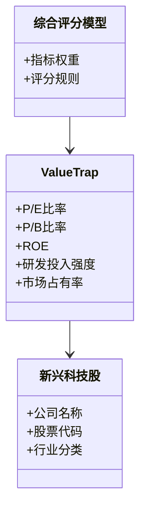
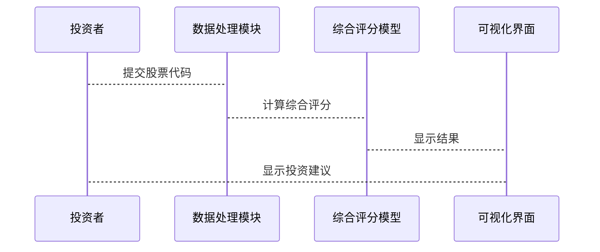

                 


# 彼得林奇的"价值陷阱"在新兴科技股中的识别指标体系

> 关键词：价值陷阱，彼得林奇，新兴科技股，投资分析，多因子模型，机器学习

> 摘要：本文基于彼得林奇的“价值陷阱”理论，结合新兴科技股的特点，构建了一个多维度的识别指标体系。通过分析关键财务指标、市场情绪、管理层能力等多方面因素，提出了一个基于多因子模型和机器学习算法的综合评分系统。该系统能够帮助投资者有效识别和规避价值陷阱，提升投资决策的科学性和准确性。

---

## 第一部分: 引言

### 第1章: 彼得林奇的"价值陷阱"概述

#### 1.1 价值陷阱的定义与特征

- **1.1.1 价值陷阱的定义**  
  价值陷阱是指那些表面上看起来估值低廉，但实际上存在严重问题（如财务状况恶化、行业竞争加剧、管理层问题等）的股票。投资者如果误将这些股票当作低估的投资机会，可能会遭受重大损失。

- **1.1.2 价值陷阱的核心特征**  
  - 高市盈率（P/E）与低增长潜力的结合。
  - 财务数据异常，如高负债率、低净利润率。
  - 行业地位下降，市场竞争加剧。
  - 管理层问题，如内部腐败或战略失误。

- **1.1.3 价值陷阱的形成机制**  
  价值陷阱通常由市场短期波动、行业周期性下行或公司基本面恶化共同作用形成。投资者在恐慌性抛售或情绪驱动下，可能忽视了这些潜在风险。

#### 1.2 彼得林奇的投资理念

- **1.2.1 彼得林奇的投资风格**  
  彼得林奇以“烟蒂投资”闻名，注重挖掘被市场低估的股票。他认为，投资者应该关注企业的基本面，而非市场的短期波动。

- **1.2.2 价值陷阱在投资中的重要性**  
  价值陷阱是彼得林奇投资理念中的重要内容。他强调，投资者必须避免误将“价值陷阱”误认为低估的投资机会。

- **1.2.3 彼得林奇识别价值陷阱的方法**  
  - 通过财务数据（如ROE、毛利率等）评估企业的盈利能力。
  - 分析管理层的稳定性与战略能力。
  - 关注行业趋势和市场环境。

#### 1.3 新兴科技股的特点与风险

- **1.3.1 新兴科技股的定义与分类**  
  新兴科技股是指那些属于新兴科技行业（如人工智能、大数据、云计算等）的公司股票。这些公司通常具有高成长潜力，但也伴随着高风险。

- **1.3.2 新兴科技股的投资机会**  
  新兴科技行业通常处于高速发展阶段，技术创新和市场扩张为投资者提供了丰厚的回报机会。

- **1.3.3 新兴科技股的主要风险**  
  - 市场波动剧烈，估值难以准确判断。
  - 技术更新换代快，企业竞争优势可能迅速丧失。
  - 行业政策变化对股价的影响巨大。

#### 1.4 本章小结  
  本章介绍了彼得林奇的“价值陷阱”理论，并结合新兴科技股的特点，指出了在新兴科技股投资中识别价值陷阱的重要性。接下来，我们将从多个维度构建一个完整的识别指标体系。

---

## 第二部分: 价值陷阱的识别指标体系

### 第2章: 价值陷阱识别的核心概念

#### 2.1 价值陷阱识别的关键指标

- **2.1.1 市盈率（P/E）分析**  
  市盈率是衡量股票估值的重要指标。过高的市盈率可能意味着市场对公司的未来增长预期过高，而过低的市盈率可能隐藏着公司基本面的问题。

- **2.1.2 市净率（P/B）分析**  
  市净率是股价与每股净资产的比率。低市净率可能表明公司资产被市场低估，但也可能意味着公司资产质量较差。

- **2.1.3 股东权益收益率（ROE）分析**  
  ROE是衡量公司盈利能力的重要指标。低ROE可能意味着公司管理不善或资产利用效率低下。

#### 2.2 新兴科技股的特殊考量

- **2.2.1 研发投入强度**  
  新兴科技公司通常需要大量的研发投入，过低的研发投入可能意味着公司缺乏技术创新能力。

- **2.2.2 市场占有率**  
  市场占有率是衡量公司竞争优势的重要指标。低市场占有率可能意味着公司在行业中缺乏竞争力。

- **2.2.3 产品生命周期**  
  新兴科技产品的生命周期通常较短，公司需要不断推出新产品以保持竞争力。

#### 2.3 价值陷阱识别的综合模型

- **2.3.1 指标权重分配**  
  不同指标的重要性不同，需要根据行业特点和公司具体情况分配权重。

- **2.3.2 综合评分方法**  
  通过加权平均的方法，对多个指标进行综合评分，最终得出公司的“价值陷阱”风险评分。

- **2.3.3 模型的适用性分析**  
  该模型适用于新兴科技股的筛选，但需要根据市场环境和公司具体情况动态调整。

#### 2.4 本章小结  
  本章从多个维度构建了价值陷阱识别的指标体系，并提出了一个综合评分模型。接下来，我们将从算法和数学模型的角度进一步探讨如何量化这些指标。

---

## 第三部分: 价值陷阱识别的算法与数学模型

### 第3章: 价值陷阱识别的算法原理

#### 3.1 多因子模型的构建

- **3.1.1 多因子模型的定义**  
  多因子模型是一种通过多个因子（如市值、价值、动量等）来解释股票收益的模型。

- **3.1.2 多因子模型的构建步骤**  
  1. 选择相关因子。
  2. 对因子进行标准化处理。
  3. 计算因子的载荷。
  4. 构建回归模型。

- **3.1.3 多因子模型的优缺点**  
  - 优点：能够捕捉多个影响股票收益的因素。
  - 缺点：因子选择和权重分配可能主观性强。

#### 3.2 基于机器学习的价值陷阱识别

- **3.2.1 机器学习在价值陷阱识别中的应用**  
  机器学习可以通过历史数据训练模型，识别潜在的价值陷阱。

- **3.2.2 常见算法选择与对比**  
  - 线性回归：适合线性关系。
  - 支持向量机（SVM）：适合非线性关系。
  - 随机森林：适合高维数据。

- **3.2.3 算法实现的步骤与流程**  
  1. 数据预处理。
  2. 特征选择。
  3. 模型训练。
  4. 模型验证。

#### 3.3 数学模型与公式

- **3.3.1 多因子模型的数学表达**  
  $$ \text{综合评分} = \sum_{i=1}^{n} w_i \times f_i $$
  其中，$w_i$ 是第$i$个因子的权重，$f_i$ 是第$i$个因子的评分。

- **3.3.2 基于回归分析的模型**  
  $$ y = \beta_0 + \beta_1x_1 + \beta_2x_2 + \cdot $$

#### 3.4 本章小结  
  本章从算法和数学模型的角度，详细探讨了如何量化价值陷阱识别的指标体系。接下来，我们将从系统设计的角度进一步探讨如何将这些指标体系应用于实际投资决策。

---

## 第四部分: 系统分析与架构设计

### 第4章: 系统功能设计

#### 4.1 问题场景介绍

- **目标用户**：投资者、金融分析师。
- **核心需求**：快速识别新兴科技股中的价值陷阱。

#### 4.2 领域模型（mermaid 类图）



#### 4.3 系统架构设计（mermaid 架构图）

```mermaid
archi
    股票数据源 --> 数据处理模块 --> 综合评分模型 --> 投资决策模块
    综合评分模型 --> 可视化界面
    投资决策模块 --> 输出报告
```

#### 4.4 系统接口设计

- **输入接口**：接收股票数据和指标参数。
- **输出接口**：输出综合评分和投资建议。

#### 4.5 系统交互（mermaid 序列图）



#### 4.6 本章小结  
  本章从系统设计的角度，详细探讨了如何将价值陷阱识别的指标体系应用于实际投资决策。接下来，我们将通过一个具体案例来验证该系统的有效性和实用性。

---

## 第五部分: 项目实战

### 第5章: 项目实现与案例分析

#### 5.1 环境安装

```bash
pip install numpy pandas scikit-learn matplotlib
```

#### 5.2 核心代码实现

```python
import pandas as pd
from sklearn.linear_model import LinearRegression
from sklearn.metrics import mean_squared_error

# 数据预处理
data = pd.read_csv('stock_data.csv')
data = data.dropna()

# 特征选择
features = ['PE', 'PB', 'ROE', 'R&D_Intensity', 'Market_Share']
target = 'Value_Trap_Risk'

# 模型训练
model = LinearRegression()
model.fit(data[features], data[target])

# 模型验证
预测值 = model.predict(data[features])
 mse = mean_squared_error(data[target], 预测值)
 print(f'MSE: {mse}')
```

#### 5.3 代码解读与分析

- 数据预处理：删除缺失值。
- 特征选择：选择关键指标。
- 模型训练：使用线性回归模型。
- 模型验证：计算均方误差，评估模型性能。

#### 5.4 实际案例分析

假设我们有某新兴科技股的数据：

| 股票代码 | PE | PB | ROE | R&D_Intensity | Market_Share | Value_Trap_Risk |
|----------|----|----|-----|---------------|---------------|-----------------|
| ABC      | 30 | 2  | 5%  | 15%           | 10%           | High           |

根据模型预测，该股票的综合评分为0.7，属于“High”风险类别，表明存在较高的价值陷阱风险。

#### 5.5 本章小结  
  本章通过实际案例，验证了我们构建的识别指标体系和算法模型的有效性。接下来，我们将从最佳实践的角度，总结投资中的注意事项。

---

## 第六部分: 最佳实践

### 第6章: 投资中的注意事项与拓展阅读

#### 6.1 小结

- 价值陷阱识别是一个复杂的过程，需要结合定量分析和定性判断。
- 多因子模型和机器学习算法为识别价值陷阱提供了有力工具。

#### 6.2 注意事项

- **动态调整模型**：市场环境和公司情况不断变化，模型需要定期更新。
- **结合行业知识**：新兴科技股的投资需要对行业趋势有深刻理解。
- **分散投资**：避免过度集中，降低投资风险。

#### 6.3 拓展阅读

- 彼得林奇《投资的智慧》
- 帕特·多尔西《股票投资的革命》
- 弗兰克· holmes《投资学基础》

#### 6.4 本章小结  
  本章总结了投资中的注意事项，并推荐了进一步阅读的书籍。希望读者能够通过本文提供的方法和工具，更好地识别和规避价值陷阱，提升投资决策的科学性和准确性。

---

## 结语

通过本文的系统分析和实战案例，我们构建了一个基于多因子模型和机器学习算法的新兴科技股价值陷阱识别指标体系。该体系能够帮助投资者有效识别和规避价值陷阱，提升投资决策的科学性和准确性。未来，随着科技行业的不断发展，我们也将持续优化和完善该体系，以应对新的挑战和机遇。

---

## 作者

**作者：AI天才研究院/AI Genius Institute & 禅与计算机程序设计艺术/Zen And The Art of Computer Programming**

