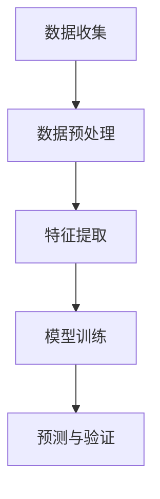
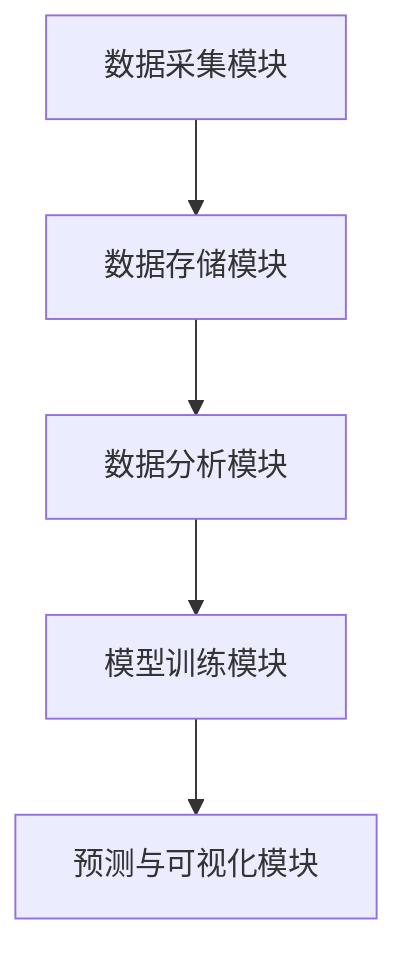

                 


# 彼得林奇的"价值陷阱"在新能源行业中的识别方法

> **关键词**: 彼得林奇, 价值陷阱, 新能源行业, 投资策略, 风险管理  
> **摘要**: 彼得林奇的价值陷阱理论在新能源行业的投资中具有重要意义。本文通过分析价值陷阱在新能源行业的具体表现，结合企业基本面分析、行业周期分析和政策环境分析，提出了识别和规避价值陷阱的方法。同时，本文还提供了基于Python的算法实现和数学模型，帮助投资者在新能源行业中有效识别和规避价值陷阱。

---

## 第1章: 价值陷阱的基本概念

### 1.1 价值陷阱的定义与特征

#### 1.1.1 价值陷阱的定义  
价值陷阱是指一些股票或公司表面上看似乎具有投资价值（如低市盈率、低市净率），但实际上由于公司基本面恶化、行业竞争加剧或其他潜在风险，这些股票的价值可能进一步下降。投资者如果误判了这些公司的基本面，可能会陷入价值陷阱。

#### 1.1.2 价值陷阱的核心特征  
价值陷阱的核心特征包括：  
1. **表面价值高**：公司估值指标（如PE、PB）看似合理甚至偏低。  
2. **基本面恶化**：公司盈利能力下降、现金流恶化、债务高企等。  
3. **行业风险**：行业处于衰退期或竞争激烈，公司缺乏竞争优势。  
4. **潜在风险**：公司存在未公开的财务问题或政策风险。  

#### 1.1.3 价值陷阱与投资风险的关系  
价值陷阱是投资风险的一种表现形式，投资者如果未能识别这些陷阱，可能会导致投资损失。因此，识别价值陷阱是投资决策中的关键步骤。

### 1.2 彼得林奇的价值投资理念

#### 1.2.1 彼得林奇投资理论概述  
彼得林奇是全球著名投资专家，他强调基本面分析和长期投资。他认为，投资者应该选择那些具有强大竞争优势、良好管理团队和稳定财务状况的公司。

#### 1.2.2 价值陷阱在彼得林奇投资策略中的地位  
在彼得林奇的投资策略中，价值陷阱是一个需要特别警惕的信号。他认为，投资者在寻找价值投资机会时，必须仔细分析公司的基本面，避免误判。

#### 1.2.3 价值陷阱与企业基本面分析  
彼得林奇强调，价值陷阱的核心在于企业基本面的恶化。因此，投资者需要从财务数据、行业地位、管理团队等多个维度进行分析。

---

## 第2章: 新能源行业的特点与投资机会

### 2.1 新能源行业的定义与范围

#### 2.1.1 新能源行业的定义  
新能源行业是指以太阳能、风能、生物质能等可再生能源为主要能源来源的行业，包括发电、储能、智能电网等相关领域。

#### 2.1.2 新能源行业的主要领域  
1. 太阳能发电  
2. 风能发电  
3. 生物质能发电  
4. 储能技术  
5. 智能电网  

#### 2.1.3 新能源行业的市场现状与发展趋势  
新能源行业正处于快速发展阶段，全球能源转型和环保政策的推动是其主要驱动力。然而，行业的技术门槛高、竞争激烈，也存在一定的投资风险。

### 2.2 新能源行业的投资机会与风险

#### 2.2.1 新能源行业的投资机会  
1. 技术进步带来的投资机会。  
2. 政策支持（如政府补贴、税收优惠）带来的市场机会。  
3. 全球能源转型带来的长期需求增长。  

#### 2.2.2 新能源行业的主要风险  
1. 技术风险：技术落后或创新能力不足的企业可能被淘汰。  
2. 市场风险：市场竞争激烈，价格压力大。  
3. 政策风险：政策变化可能影响行业盈利能力。  
4. 金融风险：部分企业可能通过高杠杆或虚假财务数据吸引投资者。  

#### 2.2.3 价值陷阱在新能源行业中的潜在表现形式  
1. 技术落后型陷阱：企业技术 outdated，缺乏创新能力。  
2. 市场过度竞争型陷阱：行业竞争激烈，企业盈利能力下降。  
3. 政策依赖型陷阱：过度依赖政府补贴，政策变化可能导致企业亏损。  
4. 财务造假型陷阱：企业通过虚假财务数据掩盖基本面问题。  

---

## 第3章: 价值陷阱与新能源行业的结合

### 3.1 价值陷阱在新能源行业的典型表现

#### 3.1.1 技术落后型陷阱  
技术落后型企业可能表面上看估值较低，但由于缺乏创新能力，难以在竞争中生存。例如，某些太阳能电池板制造商可能在技术上落后于行业领先者。

#### 3.1.2 市场过度竞争型陷阱  
在某些新能源领域，如储能技术，企业可能因为过度竞争导致价格战，从而影响盈利能力。这类企业可能表面上看估值合理，但实际上面临盈利能力下降的风险。

#### 3.1.3 政策依赖型陷阱  
某些新能源企业过度依赖政府补贴，一旦政策发生变化，企业可能面临利润大幅下降甚至亏损。例如，某些生物质能发电企业可能因为政策调整而失去补贴支持。

#### 3.1.4 财务造假型陷阱  
部分新能源企业可能通过财务造假（如虚增收入、隐瞒债务）掩盖基本面问题。这类企业可能在短期内估值看似合理，但实际上存在较大风险。

### 3.2 新能源行业中的价值陷阱识别方法

#### 3.2.1 企业基本面分析方法  
1. **财务数据分析**：重点关注企业的盈利能力、现金流和资产负债情况。  
2. **管理团队分析**：评估管理团队的行业经验和创新能力。  
3. **技术优势分析**：评估企业的技术储备和创新能力。  

#### 3.2.2 行业周期分析方法  
1. **行业生命周期分析**：判断行业是否处于成长期或衰退期。  
2. **行业竞争分析**：评估企业在行业中的竞争力和市场份额。  

#### 3.2.3 政策环境分析方法  
1. **政策支持评估**：分析政府对新能源行业的支持政策及其持续性。  
2. **政策风险评估**：判断政策变化可能对企业盈利能力的影响。  

#### 3.2.4 市场竞争分析  
1. **市场竞争格局分析**：评估行业的竞争程度和企业市场地位。  
2. **价格分析**：分析市场价格变化趋势及其对企业盈利能力的影响。  

---

## 第4章: 价值陷阱的识别算法与数学模型

### 4.1 价值陷阱识别的算法原理

#### 4.1.1 算法流程  
1. 数据收集：收集新能源企业的财务数据、行业数据和政策数据。  
2. 数据预处理：清洗数据，处理缺失值和异常值。  
3. 特征提取：提取关键特征（如市盈率、市净率、ROE等）。  
4. 模型训练：使用机器学习算法（如逻辑回归、随机森林）训练分类模型。  
5. 预测与验证：对新能源企业进行分类，判断是否为价值陷阱。  

#### 4.1.2 算法实现  
以下是基于Python的算法实现代码：  

```python
import pandas as pd
from sklearn.model_selection import train_test_split
from sklearn.ensemble import RandomForestClassifier
from sklearn.metrics import accuracy_score

# 加载数据
data = pd.read_csv('new_energy_companies.csv')

# 数据预处理
data = data.dropna()

# 特征工程
features = ['PE', 'PB', 'ROE', 'DEbt_to_Equity']
target = 'is_value_trap'

X = data[features]
y = data[target]

# 划分训练集和测试集
X_train, X_test, y_train, y_test = train_test_split(X, y, test_size=0.2, random_state=42)

# 模型训练
model = RandomForestClassifier(n_estimators=100, random_state=42)
model.fit(X_train, y_train)

# 模型预测
y_pred = model.predict(X_test)

# 模型评估
print("Accuracy:", accuracy_score(y_test, y_pred))
```

#### 4.1.3 算法流程图  


### 4.2 数学模型与公式

#### 4.2.1 市盈率（PE）公式  
$$ PE = \frac{\text{股价}}{\text{每股收益}} $$  

#### 4.2.2 市净率（PB）公式  
$$ PB = \frac{\text{股价}}{\text{每股净资产}} $$  

#### 4.2.3 净资产收益率（ROE）公式  
$$ ROE = \frac{\text{净利润}}{\text{净资产}} $$  

---

## 第5章: 系统分析与架构设计

### 5.1 价值陷阱识别系统设计

#### 5.1.1 系统功能设计  
1. 数据采集模块：采集新能源企业的财务数据、行业数据和政策数据。  
2. 数据分析模块：对数据进行预处理和特征提取。  
3. 模型训练模块：使用机器学习算法训练分类模型。  
4. 预测与可视化模块：对新能源企业进行分类，并生成可视化报告。  

#### 5.1.2 系统架构设计  


---

## 第6章: 项目实战

### 6.1 项目背景与目标  
本项目旨在通过算法和数学模型，识别新能源行业中的价值陷阱，帮助投资者避免投资风险。

### 6.2 项目实现

#### 6.2.1 环境配置  
1. 安装Python和相关库（如Pandas、Scikit-learn）。  
2. 下载新能源企业数据集。  

#### 6.2.2 核心代码实现  
以下是核心代码：  

```python
import pandas as pd
from sklearn.ensemble import RandomForestClassifier
from sklearn.metrics import accuracy_score

# 加载数据
data = pd.read_csv('new_energy_companies.csv')

# 数据预处理
data = data.dropna()

# 特征工程
features = ['PE', 'PB', 'ROE', 'DEbt_to_Equity']
target = 'is_value_trap'

X = data[features]
y = data[target]

# 划分训练集和测试集
X_train, X_test, y_train, y_test = train_test_split(X, y, test_size=0.2, random_state=42)

# 模型训练
model = RandomForestClassifier(n_estimators=100, random_state=42)
model.fit(X_train, y_train)

# 模型预测
y_pred = model.predict(X_test)

# 模型评估
print("Accuracy:", accuracy_score(y_test, y_pred))
```

---

## 第7章: 最佳实践与总结

### 7.1 最佳实践  
1. **深入分析企业基本面**：重点关注财务数据、管理团队和技术优势。  
2. **关注行业周期**：判断行业是否处于成长期或衰退期。  
3. **政策环境分析**：评估政策对企业的潜在影响。  
4. **使用多维度分析工具**：结合算法和数学模型进行综合判断。  

### 7.2 小结  
本文通过分析彼得林奇的价值陷阱理论，结合新能源行业的特点，提出了识别和规避价值陷阱的方法。通过算法和数学模型的实现，为投资者提供了有效的工具和策略。

### 7.3 注意事项  
1. 价值陷阱识别需要结合定性和定量分析。  
2. 投资者应保持警惕，避免过度依赖单一指标。  
3. 定期更新数据和模型，以适应市场变化。  

### 7.4 拓展阅读  
1. 彼得林奇《投资学入门：stocks for the long run》  
2. 新能源行业的相关研究和报告。  

---

## 作者：AI天才研究院/AI Genius Institute & 禅与计算机程序设计艺术/Zen And The Art of Computer Programming

