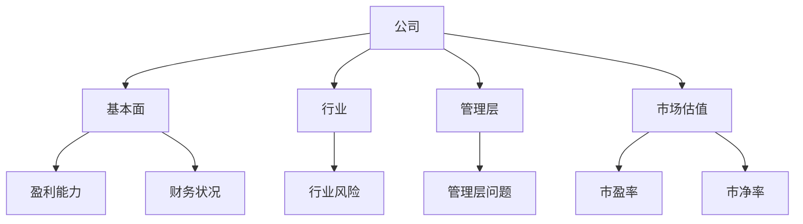
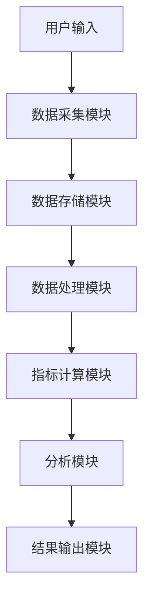

                 


# 彼得林奇的"价值陷阱"识别方法

> 关键词：价值陷阱，价值投资，彼得·林奇，投资分析，股票估值

> 摘要：本文系统地介绍了彼得·林奇提出的“价值陷阱”识别方法，从价值陷阱的定义、特征到识别方法，再到系统分析和项目实战，详细阐述了如何避免投资中的价值陷阱。文章结合了理论与实践，通过具体的案例分析和系统架构设计，帮助投资者掌握价值陷阱的识别技巧。

---

## 第一部分: 价值陷阱识别方法概述

### 第1章: 价值投资与价值陷阱的背景

#### 1.1 价值投资的基本概念

##### 1.1.1 价值投资的定义与核心理念

价值投资是一种投资策略，其核心理念是购买低于其内在价值的股票。这种策略认为市场有时会低估某些公司的价值，投资者可以通过长期持有这些股票，等待市场重新评估其价值时获得收益。

- **定义**：价值投资是基于公司基本面分析的投资方法，强调买入被市场低估的股票。
- **核心理念**：寻找具有强大基本面、合理估值和长期增长潜力的公司。

##### 1.1.2 价值投资的历史发展

价值投资的理论基础可以追溯到本杰明·格雷厄姆，他提出了“安全边际”概念，强调以低于内在价值的价格买入股票。彼得·林奇继承并发展了这一理论，提出了更适合普通投资者的价值投资策略。

- **历史发展**：
  - 20世纪初：格雷厄姆提出价值投资的基本理论。
  - 20世纪70年代：彼得·林奇开始实践并推广价值投资。
  - 20世纪末至21世纪初：价值投资在全球范围内被广泛接受和应用。

##### 1.1.3 彼得·林奇的价值投资风格

彼得·林奇以其独特的价值投资风格闻名，他注重公司基本面分析，尤其是公司的盈利能力和成长潜力。他的投资策略强调长期持有优质股票，避免短期市场波动的干扰。

- **风格特点**：
  - 长期持有：避免频繁交易，降低交易成本。
  - 选股标准：关注公司盈利能力、成长性和行业地位。
  - 价值导向：寻找市场价格低于内在价值的股票。

#### 1.2 价值陷阱的定义与特征

##### 1.2.1 价值陷阱的定义

价值陷阱是指那些表面上看起来便宜，但实际上存在严重问题的股票。这些股票可能因为市场误解、行业周期或公司基本面恶化等原因，导致其市场价格低于其实际价值，但这种现象通常是暂时的，投资者如果误判可能会陷入困境。

- **定义**：价值陷阱是那些表面上看似便宜，但实际存在严重问题的股票，容易误导投资者。

##### 1.2.2 价值陷阱的主要特征

价值陷阱通常具有以下特征：

- **低估值**：市场价格低于行业平均水平或历史平均水平。
- **盈利能力下降**：公司盈利能力持续下滑，甚至可能出现亏损。
- **行业风险**：所在行业面临周期性衰退或政策变化。
- **管理层问题**：公司管理层可能存在重大问题，如内部腐败或战略失误。
- **财务健康状况不佳**：公司财务状况恶化，可能存在高额债务或流动性问题。

##### 1.2.3 价值陷阱与价值投资的差异

- **差异**：
  - 价值投资追求的是市场价格低于内在价值的股票。
  - 价值陷阱则是市场价格低于内在价值，但公司基本面存在严重问题，可能导致股价进一步下跌。

---

### 第2章: 价值陷阱识别的核心概念

#### 2.1 价值陷阱识别的原理

##### 2.1.1 核心概念：公司基本面与市场估值的不匹配

价值陷阱的核心在于公司基本面与市场估值的不匹配。当市场价格低于内在价值时，投资者可能会误判，认为存在投资机会，但实际上公司基本面存在问题，导致股价继续下跌。

- **不匹配原因**：
  - 市场情绪影响：市场恐慌或过度乐观导致价格偏离价值。
  - 公司基本面变化：公司盈利能力下降或行业周期性变化。
  - 信息不对称：投资者对公司基本面的了解不全面。

##### 2.1.2 价值陷阱识别的逻辑框架

价值陷阱识别的逻辑框架包括以下几个步骤：

1. **公司基本面分析**：评估公司的盈利能力、成长性和财务健康状况。
2. **行业分析**：了解公司所在行业的竞争格局和周期性变化。
3. **管理层评估**：分析公司管理层的决策能力和战略规划。
4. **市场估值分析**：比较市场价格与内在价值，判断是否存在不匹配。

##### 2.1.3 彼得·林奇的价值陷阱识别方法

彼得·林奇提出了以下几个价值陷阱识别的关键点：

- **关注低估值股票**：寻找市场价格低于行业平均水平的股票。
- **分析公司盈利能力**：关注公司盈利能力是否持续下降。
- **行业风险评估**：了解公司所在行业的周期性变化和竞争格局。
- **管理层问题**：警惕公司管理层是否存在重大问题。

#### 2.2 核心概念与联系

##### 2.2.1 价值陷阱识别的关键指标

以下是一些常用的指标，用于识别价值陷阱：

| 指标名称       | 定义与作用                         |
|----------------|------------------------------------|
| 市盈率（P/E）   | 当前股价与每股收益的比率，用于衡量股价是否被低估或高估。 |
| 市净率（P/B）   | 当前股价与每股净资产的比率，用于衡量股价是否被低估。    |
| 股息率         | 每股股息与当前股价的比率，用于衡量股票的投资回报。        |
| 营业利润率      | 营业收入与营业成本的比率，用于衡量公司盈利能力。          |

##### 2.2.2 价值陷阱识别的属性特征对比表

以下是一个价值陷阱识别的属性特征对比表：

| 属性       | 价值陷阱特征                 | 正常价值股票特征           |
|------------|-------------------------------|---------------------------|
| 市盈率     | 偏低或远低于行业平均水平       | 接近或略高于行业平均水平   |
| 营业利润率   | 持续下降或亏损               | 稳定或持续增长             |
| 行业风险     | 高，行业处于衰退期           | 低，行业处于成长期或稳定期 |
| 管理层问题   | 存在重大问题或战略失误       | 管理层稳定且战略清晰       |

##### 2.2.3 ER实体关系图（Mermaid流程图）

以下是价值陷阱识别的实体关系图：



---

### 第3章: 价值陷阱识别的算法原理

#### 3.1 价值陷阱识别的算法流程

价值陷阱识别的算法流程包括以下几个步骤：

1. **数据收集**：收集目标公司的财务数据、行业数据和市场数据。
2. **数据预处理**：清洗数据，处理缺失值和异常值。
3. **计算关键指标**：计算市盈率、市净率、营业利润率等关键指标。
4. **分析公司基本面**：评估公司盈利能力、财务状况和管理层问题。
5. **行业分析**：评估公司所在行业的竞争格局和周期性变化。
6. **市场估值分析**：比较市场价格与内在价值，判断是否存在不匹配。
7. **识别价值陷阱**：根据分析结果，判断是否存在价值陷阱。

#### 3.2 价值陷阱识别的Python源代码

以下是价值陷阱识别的Python源代码示例：

```python
import pandas as pd
import numpy as np

def calculate_pe_ratio(df):
    df['PE'] = df['Price'] / df['EPS']
    return df

def calculate_pb_ratio(df):
    df['PB'] = df['Price'] / df['Book Value per Share']
    return df

def is_value_trap(df, threshold_pe=15, threshold_pb=2):
    df = calculate_pe_ratio(df)
    df = calculate_pb_ratio(df)
    df['Is Value Trap'] = (df['PE'] < threshold_pe) & (df['PB'] < threshold_pb)
    return df

# 示例数据
data = {
    'Company': ['Company A', 'Company B', 'Company C'],
    'Price': [10, 15, 20],
    'EPS': [0.5, 1.0, 0.8],
    'Book Value per Share': [2, 3, 4]
}

df = pd.DataFrame(data)
result = is_value_trap(df)
print(result)
```

#### 3.3 价值陷阱识别的数学模型与公式

以下是价值陷阱识别的数学模型与公式：

- **市盈率（PE）**：
  $$ PE = \frac{\text{Price}}{\text{EPS}} $$
  
- **市净率（PB）**：
  $$ PB = \frac{\text{Price}}{\text{Book Value per Share}} $$

- **价值陷阱识别模型**：
  $$ \text{Is Value Trap} = (PE < \text{threshold\_pe}) \& (PB < \text{threshold\_pb}) $$

---

### 第4章: 价值陷阱识别的系统分析与架构设计

#### 4.1 价值陷阱识别的系统架构设计

以下是价值陷阱识别的系统架构设计：



---

### 第5章: 价值陷阱识别的项目实战

#### 5.1 项目环境安装与配置

##### 5.1.1 环境搭建

- **操作系统**：Windows 10 或 macOS 10.15
- **Python版本**：Python 3.8 或更高版本
- **工具安装**：安装 Pandas、NumPy 等数据分析库

##### 5.1.2 工具安装与配置

- **安装Python环境**：
  ```bash
  python -m pip install --upgrade pip
  pip install pandas numpy
  ```

---

## 总结

彼得·林奇的价值陷阱识别方法为我们提供了一种系统性的投资策略，帮助投资者避免误判低估值股票。通过结合理论与实践，我们能够更好地识别价值陷阱，并在实际投资中应用这些方法。

**作者：AI天才研究院 & 禅与计算机程序设计艺术**

