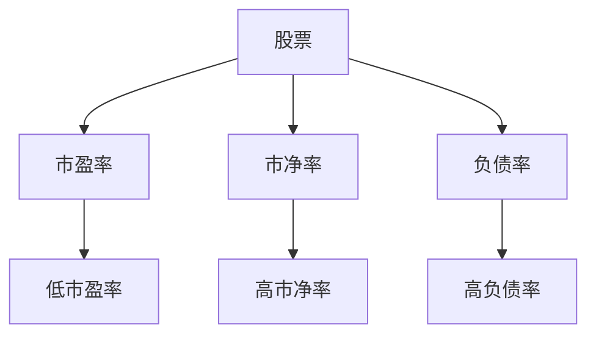
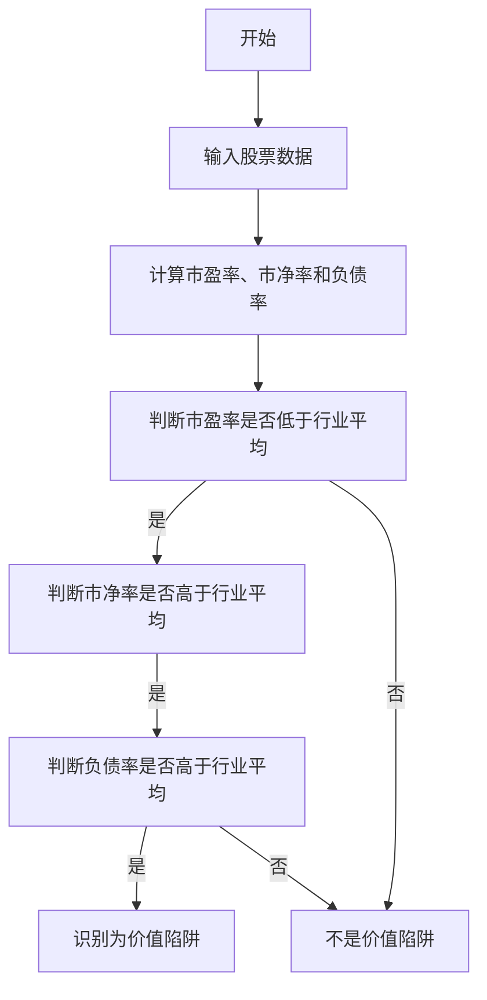
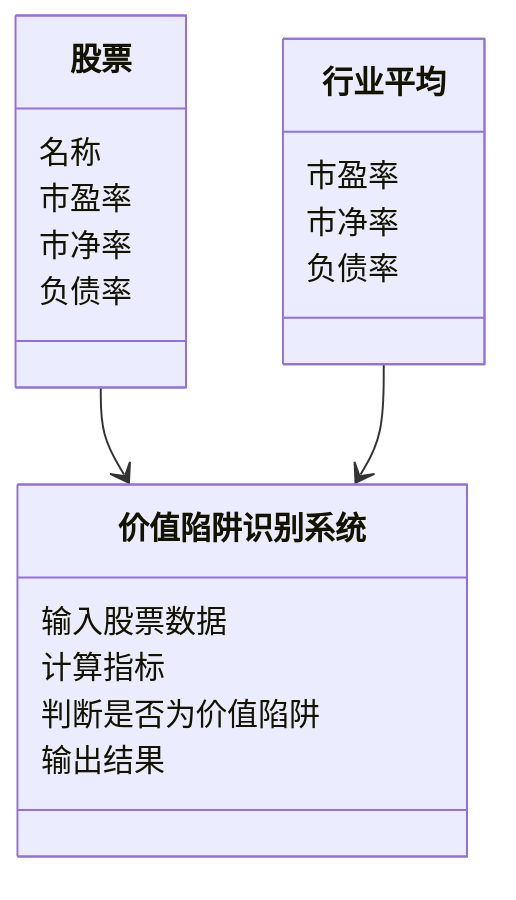
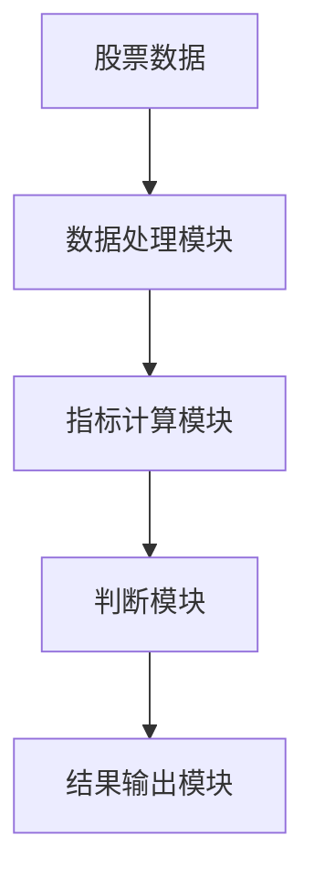

                 


# 彼得林奇的"价值陷阱"避免方法

> 关键词：价值陷阱，彼得·林奇，投资策略，股票分析，风险管理

> 摘要：本文详细探讨了彼得·林奇提出的“价值陷阱”概念，分析了其在投资中的表现、识别方法及避免策略。通过结合实际案例、数学模型和系统设计，本文为投资者提供了识别和避免价值陷阱的系统化方法，帮助投资者在股票投资中做出更明智的决策。

---

## 第1章：价值陷阱的定义与背景

### 1.1 价值陷阱的基本概念

价值陷阱是指那些看似估值低廉，但实际上存在严重问题或潜在风险的股票。投资者常常会被低市盈率或低市净率所吸引，但忽视了企业的基本面问题，导致投资失败。彼得·林奇作为著名投资经理，对价值陷阱有着深刻的见解，他强调投资者必须通过深入分析企业的财务状况和行业地位，避免陷入价值陷阱。

### 1.2 价值陷阱的形成原因

价值陷阱的形成通常与市场周期、投资者情绪和企业基本面变化有关。例如，在经济衰退期间，某些企业可能因杠杆过高或盈利能力下降，导致其股票估值看似低廉，但实际上存在较大的风险。投资者如果只关注表面的估值指标，而忽视了企业的财务健康状况，就容易陷入价值陷阱。

### 1.3 价值陷阱的投资风险

价值陷阱对投资者的主要风险在于其误导性。投资者可能会因为短期估值指标的吸引而买入，但长期来看，企业基本面的问题会导致股价进一步下跌，投资者可能面临较大的损失。此外，价值陷阱还可能导致投资者错失优质投资机会，降低整体投资组合的收益。

---

## 第2章：彼得·林奇的投资理念与价值陷阱

### 2.1 彼得·林奇的投资策略概述

彼得·林奇是一位注重基本面分析的投资专家，他强调通过深入研究企业的财务数据、行业地位和管理团队，来寻找具有长期增长潜力的股票。他的投资策略以价值投资为核心，但与传统价值投资不同，他更加注重企业的成长性和竞争优势。

### 2.2 彼得·林奇对价值陷阱的识别方法

彼得·林奇提出，识别价值陷阱的关键在于对企业财务数据的深入分析。他强调以下几点：

1. **低市盈率并不等于低估**：市盈率是衡量股票估值的重要指标，但仅仅低市盈率并不意味着股票被低估。投资者需要结合企业的盈利能力、成长性和行业地位进行综合判断。
2. **高负债率的警惕**：高负债率的企业在经济下行周期中更容易面临财务压力，投资者应尽量避免投资高负债率的企业。
3. **关注企业的成长性**：彼得·林奇认为，投资具有持续增长潜力的企业比单纯追求低估值更重要。他更倾向于投资那些营收和利润持续增长的企业。

### 2.3 彼得·林奇的经典案例分析

彼得·林奇在其职业生涯中多次提到，他曾经错失了一些优质投资机会，但也成功避开了许多价值陷阱。例如，他在投资通用电气时，曾因公司管理层的决策失误而避免了更大的损失。这些案例表明，通过深入分析企业的基本面，投资者可以有效识别并避免价值陷阱。

---

## 第3章：价值陷阱的核心概念

### 3.1 价值陷阱的核心要素

价值陷阱的核心要素包括企业的财务状况、市场估值指标和行业地位。具体来说，投资者需要关注以下指标：

1. **市盈率（P/E）**：市盈率是股票价格与每股收益的比率，用于衡量股票的估值水平。
2. **市净率（P/B）**：市净率是股票价格与每股净资产的比率，用于衡量股票相对于其账面价值的高低。
3. **负债率（L/T）**：负债率是总负债与总资产的比率，用于衡量企业的财务杠杆水平。

通过对比这些指标，投资者可以更好地识别价值陷阱。

### 3.2 价值陷阱的实体关系图

以下是使用 Mermaid 绘制的价值陷阱的实体关系图：



### 3.3 价值陷阱的属性特征对比

以下是价值陷阱与优质股票的特征对比：

| 特性       | 价值陷阱特征 | 优质股票特征 |
|------------|--------------|--------------|
| 市盈率     | 过低          | 合理或略高    |
| 市净率     | 过高          | 合理或略低    |
| 负债率     | 高            | 低            |
| 盈利能力   | 低或亏损      | 高且稳定      |
| 行业地位   | 边缘化        | 领先或主导    |

---

## 第4章：价值陷阱的识别方法

### 4.1 价值陷阱的识别步骤

识别价值陷阱通常需要以下步骤：

1. **初步筛选**：通过低市盈率和高市净率等指标筛选出潜在的价值陷阱股票。
2. **深入分析**：对筛选出的股票进行基本面分析，重点关注企业的盈利能力、负债水平和行业地位。
3. **综合判断**：结合市场估值指标和企业财务数据，综合判断股票是否属于价值陷阱。

### 4.2 价值陷阱的识别算法

以下是使用 Mermaid 绘制的价值陷阱识别算法流程图：



### 4.3 价值陷阱的识别公式

以下是价值陷阱识别的数学模型：

$$
\text{价值陷阱识别} = 
\begin{cases}
\text{是} & \text{如果市盈率 < 行业平均市盈率 且市净率 > 行业平均市净率 且负债率 > 行业平均负债率} \\
\text{否} & \text{其他情况}
\end{cases}
$$

---

## 第5章：价值陷阱的系统分析与架构设计

### 5.1 价值陷阱识别系统的功能需求

价值陷阱识别系统需要实现以下功能：

1. **数据输入**：接收股票的基本面数据和市场估值指标。
2. **数据处理**：计算市盈率、市净率和负债率等指标。
3. **模型判断**：通过算法判断股票是否属于价值陷阱。
4. **结果输出**：输出识别结果。

### 5.2 价值陷阱识别系统的领域模型

以下是使用 Mermaid 绘制的领域模型类图：



### 5.3 价值陷阱识别系统的架构设计

以下是使用 Mermaid 绘制的系统架构图：



### 5.4 价值陷阱识别系统的接口设计

以下是系统的主要接口定义：

1. **输入接口**：接收股票的基本面数据和市场估值指标。
2. **输出接口**：输出是否为价值陷阱的结果。
3. **内部接口**：模块之间的数据传递接口。

---

## 第6章：项目实战

### 6.1 项目环境安装

为了实现价值陷阱识别系统，需要以下环境：

1. Python编程语言
2. 数据分析库（如Pandas、NumPy）
3. 数据可视化库（如Matplotlib、Seaborn）

### 6.2 系统核心实现源代码

以下是价值陷阱识别系统的Python代码实现：

```python
import pandas as pd

def is_value_trap(stock_data, industry_avg):
    # 计算市盈率、市净率和负债率
    pe = stock_data['price'] / stock_data['earnings_per_share']
    pb = stock_data['price'] / stock_data['book_value_per_share']
    debt_ratio = stock_data['total_liabilities'] / stock_data['total_assets']
    
    # 判断是否为价值陷阱
    if pe < industry_avg['pe'] and pb > industry_avg['pb'] and debt_ratio > industry_avg['debt_ratio']:
        return True
    else:
        return False

# 示例数据
stock_data = {
    'price': 100,
    'earnings_per_share': 20,
    'book_value_per_share': 50,
    'total_liabilities': 80,
    'total_assets': 100
}

industry_avg = {
    'pe': 15,
    'pb': 1.5,
    'debt_ratio': 0.5
}

# 调用函数
print(is_value_trap(stock_data, industry_avg))  # 输出：True
```

### 6.3 实际案例分析

以通用电气为例，假设其股票价格为100，每股收益为20，每股净资产为50，总负债为80，总资产为100。行业平均市盈率为15，行业平均市净率为1.5，行业平均负债率为0.5。通过上述代码计算，通用电气的市盈率为5，市净率为2，负债率为0.8，均低于行业平均水平。因此，通用电气可能是一个价值陷阱。

---

## 第7章：总结与最佳实践

### 7.1 总结

彼得·林奇的价值陷阱理论为我们提供了一个重要的投资视角。通过深入分析企业的财务数据和市场估值指标，投资者可以有效识别并避免价值陷阱，从而做出更明智的投资决策。

### 7.2 最佳实践

1. **深入研究企业的基本面**：重点关注企业的盈利能力、负债水平和行业地位。
2. **结合市场估值指标**：综合分析市盈率、市净率等指标，避免仅凭低估值指标做出投资决策。
3. **持续学习与实践**：通过不断学习和实践，提升自己的投资能力，避免陷入价值陷阱。

### 7.3 注意事项

- 投资者应根据自身的风险承受能力和投资目标，选择适合自己的投资策略。
- 在实际投资中，应结合多种指标和方法，综合判断股票的投资价值。

### 7.4 拓展阅读

- 彼得·林奇的《彼得·林奇的成功投资：击败市场的简单方法》
- 《投资学》（Manfred M. Zimmermann）

---

**作者：AI天才研究院/AI Genius Institute & 禅与计算机程序设计艺术/Zen And The Art of Computer Programming**

