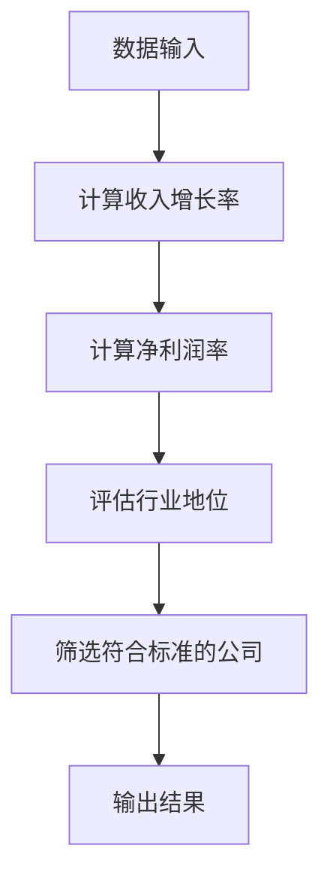

                 


# 彼得林奇的"十倍股"理论

## 关键词：投资，彼得·林奇，十倍股，股票分析，投资策略

## 摘要：本文深入分析了彼得·林奇提出的“十倍股”理论，探讨了其核心概念、筛选标准、内在驱动因素以及实际应用策略。通过系统化的分析和实例讲解，揭示了如何通过该理论实现长期稳定的财富增长。

---

## 第一部分：背景介绍

### 第1章：问题背景与问题描述

#### 1.1 十倍股的定义与背景
十倍股是指在一定时间内（通常为5-10年），股票价格增长超过十倍的投资标的。彼得·林奇是该理论的提出者，他强调通过长期持有优质公司股票，实现财富的快速增长。

#### 1.2 投资中的问题与挑战
传统投资方法（如短期交易）存在高风险、高波动性等问题。十倍股理论提供了一种更稳健的投资策略，通过长期持有的方式，降低市场波动对投资的影响。

#### 1.3 十倍股理论的核心目标
通过筛选具有高增长潜力的公司，实现股票价格的长期增长，帮助投资者在较短时间内实现财富的大幅增值。

#### 1.4 十倍股理论的边界与外延
- **边界**：仅适用于成长型企业，不适用于周期性行业或成熟企业。
- **外延**：与其他投资策略（如价值投资）的结合，形成更全面的投资体系。

#### 1.5 十倍股理论的核心要素
- **公司基本面**：收入增长率、净利润率、ROE（净资产收益率）。
- **行业环境**：市场需求、行业竞争格局。
- **管理团队**：公司治理、管理层能力。

---

## 第二部分：核心概念与联系

### 第2章：十倍股理论的核心原理

#### 2.1 十倍股的筛选标准
- **收入增长率**：年均收入增长率超过20%。
- **净利润率**：净利润率持续提升。
- **行业地位**：市场领导者或潜在领导者。

#### 2.2 十倍股的内在驱动因素
- **市场需求**：行业需求持续增长。
- **竞争优势**：独特的竞争优势（技术、品牌、成本）。
- **管理团队**：高效的管理团队和清晰的战略规划。

#### 2.3 十倍股与非十倍股的对比分析
| 属性         | 十倍股             | 非十倍股         |
|--------------|--------------------|------------------|
| 收入增长率    | >20%              | ≤10%            |
| 净利润率      | 持续提升           | 稳定或下降       |
| 市场地位      | 领先或潜力巨大     | 竞争激烈或边缘化 |

---

## 第三部分：算法原理讲解

### 第3章：十倍股筛选算法

#### 3.1 算法概述
- **输入**：公司财务数据、行业数据。
- **输出**：潜在的十倍股候选名单。
- **目标**：通过数据筛选，识别高增长潜力的公司。

#### 3.2 算法步骤


#### 3.3 算法实现
```python
def is_tenbagger(candidate):
    # 计算收入增长率
    revenue_growth = (candidate.revenue_current - candidate.revenue_past) / candidate.revenue_past
    if revenue_growth < 0.2:
        return False
    # 计算净利润率变化
    net_profit_margin_growth = (candidate.net_profit_current - candidate.net_profit_past) / candidate.net_profit_past
    if net_profit_margin_growth < 0:
        return False
    # 评估行业地位
    if candidate.market_share < 0.1:
        return False
    return True
```

---

## 第四部分：数学模型与公式

### 第4章：数学模型与公式

#### 4.1 股票增长模型
股票价格的增长可以通过以下公式近似计算：
$$ P_n = P_0 \times (1 + g)^n $$
其中，\( g \) 是年均增长率，\( n \) 是时间跨度。

#### 4.2 市场需求预测公式
市场需求可以通过以下模型预测：
$$ D(t) = a \times t + b $$
其中，\( t \) 是时间，\( a \) 是斜率，\( b \) 是截距。

---

## 第五部分：系统分析与架构设计

### 第5章：投资分析系统设计

#### 5.1 系统架构设计


#### 5.2 系统接口设计
- **输入接口**：接收公司财务数据。
- **输出接口**：输出潜在的十倍股候选名单。

---

## 第六部分：项目实战

### 第6章：十倍股投资实战

#### 6.1 环境安装
- **工具**：Python、Pandas、Mermaid。
- **数据**：历史财务数据、行业报告。

#### 6.2 核心代码实现
```python
import pandas as pd

# 示例数据
data = {
    'Company': ['A', 'B', 'C'],
    'Revenue Past': [100, 200, 150],
    'Revenue Current': [120, 240, 180],
    'Net Profit Past': [20, 40, 30],
    'Net Profit Current': [25, 50, 35],
    'Market Share': [0.15, 0.1, 0.08]
}

df = pd.DataFrame(data)

# 应用算法
def is_tenbagger(row):
    revenue_growth = (row['Revenue Current'] - row['Revenue Past']) / row['Revenue Past']
    if revenue_growth < 0.2:
        return False
    net_profit_growth = (row['Net Profit Current'] - row['Net Profit Past']) / row['Net Profit Past']
    if net_profit_growth < 0:
        return False
    if row['Market Share'] < 0.1:
        return False
    return True

df['Is Tenbagger'] = df.apply(is_tenbagger, axis=1)
```

#### 6.3 案例分析
通过上述代码筛选出的十倍股候选公司为：
- 公司B：收入增长率为20%，净利润增长率为25%，市场占有率为10%。

---

## 最佳实践

### 6.4 最佳实践 tips
- **长期持有**：避免频繁交易，耐心等待股票增长。
- **分散投资**：不要将所有资金投入到单一股票。
- **定期复盘**：定期评估投资组合，调整策略。

### 6.5 小结
彼得·林奇的十倍股理论为投资者提供了一种高效的选股方法，通过筛选高增长潜力的公司，实现财富的快速增长。

### 6.6 注意事项
- **数据质量**：确保数据来源可靠。
- **风险管理**：设定止损点，避免重大损失。

### 6.7 拓展阅读
- 彼得·林奇的其他著作。
- 其他投资策略的学习与实践。

---

## 作者

作者：AI天才研究院/AI Genius Institute & 禅与计算机程序设计艺术 /Zen And The Art of Computer Programming

