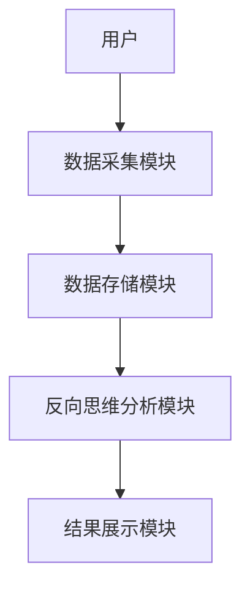

                 


# 彼得林奇的"反向思维"在央行政策解读中的应用

## 关键词：反向思维, 央行政策, 彼得林奇, 货币政策, 政策解读

## 摘要：  
本文探讨了彼得林奇提出的“反向思维”方法在央行政策解读中的应用。通过分析反向思维的核心原理、央行政策的核心要素，以及两者之间的联系，本文提出了一种基于反向思维的央行政策解读框架。文章详细介绍了反向思维在货币政策分析中的具体应用，结合实际案例，展示了如何通过反向思维来预测政策效果、评估政策目标的实现路径，并提出了基于反向思维的政策分析系统设计方案。本文旨在为政策解读者提供一种新的视角和工具，帮助其更好地理解复杂多变的央行政策。

---

## 第1章: 引言

### 1.1 反向思维的背景与重要性  
反向思维是一种通过从结果反推原因的思维方式，常用于投资、管理等领域。在金融领域，彼得林奇以其独特的反向思维方法闻名，他善于从市场的非共识中发现投资机会。将这种思维方式应用到央行政策解读中，可以帮助分析者更好地预测政策效果、理解政策制定者的意图，并在复杂多变的经济环境中做出更明智的决策。

### 1.2 央行政策的核心概念  
央行政策是国家货币政策的制定与实施，旨在通过调节货币供应量、利率等工具，实现经济增长、就业稳定、物价稳定等目标。本文将重点分析货币政策的制定过程、政策工具的使用以及政策效果的传导机制。

### 1.3 本章小结  
本章介绍了反向思维的背景与重要性，以及央行政策的核心概念，为后续分析奠定了基础。

---

## 第2章: 反向思维与央行政策的核心概念

### 2.1 反向思维的核心原理  
反向思维的核心在于从结果出发，逆向推导原因。例如，在投资领域，反向思维可以帮助投资者发现市场忽视的机会；在政策解读中，反向思维可以帮助分析者从政策效果推测政策目标。

#### 2.1.1 反向思维的逻辑框架  
- 从结果出发，寻找可能的原因。  
- 分析原因之间的关系，推导出可能的政策目标。  

#### 2.1.2 反向思维的优势  
- 能够发现市场或政策的非共识性机会。  
- 在复杂环境中提供新的视角。  

### 2.2 央行政策的核心要素  
#### 2.2.1 货币政策工具  
- 利率调整：通过调整基准利率影响市场利率。  
- 货币供应量调节：通过公开市场操作调节货币供给。  
- 其他工具：存款准备金率、货币政策信号等。  

#### 2.2.2 政策目标与效果  
- 维护价格稳定：控制通货膨胀或通货紧缩。  
- 促进经济增长：通过货币宽松刺激投资和消费。  
- 维护金融稳定：防范系统性金融风险。  

#### 2.2.3 政策的传导机制  
- 利率调整→影响企业融资成本→影响投资行为。  
- 货币供应量变化→影响信贷规模→影响经济活动。  

### 2.3 反向思维与央行政策的关系  
#### 2.3.1 反向思维如何帮助解读政策  
- 从政策效果推断政策目标。  
- 从市场反应推测政策力度。  

#### 2.3.2 反向思维在政策制定中的作用  
- 帮助政策制定者发现潜在风险。  
- 提供非共识性的政策建议。  

---

## 第3章: 反向思维在央行政策解读中的应用

### 3.1 反向思维的步骤与方法  
#### 3.1.1 确定政策目标  
- 通过政策工具的使用推测政策目标。  
- 例如：加息可能是为了抑制通货膨胀。  

#### 3.1.2 分析政策效果  
- 通过市场数据验证政策效果。  
- 例如：观察利率调整后的企业贷款变化。  

#### 3.1.3 推导政策意图  
- 结合政策目标和效果，推测政策制定者的意图。  
- 例如：连续降息可能是为了刺激经济增长。  

### 3.2 央行政策的反向思维分析  
#### 3.2.1 利率调整的反向思维分析  
- 高利率→抑制通胀→政策目标是控制通胀。  
- 低利率→刺激投资→政策目标是促进经济增长。  

#### 3.2.2 货币供应量变化的反向思维分析  
- 货币供应增加→信贷扩张→政策目标可能是刺激经济。  
- 货币供应减少→信贷收缩→政策目标可能是抑制通胀。  

### 3.3 反向思维与政策博弈  
#### 3.3.1 政策制定者与市场的博弈  
- 政策制定者通过反向思维制定政策，市场参与者通过反向思维解读政策。  
- 例如：市场预期政策会放松，导致提前投资。  

#### 3.3.2 政策的非对称信息问题  
- 政策制定者掌握更多信息，市场参与者通过反向思维推测政策。  
- 例如：央行宣布加息，市场可能已经预期到这一变化。  

---

## 第4章: 反向思维在央行政策解读中的数学模型

### 4.1 反向思维的数学表达  
假设政策效果为 $E$，政策工具为 $T$，政策目标为 $G$。反向思维可以通过以下步骤实现：  
1. 从 $E$ 推导可能的 $T$。  
2. 从 $T$ 推导可能的 $G$。  

### 4.2 央行政策的数学模型  
#### 4.2.1 利率调整模型  
$$ E = f(T) $$  
其中，$E$ 是政策效果，$T$ 是利率调整工具。  

#### 4.2.2 货币供应量模型  
$$ E = f(T) $$  
其中，$T$ 是货币供应量变化。  

### 4.3 反向思维的应用  
- 从 $E$ 推导 $T$，再从 $T$ 推导 $G$。  
- 例如：观察到通胀率上升（$E$），推测央行可能加息（$T$），目标是抑制通胀（$G$）。  

---

## 第5章: 反向思维在央行政策解读中的系统设计

### 5.1 系统功能设计  
- 数据采集：收集央行政策数据和市场数据。  
- 模型构建：建立反向思维分析模型。  
- 结果展示：输出政策目标和效果分析。  

### 5.2 系统架构设计  


### 5.3 系统接口设计  
- 数据接口：与央行数据库对接。  
- 用户接口：提供政策分析结果的可视化界面。  

---

## 第6章: 项目实战

### 6.1 环境安装  
- 数据来源：央行官方网站、经济数据库。  
- 工具：Python、数据分析库（如Pandas）、可视化库（如Matplotlib）。  

### 6.2 核心实现  
#### 6.2.1 数据采集  
```python
import pandas as pd
data = pd.read_csv('central_bank_policy.csv')
```

#### 6.2.2 模型实现  
```python
def reverse思维分析(data):
    # 从效果推导工具
    工具 = data['政策工具']
    # 从工具推导目标
    目标 = data['政策目标']
    return 目标
```

### 6.3 结果解读  
- 通过反向思维分析，得出政策目标与工具的关系。  
- 例如：观察到央行降低存款准备金率，推测政策目标可能是增加市场流动性。  

---

## 第7章: 总结与展望

### 7.1 本章总结  
本文通过分析反向思维的核心原理，探讨了其在央行政策解读中的应用。结合实际案例，提出了基于反向思维的政策分析框架，并设计了相应的系统架构。

### 7.2 未来展望  
未来的研究可以进一步结合大数据和人工智能技术，提高反向思维在政策解读中的精度和效率。

---

## 作者：AI天才研究院/AI Genius Institute & 禅与计算机程序设计艺术 /Zen And The Art of Computer Programming

