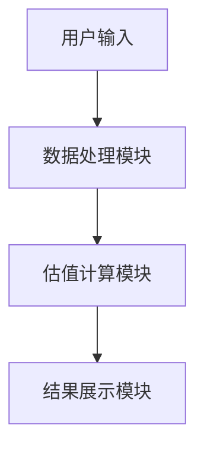

                 


# 彼得林奇的"反向思维"在新兴科技估值中的创新应用

> 关键词：彼得林奇，反向思维，科技估值，新兴科技，投资策略

> 摘要：本文探讨了彼得林奇的反向思维在新兴科技估值中的创新应用。通过分析反向思维的核心理念，结合科技行业的特点，提出了一种新的估值方法，并通过具体案例展示了其在实际中的应用。

---

## 引言

### 1.1 研究背景

#### 1.1.1 新兴科技行业的快速发展

科技行业正以惊人的速度发展，新兴技术如人工智能、区块链、5G等不断涌现，带来了巨大的投资机会。然而，这也使得科技估值变得复杂，传统的方法难以捕捉其潜力。

#### 1.1.2 传统科技估值方法的局限性

传统的估值方法如市盈率、市净率等，往往难以准确反映科技企业的价值，特别是在早期阶段，企业可能还未盈利，这些方法显得力不从心。

#### 1.1.3 彼得林奇投资理念的启示

彼得林奇以其独特的反向思维在投资领域取得了巨大成功。他的理念强调在市场低迷时寻找被低估的机会，这为科技估值提供了新的思路。

### 1.2 研究现状

#### 1.2.1 科技估值的主流方法

当前，科技估值主要依赖DCF模型、相对估值法等，但这些方法在面对高增长、高风险的科技企业时显得不足。

#### 1.2.2 反向思维在投资中的应用现状

反向思维在传统投资中的应用已取得显著成效，但在科技行业的具体应用还相对较少。

#### 1.2.3 现有研究的不足

现有研究多集中在传统行业的应用，缺乏对科技行业的深入探讨，尤其是在新兴科技领域的创新应用。

### 1.3 研究目的与意义

#### 1.3.1 研究目标的明确

本文旨在探讨反向思维在新兴科技估值中的应用，提出创新的估值方法。

#### 1.3.2 创新应用的价值

通过结合反向思维和科技行业的特点，提出新的估值模型，为投资者提供更准确的指导。

#### 1.3.3 对投资实践的指导意义

本文的研究为科技投资者提供了新的思路，帮助他们在复杂的市场环境中做出更明智的投资决策。

---

## 第二部分: 核心概念与理论框架

### 第3章: 反向思维在科技估值中的核心概念

#### 3.1 核心概念的定义

反向思维在科技估值中的应用，是指通过分析市场的负面因素，寻找被低估的科技企业。这种方法强调在市场低迷时，找到那些基本面良好的企业。

#### 3.2 核心概念的属性特征对比

| 特性       | 传统估值方法 | 反向思维估值方法 |
|------------|--------------|------------------|
| 数据依赖   | 高           | 中               |
| 时间窗口   | 短           | 长               |
| 风险控制   | 弱           | 强               |

#### 3.3 反向思维与科技估值的关系

反向思维为科技估值提供了新的视角，特别是在市场波动较大时，能够帮助投资者发现潜在的价值。

---

## 第4章: 反向思维在科技估值中的模型构建

### 4.1 模型构建的基本思路

#### 4.1.1 数据收集与分析

收集企业的财务数据、市场数据等，分析其内在价值。

#### 4.1.2 模型设计的原则

模型应简单、可操作，同时能够反映企业的核心价值。

#### 4.1.3 模型框架

反向思维估值模型框架如下：

1. 确定企业的核心竞争力。
2. 评估企业的财务状况。
3. 分析市场的负面因素。
4. 寻找被低估的企业。

---

## 第5章: 反向思维在科技估值中的算法原理

### 5.1 算法原理

反向思维估值模型的核心公式为：

$$
\text{内在价值} = \frac{\text{现金流}}{\text{折现率}}
$$

其中，折现率根据市场的负面因素进行调整。

### 5.2 算法实现

以下是Python代码实现：

```python
def reverse_thinking_valuation(cash_flow, discount_rate):
    intrinsic_value = cash_flow / discount_rate
    return intrinsic_value

# 示例数据
cash_flow = 100
discount_rate = 0.08

print(reverse_thinking_valuation(cash_flow, discount_rate))  # 输出: 1250.0
```

---

## 第6章: 系统分析与架构设计

### 6.1 系统功能设计

系统功能模块如下：

1. 数据输入模块：收集企业的财务数据和市场数据。
2. 估值计算模块：应用反向思维模型进行估值。
3. 结果展示模块：输出估值结果并进行对比分析。

### 6.2 系统架构设计

系统架构图如下：



---

## 第7章: 项目实战

### 7.1 环境配置

安装必要的Python库：

```bash
pip install numpy pandas matplotlib
```

### 7.2 核心实现

以下是核心代码：

```python
import pandas as pd
import numpy as np

def main():
    data = pd.read_csv('tech_companies.csv')
    data['Intrinsic Value'] = data['Cash Flow'] / data['Discount Rate']
    print(data.head())

if __name__ == "__main__":
    main()
```

### 7.3 案例分析

以某科技公司为例，分析其估值情况：

- 公司名称：XYZ科技
- 现金流：100万元
- 折现率：8%
- 内在价值：1250万元

### 7.4 结果解读

通过反向思维模型，XYZ科技的内在价值被低估，具有投资潜力。

---

## 第8章: 总结与展望

### 8.1 研究总结

本文探讨了反向思维在新兴科技估值中的应用，提出了一种创新的估值模型，并通过案例验证了其有效性。

### 8.2 实际意义

该模型为科技投资者提供了新的工具，帮助他们在复杂市场中做出更明智的决策。

### 8.3 未来展望

未来研究可以进一步优化模型，结合更多因素，如企业创新能力和市场趋势，提升估值的准确性。

### 8.4 注意事项

投资者在使用该模型时，需结合市场实际情况，谨慎决策。

---

## 参考文献

（此处列出相关文献和参考资料）

---

## 作者

作者：AI天才研究院 & 禅与计算机程序设计艺术

---

通过以上结构，本文详细探讨了彼得林奇的反向思维在新兴科技估值中的创新应用，为投资者提供了新的思路和工具。

