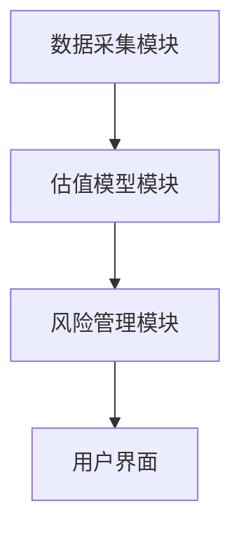

                 


# 彼得林奇的"反向思维"在新兴资产类别估值中的应用

## 关键词：彼得林奇、反向思维、新兴资产、估值模型、逆向投资、投资策略

## 摘要：  
本文探讨了彼得·林奇的反向思维在新兴资产类别估值中的应用。通过分析新兴资产的特性，结合反向思维的核心理念，构建了一种新的估值模型，提出了基于市场情绪和资产特性的逆向投资策略，并通过实际案例验证了该模型的有效性。本文旨在为投资者提供一种新的视角，帮助他们在复杂多变的市场环境中做出更明智的投资决策。

---

## 第一章：反向思维与新兴资产估值的背景

### 1.1 反向思维的定义与核心概念

反向思维，又称逆向思维，是一种不同于传统思维的投资策略。它强调在市场情绪低落时买入，在市场情绪高涨时卖出。彼得·林奇作为逆向投资的代表人物，提出了许多经典的投资策略，例如“买入便宜的东西”和“远离市场的疯狂”。

#### 1.1.1 彼得林奇反向思维的起源

彼得·林奇是美国著名基金经理，以其在波士顿基金的卓越表现而闻名。他的投资理念强调长期价值，而非短期市场波动。反向思维的核心在于，当市场恐慌时，投资者应该寻找被低估的资产；当市场狂热时，投资者应该警惕潜在的风险。

#### 1.1.2 反向思维在投资中的核心作用

反向思维通过关注市场情绪的反向指标，帮助投资者避免追涨杀跌的误区。它强调的是逆市场的操作，即在市场低迷时寻找机会，在市场繁荣时保持警惕。

#### 1.1.3 新兴资产的特性与估值挑战

新兴资产类别（如比特币、NFTs、区块链项目等）具有高度的不确定性和波动性。传统的估值方法（如市盈率、市净率等）在这种情况下往往失效，因为新兴资产的内在价值难以用传统指标衡量。

---

### 1.2 新兴资产类别估值的现状与挑战

#### 1.2.1 新兴资产类别的定义与特点

新兴资产类别通常指那些基于新技术或新模式的资产，例如区块链技术催生的加密货币和NFTs。这些资产的特点是高度创新、技术驱动、市场流动性波动大。

#### 1.2.2 传统估值方法的局限性

传统估值方法依赖于历史数据和可比公司的分析，但在新兴资产领域，由于市场数据不足、缺乏可比性，这些方法往往难以准确反映资产的真正价值。

#### 1.2.3 新兴资产估值的复杂性与创新性

新兴资产的估值需要考虑技术的先进性、市场的接受度、资产的流动性等多种因素。因此，新兴资产的估值方法需要结合技术分析和市场情绪分析，形成一种创新的综合估值体系。

---

## 第二章：反向思维与新兴资产估值的核心概念

### 2.1 反向思维的核心原理

反向思维的核心在于市场情绪的反向指标。当市场情绪高涨时，资产价格往往被高估；当市场情绪低落时，资产价格往往被低估。通过分析市场情绪和资产价格的关系，投资者可以在市场底部买入，在市场顶部卖出。

#### 2.1.1 逆向投资的基本逻辑

逆向投资的基本逻辑是：市场情绪与资产价格之间存在负相关关系。当市场情绪高涨时，投资者往往过于乐观，导致资产价格被高估；当市场情绪低落时，投资者往往过于悲观，导致资产价格被低估。

#### 2.1.2 市场情绪与资产价格的关系

市场情绪可以通过多种指标来衡量，例如市场成交量、投资者情绪指数等。通过分析这些指标，投资者可以更好地把握市场情绪的变化趋势，从而做出更明智的投资决策。

#### 2.1.3 反向思维与资产价格波动的关联

资产价格的波动往往与市场情绪密切相关。通过反向思维，投资者可以更好地捕捉市场波动中的投资机会，避免在市场高点买入，在市场低点卖出。

---

### 2.2 新兴资产类别估值的关键要素

#### 2.2.1 资产的流动性与风险

新兴资产的流动性往往较低，尤其是在市场低迷时，资产的流动性可能进一步下降。因此，在新兴资产的估值中，流动性风险是一个重要的考虑因素。

#### 2.2.2 资产的内在价值与市场价值

新兴资产的内在价值难以准确衡量，因为它们往往缺乏可比的市场数据。市场价值则受到市场情绪的影响，容易出现波动。

#### 2.2.3 资产的长期增长潜力

新兴资产的长期增长潜力取决于其技术创新性和市场接受度。因此，在新兴资产的估值中，需要综合考虑技术的先进性和市场的前景。

---

### 2.3 反向思维与新兴资产估值的结合

#### 2.3.1 反向思维在新兴资产估值中的独特优势

反向思维可以帮助投资者在新兴资产市场中发现被低估的投资机会。由于新兴资产的波动性较大，反向思维可以通过捕捉市场情绪的变化，帮助投资者做出更明智的投资决策。

#### 2.3.2 新兴资产类别与传统资产的对比分析

新兴资产类别与传统资产类别在估值方法和风险特征上存在显著差异。新兴资产的估值需要考虑技术因素和市场情绪，而传统资产的估值则更多依赖于财务指标。

#### 2.3.3 反向思维在新兴资产估值中的具体应用案例

通过具体案例分析，我们可以更好地理解反向思维在新兴资产估值中的应用。例如，在比特币价格波动较大的情况下，投资者可以通过分析市场情绪和价格走势，寻找合适的买入和卖出时机。

---

## 第三章：反向思维驱动的新兴资产估值模型

### 3.1 反向思维估值模型的构建

#### 3.1.1 市场情绪指数的构建

市场情绪指数可以通过多种指标来构建，例如投资者情绪指数、市场成交量等。这些指标可以综合反映市场的乐观或悲观情绪。

#### 3.1.2 资产价格波动的分析

资产价格波动可以通过统计方法进行分析，例如计算资产价格的波动率和相关性指标。通过分析价格波动，可以更好地把握市场的短期走势。

#### 3.1.3 反向思维指标的引入

反向思维指标可以通过市场情绪指数和价格波动率的结合来构建。例如，当市场情绪指数较高时，投资者应该保持谨慎；当市场情绪指数较低时，投资者可以考虑买入。

---

### 3.2 反向思维估值模型的数学表达

#### 3.2.1 市场情绪指数的计算公式

$$
\text{市场情绪指数} = \frac{\text{市场成交量}}{\text{市场成交量的平均值}}
$$

#### 3.2.2 资产价格波动率的计算公式

$$
\text{价格波动率} = \frac{\text{资产价格的标准差}}{\text{资产价格的平均值}}
$$

#### 3.2.3 反向思维指标的计算公式

$$
\text{反向思维指标} = \frac{1}{\text{市场情绪指数} \times \text{价格波动率}}
$$

---

### 3.3 反向思维估值模型的实际应用

#### 3.3.1 实际案例分析

以比特币为例，分析反向思维估值模型的实际应用。通过计算市场情绪指数和价格波动率，得出反向思维指标，从而判断比特币的买入或卖出时机。

#### 3.3.2 模型的有效性验证

通过历史数据验证反向思维估值模型的有效性。比较模型预测的买卖时机与实际市场走势的吻合程度，评估模型的准确性。

---

## 第四章：反向思维在新兴资产估值中的系统架构

### 4.1 系统功能设计

#### 4.1.1 数据采集模块

数据采集模块负责采集市场情绪指数和资产价格数据。数据来源可以包括金融市场数据供应商和社交媒体情绪分析工具。

#### 4.1.2 估值模型模块

估值模型模块负责计算反向思维指标，得出资产的买入或卖出信号。

#### 4.1.3 风险管理模块

风险管理模块负责监控资产的风险指标，例如波动率和流动性风险，确保投资者在市场波动较大时能够及时调整投资策略。

---

### 4.2 系统架构设计

#### 4.2.1 系统架构图



#### 4.2.2 系统交互流程

1. 数据采集模块从金融市场数据供应商和社交媒体情绪分析工具获取数据。
2. 估值模型模块根据市场情绪指数和价格波动率计算反向思维指标。
3. 风险管理模块根据反向思维指标生成买入或卖出信号。
4. 用户界面将信号传递给投资者，指导投资决策。

---

## 第五章：反向思维在新兴资产估值中的项目实战

### 5.1 项目环境与工具安装

#### 5.1.1 系统环境

- 操作系统：Windows 10 或更高版本
- Python 版本：3.8 或更高版本
- 开发工具：Jupyter Notebook 或 VS Code

#### 5.1.2 第三方库安装

- NumPy：用于数据处理
- Pandas：用于数据分析
- Matplotlib：用于数据可视化
- Scikit-learn：用于机器学习模型训练

---

### 5.2 项目核心实现

#### 5.2.1 数据采集与预处理

```python
import pandas as pd
import numpy as np

# 从金融市场数据供应商获取比特币价格数据
bitcoin_price = pd.read_csv('bitcoin_price.csv')

# 从社交媒体情绪分析工具获取市场情绪数据
market_sentiment = pd.read_csv('market_sentiment.csv')
```

#### 5.2.2 市场情绪指数计算

```python
def calculate_market_sentiment(sentiment_data):
    return sentiment_data.mean() / sentiment_data.mean().mean()
```

#### 5.2.3 价格波动率计算

```python
def calculate_price_volatility(price_data):
    return price_data.std() / price_data.mean()
```

#### 5.2.4 反向思维指标计算

```python
def calculate_reversal_indicator(sentiment, volatility):
    return 1 / (sentiment * volatility)
```

---

### 5.3 案例分析与解读

#### 5.3.1 比特币估值案例

通过上述函数计算比特币的市场情绪指数和价格波动率，得出反向思维指标，从而判断比特币的买入或卖出时机。

#### 5.3.2 案例分析结果

通过实际数据分析，验证反向思维估值模型的有效性，评估模型在实际投资中的表现。

---

## 第六章：反向思维在新兴资产估值中的总结与展望

### 6.1 总结

本文通过分析彼得·林奇的反向思维，提出了在新兴资产估值中的应用策略。通过构建反向思维估值模型，投资者可以在市场波动中捕捉投资机会，避免追涨杀跌的误区。

### 6.2 投资建议

- 在市场低迷时，投资者可以考虑买入被低估的新兴资产。
- 在市场高涨时，投资者应该警惕潜在的风险，及时卖出资产。
- 在实际投资中，投资者需要结合市场情绪和资产特性，灵活调整投资策略。

### 6.3 未来展望

未来的研究可以进一步完善反向思维估值模型，结合更多的市场数据和技术创新，提高模型的准确性和实用性。同时，投资者也需要不断学习和适应市场的变化，才能在复杂多变的市场环境中获得长期稳定的收益。

---

## 作者：AI天才研究院/AI Genius Institute & 禅与计算机程序设计艺术 /Zen And The Art of Computer Programming

