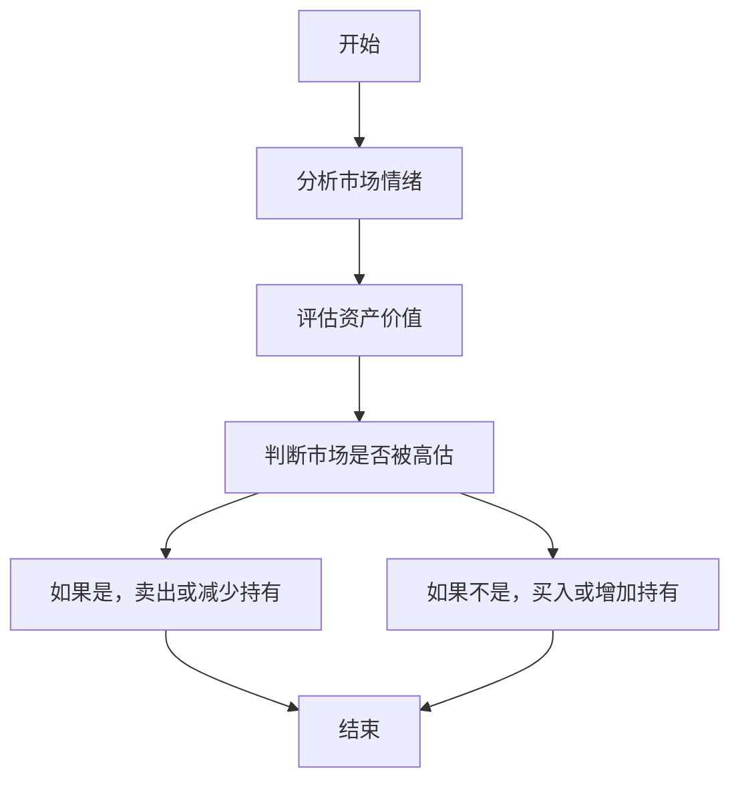

                 


# 彼得林奇的"反向思维"在牛市中的应用

> 关键词：彼得·林奇，反向思维，投资策略，牛市，风险管理

> 摘要：本文深入探讨了彼得·林奇的反向思维在牛市中的应用，分析了其投资理念的核心要素，结合实际案例和数学模型，详细阐述了如何在牛市中运用反向思维寻找投资机会、控制风险，并通过系统设计和项目实战提供可操作的策略。文章内容涵盖了从理论到实践的全过程，帮助投资者在复杂市场中做出明智决策。

---

## 第一部分：彼得林奇的反向思维概述

### 第1章：反向思维的基本概念

#### 1.1 投资的基本概念
- **投资的定义与分类**：投资是指将资金投入到特定资产中，以期获得收益的行为。常见的投资类型包括股票、债券、房地产和基金等。
- **反向思维的定义**：反向思维是指在市场普遍乐观时保持谨慎，在市场低迷时积极投资的策略。
- **反向思维在投资中的重要性**：在牛市中，反向思维可以帮助投资者避免盲目跟风，寻找被低估的机会。

#### 1.2 彼得·林奇的简介
- **彼得·林奇的生平**：彼得·林奇是美国著名投资家，曾任富达麦哲伦基金的经理，创造了卓越的投资业绩。
- **彼得·林奇的投资理念**：他主张长期投资，注重基本面分析，并在市场恐慌时寻找优质资产。
- **彼得·林奇的成功案例**：通过长期持有优质股票，他在职业生涯中取得了显著的超额收益。

---

### 第2章：反向思维的核心原理

#### 2.1 反向思维的理论基础
- **市场波动与投资者心理**：市场波动往往由投资者情绪驱动，而在市场情绪过于乐观时，反向思维尤为重要。
- **逆向投资的逻辑**：逆向投资的核心是寻找市场中的非共识机会，避免 crowd's wisdom 的陷阱。
- **市场情绪与投资决策的关系**：市场情绪可以通过分析新闻报道、社交媒体和投资者行为来评估。

#### 2.2 反向思维的核心要素
- **价值评估**：寻找具有持续盈利能力和良好财务状况的公司。
- **市场情绪分析**：通过分析市场情绪，判断市场的理性与非理性部分。
- **风险控制**：在投资组合中加入风险对冲工具，降低市场波动带来的影响。

---

### 第3章：反向思维在牛市中的应用

#### 3.1 牛市的特点与挑战
- **牛市的定义与特征**：牛市是指市场整体呈现上涨趋势，投资者情绪乐观。
- **牛市中的投资者行为**：投资者倾向于追涨杀跌，容易忽视风险。
- **牛市中的常见错误**：过度杠杆、盲目跟风和忽视基本面分析。

#### 3.2 反向思维的具体策略
- **寻找被低估的投资机会**：在牛市中，某些优质资产可能被市场忽视，提供投资机会。
- **抵制市场热潮**：避免参与市场热点，专注于长期价值。
- **长期持有的重要性**：通过长期持有优质资产，抵御短期市场波动。

---

### 第4章：彼得·林奇的反向思维策略

#### 4.1 林奇的选股方法
- **选股标准**：关注公司基本面，如盈利能力、财务健康和行业地位。
- **行业分析**：选择具有长期增长潜力的行业。
- **财务指标评估**：通过市盈率、市净率等指标评估股票的估值。

#### 4.2 林奇的投资组合管理
- **投资组合的构建**：分散投资，降低风险。
- **风险分散策略**：通过投资不同行业的股票，降低特定行业的风险。
- **定期调整与优化**：根据市场变化和公司基本面，定期调整投资组合。

---

### 第5章：反向思维的数学模型与算法

#### 5.1 投资决策的数学模型
- **预期收益计算公式**：预期收益 = 现金流量的加权平均值。
- **风险评估模型**：使用标准差衡量资产的风险。
- **投资组合优化算法**：通过均值-方差优化，找到最优投资组合。

#### 5.2 反向思维的算法


---

### 第6章：系统分析与架构设计

#### 6.1 投资决策系统
- **问题场景介绍**：设计一个基于反向思维的投资决策系统，帮助投资者在牛市中做出明智决策。
- **系统功能设计**：包括市场情绪分析、资产估值、投资组合优化等功能。
- **系统架构设计**：使用分层架构，包括数据层、业务逻辑层和用户界面层。
- **系统接口设计**：定义 API 接口，实现数据获取和分析功能。
- **系统交互序列图**：展示用户与系统之间的交互流程。

---

### 第7章：项目实战

#### 7.1 环境安装
- 安装 Python 和相关库（如 pandas、numpy、scipy）。

#### 7.2 核心实现源代码
```python
import pandas as pd
import numpy as np

def calculate_expected_return(cash_flows, discount_rate):
    return np.npv(discount_rate, cash_flows)

def assess_market_sentiment(ticker, news_data):
    positive_keywords = ['bull market', 'growth', 'profit']
    negative_keywords = ['bear market', 'loss', 'downgrade']
    positive_count = sum(1 for news in news_data if any(keyword in news for keyword in positive_keywords))
    negative_count = sum(1 for news in news_data if any(keyword in news for keyword in negative_keywords))
    sentiment_score = (positive_count - negative_count) / (positive_count + negative_count)
    return 'positive' if sentiment_score > 0 else 'negative'

# 示例用法
cash_flows = [100, 200, 300]
discount_rate = 0.05
expected_return = calculate_expected_return(cash_flows, discount_rate)
print(f"预期收益率：{expected_return}%")

news_data = ["Market shows growth", "Earnings up", "Stocks down"]
sentiment = assess_market_sentiment("AAPL", news_data)
print(f"市场情绪：{sentiment}")
```

---

### 第8章：最佳实践

#### 8.1 小结
- 反向思维是一种有效的投资策略，尤其在牛市中具有重要意义。
- 投资者应注重基本面分析，避免市场情绪的干扰。

#### 8.2 注意事项
- 风险控制是投资成功的关键。
- 需要持续学习和调整策略，以适应市场变化。

#### 8.3 拓展阅读
- 彼得·林奇的《投资任何股票的书》
- 投资学经典教材《证券分析》

---

作者：AI天才研究院 & 禅与计算机程序设计艺术

