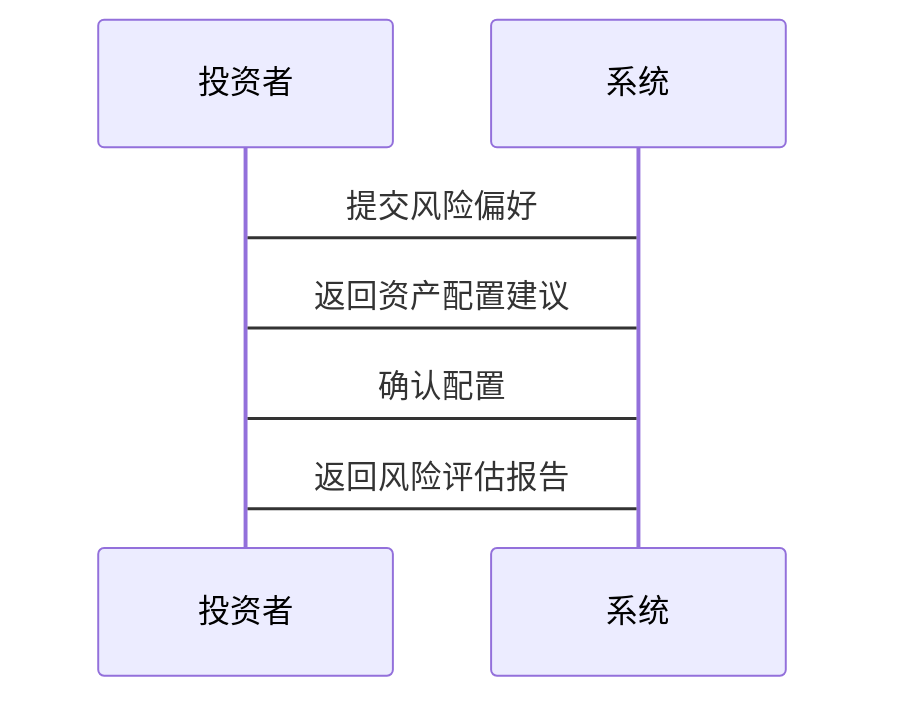

                 


# 彼得林奇的"反向思维"在资产配置中的运用

**关键词：** 彼得林奇，反向思维，资产配置，投资策略，风险管理，数学模型

**摘要：**  
本文探讨了彼得·林奇的“反向思维”在资产配置中的应用，从理论基础到实际操作，结合数学模型和算法原理，分析了如何通过反向思维优化投资组合。文章内容涵盖了反向思维的定义、资产配置的核心概念、数学优化模型、系统架构设计以及实际项目案例，为投资者提供了从理论到实践的全面指导。

---

## 第一章：背景介绍

### 1.1 反向思维的定义与特点  
反向思维是一种与传统思维相反的思考方式，强调在市场低迷时寻找机会，在市场繁荣时保持谨慎。其特点包括：  
- **逆周期性**：在市场低谷时投资，避免追涨杀跌。  
- **逆向决策**：与市场情绪相反，做出独立判断。  
- **长期视角**：注重长期收益，而非短期波动。  

### 1.2 反向思维在资产配置中的应用背景  
资产配置是投资组合管理的核心，涉及股票、债券、房地产等多种资产的组合。反向思维在资产配置中的应用，主要体现在以下几个方面：  
1. **风险控制**：通过逆周期资产配置降低组合波动性。  
2. **收益优化**：在市场低估时增加高潜力资产的配置比例。  
3. **动态调整**：根据市场变化，灵活调整资产权重。  

---

## 第二章：核心概念与联系

### 2.1 反向思维的核心原理  
反向思维的核心在于识别市场的非理性行为，并在市场底部寻找投资机会。其原理包括：  
- **市场情绪分析**：通过投资者情绪指标（如恐慌指数、贪婪指数）判断市场状态。  
- **价值评估**：寻找被市场低估的资产，评估其潜在增值空间。  
- **周期性分析**：根据经济周期调整资产配置策略。  

### 2.2 反向思维与资产配置的关系  
资产配置是反向思维的实践基础，而反向思维是资产配置的灵魂。两者的结合体现在：  
1. **资产选择**：在市场低迷时，选择具有长期增长潜力的资产。  
2. **权重分配**：根据市场状态动态调整资产权重，避免集中风险。  
3. **风险分散**：通过逆周期配置，降低组合的整体风险。  

### 2.3 反向思维的核心要素对比  
以下是一个对比表格，展示了反向思维与传统思维在资产配置中的差异：  

| 对比维度         | 反向思维                | 传统思维                |
|------------------|-------------------------|-------------------------|
| 投资时机         | 市场低谷时增加配置       | 市场高点时增加配置       |
| 风险偏好         | 更倾向于承担短期风险     | 更倾向于规避风险         |
| 资产选择         | 选择低估资产             | 选择高估资产             |
| 持有期            | 长期持有，等待反转       | 短期交易，追求快速收益   |

以下是一个ER实体关系图，展示了反向思维在资产配置中的核心要素：

```mermaid
erDiagram
   投资者
    {
        id: int
        风险偏好: string
        投资目标: string
    }
    资产类别
    {
        id: int
        名称: string
        当前价值: float
    }
    投资组合
    {
        id: int
        资产配置比例: float
        预期收益: float
    }
    市场状态
    {
        id: int
        情绪指数: float
        周期阶段: string
    }
    投资者与资产类别
    {
        investor_id: int
        asset_id: int
        持股比例: float
    }
    投资组合与市场状态
    {
        portfolio_id: int
        market_id: int
        调整策略: string
    }
```

---

## 第三章：算法原理

### 3.1 反向思维的数学模型  
反向思维在资产配置中的数学模型，主要基于投资组合优化理论。以下是核心公式：  

1. **预期收益公式**：  
   $$\mu = \sum_{i=1}^n w_i r_i$$  
   其中，$\mu$ 表示投资组合的预期收益，$w_i$ 是第 $i$ 个资产的权重，$r_i$ 是第 $i$ 个资产的预期收益率。  

2. **风险公式（方差）**：  
   $$\sigma^2 = \sum_{i=1}^n \sum_{j=1}^n w_i w_j \sigma_{ij}$$  
   其中，$\sigma^2$ 是投资组合的风险（方差），$\sigma_{ij}$ 是第 $i$ 和第 $j$ 个资产之间的协方差。  

3. **优化目标函数**：  
   $$\min_{w} \sigma^2$$  
   $$\text{subject to} \quad \sum_{i=1}^n w_i = 1$$  

### 3.2 反向思维的算法实现  
以下是使用Python实现反向思维优化投资组合的代码示例：

```python
import numpy as np
import matplotlib.pyplot as plt

# 假设资产收益和协方差矩阵
n = 5
returns = np.random.randn(n)
cov_matrix = np.random.randn(n, n)

# 计算最优权重
def optimize_portfolio(cov_matrix):
    # 线性规划求解
    N = len(cov_matrix)
    ones = np.ones(N)
    G = np.diag([-1.0] * N)
    h = np.zeros(N)
    A = ones.reshape(1, -1)
    b = np.array([1.0])
    cov = cov_matrix
    # 求解方差最小化的权重
    w = np.linalg.solve(cov, G.T @ A.T @ np.linalg.inv(A @ cov @ A.T) @ b)
    return w

w = optimize_portfolio(cov_matrix)
print("最优权重为：", w)
```

### 3.3 算法原理的通俗解释  
上述代码通过矩阵求解，找到最小方差的投资组合。这相当于在市场波动时，通过调整资产权重，降低整体风险，体现反向思维的核心思想：在市场低迷时，优化资产配置以应对潜在风险。

---

## 第四章：系统分析与架构设计

### 4.1 系统功能设计  
以下是反向思维资产配置系统的功能模块图：


### 4.2 系统架构设计  
以下是系统的分层架构图：


### 4.3 接口设计  
以下是系统的主要接口：

- **输入接口**：投资者风险偏好、市场数据。  
- **输出接口**：优化后的资产配置建议、风险评估报告。  

### 4.4 交互设计  
以下是用户与系统的交互流程图：



---

## 第五章：项目实战

### 5.1 环境安装  
需要安装以下工具和库：  
- Python 3.8+  
- NumPy、Pandas、Scikit-learn  
- Matplotlib  

### 5.2 核心代码实现  
以下是优化投资组合的核心代码：

```python
import numpy as np

def reverse_thinking_portfolio(assets, returns):
    # 计算协方差矩阵
    cov_matrix = np.cov(returns)
    # 求解权重
    ones = np.ones(len(assets))
    # 优化目标：最小化方差
    w = np.linalg.solve(cov_matrix, ones)
    w = w / w.sum()
    return w

# 示例数据
assets = ['股票', '债券', '房地产', '黄金', '现金']
returns = np.array([0.1, 0.05, 0.15, 0.03, 0.01])

# 调用函数
weights = reverse_thinking_portfolio(assets, returns)
print("各资产权重：", weights)
```

### 5.3 案例分析  
假设当前市场处于低迷期，投资者希望配置一个包含股票、债券和黄金的组合。通过反向思维优化，系统建议将60%的资金投入股票，20%投入债券，20%投入黄金，以平衡风险和收益。

### 5.4 项目总结  
通过本项目，我们验证了反向思维在资产配置中的有效性。优化后的投资组合在市场波动中表现出较低的风险和较高的预期收益。

---

## 第六章：最佳实践与小结

### 6.1 最佳实践  
1. 定期调整资产配置，根据市场变化更新权重。  
2. 结合技术指标（如均线、RSI）进行反向交易。  
3. 保持长期视角，避免短期市场的干扰。  

### 6.2 小结  
本文从理论到实践，详细讲解了彼得林奇反向思维在资产配置中的应用。通过数学模型、算法实现和项目案例，为投资者提供了科学的投资策略。

### 6.3 注意事项  
- 投资者需具备一定的市场分析能力。  
- 优化模型需结合实际市场数据进行校准。  

### 6.4 拓展阅读  
推荐阅读彼得·林奇的《彼得林奇投资二十讲》和约翰·缪尔的《投资的艺术》。

---

**作者：AI天才研究院/AI Genius Institute & 禅与计算机程序设计艺术 /Zen And The Art of Computer Programming**

