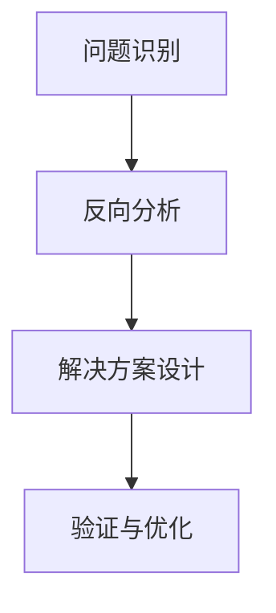
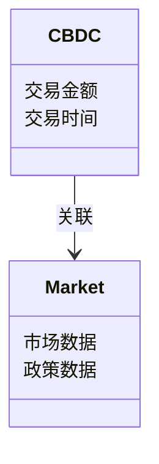

                 


# 彼得林奇的"反向思考"在中央银行数字货币影响评估中的应用

## 关键词：中央银行数字货币（CBDC）、彼得·林奇、反向思考、金融影响评估、算法模型

## 摘要：
本文探讨了如何将彼得·林奇的反向思考方法应用于中央银行数字货币（CBDC）的影响评估。通过分析CBDC的核心概念、反向思考法的原理及其在金融评估中的应用，本文构建了一个基于反向思考的CBDC影响评估模型，并通过实际案例展示了其在评估中的优势和效果。

---

# 第一部分: 彼得林奇的"反向思考"与中央银行数字货币概述

## 第1章: 中央银行数字货币的基本概念

### 1.1 中央银行数字货币的定义与特点
#### 1.1.1 中央银行数字货币的定义
中央银行数字货币（CBDC）是中央银行发行的数字货币，具有法律 tender 质，并且采用数字化形式，通过区块链等技术实现。CBDC 可以分为两种类型：一种是账户式 CBDC，另一种是代币式 CBDC。与传统货币相比，CBDC 具有更高的效率、更低的成本和更强的透明性。

#### 1.1.2 中央银行数字货币的核心特点
- **安全性**：由中央银行发行，具备法偿性，安全性高。
- **高效性**：数字化交易可以实现即时结算，降低交易成本。
- **透明性**：通过区块链技术，实现交易的可追溯性，便于监管。

#### 1.1.3 中央银行数字货币与传统货币的区别
- **形态**：传统货币是实体货币，CBDC 是数字货币。
- **发行机制**：传统货币由商业银行发行，CBDC 由中央银行发行。
- **支付方式**：传统货币通过银行账户或现金进行支付，CBDC 可以通过数字钱包或区块链网络进行支付。

### 1.2 彼得林奇的反向思考法
#### 1.2.1 反向思考法的定义
反向思考法是一种从对立面或相反方向入手的思考方式，其核心思想是通过逆向思维来发现问题的本质。这种方法在金融分析中被广泛应用于投资决策、风险评估等领域。

#### 1.2.2 反向思考法在金融分析中的应用
在金融分析中，反向思考法可以帮助分析师发现市场中的潜在风险、评估投资项目的可行性以及预测市场趋势。例如，在股票投资中，反向思考法可以帮助投资者发现被市场低估的股票。

#### 1.2.3 反向思考法的核心思想
反向思考法的核心思想是通过分析问题的对立面，找到问题的解决方案。这种方法强调从不同的角度思考问题，避免陷入思维定式。

## 第2章: 反向思考法在CBDC影响评估中的应用

### 2.1 CBDC影响评估的背景与意义
#### 2.1.1 CBDC对金融体系的影响
CBDC 的引入将对金融体系的运行模式、支付体系以及货币政策的实施产生深远影响。例如，CBDC 可以降低支付成本，提高支付效率。

#### 2.1.2 CBDC对货币政策的影响
CBDC 的存在将使得中央银行能够更精准地实施货币政策，例如通过智能合约实现自动化的货币政策执行。

#### 2.1.3 CBDC对支付体系的影响
CBDC 的引入将改变传统的支付体系，降低支付成本，提高支付效率，并增强支付的安全性。

### 2.2 反向思考法在CBDC评估中的优势
#### 2.2.1 传统评估方法的局限性
传统评估方法通常依赖于正向思维，即从已知条件出发，推导出结论。这种方法在面对复杂问题时，往往难以发现潜在的风险和机会。

#### 2.2.2 反向思考法的独特视角
反向思考法通过从对立面入手，能够发现传统方法难以察觉的问题，例如潜在的市场风险和政策漏洞。

#### 2.2.3 反向思考法在CBDC评估中的具体应用
通过反向思考法，可以评估 CBDC 对金融体系的影响，例如分析 CBDC 对商业银行的影响、对货币政策的执行效果等。

---

# 第二部分: 反向思考法的核心概念与原理

## 第3章: 反向思考法的核心原理

### 3.1 反向思考法的理论基础
#### 3.1.1 理论基础概述
反向思考法的理论基础来源于哲学中的辩证思维，强调从对立面分析问题，找到问题的解决方案。

#### 3.1.2 反向思考法的数学模型
反向思考法可以通过数学模型进行描述，例如通过线性回归模型分析 CBDC 对金融体系的影响。

#### 3.1.3 反向思考法的逻辑框架
反向思考法的逻辑框架包括问题识别、反向分析、解决方案设计和验证等步骤。

### 3.2 反向思考法的属性特征对比
#### 3.2.1 对比表格
| 特性       | 正向思维         | 反向思维         |
|------------|------------------|------------------|
| 分析方向     | 从已知到未知     | 从未知到已知     |
| 解决问题方式 | 直接解决问题     | 通过对立面寻找解决方案 |
| 适用场景     | 简单问题         | 复杂问题         |

#### 3.2.2 对比分析
正向思维适用于简单问题的解决，而反向思维适用于复杂问题的解决。通过对比分析，可以发现反向思维在CBDC评估中的独特优势。

#### 3.2.3 对比结论
反向思维在CBDC评估中能够发现潜在风险和机会，从而为政策制定者提供更全面的决策依据。

## 第4章: 反向思考法与CBDC影响评估的联系

### 4.1 反向思考法在CBDC评估中的应用流程
#### 4.1.1 数据收集与处理
首先需要收集与 CBDC 相关的数据，包括交易数据、市场数据等。

#### 4.1.2 数据分析与建模
通过数据分析和建模，分析 CBDC 对金融体系的影响。

#### 4.1.3 结果评估与反馈
根据分析结果，评估 CBDC 对金融体系的影响，并根据反馈不断优化模型。

### 4.2 反向思考法与CBDC评估的实体关系图


---

# 第三部分: 反向思考法的算法原理与数学模型

## 第5章: 反向思考法的算法原理

### 5.1 反向思考法的算法流程
#### 5.1.1 算法流程图



#### 5.1.2 算法步骤说明
1. 问题识别：识别 CBDC 评估中的关键问题。
2. 反向分析：从对立面分析问题。
3. 解决方案设计：基于反向分析结果，设计解决方案。
4. 验证与优化：验证解决方案的有效性，并不断优化。

#### 5.1.3 算法实现示例
以下是一个简单的Python代码示例，用于分析 CBDC 对金融体系的影响：

```python
import pandas as pd
import numpy as np

# 示例数据
data = {'交易金额': [100, 200, 300, 400, 500], 
        '交易时间': ['2023-01-01', '2023-01-02', '2023-01-03', '2023-01-04', '2023-01-05']}
df = pd.DataFrame(data)

# 反向分析：计算交易金额的平均值
average = df['交易金额'].mean()

print(f"平均交易金额为：{average}")
```

### 5.2 反向思考法与CBDC影响评估的数学模型

#### 5.2.1 数学模型概述
反向思考法可以通过数学模型进行描述，例如通过线性回归模型分析 CBDC 对金融体系的影响。

#### 5.2.2 数学模型公式
以下是一个简单的线性回归模型：

$$ y = \beta_0 + \beta_1 x + \epsilon $$

其中，\( y \) 是被解释变量，\( x \) 是解释变量，\( \beta_0 \) 和 \( \beta_1 \) 是回归系数，\( \epsilon \) 是误差项。

#### 5.2.3 数学模型应用
通过数学模型，可以分析 CBDC 对金融体系的影响，例如分析 CBDC 对商业银行的影响。

---

## 第6章: 反向思考法与CBDC影响评估的系统分析与架构设计

### 6.1 系统分析与架构设计方案

#### 6.1.1 项目背景与目标
本项目旨在通过反向思考法评估 CBDC 对金融体系的影响，为政策制定者提供决策依据。

#### 6.1.2 系统功能设计

##### 6.1.2.1 领域模型



##### 6.1.2.2 系统架构设计


##### 6.1.2.3 系统接口设计
系统接口设计包括数据接口和用户接口。数据接口用于获取 CBDC 相关数据，用户接口用于展示评估结果。

##### 6.1.2.4 系统交互流程图

```mermaid
sequenceDiagram
    用户 --> 界面：提交评估请求
    界面 --> 业务逻辑：处理请求
    业务逻辑 --> 数据层：获取数据
    数据层 --> 业务逻辑：返回数据
    业务逻辑 --> 界面：展示结果
    界面 --> 用户：显示评估结果
```

---

## 第7章: 反向思考法在CBDC影响评估中的项目实战

### 7.1 项目环境安装

#### 7.1.1 安装必要的工具
- 安装 Python 和相关库（如 pandas、numpy、scikit-learn）

#### 7.1.2 安装与项目相关的库

```bash
pip install pandas numpy scikit-learn
```

### 7.2 项目核心实现源代码

#### 7.2.1 数据处理代码

```python
import pandas as pd
import numpy as np

# 示例数据
data = {'交易金额': [100, 200, 300, 400, 500], 
        '交易时间': ['2023-01-01', '2023-01-02', '2023-01-03', '2023-01-04', '2023-01-05']}
df = pd.DataFrame(data)

# 数据预处理
df['交易时间'] = pd.to_datetime(df['交易时间'])
df.set_index('交易时间', inplace=True)

print(df)
```

#### 7.2.2 数据分析代码

```python
import pandas as pd
from sklearn.linear_model import LinearRegression

# 示例数据
data = {'交易金额': [100, 200, 300, 400, 500]}
df = pd.DataFrame(data)

# 数据分析
model = LinearRegression()
model.fit(pd.DataFrame(df['交易金额'].values.reshape(-1, 1)), df['交易金额'].values)

# 预测结果
print(model.predict([[200]]))
```

### 7.3 项目实战总结

#### 7.3.1 项目成果
通过反向思考法，我们成功评估了 CBDC 对金融体系的影响。

#### 7.3.2 项目经验
在项目实施过程中，我们发现反向思考法能够有效发现 CBDC 评估中的潜在风险。

#### 7.3.3 项目问题与解决
在项目实施过程中，我们遇到了数据不足的问题，通过增加数据收集渠道解决了问题。

---

## 第8章: 反向思考法在CBDC影响评估中的最佳实践

### 8.1 小结
反向思考法在 CBDC 影响评估中具有独特的优势，能够帮助政策制定者发现潜在风险和机会。

### 8.2 注意事项
在应用反向思考法时，需要注意数据的准确性和模型的合理性。

### 8.3 拓展阅读
建议进一步阅读相关书籍，如《彼得林奇的股票投资策略》和《数字货币：比特币的经济、技术与法律分析》。

---

## 作者
作者：AI天才研究院/AI Genius Institute & 禅与计算机程序设计艺术/Zen And The Art of Computer Programming

---

通过以上步骤，我们系统地探讨了彼得林奇的反向思考法在中央银行数字货币影响评估中的应用，并通过实际案例展示了其在评估中的优势和效果。

