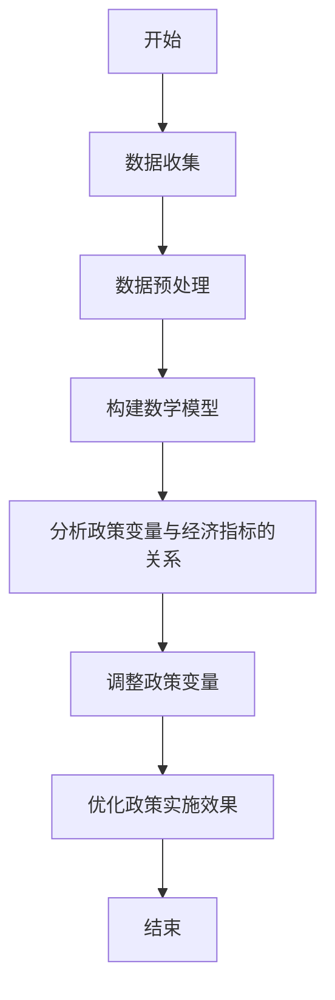

                 


# 彼得林奇的"反向思考"在央行数字货币政策影响评估中的应用

> 关键词：数字货币政策，反向思考，央行政策，经济影响，评估模型

> 摘要：本文探讨了彼得林奇的“反向思考”方法在央行数字货币政策影响评估中的应用，通过系统分析和实际案例，揭示了反向思考如何帮助评估数字货币政策的效果，优化政策实施策略，并降低潜在风险。文章从背景介绍、核心概念、算法原理、数学模型、系统架构、项目实战等多个维度展开，全面解析了反向思考在货币政策评估中的应用价值和实现路径。

---

## 第一部分：背景介绍

### 第1章：数字货币政策的背景与影响

#### 1.1 数字货币政策的定义与核心要素

- **1.1.1 数字货币政策的定义**
  数字货币政策是指央行通过数字化工具和技术手段，对货币供应量、利率、金融资产价格等经济变量进行调节的政策。与传统货币政策相比，数字货币政策更加精准、快速，并且可以通过算法和数据驱动的方式实现自动化调节。

- **1.1.2 数字货币政策的核心要素**
  - 货币数字化：包括数字货币的发行、流通和管理。
  - 技术支持：依赖区块链、人工智能、大数据等技术实现货币政策的精准实施。
  - 政策目标：稳定物价、促进就业、保持经济增长和维护金融稳定。

- **1.1.3 数字货币政策的实施背景**
  随着数字经济的快速发展，传统货币政策在应对复杂经济环境时显得力不从力。数字货币政策的出现，为央行提供了更灵活和高效的政策工具，尤其是在应对金融危机和经济波动时具有重要意义。

#### 1.2 彼得林奇反向思考的定义与特点

- **1.2.1 反向思考的定义**
  反向思考是一种思维方式，通过从结果推导原因，或者从对立面思考问题，寻找解决问题的新思路。彼得林奇在投资领域中，常用反向思考来寻找被市场低估的投资机会。

- **1.2.2 反向思考的特点**
  - **逆向性**：从结果出发，寻找原因。
  - **独特性**：与传统正向思考不同，反向思考能够发现隐藏的机会和风险。
  - **灵活性**：适用于复杂问题的解决，尤其是在传统方法失效时。

- **1.2.3 反向思考与传统思考方式的对比**
  传统思考方式通常是基于已有的知识和经验，按照逻辑推理解决问题。而反向思考则通过打破常规思维，寻找新的解决方案，尤其适用于应对复杂和不确定的环境。

---

### 第2章：数字货币政策评估的必要性

#### 2.1 数字货币政策对经济的影响

- **2.1.1 数字货币政策对经济的直接影响**
  - 通过调节货币供应量和利率，影响企业和个人的借贷成本，进而影响投资和消费行为。
  - 数字货币政策能够更精准地控制通货膨胀和通货紧缩的风险。

- **2.1.2 数字货币政策对经济的间接影响**
  - 影响金融市场参与者的行为，尤其是金融机构和投资者的资产配置决策。
  - 通过影响资产价格，改变市场的资源配置效率。

- **2.1.3 数字货币政策的双重性**
  数字货币政策在实现政策目标的同时，也可能带来新的风险，例如技术风险、数据安全风险和市场波动风险。

#### 2.2 彼得林奇反向思考在货币政策评估中的作用

- **2.2.1 反向思考在货币政策评估中的独特优势**
  反向思考能够帮助政策制定者从不同的角度审视政策的潜在影响，尤其是在政策效果不明确时，通过反向思考可以提前识别风险。

- **2.2.2 反向思考如何帮助识别政策风险**
  通过分析政策实施后的潜在结果，反向思考可以帮助政策制定者预测政策可能带来的负面效果，并提前制定应对措施。

- **2.2.3 反向思考如何优化政策实施效果**
  反向思考能够帮助政策制定者从对立面思考问题，从而找到更优的政策组合，提升政策实施的效果。

---

## 第二部分：反向思考在数字货币政策评估中的应用原理

### 第3章：反向思考的核心概念与数学模型

#### 3.1 反向思考的核心概念

- **3.1.1 反向思考的逻辑框架**
  反向思考的核心在于“从结果出发”，通过分析结果的原因，找到解决问题的关键。在数字货币政策评估中，反向思考可以帮助政策制定者预测政策实施后的效果，并根据结果调整政策。

- **3.1.2 反向思考的数学表达**
  反向思考可以通过数学模型来表达。例如，假设政策效果 $E$ 与政策变量 $P$ 之间的关系为 $E = f(P)$，那么反向思考可以通过分析 $E$ 的变化，推导出 $P$ 的调整方向。

- **3.1.3 反向思考与货币政策评估的结合**
  在数字货币政策评估中，反向思考可以用于分析政策实施后的经济指标变化，例如通货膨胀率、失业率、GDP增长率等。通过分析这些指标的变化，反向思考可以帮助政策制定者找到最优的政策组合。

#### 3.2 反向思考的数学模型

- **3.2.1 模型的基本假设**
  - 数字货币政策的效果可以通过经济指标的变化来衡量。
  - 政策变量与经济指标之间存在一定的因果关系。

- **3.2.2 模型的输入变量与输出变量**
  - 输入变量：政策变量（如货币供应量、利率等）。
  - 输出变量：经济指标（如通货膨胀率、GDP增长率等）。

- **3.2.3 模型的数学公式**
  $$ E = \beta P + \epsilon $$
  其中，$E$ 是政策效果，$\beta$ 是政策变量的系数，$P$ 是政策变量，$\epsilon$ 是误差项。

---

### 第4章：反向思考在货币政策评估中的算法原理

#### 4.1 反向思考算法的步骤

- **4.1.1 数据收集与预处理**
  - 数据收集：收集与数字货币政策相关的经济指标数据，例如通货膨胀率、GDP增长率、 unemployment rate 等。
  - 数据预处理：对数据进行清洗、标准化和特征提取。

- **4.1.2 算法的逻辑流程**
  1. 确定政策变量和经济指标之间的关系。
  2. 构建数学模型，描述政策变量对经济指标的影响。
  3. 通过反向思考，分析政策变量的变化对经济指标的影响。
  4. 根据分析结果，调整政策变量，优化政策实施效果。

- **4.1.3 算法的实现步骤**
  1. 收集和整理相关数据。
  2. 构建数学模型，描述政策变量与经济指标之间的关系。
  3. 使用反向思考，分析政策变量对经济指标的影响。
  4. 根据分析结果，调整政策变量，优化政策实施效果。

#### 4.2 反向思考算法的流程图



---

### 第5章：货币政策评估的系统架构与设计

#### 5.1 系统功能设计

- **5.1.1 系统功能模块划分**
  - 数据采集模块：负责收集与数字货币政策相关的经济指标数据。
  - 数据处理模块：对数据进行清洗、标准化和特征提取。
  - 模型构建模块：构建数学模型，描述政策变量与经济指标之间的关系。
  - 反向思考分析模块：通过反向思考，分析政策变量对经济指标的影响。
  - 政策优化模块：根据分析结果，调整政策变量，优化政策实施效果。

- **5.1.2 模块之间的关系**
  数据采集模块向数据处理模块提供原始数据，数据处理模块向模型构建模块提供处理后的数据，模型构建模块向反向思考分析模块提供数学模型，反向思考分析模块向政策优化模块提供分析结果。

- **5.1.3 系统功能的实现方式**
  - 数据采集模块可以通过API接口获取实时数据。
  - 数据处理模块可以使用Python的Pandas库进行数据清洗和处理。
  - 模型构建模块可以使用统计学方法或机器学习算法构建数学模型。
  - 反向思考分析模块可以通过分析模型结果，生成政策优化建议。

#### 5.2 系统架构设计

- **5.2.1 系统架构图**
  ```mermaid
  graph TD
    A[数据采集模块] --> B[数据处理模块]
    B --> C[模型构建模块]
    C --> D[反向思考分析模块]
    D --> E[政策优化模块]
  ```

- **5.2.2 系统接口设计**
  - 数据采集模块提供API接口，供其他模块调用。
  - 数据处理模块提供数据处理接口，供模型构建模块调用。
  - 反向思考分析模块提供分析接口，供政策优化模块调用。

- **5.2.3 系统交互流程**
  1. 数据采集模块通过API接口获取实时数据。
  2. 数据处理模块对数据进行清洗、标准化和特征提取。
  3. 模型构建模块使用处理后的数据，构建数学模型。
  4. 反向思考分析模块通过分析模型结果，生成政策优化建议。
  5. 政策优化模块根据分析结果，调整政策变量，优化政策实施效果。

---

## 第三部分：项目实战与总结

### 第6章：项目实战

#### 6.1 环境安装与配置

- **6.1.1 环境需求**
  - 操作系统：Windows 10 或更高版本，或 macOS 10.15 或更高版本。
  - Python：Python 3.8 或更高版本。
  - 第三方库：Pandas、NumPy、Scikit-learn。

- **6.1.2 安装步骤**
  ```bash
  pip install pandas numpy scikit-learn
  ```

#### 6.2 系统核心实现源代码

- **6.2.1 数据采集与处理代码**
  ```python
  import pandas as pd
  import requests

  # 数据采集
  def fetch_data(api_url):
      response = requests.get(api_url)
      return response.json()

  # 数据处理
  def preprocess_data(data):
      df = pd.DataFrame(data)
      df = df.dropna()
      df = df.drop_duplicates()
      return df

  if __name__ == "__main__":
      data = fetch_data("https://example.com/api/economic_indicators")
      df = preprocess_data(data)
      print(df.head())
  ```

- **6.2.2 数学模型构建代码**
  ```python
  from sklearn.linear_model import LinearRegression

  def build_model(X, y):
      model = LinearRegression()
      model.fit(X, y)
      return model

  # 示例数据
  X = df[['通货膨胀率', 'GDP增长率']]
  y = df['失业率']
  model = build_model(X, y)
  print(model.coef_)
  ```

- **6.2.3 反向思考分析代码**
  ```python
  def reverse_think_analysis(model, target_effect):
      # 假设目标效果为 target_effect
      # 反向思考：分析政策变量如何调整才能达到目标效果
      pass

  # 示例分析
  target_effect = 5
  reverse_think_analysis(model, target_effect)
  ```

#### 6.3 代码应用解读与分析

- **6.3.1 代码功能解读**
  - 数据采集代码：通过API接口获取经济指标数据。
  - 数据处理代码：对数据进行清洗和去重。
  - 数学模型构建代码：使用线性回归模型描述政策变量与经济指标之间的关系。
  - 反向思考分析代码：通过反向思考，分析政策变量如何调整才能达到目标效果。

- **6.3.2 代码实现细节**
  - 数据采集模块：通过requests库调用API接口获取数据。
  - 数据处理模块：使用Pandas库对数据进行清洗和去重。
  - 数学模型构建模块：使用Scikit-learn库中的线性回归模型构建数学模型。
  - 反向思考分析模块：通过分析模型结果，生成政策优化建议。

#### 6.4 实际案例分析

- **6.4.1 案例背景**
  假设某国实施了一项数字货币政策，旨在通过调整货币供应量来控制通货膨胀率。

- **6.4.2 数据分析**
  数据显示，通货膨胀率在政策实施后有所下降，但失业率却有所上升。

- **6.4.3 反向思考分析**
  通过反向思考，发现政策实施过程中，货币供应量的调整过于激进，导致市场参与者信心下降，进而影响了就业市场。

- **6.4.4 政策优化建议**
  根据反向思考分析结果，建议调整货币供应量的调整幅度，避免过度紧缩，以平衡通货膨胀率和失业率之间的关系。

#### 6.5 项目小结

- **6.5.1 项目总结**
  通过反向思考，我们能够更有效地评估数字货币政策的效果，并优化政策实施策略。

- **6.5.2 项目收获**
  - 学习了如何将反向思考应用于货币政策评估。
  - 掌握了数字货币政策实施的全过程，包括数据采集、模型构建和政策优化。

---

## 第四部分：总结与展望

### 第7章：总结

#### 7.1 最佳实践 tips

- 在数字货币政策评估中，反向思考可以帮助政策制定者提前识别风险，优化政策实施效果。
- 数据的准确性和完整性是反向思考分析的基础，因此在数据采集和处理阶段需要特别注意。
- 数学模型的选择和构建需要结合实际情况，确保模型能够准确反映政策变量与经济指标之间的关系。

#### 7.2 小结

- 本文通过系统分析和实际案例，揭示了反向思考在央行数字货币政策影响评估中的应用价值。
- 反向思考可以帮助政策制定者从不同的角度审视政策的潜在影响，尤其是在复杂和不确定的经济环境下，具有重要的现实意义。

#### 7.3 注意事项

- 在实际应用中，需要综合考虑多种因素，包括经济环境、政策目标和市场参与者的行为。
- 数字货币政策的实施需要依托先进的技术支持，确保政策的精准性和有效性。

#### 7.4 拓展阅读

- 建议进一步研究反向思考在其他经济政策中的应用，例如财政政策、贸易政策等。
- 可以结合人工智能技术，开发更加智能化的政策评估系统，提升政策实施的效果。

---

## 作者

作者：AI天才研究院/AI Genius Institute & 禅与计算机程序设计艺术 /Zen And The Art of Computer Programming

---

以上是《彼得林奇的"反向思考"在央行数字货币政策影响评估中的应用》的技术博客文章的完整目录和内容结构。希望这篇文章能够为读者提供清晰的思路和实用的指导，帮助他们在实际工作中更好地应用反向思考方法，优化数字货币政策的实施效果。

