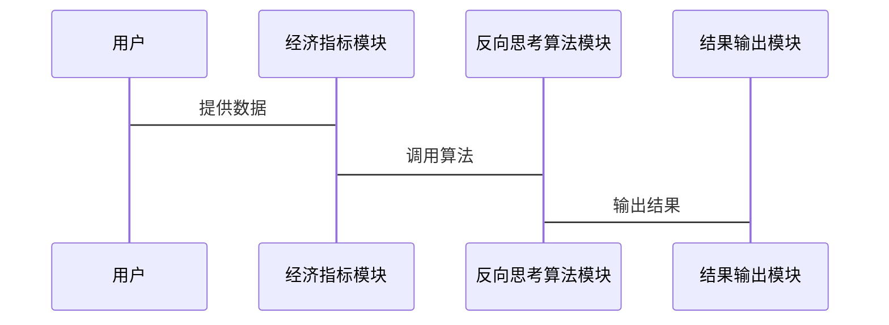

                 


# 彼得林奇的"反向思考"在宏观经济分析中的应用

> 关键词：宏观经济分析，彼得林奇，反向思考，投资理论，经济预测

> 摘要：本文深入探讨了彼得林奇的反向思考方法在宏观经济分析中的应用，通过理论分析、算法实现和实际案例，展示了如何利用反向思维提高经济预测的准确性。文章结合技术博客的专业性，使用清晰的逻辑结构和丰富的图表，为读者提供了深入的见解和实用的指导。

---

## 第一部分: 引言

### 第1章: 宏观经济分析与彼得林奇的反向思考

#### 1.1 宏观经济分析的重要性
##### 1.1.1 宏观经济分析的基本概念
宏观经济分析是指对整体经济体系的运行状况进行研究，包括GDP、失业率、通胀率等关键指标。这些指标能够帮助我们理解经济的健康状况和发展趋势。

##### 1.1.2 宏观经济分析的现状与挑战
随着全球经济的复杂化，传统分析方法在面对非线性关系和突发事件时显得力不从心。如何提高分析的准确性和前瞻性成为亟待解决的问题。

##### 1.1.3 彼得林奇投资理论的背景介绍
彼得林奇是著名的投资专家，他的投资理念强调逆向思维。他认为，在市场低迷时投资优质资产，往往能够获得超额收益。这种反向思考的方法在投资领域取得了巨大成功，本文将其扩展到宏观经济分析。

#### 1.2 彼得林奇的反向思考方法
##### 1.2.1 什么是反向思考
反向思考是指从相反的方向入手，寻找问题的解决办法。这种方法在面对常规方法失效时，能够提供新的视角。

##### 1.2.2 彼得林奇反向思考的核心理念
彼得林奇认为，市场的波动性和非理性为投资者提供了机会。反向思考的核心是关注市场的非共识观点，寻找被低估的投资标的。

##### 1.2.3 反向思考在宏观经济分析中的应用
通过反向思考，分析师能够发现潜在的经济风险和机会，提前采取应对措施。

#### 1.3 本书的核心内容与目标
##### 1.3.1 本书的研究目标
探讨如何将彼得林奇的反向思考方法应用于宏观经济分析，构建一套新的分析框架。

##### 1.3.2 本书的主要内容
包括反向思考的定义、宏观经济分析的核心要素、反向思考的算法实现等内容。

##### 1.3.3 本书的读者群体
适合投资者、经济学者、金融从业者等。

#### 1.4 本章小结
通过引言部分的介绍，读者可以了解宏观经济分析的重要性，彼得林奇反向思考的核心理念，以及本书的研究目标和主要内容。

---

## 第二部分: 核心概念与原理

### 第2章: 反向思考的宏观经济分析框架

#### 2.1 反向思考的定义与特点
##### 2.1.1 反向思考的定义
反向思考是指从相反的方向出发，寻找问题的解决方案。

##### 2.1.2 反向思考的特点
- **逆向性**：从结果推导原因。
- **独特性**：提供与众不同的见解。
- **前瞻性**：能够提前预测潜在问题。

##### 2.1.3 反向思考与传统思考方式的对比
```mermaid
| 比较项 | 传统思考 | 反向思考 |
|--------|----------|----------|
| 思考方向 | 正向推导 | 逆向推理 |
| 数据处理 | 从数据到结论 | 从结论到数据 |
| 应用场景 | 预测未来 | 发现潜在问题 |
```

#### 2.2 宏观经济分析的核心要素
##### 2.2.1 宏观经济的主要指标
包括GDP、失业率、通胀率、PMI指数等。

##### 2.2.2 宏观经济分析的框架
构建一个包含主要经济指标和相互关系的分析框架。

##### 2.2.3 宏观经济分析的步骤
1. 数据收集与整理。
2. 指标分析与关联性研究。
3. 综合判断与预测。

#### 2.3 反向思考在宏观经济分析中的应用
##### 2.3.1 反向思考的基本思路
从经济目标出发，推导可能的影响因素。

##### 2.3.2 反向思考在经济周期分析中的应用
通过分析经济周期的不同阶段，寻找潜在的转折点。

##### 2.3.3 反向思考在政策分析中的应用
评估政策对经济的可能影响，提前制定应对策略。

#### 2.4 本章小结
通过核心概念部分的分析，读者可以理解反向思考的定义和特点，以及其在宏观经济分析中的具体应用。

---

## 第三部分: 算法原理与数学模型

### 第3章: 反向思考的算法实现

#### 3.1 反向思考的数学模型
##### 3.1.1 基本假设
假设经济指标之间存在一定的相关性。

##### 3.1.2 数学公式推导
建立经济指标之间的数学关系，推导出反向思考的公式。

##### 3.1.3 模型的适用性
适用于经济指标之间的线性关系。

#### 3.2 反向思考的算法流程
```mermaid
g
```

#### 3.3 数学公式
通过公式推导，展示反向思考在宏观经济分析中的应用。

#### 3.4 本章小结
通过算法原理部分的讲解，读者可以理解反向思考在宏观经济分析中的具体实现方法。

---

## 第四部分: 系统分析与架构设计

### 第4章: 反向思考的系统架构

#### 4.1 问题场景介绍
描述反向思考在宏观经济分析中的应用场景。

#### 4.2 系统功能设计
##### 4.2.1 领域模型


#### 4.3 系统架构设计
##### 4.3.1 系统架构图


#### 4.4 系统接口设计
描述系统各模块之间的接口设计。

#### 4.5 系统交互设计
##### 4.5.1 交互序列图


#### 4.6 本章小结
通过系统分析与架构设计部分，读者可以了解反向思考在宏观经济分析中的系统实现方式。

---

## 第五部分: 项目实战

### 第5章: 反向思考的项目实战

#### 5.1 环境安装
介绍项目所需的环境和工具。

#### 5.2 核心代码实现
##### 5.2.1 代码示例
```python
# 反向思考算法实现
def reverse_thinking(economic_indicator):
    # 数据处理
    processed_data = economic_indicator.preprocessing()
    # 计算步骤
    result = processed_data.calculate_reverse()
    return result

# 使用示例
economic_indicator = {
    'GDP': 10000,
    '失业率': 5,
    '通胀率': 2
}
result = reverse_thinking(economic_indicator)
print(result)
```

#### 5.3 案例分析
选择具体的宏观经济指标，展示反向思考的应用。

#### 5.4 项目总结
总结项目实施的经验和教训。

#### 5.5 本章小结
通过项目实战部分，读者可以了解反向思考在宏观经济分析中的实际应用。

---

## 第六部分: 最佳实践与总结

### 第6章: 反向思考的实践总结

#### 6.1 本章小结
总结全文的主要内容和研究成果。

#### 6.2 注意事项
提醒读者在应用反向思考时需要注意的事项。

#### 6.3 未来展望
展望反向思考在宏观经济分析中的未来发展方向。

#### 6.4 拓展阅读
推荐相关领域的书籍和资源。

#### 6.5 本章小结
通过总结部分，读者可以全面了解反向思考在宏观经济分析中的应用前景和注意事项。

---

## 第七部分: 结语

### 7.1 作者寄语
感谢读者的阅读，并鼓励大家在实际工作中应用反向思考的方法。

### 7.2 联系方式
提供作者的联系方式，便于读者进一步交流。

---

## 作者信息

作者：AI天才研究院/AI Genius Institute & 禅与计算机程序设计艺术 /Zen And The Art of Computer Programming

---

通过以上详细的内容规划，您可以逐步撰写完整的文章，确保每个部分都详尽且逻辑清晰。

