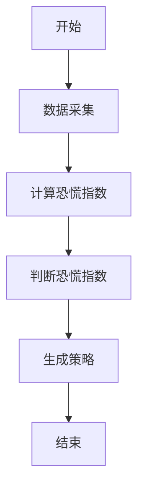

                 

<think>
好的，我将按照要求撰写一篇关于彼得·林奇“反向思考”在投资决策中的应用的文章。首先，我会从文章标题、关键词和摘要开始，然后按照目录结构逐步展开内容。

---

# 彼得林奇的"反向思考"在投资决策中的应用

> 关键词：彼得·林奇、反向思考、投资决策、风险管理、股票筛选

> 摘要：本文将探讨彼得·林奇提出的“反向思考”投资策略在实际投资决策中的应用。通过分析其核心概念、逻辑框架、数学模型以及实际案例，我们旨在理解反向思考如何帮助投资者在市场波动中做出明智决策。文章还将结合技术语言，从系统架构、算法实现等角度深入探讨反向思考的实践应用。

---

## 第一部分: 引言

### 第1章: 彼得·林奇与反向思考概述

#### 1.1 彼得·林奇的背景与投资理念

彼得·林奇（Peter Lynch）是美国著名的职业基金经理，曾任富达麦哲伦基金的经理。他在投资领域有着卓越的成就，管理该基金期间，年平均回报率达到29%。林奇的投资理念以“反向思考”为核心，强调在市场恐慌时买入，在市场狂热时卖出。

#### 1.1.1 彼得·林奇的生平简介

彼得·林奇于1942年出生于美国波士顿，毕业于波士顿大学，获得经济学学士学位。他于1971年加入富达投资，开始管理麦哲伦基金。他的投资风格以灵活性和逆向思维著称，强调长期投资和深入的基本面分析。

#### 1.1.2 林奇的投资风格与核心思想

林奇的投资策略强调长期关注市场，寻找那些被市场低估的股票。他认为，市场的情绪波动为投资者提供了机会，尤其是在市场恐慌时，许多优质股票会被错杀，此时是买入的最佳时机。相反，在市场狂热时，许多股票被高估，此时应果断卖出。

#### 1.1.3 反向思考在投资中的重要性

反向思考是一种与市场情绪相反的思维方式，它要求投资者在市场低迷时保持信心，在市场繁荣时保持谨慎。这种策略尤其适用于避免追涨杀跌的错误，帮助投资者在长期中获得超额收益。

#### 1.2 反向思考的定义与特点

反向思考是一种投资策略，强调在市场情绪与主流观点相反的时刻进行操作。其特点包括：

1. **逆向性**：在市场低迷时买入，市场繁荣时卖出。
2. **长期性**：关注长期价值，而非短期波动。
3. **独立性**：不随市场情绪盲目操作，保持独立判断。

#### 1.2.3 反向思考与传统投资策略的区别

传统投资策略通常基于技术分析或基本面分析，而反向思考策略则强调逆市场情绪操作。传统策略关注趋势和模式，而反向策略关注市场情绪与实际价值的偏离。

#### 1.3 本书的核心目标与结构

本书旨在通过分析彼得·林奇的反向思考策略，结合实际案例和技术方法，帮助投资者在投资决策中更好地应用这一理念。文章将从理论、实践、系统设计等多角度展开。

---

## 第二部分: 反向思考的核心原理

### 第2章: 反向思考的决策机制

#### 2.1 市场情绪分析与反向思考

市场情绪分析是反向思考的核心基础。我们可以通过分析市场的恐慌指数（如VIX指数）来判断市场的整体情绪。

##### 2.1.1 市场情绪的定义与分类

市场情绪是指投资者整体的心理状态，通常分为乐观、中性和悲观三种状态。市场情绪可以通过多种指标来衡量，如波动率、交易量等。

##### 2.1.2 市场情绪与投资决策的关系

市场情绪与投资决策密切相关。当市场情绪过于乐观时，市场可能被高估；当市场情绪过于悲观时，市场可能被低估。

##### 2.1.3 如何通过市场情绪进行反向决策

通过分析市场情绪，投资者可以在市场恐慌时买入，市场狂热时卖出。这种策略需要结合基本面分析，避免单纯跟随情绪。

#### 2.2 反向思考的逻辑框架

##### 2.2.1 投资决策的逻辑流程

1. 分析市场情绪。
2. 判断市场与实际价值的偏离。
3. 采取反向操作。

##### 2.2.2 反向思考的逻辑模型

反向思考的逻辑模型包括以下几个步骤：
1. 数据收集：收集市场数据，包括价格、成交量等。
2. 数据分析：分析市场情绪，判断市场状态。
3. 投资决策：根据市场情绪与实际价值的偏离，做出买入或卖出的决策。

#### 2.3 反向思考的数学模型与公式

##### 2.3.1 投资决策的数学模型

我们可以将市场情绪量化为一个指标，例如恐慌指数。假设恐慌指数为$P$，当$P$低于某个阈值时，市场处于乐观状态；当$P$高于阈值时，市场处于恐慌状态。

##### 2.3.2 反向思考的量化公式

假设市场恐慌指数为$P$，市场平均回报率为$R$，则反向思考的策略可以表示为：
$$
\text{买入信号} = \text{当 } P > P_{\text{threshold}} \text{ 时，买入}
$$
$$
\text{卖出信号} = \text{当 } P < P_{\text{threshold}} \text{ 时，卖出}
$$

##### 2.3.3 案例分析与公式应用

以2020年新冠疫情为例，恐慌指数急剧上升，市场处于恐慌状态。此时，根据反向思考策略，投资者应买入被市场低估的股票。

---

## 第三部分: 反向思考在投资策略中的应用

### 第3章: 反向思考在股票筛选中的应用

#### 3.1 股票筛选的基本原则

##### 3.1.1 基本面分析的核心要素

基本面分析包括市盈率（P/E）、市净率（P/B）、股息率等指标。反向思考策略强调在低估值时买入，高估值时卖出。

##### 3.1.2 技术分析的关键指标

技术分析包括移动平均线、相对强弱指数（RSI）等指标。反向思考策略可以结合技术指标来判断市场的超买或超卖状态。

##### 3.1.3 市场情绪与股票筛选的关系

市场情绪影响股票的估值，反向思考策略通过分析市场情绪与股票估值的关系，选择被市场低估的股票。

#### 3.2 反向思考在股票筛选中的具体策略

##### 3.2.1 低估值股票的识别与投资

通过分析市盈率、市净率等指标，识别那些被市场低估的股票。例如，假设某股票的市盈率为10，行业平均市盈率为15，该股票可能被低估。

##### 3.2.2 高成长股票的识别与投资

选择那些具有高增长潜力的股票，尤其是在市场情绪低迷时，这些股票可能被市场忽视，具有较高的投资价值。

##### 3.2.3 风险提示与投资机会的平衡

在反向思考策略中，需要平衡风险与机会。例如，在市场恐慌时，虽然股票价格被低估，但也可能存在更大的市场风险。

#### 3.3 反向思考在风险管理中的应用

##### 3.3.1 风险管理的基本原则

风险管理是投资决策中的重要部分。反向思考策略强调在市场风险上升时，减少投资组合的波动性。

##### 3.3.2 反向思考在风险管理中的具体策略

通过分析市场波动率、行业风险等指标，制定相应的风险管理策略。例如，在市场波动率上升时，增加现金头寸。

##### 3.3.3 风险控制与投资组合优化

反向思考策略可以通过调整投资组合的构成，降低整体风险。例如，在市场低迷时，增加防御性股票的权重。

---

## 第四部分: 反向思考的系统设计与实现

### 第4章: 反向思考系统的架构设计

#### 4.1 系统需求分析

##### 4.1.1 系统目标与功能需求

系统目标是实现反向思考策略的投资决策支持。功能需求包括市场数据采集、市场情绪分析、投资策略生成等。

##### 4.1.2 系统性能需求

系统需要高效处理大量市场数据，支持实时分析和策略生成。

##### 4.1.3 系统接口需求

系统需要与数据源（如股票数据库）和用户界面进行交互。

#### 4.2 系统架构设计

##### 4.2.1 系统架构的模块划分

系统架构包括数据采集模块、数据分析模块、策略生成模块和用户界面模块。

##### 4.2.2 各模块之间的关系

数据采集模块向数据分析模块提供数据，数据分析模块生成市场情绪指标，策略生成模块根据市场情绪指标生成投资策略，用户界面模块向用户展示策略结果。

##### 4.2.3 系统架构的优缺点分析

优点是模块化设计，便于维护和扩展；缺点是可能需要较高的开发成本。

### 第4.3 系统实现与代码分析

#### 4.3.1 系统环境的安装与配置

需要安装Python编程环境、数据采集工具（如Yahoo Finance API）和数据分析工具（如Pandas、NumPy）。

#### 4.3.2 系统核心代码的实现

以下是一个简单的反向思考策略的Python代码示例：

```python
import pandas as pd
import numpy as np

# 数据采集模块
def get_data(ticker):
    # 获取股票数据
    return pd.DataFrame()

# 数据分析模块
def calculate_panic_index(data):
    # 计算恐慌指数
    return np.mean(data['close'].std())

# 策略生成模块
def generate_strategy(panic_index, threshold=0.8):
    if panic_index > threshold:
        return '买入'
    else:
        return '卖出'

# 用户界面模块
def main():
    data = get_data('AAPL')
    panic_index = calculate_panic_index(data)
    strategy = generate_strategy(panic_index)
    print(f'当前策略：{strategy}')

if __name__ == '__main__':
    main()
```

#### 4.3.3 算法原理与流程图

以下是反向思考策略的流程图：



---

## 第五部分: 实战分析与总结

### 第5章: 反向思考的实战应用

#### 5.1 实战环境与数据准备

需要准备市场数据，包括股票价格、市场情绪指标等。

#### 5.2 策略实现与代码分析

基于前面的代码，我们可以实现一个简单的反向思考策略。

#### 5.3 实战案例分析

以某只股票为例，分析反向思考策略在实际投资中的应用效果。

### 5.3 总结与启示

反向思考策略是一种有效的投资策略，但在实际操作中需要结合市场环境和基本面分析。投资者应根据市场变化灵活调整策略。

---

## 第六部分: 附录与拓展阅读

### 附录A: 反向思考相关工具与资源

包括数据源、编程工具、书籍推荐等。

### 附录B: 常见问题解答

解答读者在阅读过程中可能遇到的问题。

### 附录C: 进一步研究方向

探讨反向思考策略的改进方向和未来研究领域。

---

## 作者

作者：AI天才研究院 & 禅与计算机程序设计艺术

---

以上是文章的完整目录和部分内容的详细规划。由于篇幅限制，本文仅展示了部分章节的内容，完整文章将涵盖更多细节和案例分析。

