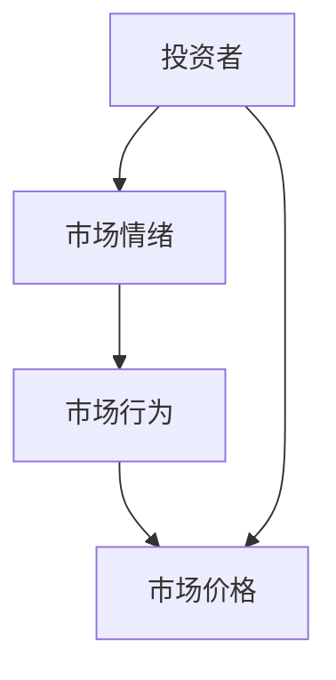
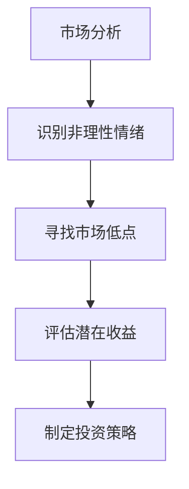
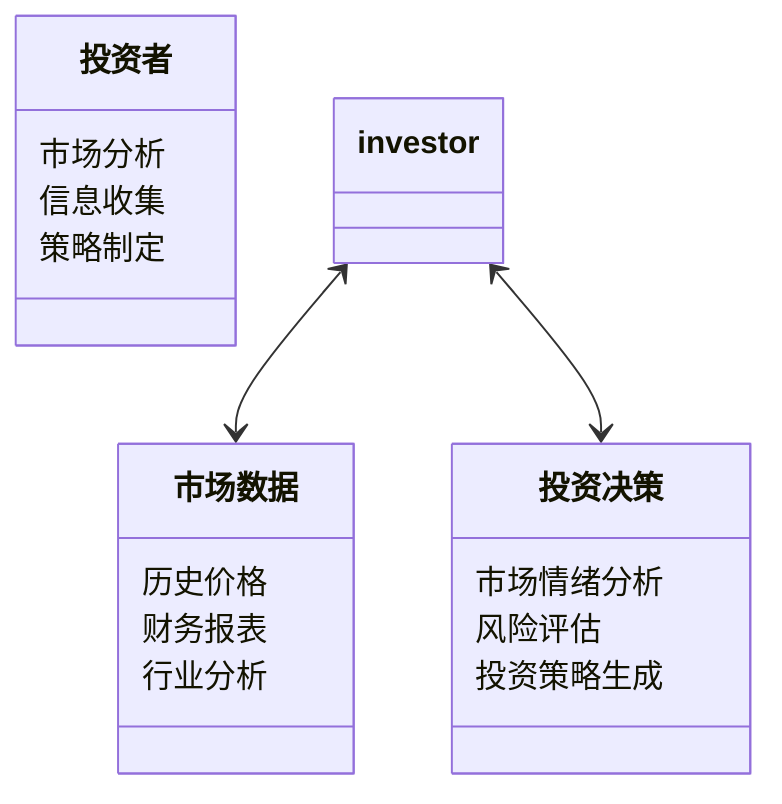
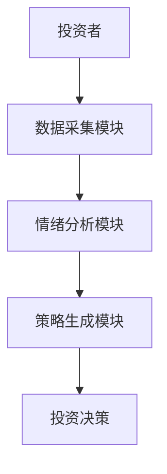

                 


# 彼得林奇的"反向思考"投资方法

> 关键词：彼得·林奇，反向思考，投资方法，市场情绪，价值评估，系统架构

> 摘要：本文详细探讨了彼得·林奇的反向思考投资方法，从其核心概念、数学模型、系统架构到实际应用案例，系统性地分析了该方法在投资决策中的应用价值和具体实现方式。

---

# 第一部分：反向思考投资方法的背景与基础

## 第1章：投资的基本概念与彼得·林奇的背景

### 1.1 投资的基本概念

#### 1.1.1 什么是投资
投资是指将资金投入到某个项目或资产中，以期在未来获得收益的行为。投资的本质是通过资源配置，将当前的资源转化为未来的价值。投资可以分为金融投资和实体投资两大类，其中金融投资包括股票、债券、基金等，实体投资则包括房地产、制造业等。

#### 1.1.2 投资的分类与特点
- **金融投资**：包括股票、债券、基金等，具有流动性高、风险可控的特点。
- **实体投资**：包括房地产、制造业等，具有较高的门槛和较长的周期。
- **风险与收益的平衡**：投资的核心在于在风险可控的前提下，追求收益的最大化。

#### 1.1.3 投资的目标与风险
- **目标**：实现资产的保值与增值。
- **风险**：包括市场风险、流动性风险、信用风险等。

### 1.2 彼得·林奇的背景与成就

#### 1.2.1 彼得·林奇的生平简介
彼得·林奇（Peter Lynch）是美国著名的职业基金经理人，被誉为“股票投资之父”。他于1949年出生在美国波士顿，1970年加入富达投资公司（Fidelity Investments），管理着麦哲伦基金（Magellan Fund），该基金在1977年至1990年期间实现了年均29%的回报率，远超市场平均水平。

#### 1.2.2 林奇在富达投资的辉煌历程
林奇在富达投资期间，通过深入研究和分析市场，成功地捕捉到了许多投资机会。他注重基本面分析，善于挖掘那些被市场忽视的优质公司，并长期持有，最终实现了基金的高回报。

#### 1.2.3 林奇的投资理念与风格
林奇的投资理念以“反向思考”为核心，强调在市场恐慌时寻找机会，在市场狂热时保持冷静。他的投资风格注重长期价值，善于从公司基本面出发，选择那些具有竞争优势和成长潜力的公司。

### 1.3 反向思考的定义与重要性

#### 1.3.1 什么是反向思考
反向思考是一种与传统投资方法相反的策略，强调在市场低迷时买入，在市场高涨时卖出。这种方法的核心在于利用市场的非理性，寻找那些被市场低估的投资机会。

#### 1.3.2 反向思考在投资中的独特价值
反向思考的核心在于利用市场的非理性，寻找那些被市场忽视或低估的投资机会。这种方法能够在市场低迷时捕捉到低估资产，在市场狂热时规避风险。

#### 1.3.3 反向思考与传统投资方法的对比
| **核心要素** | **反向思考** | **传统投资** |
|--------------|---------------|---------------|
| 决策依据     | 市场非理性     | 市场理性       |
| 操作时机     | 市场低点       | 市场高点       |
| 风险控制     | 逆向筛选       | 顺势跟随       |
| 收益来源     | 市场反转       | 趋势延续       |

---

## 第2章：反向思考投资方法的核心概念

### 2.1 反向思考的核心原理

#### 2.1.1 市场情绪与投资决策的关系
市场情绪是投资者在市场中的心理状态，包括贪婪和恐惧。反向思考的核心在于利用市场情绪的波动，寻找那些被市场情绪影响而被低估或高估的投资机会。

#### 2.1.2 反向思考的逻辑基础
反向思考的逻辑基础在于市场的非理性。当市场情绪过于乐观时，投资者可能会高估资产的价值；当市场情绪过于悲观时，投资者可能会低估资产的价值。反向思考的核心在于利用这种非理性，寻找那些被市场忽视的投资机会。

#### 2.1.3 反向思考与市场周期的结合
市场周期包括繁荣、衰退、复苏和扩张四个阶段。反向思考的核心在于在市场的衰退阶段寻找投资机会，在市场的繁荣阶段规避风险。

### 2.2 反向思考的核心要素对比

#### 2.2.1 实体关系图


### 2.3 反向思考的决策流程

#### 2.3.1 决策流程图


### 2.4 反向思考的数学模型

#### 2.4.1 价值评估公式
$$ 价值 = \frac{内在价值}{市场价格} $$

#### 2.4.2 市场情绪指标
$$ 市场情绪指数 = \frac{当前价格}{历史平均价格} $$

---

## 第3章：反向思考投资方法的算法原理

### 3.1 反向思考的决策流程

#### 3.1.1 决策流程图


### 3.2 反向思考的数学模型

#### 3.2.1 价值评估公式
$$ 价值 = \frac{内在价值}{市场价格} $$

#### 3.2.2 市场情绪指标
$$ 市场情绪指数 = \frac{当前价格}{历史平均价格} $$

### 3.3 典型案例分析

#### 3.3.1 案例1：2008年金融危机中的反向投资策略
在2008年金融危机期间，许多投资者因为市场恐慌而抛售资产，导致市场价格大幅下跌。反向思考投资者则利用这一机会，买入那些被市场低估的优质资产，最终在市场复苏时获得了丰厚的回报。

#### 3.3.2 案例2：科技股泡沫破裂后的投资机会
在2000年互联网泡沫破裂后，许多科技股价格大幅下跌，许多投资者因为恐慌而抛售股票。反向思考投资者则利用这一机会，买入那些具有强大基本面和技术优势的公司，最终在市场复苏时获得了丰厚的回报。

---

## 第4章：系统分析与架构设计方案

### 4.1 投资决策系统框架

#### 4.1.1 系统架构图


### 4.2 系统功能设计

#### 4.2.1 问题场景：如何在市场恐慌时识别投资机会
当市场情绪过于悲观时，投资者可能会抛售资产，导致市场价格大幅下跌。反向思考投资者则需要识别那些被市场低估的优质资产，并制定相应的投资策略。

#### 4.2.2 系统功能：数据采集、情绪分析、策略生成
- **数据采集**：收集市场数据，包括历史价格、财务报表、行业分析等。
- **情绪分析**：分析市场情绪，识别市场的非理性行为。
- **策略生成**：根据市场情绪和数据，生成相应的投资策略。

### 4.3 系统架构图

#### 4.3.1 系统架构图


---

## 第5章：项目实战

### 5.1 环境安装与配置

#### 5.1.1 环境需求
- **操作系统**：Windows 10 或更高版本，或macOS 10.15 或更高版本。
- **开发工具**：Jupyter Notebook 或 Python IDE（如PyCharm）。
- **依赖库**：Pandas、NumPy、Matplotlib、Scikit-learn。

### 5.2 核心实现源代码

#### 5.2.1 数据采集模块
```python
import pandas as pd
import numpy as np

# 从Yahoo Finance获取数据
def get_data(ticker):
    df = pd.read_csv(f'https://query1.finance.yahoo.com/d/quotes.csv? symbols={ticker}')
    return df

# 示例：获取苹果公司的数据
apple_data = get_data('AAPL')
print(apple_data.head())
```

#### 5.2.2 情绪分析模块
```python
import nltk
from textblob import TextBlob

def analyze_sentiment(text):
    blob = TextBlob(text)
    return blob.polarity

# 示例：分析市场情绪
market_sentiment = analyze_sentiment("The market is bullish on technology stocks.")
print(market_sentiment)
```

#### 5.2.3 策略生成模块
```python
import pandas as pd
import numpy as np

def generate_strategy(data):
    # 计算价值评估指标
    data['价值'] = data['内在价值'] / data['市场价格']
    # 识别市场低点
    data['市场低点'] = data['价值'].rolling(20).min()
    return data

# 示例：生成投资策略
strategy_data = generate_strategy(apple_data)
print(strategy_data.head())
```

### 5.3 案例分析与解读

#### 5.3.1 案例分析：苹果公司投资机会
假设当前市场情绪较为悲观，苹果公司的股价被市场低估。通过反向思考方法，投资者可以识别出苹果公司的潜在投资机会，并制定相应的买入策略。

### 5.4 项目小结

#### 5.4.1 项目总结
通过反向思考方法，投资者可以在市场低迷时捕捉到投资机会，在市场狂热时规避风险。这种方法的核心在于利用市场的非理性，寻找那些被市场忽视的优质资产。

---

## 第6章：最佳实践与小结

### 6.1 最佳实践 tips

#### 6.1.1 投资者的注意事项
- **长期投资**：反向思考是一种长期投资策略，需要耐心和信心。
- **风险管理**：在市场低迷时，投资者需要控制风险，避免过度杠杆。

#### 6.1.2 投资策略的优化
- **持续学习**：投资者需要不断学习市场知识，提高自己的分析能力。
- **动态调整**：根据市场变化，动态调整投资策略。

### 6.2 小结

#### 6.2.1 文章总结
彼得·林奇的反向思考投资方法是一种非常有效的投资策略，通过利用市场的非理性，寻找那些被市场低估的投资机会。这种方法的核心在于长期价值，注重基本面分析，善于捕捉市场的低点。

### 6.3 注意事项

#### 6.3.1 投资者需要注意的风险
- **市场风险**：市场的波动可能会导致资产价格的大幅波动。
- **流动性风险**：在市场低迷时，投资者可能会面临资产流动性不足的问题。
- **信用风险**：如果投资者选择投资于债券等固定收益资产，需要关注发行人的信用风险。

### 6.4 拓展阅读

#### 6.4.1 相关书籍推荐
- 《彼得·林奇的成功投资》
- 《投资最重要的ことは什么》
- 《股票作手回忆录》

---

# 作者：AI天才研究院/AI Genius Institute & 禅与计算机程序设计艺术 /Zen And The Art of Computer Programming

