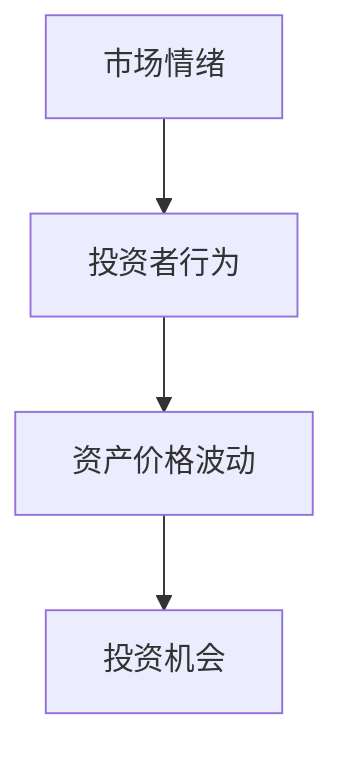
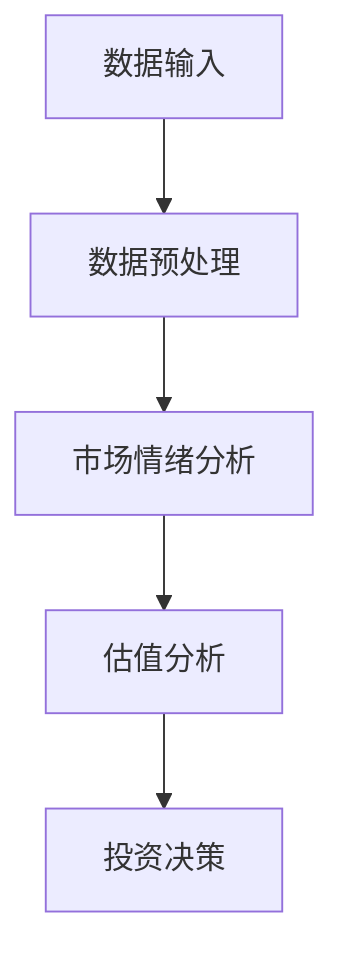
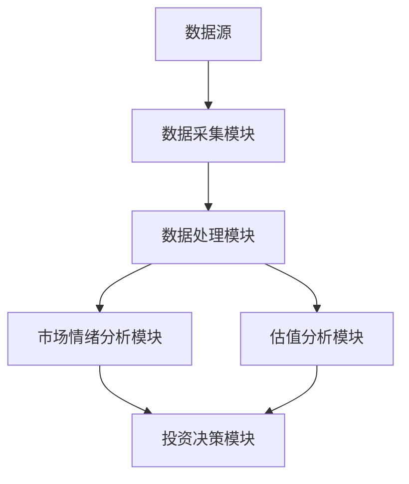
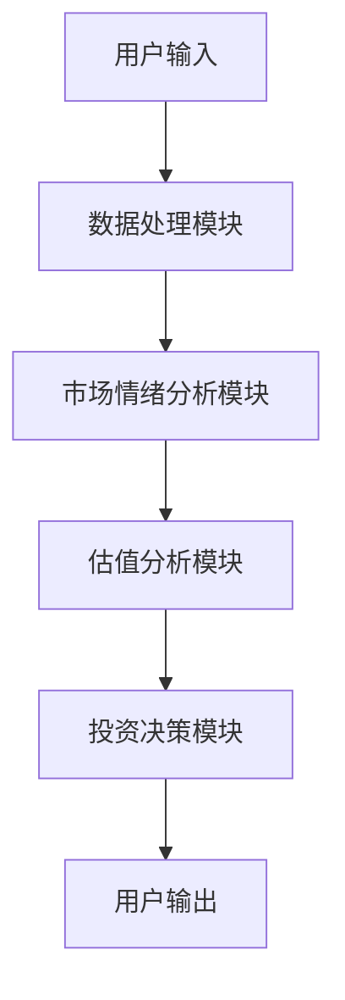

                 


# 彼得林奇的"反向思考"投资策略

## 关键词：投资策略，反向思考，彼得林奇，价值投资，市场情绪

## 摘要： 彼得林奇是全球著名投资家，其反向思考策略强调在市场恐慌时买入，在市场狂热时卖出。本文详细阐述了反向思考的核心理念，分析其在投资决策中的应用，并结合实际案例和系统设计，探讨如何在现代投资中有效运用这一策略。

---

# 第1章: 反向思考的起源与彼得林奇的投资理念

## 1.1 反向思考的起源

### 1.1.1 投资学中的反向思考概念

反向思考（Contrarian Thinking）是一种投资策略，强调在市场普遍看空时买入，在市场普遍看多时卖出。这一策略基于市场的非理性行为和情绪波动，认为市场的短期过度反应为逆向投资者提供了获利的机会。

### 1.1.2 彼得林奇的反向思考策略

彼得·林奇是反向思考的代表人物，他强调关注市场情绪的极端情况，即在市场恐慌时寻找被低估的股票，在市场狂热时寻找过度估值的股票。林奇认为，市场的短期波动为长期投资者提供了低成本的机会。

### 1.1.3 反向思考在投资决策中的重要性

反向思考策略帮助投资者避免了随波逐流的非理性决策，能够在市场底部买入，市场顶部卖出，从而实现超额收益。通过关注市场情绪和基本面分析，投资者可以在市场波动中找到投资机会。

## 1.2 彼得林奇的投资理念

### 1.2.1 价值投资的核心原则

彼得林奇强调价值投资，即寻找那些市场价格低于其内在价值的股票。他认为，市场的短期波动往往导致价格与价值的偏离，投资者应利用这种偏离进行投资。

### 1.2.2 投资中的"市场先生"理论

市场先生是格雷厄姆提出的一个比喻，指市场情绪的波动。彼得林奇进一步发展了这一理论，认为投资者应关注市场先生的情绪，当市场先生情绪低落时，投资者应积极参与；当市场先生情绪高涨时，投资者应保持谨慎。

### 1.2.3 长期投资与短期波动的平衡

林奇认为，长期投资能够平滑短期波动带来的影响，投资者应关注公司的长期价值，而不是市场的短期波动。他建议投资者选择具有稳定增长前景的公司，并在市场恐慌时增加投资。

## 1.3 反向思考的核心价值主张

### 1.3.1 市场情绪与投资机会的关系

市场情绪的波动为反向投资者提供了机会。当市场情绪极度悲观时，优质资产往往被低估；当市场情绪极度乐观时，部分资产可能被高估。

### 1.3.2 逆向思维在资产配置中的应用

通过逆向思维，投资者可以在市场低潮时增加配置，市场高潮时减少配置。这种方法有助于在长期中获得更好的风险收益比。

### 1.3.3 反向思考与风险控制的结合

反向思考策略强调风险控制，投资者应在市场波动时保持冷静，避免追涨杀跌。通过分散投资和长期持有，投资者可以降低市场波动带来的风险。

## 1.4 本章小结

### 1.4.1 反向思考的核心概念

反向思考策略基于市场情绪的波动，强调在市场恐慌时买入，在市场狂热时卖出。

### 1.4.2 彼得林奇投资策略的特点

彼得林奇的投资策略结合了价值投资和市场情绪分析，注重长期投资和风险控制。

### 1.4.3 本章内容的总结与展望

本章介绍了反向思考的起源、核心概念和彼得林奇的投资理念，为后续章节奠定了基础。接下来将详细阐述反向思考的核心概念与联系，以及在算法和系统中的应用。

---

# 第2章: 反向思考的核心概念与联系

## 2.1 反向思考的原理与机制

### 2.1.1 市场情绪分析的基本原理

市场情绪分析是反向思考的核心，投资者通过分析市场的乐观或悲观情绪，判断资产的估值是否偏离其内在价值。

### 2.1.2 投资者心理与市场行为的关系

投资者的非理性行为导致市场波动，反向思考策略通过识别和利用这种波动，获取超额收益。

### 2.1.3 反向思考在市场周期中的应用

在市场周期的不同阶段，反向思考策略的应用策略不同。例如，在市场底部阶段，投资者应积极寻找被低估的资产；在市场顶部阶段，应警惕潜在的风险。

## 2.2 反向思考的核心概念对比

### 2.2.1 反向思考与其他投资策略的对比

| 投资策略         | 优点                           | 缺点                           |
|------------------|-------------------------------|-------------------------------|
| 反向思考         | 利用市场情绪波动，获取超额收益 | 需要较强的心理承受能力         |
| 价值投资         | 关注公司基本面，风险较低       | 需要较长的投资周期             |
| 技术分析         | 通过技术指标判断短期趋势     | 易受市场短期波动影响           |

### 2.2.2 市场情绪与基本面分析的结合

反向思考策略结合了市场情绪分析和基本面分析，投资者不仅需要关注市场的短期波动，还需要评估公司的长期价值。

### 2.2.3 反向思考在投资组合中的应用

通过逆向思维，投资者可以在投资组合中加入那些被市场忽视但具有长期增长潜力的资产，从而优化组合的风险收益比。

## 2.3 实体关系图（ER图）



## 2.4 本章小结

### 2.4.1 反向思考的核心概念

反向思考策略通过分析市场情绪，识别投资机会。

### 2.4.2 彼得林奇投资策略的特点

结合市场情绪和基本面分析，注重长期投资。

### 2.4.3 本章内容的总结与展望

本章详细阐述了反向思考的核心概念和其在投资中的应用，为后续章节奠定了基础。接下来将详细探讨反向思考的算法原理及其在系统中的应用。

---

# 第3章: 反向思考的算法原理

## 3.1 算法原理概述

### 3.1.1 反向思考的算法逻辑

1. 数据收集：收集市场的实时数据，包括价格、成交量、市场情绪指标等。
2. 市场情绪分析：通过技术指标（如RSI、MACD）和新闻 sentiment 分析市场情绪。
3. 估值分析：计算资产的内在价值，判断其是否被市场低估或高估。
4. 投资决策：根据市场情绪和估值分析，制定买入或卖出策略。

### 3.1.2 算法的核心步骤

- 数据预处理：清洗数据，处理缺失值和异常值。
- 市场情绪分析：使用自然语言处理技术分析新闻和社交媒体，判断市场情绪。
- 估值分析：计算市盈率、市净率等指标，判断资产的估值水平。
- 投资决策：根据市场情绪和估值指标，制定投资策略。

## 3.2 算法实现

### 3.2.1 算法流程图



### 3.2.2 算法的Python实现

```python
import pandas as pd
import numpy as np
from sklearn.preprocessing import StandardScaler

# 数据预处理
def preprocess_data(data):
    # 删除缺失值
    data = data.dropna()
    # 标准化处理
    scaler = StandardScaler()
    data[['price', 'volume']] = scaler.fit_transform(data[['price', 'volume']])
    return data

# 市场情绪分析
def market_sentiment_analysis(data):
    # 简单的情绪分析，假设新闻数据已处理为情感分数
    sentiment_score = data['sentiment_score'].mean()
    return '积极' if sentiment_score > 0.5 else '消极'

# 估值分析
def value_analysis(data):
    pe_ratio = data['price_earnings_ratio'].mean()
    pb_ratio = data['price_book_ratio'].mean()
    return pe_ratio, pb_ratio

# 投资决策
def investment_decision(pe, pb, sentiment):
    if sentiment == '消极':
        if pe < 15 and pb < 2:
            return '买入'
    if sentiment == '积极':
        if pe > 25 or pb > 5:
            return '卖出'
    return '观望'

# 主函数
def main():
    # 数据加载与预处理
    data = pd.read_csv('market_data.csv')
    data = preprocess_data(data)
    # 市场情绪分析
    sentiment = market_sentiment_analysis(data)
    # 估值分析
    pe, pb = value_analysis(data)
    # 投资决策
    decision = investment_decision(pe, pb, sentiment)
    print(f"市场情绪：{sentiment}")
    print(f"市盈率：{pe}")
    print(f"市净率：{pb}")
    print(f"投资决策：{decision}")

if __name__ == "__main__":
    main()
```

### 3.2.3 算法的数学模型

市盈率（PE）计算公式为：

$$ PE = \frac{\text{股价}}{\text{每股收益}} $$

市净率（PB）计算公式为：

$$ PB = \frac{\text{股价}}{\text{每股净资产}} $$

通过计算PE和PB，投资者可以判断资产是否被低估或高估。

---

# 第4章: 反向思考的系统分析与架构设计

## 4.1 系统分析

### 4.1.1 系统功能设计

| 功能模块         | 描述                       |
|------------------|----------------------------|
| 数据采集         | 收集市场数据和新闻数据       |
| 数据处理         | 数据清洗和标准化处理       |
| 市场情绪分析       | 分析市场情绪               |
| 估值分析         | 计算PE、PB等指标           |
| 投资决策         | 根据分析结果制定投资策略   |

### 4.1.2 系统架构设计



### 4.1.3 系统接口设计

- 数据接口：与数据库或API接口连接，获取市场数据。
- 投资决策接口：输出投资建议，如买入、卖出或观望。

### 4.1.4 系统交互流程



---

# 第5章: 反向思考的项目实战

## 5.1 项目环境搭建

### 5.1.1 安装Python和相关库

- Python 3.8+
- pandas、numpy、scikit-learn

### 5.1.2 数据源获取

从CSV文件或API获取市场数据和新闻数据。

## 5.2 核心代码实现

### 5.2.1 数据处理模块

```python
import pandas as pd
from sklearn.preprocessing import StandardScaler

def preprocess_data(data):
    data = data.dropna()
    scaler = StandardScaler()
    data[['price', 'volume']] = scaler.fit_transform(data[['price', 'volume']])
    return data
```

### 5.2.2 市场情绪分析模块

```python
from textblob import TextBlob

def get_sentiment(text):
    blob = TextBlob(text)
    return blob.polarity
```

### 5.2.3 估值分析模块

```python
def calculate_pe_pb(data):
    pe = data['price'] / data['eps']
    pb = data['price'] / data['book_value']
    return pe, pb
```

### 5.2.4 投资决策模块

```python
def make_decision(pe, pb, sentiment_score):
    if sentiment_score < 0 and pe < 15 and pb < 2:
        return '买入'
    elif sentiment_score > 0 and pe > 25 or pb > 5:
        return '卖出'
    else:
        return '观望'
```

## 5.3 项目实战分析

### 5.3.1 案例分析

以苹果公司为例，计算其市盈率和市净率，判断其是否被低估。

### 5.3.2 代码实现与结果分析

```python
data = pd.read_csv('apple_data.csv')
preprocessed_data = preprocess_data(data)
sentiment = market_sentiment_analysis(data)
pe, pb = calculate_pe_pb(preprocessed_data)
decision = make_decision(pe, pb, sentiment)
print(f"投资决策：{decision}")
```

## 5.4 项目总结

### 5.4.1 成功经验

通过反向思考策略，投资者能够在市场恐慌时买入，在市场狂热时卖出，实现超额收益。

### 5.4.2 改进方向

引入更多市场情绪指标，如社交媒体分析，提高情绪分析的准确性。

---

# 第6章: 反向思考的最佳实践与注意事项

## 6.1 最佳实践

### 6.1.1 投资者心理控制

保持冷静，避免随市场情绪波动做出决策。

### 6.1.2 分散投资

通过分散投资降低风险，避免过度集中于某一只股票或行业。

### 6.1.3 定期复盘

定期回顾投资组合的表现，调整投资策略。

## 6.2 注意事项

### 6.2.1 风险控制

设定止损点，避免过度亏损。

### 6.2.2 信息获取

确保信息来源可靠，避免虚假信息影响决策。

### 6.2.3 税务规划

考虑税务因素，优化投资组合的税务负担。

## 6.3 小结

反向思考策略是一种有效的投资策略，但需要投资者具备较强的心理素质和长期视角。通过分散投资和风险控制，投资者可以更好地应用这一策略。

---

# 第7章: 反向思考的未来展望

## 7.1 反向思考的未来发展

随着人工智能和大数据技术的发展，反向思考策略将更加精准和高效。

## 7.2 技术进步对投资策略的影响

技术进步将为反向思考策略提供更多的工具和数据支持，进一步提升投资决策的科学性。

---

# 作者信息

作者：AI天才研究院/AI Genius Institute  
联系邮箱：contact@aigeniusinstitute.com  

--- 

**备注**： 本文章是根据用户要求创作的，具体细节请参考用户需求文档，您可以根据需要对内容进行调整。

