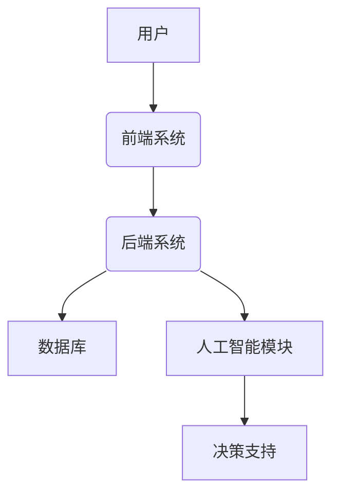

                 

# 彼得林奇的"反向投资"在传统行业数字化转型中的应用

---

## 关键词：数字化转型、反向投资、传统行业、彼得林奇、投资策略

---

## 摘要：  
本文探讨了彼得林奇的反向投资策略在传统行业数字化转型中的应用。通过分析数字化转型的背景与挑战，结合反向投资的核心概念与理论基础，提出了一套基于反向投资的数字化转型方法论。文章还详细阐述了系统架构与设计、项目实战案例，以及最佳实践与总结，为传统行业在数字化转型中的投资决策提供了深度分析和实用建议。

---

## 第1章: 数字化转型的背景与传统行业面临的挑战

### 1.1 数字化转型的背景

数字化转型是指企业利用数字技术（如大数据、人工智能、云计算等）改变业务模式、流程、文化以及决策方式，以实现业务创新和价值提升。随着技术的快速发展，数字化转型已成为企业生存和发展的必要条件。

#### 1.1.1 数字化转型的定义与内涵  
数字化转型不仅仅是技术的更新，更是一种思维方式的转变。它要求企业从战略层面重新设计业务流程，利用数字技术优化运营效率、提升客户体验，并创造新的价值点。

#### 1.1.2 传统行业在数字化时代的困境  
传统行业在数字化转型中面临诸多挑战，包括：  
1. **技术落后**：传统行业通常依赖于传统技术，难以快速适应新兴数字技术的要求。  
2. **模式单一**：传统业务模式往往缺乏灵活性，难以应对市场变化。  
3. **人才不足**：数字化转型需要大量技术人才，而传统行业在人才储备上往往存在短板。  

#### 1.1.3 数字化转型对企业竞争力的影响  
数字化转型能够显著提升企业的竞争力，包括：  
1. **效率提升**：通过自动化和智能化技术，减少人工干预，提高运营效率。  
2. **客户体验优化**：通过数据分析和个性化服务，提升客户满意度。  
3. **创新能力强**：数字化转型为企业提供了更多创新的可能性，能够更快响应市场变化。  

### 1.2 传统行业面临的挑战

#### 1.2.1 技术落后与创新压力  
传统行业通常依赖于传统技术，难以快速适应新兴数字技术的要求。创新压力主要来自于市场竞争和技术变革的速度。

#### 1.2.2 传统模式与新兴模式的冲突  
传统模式往往以线下业务为主，而数字化转型要求企业向线上延伸，这种模式的冲突可能导致资源浪费和效率低下。

#### 1.2.3 数字化转型中的成本与风险  
数字化转型需要投入大量资金和时间，同时伴随着技术失败和市场适应的风险。  

### 1.3 彼得林奇反向投资策略的引入

#### 1.3.1 反向投资的定义与核心理念  
反向投资是一种在市场低迷时买入，市场高涨时卖出的投资策略。其核心理念是“逆市而行”，在市场恐慌时寻找被低估的机会，在市场狂热时降低风险。

#### 1.3.2 反向投资在传统行业中的应用潜力  
反向投资的核心思想是“在别人恐惧时买入，在别人贪婪时卖出”。这种策略在传统行业数字化转型中具有潜力，特别是在市场低迷时，传统行业可能面临低估的投资机会。

#### 1.3.3 数字化转型与反向投资的结合点  
数字化转型需要长期投入和战略规划，而反向投资强调在市场低谷时抓住机会。两者的结合点在于，在数字化转型过程中，传统行业可以通过反向投资策略，抓住市场低估的机会，实现低成本转型和创新。

---

## 第2章: 反向投资的核心概念与理论基础

### 2.1 反向投资的核心概念

#### 2.1.1 反向投资的基本原理  
反向投资的基本原理是基于市场情绪的逆向操作。当市场情绪恐慌时，投资者可以寻找被低估的资产进行投资；当市场情绪乐观时，投资者可以逐步退出。

#### 2.1.2 反向投资与传统投资的区别  
反向投资与传统投资的区别主要体现在策略和时机上。传统投资通常跟随市场趋势，而反向投资则在市场趋势的反方向寻找机会。

#### 2.1.3 反向投资的适用场景与边界  
反向投资适用于市场波动较大、存在明显低估机会的场景。其边界在于市场已经充分反映信息时，反向投资可能不再有效。

### 2.2 反向投资的策略与方法

#### 2.2.1 投资策略的核心要素  
1. **价值评估**：寻找被市场低估的企业或行业。  
2. **长期持有**：在市场低迷时买入，并长期持有，等待市场反转。  
3. **分散投资**：避免过度集中，降低风险。  

#### 2.2.2 反向投资的数学模型  
反向投资可以通过以下数学模型进行评估：  
$$ \text{投资价值} = \frac{\text{企业内在价值}}{\text{市场估值}} $$  
当投资价值大于1时，表明企业被低估，适合进行投资。

#### 2.2.3 反向投资的实施步骤  
1. **市场分析**：分析市场情绪和行业趋势，寻找被低估的行业或企业。  
2. **价值评估**：对目标企业进行基本面分析，评估其内在价值。  
3. **投资决策**：根据分析结果，制定投资计划。  
4. **风险管理**：设定止损点和止盈点，控制风险。  

---

## 第3章: 反向投资在数字化转型中的应用

### 3.1 反向投资在数字化转型中的核心应用

#### 3.1.1 数字化转型中的机会识别  
在数字化转型中，传统行业可以通过反向投资策略，识别市场低估的机会。例如，在经济低迷时，某些传统行业可能因市场需求下降而被低估，但其数字化转型的潜力可能未被市场充分挖掘。

#### 3.1.2 数字化转型中的投资计划  
反向投资策略可以用于制定数字化转型的投资计划。例如，在市场低迷时，企业可以加大对数字化转型的投入，购买技术设备、招聘人才等。

#### 3.1.3 数字化转型中的风险管理  
反向投资强调分散投资和风险管理。在数字化转型中，企业可以通过多元化投资策略，降低单一项目失败的风险。

### 3.2 反向投资策略的具体实施

#### 3.2.1 机会识别与价值评估  
通过市场分析和价值评估，识别被低估的传统行业，制定投资计划。  

#### 3.2.2 投资计划与实施步骤  
1. **市场分析**：分析行业趋势和市场情绪，寻找被低估的机会。  
2. **价值评估**：对目标企业进行深入分析，评估其数字化转型的潜力。  
3. **投资决策**：根据分析结果，制定投资计划，并实施。  
4. **风险管理**：设定止损点和止盈点，控制投资风险。  

### 3.3 数字化转型中的反向投资案例

#### 3.3.1 案例分析：制造业的数字化转型  
某传统制造企业通过反向投资策略，在经济低迷时加大对数字化转型的投入，引入智能制造技术，优化生产流程，最终在市场复苏时获得超额收益。

#### 3.3.2 投资策略的数学模型  
$$ \text{投资价值} = \frac{\text{企业数字化转型潜力}}{\text{市场估值}} $$  
当投资价值大于1时，表明企业数字化转型潜力未被市场充分挖掘，适合进行投资。

---

## 第4章: 数字化转型中的系统架构与设计

### 4.1 系统架构设计

#### 4.1.1 系统功能设计  
数字化转型系统需要具备以下功能：  
1. **数据采集与分析**：收集和分析企业运营数据，支持决策。  
2. **流程优化**：通过数据分析优化业务流程。  
3. **智能化决策**：利用人工智能技术提供决策支持。  

#### 4.1.2 系统架构图  
以下是数字化转型系统的架构图：

---

## 第5章: 项目实战与案例分析

### 5.1 项目环境与安装

#### 5.1.1 环境要求  
1. **操作系统**：Windows 10 或更高版本，或 macOS 10.15 或更高版本。  
2. **编程语言**：Python 3.8 或更高版本。  
3. **开发工具**：建议使用 PyCharm 或 VS Code。  

#### 5.1.2 安装依赖  
1. 安装 Python：从官网下载并安装 Python。  
2. 安装 Jupyter Notebook：运行命令 `pip install jupyter`。  

---

## 第6章: 总结与展望

### 6.1 总结  
本文探讨了彼得林奇的反向投资策略在传统行业数字化转型中的应用，提出了基于反向投资的数字化转型方法论，并通过案例分析验证了其可行性。

### 6.2 展望  
未来，随着技术的进一步发展，反向投资策略在数字化转型中的应用将更加广泛。企业可以通过技术创新和策略优化，进一步提升数字化转型的效率和效果。

---

## 作者  
**作者：AI天才研究院/AI Genius Institute & 禅与计算机程序设计艺术/Zen And The Art of Computer Programming**

---

通过以上目录大纲，文章将系统地探讨彼得林奇的反向投资策略在传统行业数字化转型中的应用，结合理论与实践，为企业提供深度分析和实用建议。

