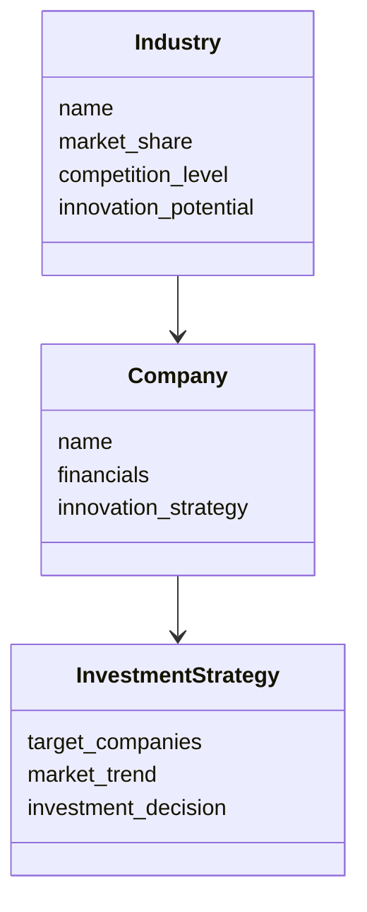
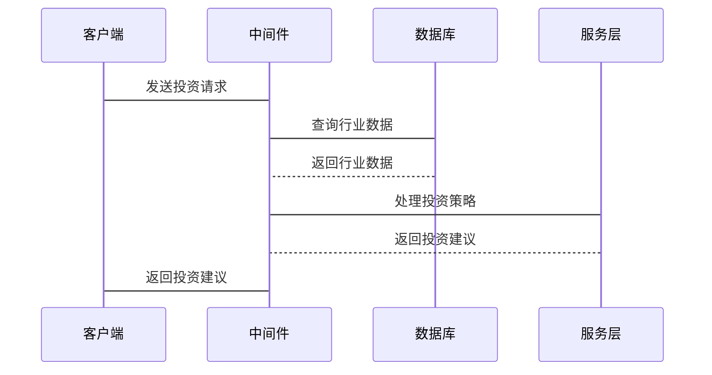

                 


# 彼得林奇的"反向投资"在成熟行业创新中的应用

## 关键词：反向投资，彼得林奇，成熟行业，创新，投资策略

## 摘要：  
本文探讨了彼得林奇的反向投资策略在成熟行业创新中的应用。通过分析反向投资的基本原理、成熟行业的特点以及创新机会的识别，本文构建了一个创新模型，并通过具体案例展示了如何在科技、医疗、制造等行业中应用反向投资策略。文章还提供了系统设计和项目实战，帮助读者理解和应用这一策略。

---

# 第一部分：彼得林奇反向投资策略概述

## 第1章：反向投资的基本概念

### 1.1 反向投资的定义与核心理念

#### 1.1.1 投资的基本概念
投资是指将资金投入到某个项目或资产中，以期获得未来的收益。投资的核心在于识别价值，抓住市场机会，规避风险。

#### 1.1.2 反向投资的定义
反向投资是一种逆向市场趋势的投资策略，强调在市场低迷时买入，在市场高涨时卖出。其核心理念是“别人恐惧时我贪婪，别人贪婪时我恐惧”。

#### 1.1.3 反向投资的核心理念
反向投资的核心理念包括：
1. **逆市场情绪**：在市场恐慌时寻找机会，避免追高杀跌。
2. **长期价值**：关注企业的基本面，而非短期市场波动。
3. **分散风险**：通过多样化投资降低风险。

### 1.2 彼得林奇的投资风格

#### 1.2.1 彼得林奇的生平简介
彼得·林奇（Peter Lynch）是美国著名的投资专家，被誉为“股票投资之父”。他在富达投资管理公司管理麦哲伦基金期间取得了卓越的业绩，创造了年化29%的回报率。

#### 1.2.2 彼得林奇的投资哲学
彼得林奇的投资哲学包括：
1. **价值投资**：寻找具有成长潜力的公司。
2. **分散投资**：避免过度集中。
3. **长期视角**：关注企业的基本面，而非短期市场波动。

#### 1.2.3 反向投资在彼得林奇策略中的地位
反向投资是彼得林奇策略的重要组成部分，尤其是在市场低迷时，他倾向于投资那些被市场低估的优质企业。

---

## 第2章：成熟行业的特点与创新挑战

### 2.1 成熟行业的定义与特征

#### 2.1.1 行业生命周期理论
行业生命周期包括导入期、成长期、成熟期和衰退期。成熟期的特点是增长缓慢，竞争激烈，创新减少。

#### 2.1.2 成熟行业的市场特点
成熟行业的市场特点包括：
1. 市场份额稳定。
2. 竞争格局固化。
3. 创新动力不足。

#### 2.1.3 成熟行业创新的难点
成熟行业创新的难点包括：
1. 创新成本高。
2. 市场接受度低。
3. 创新回报不确定。

### 2.2 创新在成熟行业中的重要性

#### 2.2.1 创新对行业发展的推动作用
创新可以为成熟行业注入新的活力，提升效率，降低成本。

#### 2.2.2 创新在企业竞争中的关键作用
在成熟行业中，创新是企业差异化竞争的关键。

#### 2.2.3 反向投资在创新中的潜在机会
反向投资可以帮助投资者在成熟行业中发现被低估的创新机会。

---

# 第二部分：反向投资策略在成熟行业创新中的应用

## 第3章：反向投资策略的核心原理

### 3.1 反向投资的理论基础

#### 3.1.1 市场波动与投资者心理
市场波动往往由投资者心理驱动，反向投资利用市场的非理性波动寻找机会。

#### 3.1.2 价值投资与反向投资的区别与联系
价值投资关注企业内在价值，反向投资关注市场波动与价值的偏离。

#### 3.1.3 反向投资的数学模型
反向投资的数学模型可以表示为：
$$
\text{投资价值} = \frac{\text{内在价值}}{\text{市场情绪系数}}
$$

### 3.2 反向投资与创新机会的结合

#### 3.2.1 反向投资视角下的创新机会识别
在成熟行业中，创新机会往往被市场忽视，反向投资可以帮助识别这些机会。

#### 3.2.2 成熟行业中的低估值创新领域
低估值创新领域包括技术升级、产品优化、商业模式创新等。

#### 3.2.3 反向投资策略在创新中的应用框架
反向投资策略在创新中的应用框架包括：
1. 识别市场低估的创新领域。
2. 分析企业的创新潜力。
3. 制定投资策略。

---

## 第4章：反向投资策略在具体行业的应用

### 4.1 高 tech行业的反向投资机会

#### 4.1.1 高 tech行业的市场现状
高 tech行业处于成熟期，技术创新放缓，竞争激烈。

#### 4.1.2 反向投资在高 tech创新中的应用
在高 tech行业中，反向投资可以关注技术升级和产品优化。

#### 4.1.3 典型案例分析
例如，在半导体行业，反向投资可以关注技术领先的公司。

### 4.2 医疗行业的反向投资机会

#### 4.2.1 医疗行业的市场特点
医疗行业需求稳定，但创新动力不足。

#### 4.2.2 反向投资在医疗创新中的应用
关注医疗技术升级和产品优化。

#### 4.2.3 典型案例分析
例如，在医疗设备行业，反向投资可以关注技术创新的公司。

### 4.3 制造行业的反向投资机会

#### 4.3.1 制造行业的市场特点
制造行业竞争激烈，创新成本高。

#### 4.3.2 反向投资在制造创新中的应用
关注制造技术升级和产品优化。

#### 4.3.3 典型案例分析
例如，在汽车制造行业，反向投资可以关注技术创新的公司。

---

## 第5章：系统分析与架构设计方案

### 5.1 问题场景介绍

#### 5.1.1 问题描述
在成熟行业中，创新机会被低估，反向投资可以帮助识别这些机会。

#### 5.1.2 问题解决
通过系统设计，构建反向投资创新框架。

### 5.2 项目介绍

#### 5.2.1 项目目标
构建反向投资创新框架，帮助投资者在成熟行业中发现创新机会。

#### 5.2.2 项目范围
涵盖高 tech、医疗、制造等行业。

### 5.3 系统功能设计

#### 5.3.1 领域模型（Mermaid类图）


#### 5.3.2 系统架构设计（Mermaid架构图）


#### 5.3.3 系统接口设计
系统接口包括：
1. 数据输入接口。
2. 数据处理接口。
3. 结果输出接口。

#### 5.3.4 系统交互流程（Mermaid序列图）


---

## 第6章：项目实战

### 6.1 环境安装

#### 6.1.1 系统环境
安装Python、Jupyter Notebook、Mermaid工具。

### 6.2 核心实现源代码

#### 6.2.1 投资模型实现
```python
def reverse_investment_model(industry_data):
    # 计算市场情绪系数
    market_mood = industry_data['market_trend']
    # 计算投资价值
    investment_value = industry_data['intrinsic_value'] / market_mood
    return investment_value
```

#### 6.2.2 投资策略实现
```python
def investment_strategy(industry, companies):
    # 识别创新机会
    opportunities = [c for c in companies if c['innovation_potential'] > 0.7]
    return opportunities
```

### 6.3 代码应用解读与分析
通过代码实现反向投资模型，识别创新机会。

### 6.4 实际案例分析
以高 tech行业为例，分析某公司的创新潜力。

### 6.5 项目小结
项目实战展示了反向投资策略在成熟行业创新中的应用。

---

## 第7章：总结与展望

### 7.1 总结
本文探讨了彼得林奇的反向投资策略在成熟行业创新中的应用，构建了创新模型，并提供了系统设计和项目实战。

### 7.2 未来展望
未来，反向投资策略可以在更多行业中应用，创新模型需要进一步优化。

### 7.3 最佳实践 tips
- 关注市场低估的创新领域。
- 分析企业的创新潜力。
- 制定合理的投资策略。

---

## 作者：AI天才研究院/AI Genius Institute & 禅与计算机程序设计艺术 /Zen And The Art of Computer Programming

