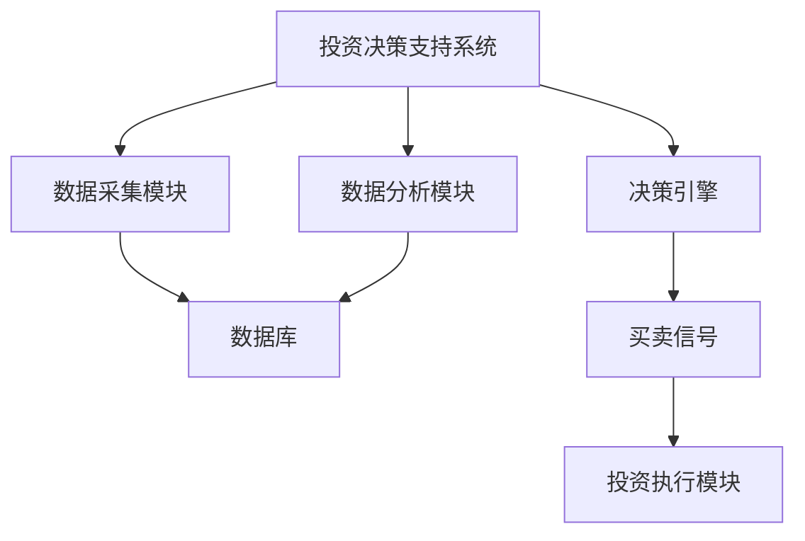
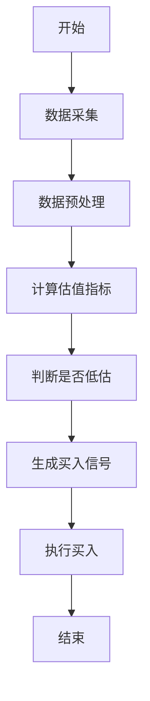
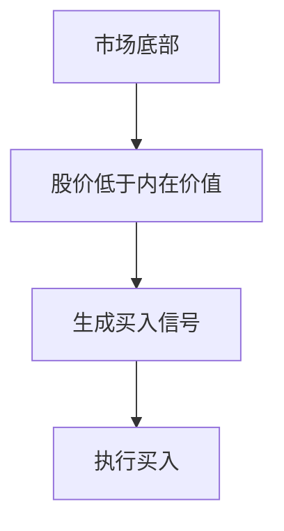

                 


# 彼得林奇的"反向投资"成功案例

## 关键词：反向投资, 彼得·林奇, 投资策略, 市场分析, 投资哲学

## 摘要：本文深入分析了彼得·林奇的反向投资策略，探讨了其成功的原理和方法，结合实际案例，详细阐述了如何在投资中运用反向思维，帮助读者理解并掌握这一投资策略。

---

# 第一部分：反向投资的背景与概述

## 第1章：反向投资的基本概念

### 1.1 反向投资的定义与特点

反向投资是一种与市场趋势相反的投资策略，强调在市场低迷时买入，在市场高涨时卖出。其核心在于逆市场情绪操作，寻找被低估的资产。

#### 1.1.1 反向投资的定义
反向投资是指在市场恐慌时买入，在市场狂热时卖出。其本质是逆人性投资，避免随波逐流，寻找价格与价值的偏差。

#### 1.1.2 反向投资的核心特点
- **低买高卖**：在市场低谷时买入，高点时卖出。
- **逆市场情绪**：与市场情绪相反操作。
- **长期视角**：注重资产的长期价值，而非短期波动。

#### 1.1.3 反向投资与其他投资策略的区别

| 策略类型 | 投资时机 | 投资标的 | 风险承受 |
|----------|----------|----------|----------|
| 顺势投资 | 市场高点 | 高估资产 | 低风险   |
| 反向投资 | 市场低点 | 低估资产 | 高风险   |

### 1.2 彼得·林奇的背景与投资理念

#### 1.2.1 彼得·林奇的生平简介
- **职业背景**：美国著名基金经理，富达麦哲伦基金的传奇经理人。
- **投资风格**：注重基本面分析，寻找具有持续增长潜力的公司。
- **投资哲学**：长期投资，注重公司内在价值。

#### 1.2.2 林奇的投资哲学与方法
- **价值投资**：寻找被市场低估的公司。
- **分散投资**：通过多样化降低风险。
- **逆市投资**：在市场恐慌时买入优质资产。

#### 1.2.3 林奇对反向投资的贡献
- 林奇的成功证明了反向投资的有效性。
- 他强调了对公司基本面的深入分析，而非随市场波动操作。

---

# 第二部分：反向投资的理论基础

## 第2章：市场周期与人性弱点

### 2.1 市场周期的分析

#### 2.1.1 市场周期的定义与阶段划分
- **市场周期**：指市场从低点到高点再到低点的循环过程。
- **阶段划分**：底部、复苏、上涨、顶部、下跌。

#### 2.1.2 不同阶段的市场特征

| 阶段 | 特征 | 投资策略 |
|------|------|----------|
| 底部 | 价格低，估值低 | 买入低估资产 |
| 复苏 | 价格回升 | 维持持仓 |
| 上涨 | 价格快速上涨 | 考虑卖出 |
| 顶部 | 价格高估 | 减仓或清仓 |
| 下跌 | 价格下跌 | 寻找买入机会 |

### 2.2 人性的弱点与投资决策

#### 2.2.1 人性的弱点
- **贪婪与恐惧**：投资者在市场高点贪婪，在市场低点恐惧。
- **从众心理**：跟随市场 majority 操作，忽视独立判断。

#### 2.2.2 投资者心理与市场行为
- **情绪化决策**：投资者往往根据情绪而非理性做出决策。
- **羊群效应**：大量投资者跟随市场趋势，导致市场泡沫或崩盘。

---

# 第三部分：反向投资的核心策略与模型

## 第3章：反向投资的策略与模型

### 3.1 反向投资的核心策略

#### 3.1.1 估值分析
- **市盈率（P/E）**：股价除以每股收益。
- **市净率（P/B）**：股价除以每股净资产。
- **股息率**：股息与股价的比率。

#### 3.1.2 行业分析
- **行业周期**：选择处于上升周期的行业。
- **行业竞争格局**：选择有竞争优势的企业。

#### 3.1.3 公司分析
- **财务状况**：关注公司的盈利能力、负债情况。
- **管理团队**：优秀的管理层能带来持续增长。
- **竞争优势**：企业是否有独特的竞争优势。

### 3.2 反向投资的数学模型

#### 3.2.1 估值模型
- **内在价值计算**：使用DCF模型计算公司的真实价值。
  $$DCF = \frac{CF}{(r - g)}$$
  其中，CF为自由现金流，r为折现率，g为增长率。

- **安全边际**：买入价格低于内在价值一定比例。
  $$买入价格 \leq 内在价值 \times (1 - 安全边际)$$

#### 3.2.2 风险控制模型
- **止损策略**：设定止损点，控制回撤。
  $$止损价 = 买入价 \times (1 - 止损比例)$$

---

# 第四部分：反向投资的系统架构与算法实现

## 第4章：反向投资的系统架构设计

### 4.1 投资决策支持系统的构建

#### 4.1.1 系统功能设计
- 数据采集模块：收集市场数据。
- 数据分析模块：进行估值分析、行业分析。
- 决策引擎：根据分析结果生成买卖信号。

#### 4.1.2 系统架构设计



### 4.2 反向投资算法的实现

#### 4.2.1 算法流程



#### 4.2.2 代码实现

```python
def calculate_value(company_data):
    pe = company_data['市盈率']
    pb = company_data['市净率']
    roe = company_data['ROE']
    # 计算内在价值
    intrinsic_value = pe * company_data['每股收益'] / (roe - growth_rate)
    return intrinsic_value

def generate_signal(intrinsic_value, price):
    if price <= intrinsic_value * 0.8:
        return '买入'
    elif price >= intrinsic_value * 1.2:
        return '卖出'
    else:
        return '持有'
```

---

# 第五部分：反向投资的项目实战与案例分析

## 第5章：项目实战与案例分析

### 5.1 项目实战

#### 5.1.1 环境设置
- 数据源：获取某公司历史股价、财务数据。
- 工具：使用Python进行数据处理，利用Pandas和Matplotlib进行分析和可视化。

#### 5.1.2 数据收集与处理

```python
import pandas as pd
import matplotlib.pyplot as plt

# 数据获取
data = pd.read_csv('company_data.csv')
# 数据预处理
data['市盈率'] = data['股价'] / data['每股收益']
data['市净率'] = data['股价'] / data['每股净资产']
```

#### 5.1.3 策略实施

```python
# 计算买入信号
buy_signals = []
for index, row in data.iterrows():
    if row['股价'] <= row['内在价值'] * 0.8:
        buy_signals.append(index)

# 执行买入
positions = [i for i in buy_signals]
```

#### 5.1.4 结果分析

```python
# 绘制股价与估值对比图
plt.plot(data['日期'], data['股价'], label='股价')
plt.plot(data['日期'], data['内在价值'], label='内在价值')
plt.xlabel('日期')
plt.ylabel('价格')
plt.legend()
plt.show()
```

### 5.2 案例分析

#### 5.2.1 案例介绍
分析某公司在市场底部的股价与内在价值的偏差，判断是否满足买入条件。

#### 5.2.2 数据分析与策略实施

```python
# 计算买入信号
intrinsic_value = calculate_value(company_data)
signal = generate_signal(intrinsic_value, company_data['股价'])
```

#### 5.2.3 结果展示



---

# 第六部分：反向投资的成功经验与未来展望

## 第6章：总结与最佳实践

### 6.1 成功经验总结

- **长期视角**：关注公司长期价值，而非短期波动。
- **逆市场操作**：在市场恐慌时买入，在市场狂热时卖出。
- **基本面分析**：深入分析公司财务状况和行业前景。

### 6.2 投资者注意事项

- **风险控制**：设定止损点，避免过大损失。
- **持续学习**：市场变化多端，需不断更新知识。
- **独立思考**：避免随大流，坚持独立判断。

### 6.3 未来展望

随着市场的发展，反向投资策略需要结合更多因素，如技术分析、大数据分析等，形成更加完善的决策模型。同时，人工智能的应用将使反向投资更加精准和高效。

---

# 作者：AI天才研究院/AI Genius Institute & 禅与计算机程序设计艺术/Zen And The Art of Computer Programming

---

# 结语

通过本文的详细分析，我们不仅了解了彼得·林奇的反向投资策略，还学习了如何在实际投资中应用这一策略。希望读者能在投资中灵活运用，实现长期稳健的收益。

