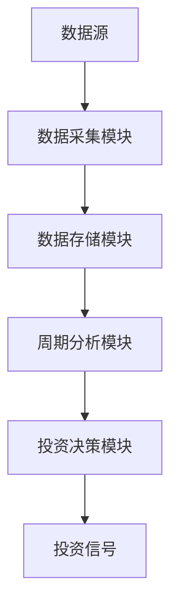

                 


# 彼得林奇的"反周期"投资在不同地域市场的应用

> 关键词：反周期投资，彼得林奇，投资策略，市场周期，地域市场

> 摘要：本文深入分析了彼得林奇的反周期投资理念，并探讨其在全球不同地域市场的应用。通过结合经济周期理论、数学模型和实际案例，本文详细阐述了如何在不同市场环境下制定有效的投资策略，帮助投资者在市场波动中抓住机会，实现稳健收益。

---

# 第一部分：彼得林奇的反周期投资概述

## 第1章：反周期投资的核心概念

### 1.1 什么是反周期投资

反周期投资是一种投资策略，强调在经济周期的低谷期（即市场低迷、资产价格被低估时）进行投资，以期在经济复苏或繁荣期获得超额收益。这种策略的核心在于识别市场的周期性波动，并在市场底部买入优质资产，待市场回升时卖出。

#### 1.1.1 经济周期的基本概念

经济周期通常分为四个阶段：繁荣、衰退、萧条和复苏。反周期投资关注的是衰退和萧条阶段，因为在这些阶段，许多资产价格被过度抛售，提供了买入的机会。

#### 1.1.2 反周期投资的定义与特点

反周期投资的定义：在市场低迷或经济衰退期间，投资那些基本面良好但价格被低估的资产或企业，以期在经济复苏时获得收益。

特点：
1. **逆向思维**：在市场恐慌时买入，市场乐观时卖出。
2. **价值导向**：注重资产的内在价值，而非市场情绪。
3. **长期视角**：反周期投资强调长期持有，避免频繁交易。

#### 1.1.3 彼得林奇投资理念的核心思想

彼得林奇是全球著名投资家，他的投资理念强调：
1. **价值投资**：寻找基本面良好、管理优秀的企业进行投资。
2. **逆向思维**：在市场恐慌时寻找被低估的机会。
3. **长期视角**：耐心持有优质资产，等待市场价值回归。

---

## 第2章：彼得林奇投资策略的理论基础

### 2.1 彼得林奇的投资哲学

彼得林奇的投资哲学可以总结为“买入并持有优质资产”。他认为，市场的短期波动并不影响企业的内在价值，投资的关键在于找到那些具有强大竞争优势、良好管理团队和光明前景的企业。

#### 2.1.1 长期投资与价值投资的结合

彼得林奇强调长期投资，他认为短期市场的波动是不可预测的，而长期来看，优质企业的价值会逐渐显现。他的投资策略结合了价值投资和长期投资的理念。

#### 2.1.2 市场波动与投资机会的关系

市场波动为投资者提供了机会。在市场低迷时，许多优质资产的价格被低估，此时买入可以获得较高的安全边际。

#### 2.1.3 投资者心理与市场周期的关联

彼得林奇认为，市场的波动往往由投资者的非理性行为驱动。在市场高点时，投资者过于乐观；在市场低点时，投资者过于悲观。这种非理性行为为反周期投资者提供了机会。

### 2.2 反周期投资的数学模型

#### 2.2.1 市场周期的数学描述

市场周期可以用时间序列模型来描述。常见的模型包括ARIMA（自回归积分滑动平均模型）和GARCH（广义自回归条件异方差模型）。

例如，使用ARIMA模型可以预测市场的未来走势：

$$ ARIMA(p, d, q) $$

其中：
- \( p \) 是自回归阶数，
- \( d \) 是差分阶数，
- \( q \) 是移动平均阶数。

#### 2.2.2 价值与价格的偏离模型

彼得林奇认为，资产的市场价格与内在价值之间存在偏离。当市场价格低于内在价值时，就是买入的机会。

内在价值可以用以下公式估算：

$$ V = \frac{C}{r} $$

其中：
- \( V \) 是内在价值，
- \( C \) 是预期现金流，
- \( r \) 是折现率。

#### 2.2.3 投资收益与周期波动的关系公式

反周期投资的收益可以通过以下公式计算：

$$ R = \frac{V_{final} - V_{initial}}{V_{initial}} \times 100\% $$

其中：
- \( R \) 是投资收益，
- \( V_{final} \) 是最终的内在价值，
- \( V_{initial} \) 是初始的内在价值。

---

## 第3章：不同地域市场的经济特点

### 3.1 全球主要市场的经济周期分析

#### 3.1.1 美国市场的周期性特征

美国市场是全球最大的金融市场之一。其经济周期受到美联储货币政策、科技创新和消费习惯的影响较大。

- 繁荣期：科技股和消费股表现优异。
- 衰退期：制造业和房地产受到冲击。
- 萧条期：政府和美联储采取刺激措施，市场逐步复苏。

#### 3.1.2 欧洲市场的经济波动

欧洲市场的经济周期受到欧洲央行货币政策、欧盟政策和区域经济一体化的影响。欧洲市场的波动性通常较低，但受到地缘政治和债务问题的影响较大。

#### 3.1.3 亚洲市场的增长模式

亚洲市场以中国、日本和韩国为核心。这些市场的增长模式以出口导向和制造业为主，周期性波动较为明显，但增长潜力较大。

### 3.2 地域市场差异对投资策略的影响

#### 3.2.1 经济结构对投资周期的影响

不同市场的经济结构决定了其周期性波动的特点。例如，制造业占主导的市场在经济衰退时会受到较大冲击，而科技主导的市场则更具弹性。

#### 3.2.2 政治环境与市场周期的关联

政治环境对市场周期有重要影响。例如，选举周期、政策变化和地缘政治冲突都会影响市场的波动。

#### 3.2.3 货币政策与市场波动的关系

不同市场的货币政策差异会导致市场周期的波动不同。例如，美联储的加息周期通常会导致全球市场的波动加剧。

---

# 第二部分：反周期投资策略的系统化应用

## 第4章：反周期投资的算法与模型

### 4.1 反周期投资的算法流程

#### 4.1.1 数据收集与处理

首先，收集目标市场的历史价格数据、宏观经济指标（如GDP、失业率、通胀率）和企业基本面数据（如利润、现金流）。

#### 4.1.2 市场周期判断算法

使用时间序列分析模型（如ARIMA）判断当前市场所处的周期阶段。

#### 4.1.3 投资时机选择模型

根据市场周期判断结果，选择在市场底部阶段进行投资。

### 4.2 Python实现反周期投资策略

#### 4.2.1 环境安装与配置

需要安装以下库：
- `pandas`：数据处理
- `numpy`：数值计算
- `statsmodels`：时间序列分析
- `matplotlib`：数据可视化

```python
import pandas as pd
import numpy as np
import statsmodels.api as sm
import matplotlib.pyplot as plt
```

#### 4.2.2 数据获取与清洗代码

从Yahoo Finance获取股票数据：

```python
def get_data(ticker):
    data = pd.read_csv(f'https://query1.finance.yahoo.com/ws/eastern/time/1D%2C5D%2C1M%2C3M/quote/{ticker}/history')
    data['Date'] = pd.to_datetime(data['Date'])
    data.set_index('Date', inplace=True)
    return data
```

#### 4.2.3 周期判断与投资信号生成代码

使用ARIMA模型进行周期判断：

```python
def forecast_cycle(ticker):
    data = get_data(ticker)
    model = sm.tsa.ARIMA(data['Close'], order=(5, 1, 0))
    results = model.fit()
    forecast = results.forecast(steps=30)
    return forecast
```

---

## 第5章：反周期投资的系统架构设计

### 5.1 系统功能设计

#### 5.1.1 数据采集模块

负责从多个数据源获取实时和历史数据，包括股票价格、宏观经济指标等。

#### 5.1.2 周期分析模块

使用统计模型分析市场周期，判断当前所处的周期阶段。

#### 5.1.3 投资决策模块

根据周期分析结果，生成投资信号（买入或卖出）。

### 5.2 系统架构图



---

## 第6章：反周期投资的项目实战

### 6.1 环境安装与配置

安装必要的库：
- `pandas`
- `numpy`
- `statsmodels`
- `matplotlib`

### 6.2 核心实现代码

实现反周期投资策略的代码：

```python
import pandas as pd
import numpy as np
import statsmodels.api as sm
import matplotlib.pyplot as plt

def get_data(ticker):
    data = pd.read_csv(f'https://query1.finance.yahoo.com/ws/eastern/time/1D%2C5D%2C1M%2C3M/quote/{ticker}/history')
    data['Date'] = pd.to_datetime(data['Date'])
    data.set_index('Date', inplace=True)
    return data

def forecast_cycle(ticker):
    data = get_data(ticker)
    model = sm.tsa.ARIMA(data['Close'], order=(5, 1, 0))
    results = model.fit()
    forecast = results.forecast(steps=30)
    return forecast

# 示例：分析苹果公司（AAPL）的股票
data = get_data('AAPL')
forecast = forecast_cycle('AAPL')
print(forecast)
```

### 6.3 案例分析

以苹果公司（AAPL）为例，分析其股价的周期性波动，并生成投资信号。

### 6.4 项目小结

通过实际案例分析，验证反周期投资策略的有效性，并总结经验教训。

---

# 小结

彼得林奇的反周期投资策略在全球不同地域市场的应用具有广泛的应用前景。通过结合经济周期理论、数学模型和实际案例，投资者可以在不同市场环境下制定有效的投资策略，抓住市场波动带来的机会。

---

# 作者：AI天才研究院/AI Genius Institute & 禅与计算机程序设计艺术 /Zen And The Art of Computer Programming

