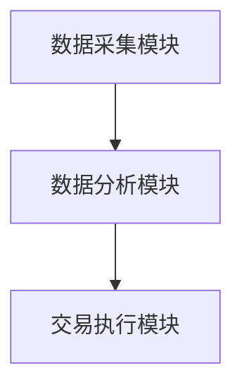

                 


# 彼得林奇的"反周期"投资在加密货币市场的应用策略

> 关键词：彼得·林奇、反周期投资、加密货币、投资策略、市场周期、风险管理、技术分析

> 摘要：本文深入探讨了彼得·林奇的“反周期”投资策略在加密货币市场的应用，分析了该策略的核心概念、算法实现、系统架构设计以及实际案例。通过技术分析和数学模型，展示了如何利用反周期投资策略在加密货币市场中捕捉投资机会，同时结合风险管理，确保投资的稳健性。

---

## 第一部分：背景介绍

### 第1章：反周期投资的核心概念

#### 1.1 反周期投资的定义与特点
- **反周期投资**是指在市场低谷期进行投资，以期望在市场复苏时获得超额收益的投资策略。与传统周期性投资不同，反周期投资更注重市场波动的低点，而非市场的整体趋势。
- **加密货币市场的特点**：加密货币市场具有高度波动性，价格受市场情绪和技术因素影响较大，具备明显的周期性特征。

#### 1.2 彼得·林奇投资理念的核心要素
- **长期投资哲学**：林奇强调长期投资，认为市场短期波动不会影响长期价值。
- **市场周期分析**：林奇擅长识别市场周期，并在市场底部进行投资。
- **风险管理**：林奇注重风险控制，避免在市场高点进行投资。

#### 1.3 加密货币市场的独特性
- **波动性高**：加密货币市场的价格波动远高于传统金融市场。
- **周期性明显**：市场存在明显的牛熊周期，反周期投资策略在加密货币市场中具有较大的应用潜力。

---

## 第二部分：核心概念与理论基础

### 第2章：反周期投资的理论基础

#### 2.1 市场周期理论
- **经济周期**：经济周期包括衰退、复苏、扩张和衰退四个阶段。
- **金融市场的周期性特征**：金融市场的价格波动与经济周期密切相关。
- **加密货币市场的周期性**：加密货币市场的价格波动与市场参与者情绪密切相关，具有明显的周期性。

#### 2.2 投资者心理与市场周期
- **投资者心理对市场周期的影响**：投资者的贪婪和恐惧情绪推动市场价格波动。
- **市场情绪分析**：通过技术指标和市场情绪分析，识别市场周期的转折点。

#### 2.3 反周期投资的数学模型
- **市场周期的数学表示**：通过时间序列分析，建立市场周期的数学模型。
- **反周期投资的数学模型**：建立反周期投资策略的数学模型，量化投资时机的选择。

---

## 第三部分：算法与数学模型

### 第3章：反周期投资的算法实现

#### 3.1 数据采集与预处理
- **数据源**：使用加密货币的历史价格数据。
- **数据清洗**：去除异常值和缺失值。

#### 3.2 市场周期检测算法
- **移动平均收敛散度（MACD）**：通过MACD指标检测市场的买卖信号。
- **相对强弱指数（RSI）**：通过RSI指标识别市场的超买和超卖信号。

#### 3.3 反周期投资策略的算法实现
- **算法步骤**：
  1. 数据预处理：清洗和归一化数据。
  2. 市场周期检测：使用MACD和RSI指标检测市场的买卖信号。
  3. 投资决策：在市场底部买入，在市场顶部卖出。

#### 3.4 数学模型与公式
- **MACD公式**：MACD = EMA(12) - EMA(26)
- **RSI公式**：RSI = 100 - (100 - (close - low)/(high - low) * 100) / N

---

## 第四部分：系统架构设计

### 第4章：反周期投资系统的架构设计

#### 4.1 系统目标
- 实现反周期投资策略的自动化交易系统。

#### 4.2 系统功能模块
- 数据采集模块：采集加密货币的历史价格数据。
- 数据分析模块：分析市场周期，生成买卖信号。
- 交易执行模块：根据买卖信号执行交易。

#### 4.3 系统架构图


#### 4.4 系统交互流程
- 数据采集模块采集数据，传送给数据分析模块。
- 数据分析模块分析数据，生成买卖信号。
- 交易执行模块根据买卖信号执行交易。

---

## 第五部分：项目实战

### 第5章：反周期投资策略的实战应用

#### 5.1 实战环境
- 数据源：加密货币交易所的历史价格数据。
- 工具：Python编程语言，Pandas数据处理库，Matplotlib可视化库。

#### 5.2 核心代码实现
```python
import pandas as pd
import numpy as np

# 数据预处理
data = pd.read_csv('bitcoin_price.csv')
data['Date'] = pd.to_datetime(data['Date'])
data.set_index('Date', inplace=True)
data = data[['Close']]
data = data.apply(lambda x: (x - x.min()) / (x.max() - x.min()))  # 数据归一化

# MACD计算
def compute_macd(data, short_window=12, long_window=26):
    ema_short = data.ewm(span=short_window).mean()
    ema_long = data.ewm(span=long_window).mean()
    macd = ema_short - ema_long
    return macd

macd = compute_macd(data.Close)

# RSI计算
def compute_rsi(data, window=14):
    delta = data.Close.diff()
    avg_gain = delta.where(delta > 0, 0).rolling(window).mean()
    avg_loss = (-delta).where(delta < 0, 0).rolling(window).mean()
    rsi = 100 - (100 - (avg_gain / avg_loss * 100))
    return rsi

rsi = compute_rsi(data)

# 生成买卖信号
signal = pd.DataFrame()
signal['macd'] = macd
signal['rsi'] = rsi
signal['buy_signal'] = (signal['macd'] > 0) & (signal['rsi'] < 30)
signal['sell_signal'] = (signal['macd'] < 0) & (signal['rsi'] > 70)

# 可视化
import matplotlib.pyplot as plt
plt.figure(figsize=(12, 6))
plt.plot(data.Close, label='Close Price')
plt.plot(macd, label='MACD')
plt.plot(rsi, label='RSI')
plt.legend()
plt.show()
```

#### 5.3 实战案例分析
- 案例：在比特币市场应用反周期投资策略，选择合适的买入和卖出时机，实现超额收益。

---

## 第六部分：总结与展望

### 第6章：总结与展望

#### 6.1 总结
- 本文深入探讨了彼得·林奇的反周期投资策略在加密货币市场的应用，通过算法实现和系统架构设计，展示了如何利用该策略实现自动化交易。

#### 6.2 展望
- 未来可以进一步研究反周期投资策略与其他投资策略的结合，优化投资组合的收益和风险比。

---

作者：AI天才研究院 & 禅与计算机程序设计艺术

