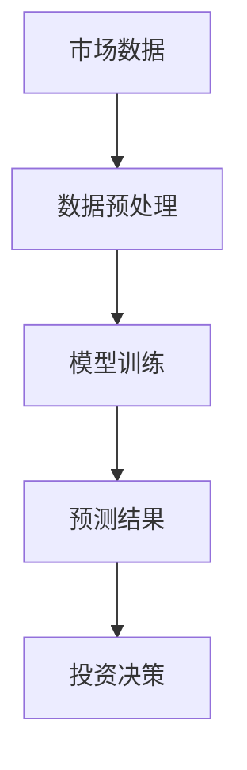
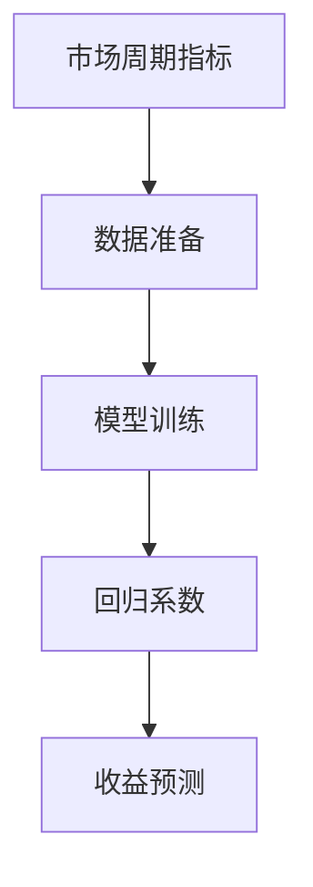
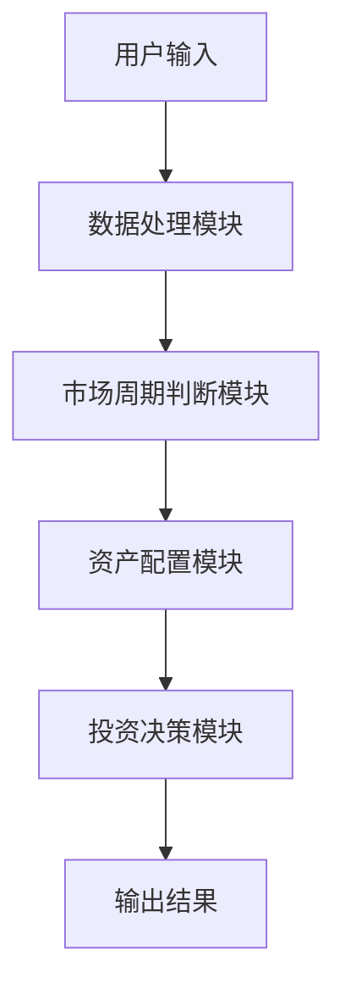

                 


# 彼得林奇的"反周期"投资在新兴资产类别中的应用

## 关键词：彼得林奇，反周期投资，新兴资产，投资策略，资产配置

## 摘要：  
本文深入探讨了彼得·林奇的反周期投资策略在新兴资产类别中的应用。通过分析市场周期、资产配置和风险评估，结合数学模型和算法原理，为投资者提供了一套系统化的投资框架。文章结合实际案例，详细讲解了如何在新兴资产中应用反周期投资策略，并通过Python代码实现，帮助读者更好地理解和应用这一策略。

---

## 第一部分: 反周期投资的背景与核心概念

### 第1章: 反周期投资的背景介绍

#### 1.1 投资周期的基本概念  
在金融市场中，投资周期是指资产价格从高点到低点再到高点的波动过程。反周期投资的核心在于识别市场的周期性波动，并在市场低谷时买入，在市场高点时卖出。这种策略的核心思想是“买低卖高”，通过逆市场趋势操作获取超额收益。

#### 1.2 反周期投资的定义与特点  
反周期投资是一种投资策略，强调在市场低点买入，在市场高点卖出。其特点是：  
1. **逆向思维**：在市场恐慌时买入，市场狂热时卖出。  
2. **长期视角**：关注资产的长期价值，而非短期波动。  
3. **风险控制**：通过周期性分析降低投资风险。  

#### 1.3 彼得林奇投资理念的核心要素  
彼得·林奇是反周期投资的代表人物，他的核心理念包括：  
1. **价值投资**：寻找被市场低估的资产。  
2. **长期持有**：避免频繁交易，降低交易成本。  
3. **分散投资**：通过多样化降低风险。  

### 第2章: 反周期投资的核心概念

#### 2.1 市场周期的阶段划分  
市场周期通常分为以下几个阶段：  
1. **牛市**：资产价格上涨，投资者情绪乐观。  
2. **震荡市**：市场波动加剧，投资者情绪趋于谨慎。  
3. **熊市**：资产价格下跌，投资者情绪恐慌。  

#### 2.2 反周期投资的理论基础  
反周期投资的理论基础包括：  
1. **市场非理性**：投资者情绪往往会导致市场偏离资产的内在价值。  
2. **均值回归**：资产价格会围绕其内在价值波动，偏离后会回归。  

#### 2.3 反周期投资与传统投资的区别  
与传统投资相比，反周期投资具有以下特点：  
- 传统投资：顺势而为，跟随市场趋势。  
- 反周期投资：逆势而为，寻找市场低估或高估的机会。  

---

## 第二部分: 反周期投资的核心原理与数学模型

### 第3章: 反周期投资的数学模型与算法原理

#### 3.1 反周期投资的核心原理  
反周期投资的核心在于识别市场周期，并在市场低点买入，在市场高点卖出。其数学模型主要包括：  
1. 市场周期的建模。  
2. 资产价格波动的统计分析。  
3. 投资决策的逻辑框架。  

#### 3.2 反周期投资的数学模型  
##### 3.2.1 市场周期的阶段划分模型  
市场周期的阶段划分可以通过时间序列分析实现。例如，使用ARIMA模型预测资产价格的未来走势，并判断当前市场所处的阶段。  

##### 3.2.2 资产配置比例的计算公式  
资产配置比例可以根据市场周期阶段动态调整。例如：  
$$  
\text{配置比例} = \begin{cases}  
100\% & \text{牛市} \\  
50\% & \text{震荡市} \\  
0\% & \text{熊市}
\end{cases}  
$$  

##### 3.2.3 投资收益的预测模型  
通过回归分析，可以预测资产在不同周期阶段的收益。例如：  
$$  
\text{收益预测} = \beta_0 + \beta_1 \times \text{市场周期指标} + \epsilon  
$$  

#### 3.3 反周期投资的算法实现  
##### 3.3.1 时间序列分析的mermaid流程图  


##### 3.3.2 回归分析的mermaid流程图  


##### 3.3.3 算法实现的Python代码示例  
```python
import pandas as pd
import numpy as np
from sklearn.linear_model import LinearRegression

# 数据预处理
data = pd.read_csv('market_data.csv')
data['return'] = data['price'].pct_change()

# 时间序列分析
from statsmodels.tsa.arima_model import ARIMA
model = ARIMA(data['return'], order=(1,1,1))
model_fit = model.fit()

# 回归分析
X = data['market_cycle_indicator']
y = data['return']
model = LinearRegression()
model.fit(X, y)

# 预测结果
predicted_return = model.predict(X)
```

---

## 第三部分: 反周期投资的系统设计与实战

### 第4章: 反周期投资的系统设计

#### 4.1 系统功能设计  
反周期投资系统的主要功能包括：  
1. 数据采集：获取市场数据。  
2. 市场周期判断：识别当前市场所处的阶段。  
3. 资产配置：根据周期阶段调整资产配置比例。  
4. 投资决策：生成买入或卖出信号。  

#### 4.2 系统架构设计  


#### 4.3 系统接口设计  
1. 数据接口：从数据源获取市场数据。  
2. 模型接口：调用时间序列分析和回归分析模型。  
3. 输出接口：生成投资决策信号。  

### 第5章: 项目实战

#### 5.1 环境安装  
需要安装以下Python库：  
- pandas  
- numpy  
- statsmodels  
- scikit-learn  

#### 5.2 核心代码实现  
```python
import pandas as pd
import numpy as np
from statsmodels.tsa.arima_model import ARIMA
from sklearn.linear_model import LinearRegression

# 数据预处理
data = pd.read_csv('market_data.csv')
data['return'] = data['price'].pct_change()

# 时间序列分析
X = data['market_cycle_indicator']
y = data['return']
model = LinearRegression()
model.fit(X, y)

# 预测结果
predicted_return = model.predict(X)
```

#### 5.3 案例分析  
以新兴资产中的科技股为例，假设当前市场处于熊市阶段，反周期投资策略建议将资产配置比例降至0%，避免市场进一步下跌的风险。  

---

## 第四部分: 总结与展望

### 第6章: 总结与最佳实践

#### 6.1 小结  
反周期投资是一种有效的投资策略，通过识别市场周期，在新兴资产类别中实现超额收益。  

#### 6.2 注意事项  
1. 风险控制：避免过度杠杆。  
2. 持续学习：关注市场变化，及时调整策略。  
3. 系统优化：定期优化模型，提高预测精度。  

#### 6.3 拓展阅读  
建议阅读彼得·林奇的经典著作《彼得林奇的选股术》。

---

## 作者：AI天才研究院 & 禅与计算机程序设计艺术

